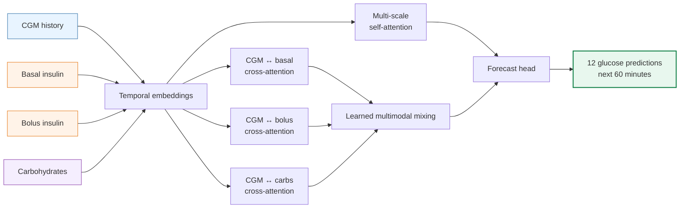
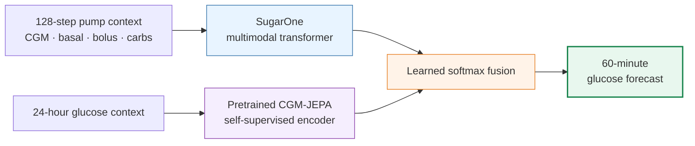
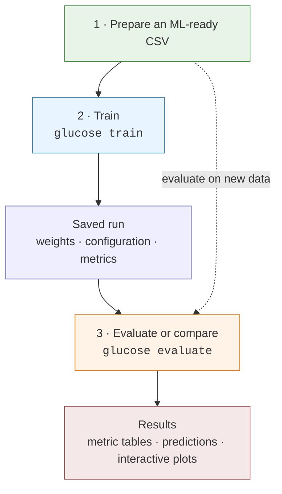
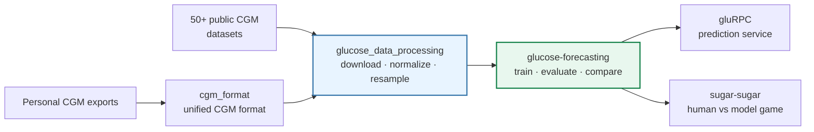

# Glucose Forecasting

<p align="center">
  <strong>Multimodal deep learning for predicting blood glucose up to 60 minutes ahead</strong>
</p>

<p align="center">
  CGM · insulin · carbohydrates · heart rate · activity
</p>

<p align="center">
  <a href="https://github.com/GlucoseDAO/glucose-forecasting"></a>
  <a href="https://pytorch.org/"></a>
  <a href="https://github.com/astral-sh/uv"></a>
  <a href="https://github.com/orgs/GlucoseDAO/repositories"></a>
</p>

This repository is both a **research platform** and a **reproducible model playground**:

- run pretrained glucose models on bundled demo data;
- train multimodal transformers on CGM, pump, meal, and wearable signals;
- compare SugarOne and GluMind with TFT, NHITS, xLSTM, and other baselines;
- evaluate across Type 1 diabetes, Type 2 diabetes, pre-diabetes, and healthy cohorts;
- connect directly to the [GlucoseDAO data pipeline](https://github.com/GlucoseDAO/glucose_data_processing), which catalogs **50+ public glucose datasets** and converts supported sources into ML-ready time series.

> **Current flagship result:** SugarOne reaches **12.40 mg/dL MAE** and **9.91% MARD** over **1.67 million held-out forecast windows** from the joined Loop + AI-READI benchmark.

---

## Try a pretrained model

No external dataset or training run is required:

```bash
git clone https://github.com/GlucoseDAO/glucose-forecasting.git
cd glucose-forecasting
uv sync
uv run glucose evaluate \
  --run-dir test_model_sugar_one \
  --data test_data/livia_sugar_one_ready.csv \
  --train-data test_data/livia_sugar_one_ready.csv
```

The repository includes both the SugarOne checkpoint and demo data. The command runs local inference—your data is not uploaded anywhere—and reports MAE, RMSE, and MARD.

## What makes the models interesting?

Glucose is not an isolated signal. Insulin can lower it, carbohydrates can raise it, and activity and physiology change the response. Our models learn those relationships with parallel cross-attention and multi-scale temporal attention.



SugarOne learns how much each pump/meal branch matters instead of combining covariates with fixed weights. GluMind applies the same multimodal idea to heart rate and step count. The package also provides standardized NeuralForecast baselines so architecture comparisons use the same holdout protocol and metrics.

### Research spotlight: SugarJEPA

**SugarJEPA combines supervised transformer forecasting with self-supervised JEPA representations.** It keeps SugarOne's multimodal backbone and adds a pretrained [CGM-JEPA](https://github.com/cruiseresearchgroup/CGM-JEPA) encoder as a fourth cross-attention stream:



In a matched-hyperparameter development experiment, the frozen JEPA branch improved test **MAE by 4.66%** and **RMSE by 4.04%** over SugarOne, with gains on every aggregate metric across validation and test splits. This is a promising research result rather than a production claim: SugarJEPA currently requires longer series, was evaluated on fewer windows, and took about 4.6× longer per epoch.

See the [full SugarJEPA vs SugarOne analysis](docs/SUGAR_JEPA_VS_SUGAR_ONE_DEV_COMPARISON.md) for results, limitations, and follow-up experiments.

## Choose your model

| Model | Inputs | Best for |
|-------|--------|----------|
| **SugarOne** | glucose + basal + bolus + carbs | Insulin pump / Loop users |
| **SugarJEPA** | SugarOne + pretrained CGM-JEPA representation | Hybrid supervised/self-supervised research |
| **GluMind** | glucose + heart rate + steps | Wearable / AI-READI cohorts |
| **NeuralForecast** | configurable | TFT, NHITS, xLSTM, LSTM baselines |

All custom models use parallel cross-attention multimodal fusion with multi-scale self-attention. SugarOne adds learnable softmax mixing weights across covariate branches.

---

## The `glucose` CLI

One command for training, evaluation, and cross-model comparison. All outputs go to `data/output/runs/`.



### Train

```bash
# Train NeuralForecast baselines (auto-detects Loop vs AI-READI covariates)
uv run glucose train \
  --backend neuralforecast \
  --data data/input/loop_ai_ready_joined2_dev.csv \
  --global-model
```

Each model gets its own timestamped run directory under `data/output/runs/` with weights, config, and metrics.

Custom PyTorch models (SugarOne, GluMind, SugarJEPA) have dedicated training scripts documented in the [CLI Reference](docs/CLI_REFERENCE.md). Their output goes to the same `data/output/runs/` structure and works with `glucose evaluate` identically.

### Evaluate one model

```bash
# Read precomputed metrics from a run directory
uv run glucose evaluate --run-dir data/output/runs/nf_holdout/__ALL__/TFT_20260718T223910Z

# Re-run live inference on a different dataset
uv run glucose evaluate \
  --run-dir data/output/runs/sugar_one/my_run \
  --data data/input/loop_ai_ready_joined2.csv
```

Auto-detects the backend (NeuralForecast, SugarOne, SugarJEPA, GluMind) from the run directory contents.

### Compare models across backends

The main payoff — mix any backends in one command:

```bash
uv run glucose evaluate \
  --run-dir sugar_jepa_dev --label SugarJEPA \
  --run-dir test_model_sugar_one --label SugarOne \
  --run-dir data/output/runs/nf_holdout/__ALL__/TFT_20260718T223910Z \
  --run-dir data/output/runs/nf_holdout/__ALL__/NHITS_20260718T223624Z \
  --out data/output/comparisons/full_comparison
```

Produces:

```
data/output/comparisons/full_comparison/
├── test_metrics_summary.csv          # model, MAE, RMSE, MARD — sorted best to worst
├── val_metrics_summary.csv
├── study_group_metrics.csv           # per-cohort breakdown across all models
├── run_manifest.json
└── plots/
    ├── metrics.html                  # interactive Plotly dashboard
    ├── metrics.png
    ├── study_group_metrics.html
    └── study_group_metrics.png
```

### Hyperparameter search

```bash
uv run tune-sugar-one -c scripts/sugar_one/tune_sugar_one_dev.toml
```

---

## Benchmark results

On the joined Loop + AI-READI dataset (`loop_ai_ready_joined2.csv`, 1.67M test windows, 60-min horizon):

| Model | MAE (mg/dL) | RMSE | MARD |
|-------|-------------|------|------|
| **SugarOne** | **12.40** | **19.03** | **9.91%** |
| SugarOne (glucose only, covariates zeroed) | 12.63 | 19.47 | 9.98% |
| GluMind (cross-domain) | 12.73 | 19.66 | 10.28% |

On the development subset (`loop_ai_ready_joined2_dev.csv`):

| Model | MAE (mg/dL) | RMSE | MARD |
|-------|-------------|------|------|
| **SugarOne** | **17.6** | **26.3** | **14.2%** |
| TFT (NeuralForecast) | 20.6 | 30.7 | 15.8% |
| SugarJEPA | 21.6 | 31.9 | 17.0% |
| NHITS (NeuralForecast) | 22.2 | 32.3 | 17.3% |

Detailed analysis: [GluMind vs SugarOne](docs/GLUMIND_VS_SUGARONE_COMPARISON.md), [T1DM covariate ablation](docs/T1DM_COVARIATE_ABLATION_REPORT.md).

The model family has also been evaluated across cohorts with increasing glycemic variability:


_This earlier wearable benchmark uses “Sugar I” as the presentation name for the GluMind architecture. SugarOne is the newer pump-aware model with insulin and carbohydrate inputs._

---

## Part of the GlucoseDAO ecosystem

Glucose forecasting is only useful when real-world CGM data can reach the model. This project is one part of the broader [GlucoseDAO open-source ecosystem](https://github.com/orgs/GlucoseDAO/repositories):



- **[glucose_data_processing](https://github.com/GlucoseDAO/glucose_data_processing)** is the data engine behind this work. It catalogs 50+ public glucose datasets and includes converters for sources such as Loop, HUPA, T1D-UOM, UCHTT1DM, AI-READI, Dexcom, Libre, and Medtronic.
- **[cgm_format](https://github.com/GlucoseDAO/cgm_format)** converts common CGM exports and datasets into a unified format.
- **[gluRPC](https://github.com/GlucoseDAO/gluRPC)** exposes glucose prediction through a gRPC service.
- **[sugar-sugar](https://github.com/GlucoseDAO/sugar-sugar)** turns forecasting into a game where people can predict glucose values.

Together, these repositories cover the path from **finding data → preparing it → training models → serving predictions → exploring human forecasting**.

## Bring a dataset

This repo does **not** ship the large datasets. Prepare ML-ready CSVs in the companion preprocessing project:

```bash
cd ..
git clone https://github.com/GlucoseDAO/glucose_data_processing.git
cd glucose_data_processing
uv sync

# Explore the available public datasets
uv run glucose-download list

# Download and process a supported dataset
uv run glucose-download by-name "HUPA"
uv run glucose-process DATA/hupa

# Feed the ML-ready output directly into this forecasting project
cd ../glucose-forecasting
cp ../glucose_data_processing/OUTPUT/hupa_ml_ready.csv data/input/hupa_ml_ready.csv

uv run glucose train \
  --backend neuralforecast \
  --data data/input/hupa_ml_ready.csv \
  --global-model
```

The preprocessing pipeline detects supported formats, separates contiguous sequences, interpolates short gaps, resamples signals to a fixed frequency, and exports a standardized ML-ready CSV.

| File | What it is |
|------|------------|
| `loop_ai_ready_joined2.csv` | Full Loop + AI-READI benchmark (~12M rows) |
| `loop_ai_ready_joined2_dev.csv` | Smaller subset for development |

**No dataset yet?** Start with the bundled data in `test_data/` and pretrained weights in `test_model_sugar_one/` and `test_model_glumind/`.

Forecasting schema details: [docs/DATA.md](docs/DATA.md). Dataset downloads, source-specific converters, and preprocessing options are documented in [glucose_data_processing](https://github.com/GlucoseDAO/glucose_data_processing).

---

## Repository layout

```
├── src/glucose_forecasting/        # installable package
│   ├── models/                     # SugarOne, GluMind, GluMind-Uni definitions
│   ├── data/                       # windowed time-series dataset classes
│   ├── evaluation/                 # unified evaluate + compare pipeline
│   ├── backends/neuralforecast/    # NF training, holdout eval, Plotly reporting
│   └── cli.py                      # `glucose` command
├── scripts/                        # model-specific training/tuning scripts
├── test_model_sugar_one/           # pretrained SugarOne weights
├── test_model_glumind/             # pretrained GluMind weights
├── test_data/                      # small demo CSVs
├── data/input/                     # your ML-ready CSVs (gitignored)
├── data/output/runs/               # training and evaluation outputs
└── docs/                           # reports, comparisons, data docs
```

---

## Troubleshooting

| Problem | Fix |
|---------|-----|
| `CSV not found` | Put files under `data/input/` or pass the correct `--data` path |
| `no evaluation data found` | CSV has no `Recommended Split` column — data is evaluated as-is |
| `no precomputed metrics and no --data` | Pass `--data your.csv` to run live inference |
| Need flag help | `uv run glucose evaluate --help` or any `--help` |

---

## Documentation

| Doc | Contents |
|-----|----------|
| **[CLI Reference](docs/CLI_REFERENCE.md)** | Full flag tables for every training/eval script |
| [Data guide](docs/DATA.md) | Preprocessing, CSV schemas, `data/input/` layout |
| [Milestones](docs/MILESTONES.md) | Project history, naming, architecture decisions |
| [GluMind vs SugarOne](docs/GLUMIND_VS_SUGARONE_COMPARISON.md) | Cross-model + ablation analysis |
| [T1DM ablation](docs/T1DM_COVARIATE_ABLATION_REPORT.md) | Basal/bolus/carb covariate contributions |
| [Legacy API migration](docs/LEGACY_API.md) | `scripts.*` → `glucose_forecasting.*` path |
