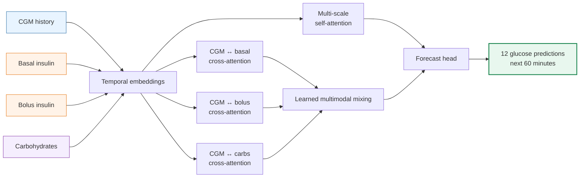
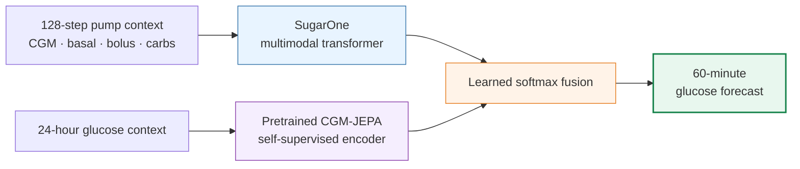
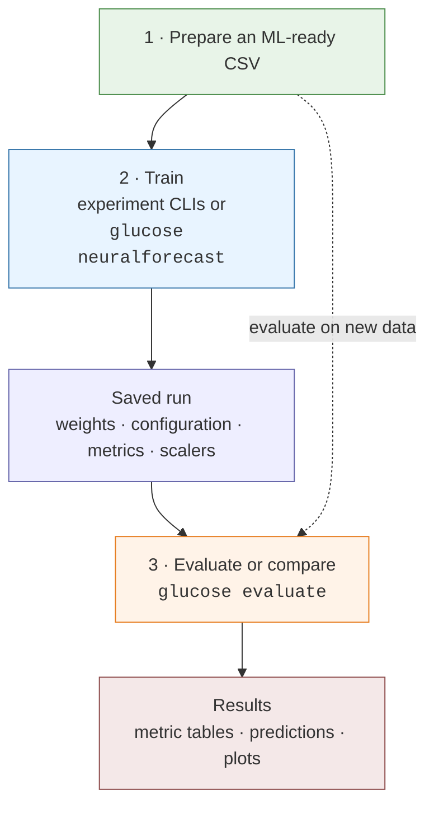
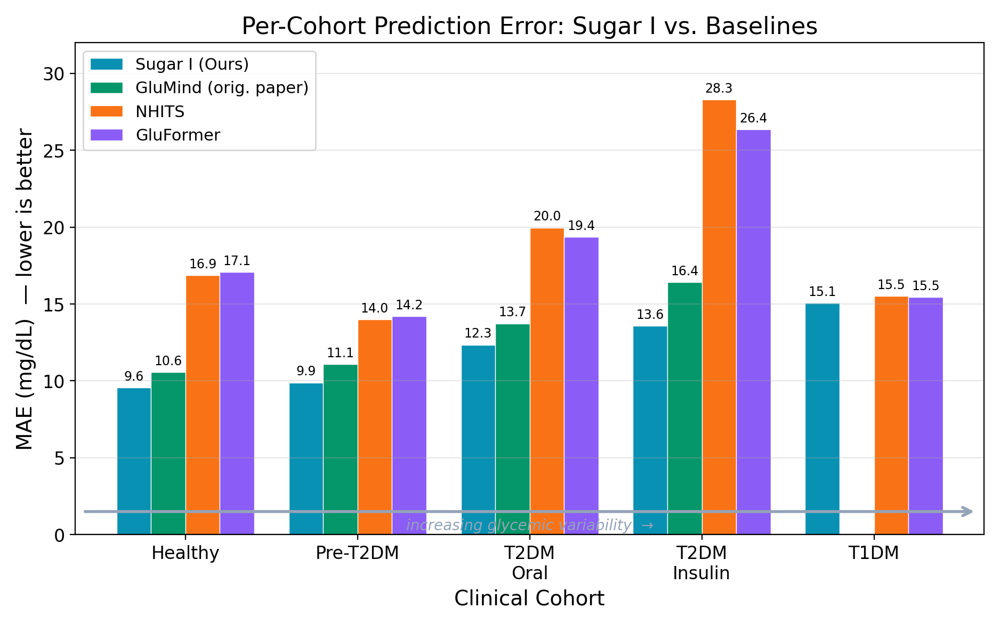
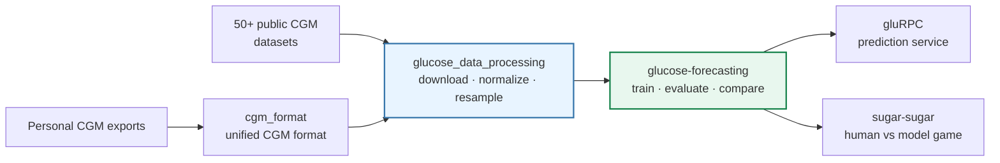

# Glucose Forecasting

<p align="center">
  <strong>Multimodal deep learning for predicting blood glucose up to 60 minutes ahead</strong>
</p>

<p align="center">
  CGM · insulin · carbohydrates · heart rate · activity
</p>

<p align="center">
  <a href="https://anonymous.4open.science/r/glucose-forecasting"></a>
  <a href="https://pytorch.org/"></a>
  <a href="https://github.com/astral-sh/uv"></a>
  <a href="https://anonymous.4open.science/r/glucose-forecasting"></a>
</p>

This repository is both a **research platform** and a **reproducible model playground**:

- run pretrained glucose models on bundled demo data;
- train multimodal transformers on CGM, pump, meal, and wearable signals;
- compare SugarOne and GluMind with TFT, NHITS, xLSTM, and other baselines;
- evaluate across Type 1 diabetes, Type 2 diabetes, pre-diabetes, and healthy cohorts;
- connect directly to the [AnonymousOrg data pipeline](https://anonymous.4open.science/r/glucose-data-processing), which catalogs **50+ public glucose datasets** and converts supported sources into ML-ready time series.

> **Current flagship result:** SugarOne reaches **12.40 mg/dL MAE** and **9.91% MARD** over **1.67 million held-out forecast windows** from the joined Loop + AI-READI benchmark.

**Docs:** [CLI reference](docs/CLI_REFERENCE.md) · [Data layout](docs/DATA.md) · [Personalization](docs/PERSONALIZATION.md) · [How to run a checkpoint](docs/How_to_run_checkpoint.md) · [Presentation](docs/presentation/PRESENTATION_NOTES.md)

---

## Try a pretrained model

No external dataset or training run is required:

```bash
git clone https://anonymous.4open.science/r/glucose-forecasting.git
cd glucose-forecasting
uv sync
uv run glucose evaluate \
  --run-dir fixtures/checkpoints/sugar_one_1.0 \
  --model-type sugar_one \
  --data fixtures/demo_data/demo_sugar_one_ready.csv \
  --test-split "" \
  --batch-size 256 \
  --no-plot
```

GluMind demo (wearable-shaped CSV, no pump columns):

```bash
uv run glucose evaluate \
  --run-dir fixtures/checkpoints/glumind_1.0 \
  --model-type glumind \
  --data fixtures/demo_data/demo_glumind_ready.csv \
  --test-split "" \
  --batch-size 4096 \
  --no-plot
```

The repository includes checkpoints and demo data. Evaluation runs locally—your data is not uploaded—and reports MAE, RMSE, and MARD. Bundled `fixtures/checkpoints/*` folders already ship **`scalers.json`**; you do not need `--train-data` for the demos.

---

## What makes the models interesting?

Glucose is not an isolated signal. Insulin can lower it, carbohydrates can raise it, and activity and physiology change the response. Our models learn those relationships with parallel cross-attention and multi-scale temporal attention.



SugarOne learns how much each pump/meal branch matters instead of combining covariates with fixed weights. GluMind applies the same multimodal idea to heart rate and step count. NeuralForecast baselines share the same holdout protocol and metrics for fair comparison.

### Research spotlight: SugarJEPA

**SugarJEPA combines supervised transformer forecasting with self-supervised JEPA representations.** It keeps SugarOne's multimodal backbone and adds a pretrained [CGM-JEPA](https://github.com/cruiseresearchgroup/CGM-JEPA) encoder as a fourth cross-attention stream:



In a matched-hyperparameter development experiment, the frozen JEPA branch improved test **MAE by 4.66%** and **RMSE by 4.04%** over SugarOne, with gains on every aggregate metric across validation and test splits. This is a promising research result rather than a production claim: SugarJEPA currently requires longer series, was evaluated on fewer windows, and took about 4.6× longer per epoch.

See the [full SugarJEPA vs SugarOne analysis](docs/SUGAR_JEPA_VS_SUGAR_ONE_DEV_COMPARISON.md).

A second variant, **SugarJEPA-2** (`sugar_jepa2`), replaces the borrowed CGM-JEPA weights with an
encoder we pretrain ourselves on this repo's own glucose data
(`src/sugar_jepa/jepa_pretrain.py`), and folds the two lookbacks into a single window so the batch
stays SugarOne's plain `(x, y)`. See [`src/sugar_jepa/README.md`](src/sugar_jepa/README.md).

## Choose your model

| Model | Inputs | Best for |
|-------|--------|----------|
| **SugarOne** | glucose + basal + bolus + carbs | Insulin pump / Loop users |
| **SugarJEPA** | SugarOne + pretrained CGM-JEPA representation | Hybrid supervised/self-supervised research |
| **SugarJEPA-2** | SugarOne + our own self-pretrained JEPA encoder | Same, without borrowed weights |
| **GluMind** | glucose + heart rate + steps | Wearable / AI-READI cohorts |
| **GluMind-Uni** | glucose only | Ablation / univariate baseline |
| **NeuralForecast** | configurable | TFT, NHITS, xLSTM, LSTM baselines |

Default forecast horizon: **12 steps = 60 minutes** at 5-minute sampling.

---

## The `glucose` CLI

Platform commands for evaluation, NeuralForecast holdout, and release bundles. Outputs go under `data/output/runs/` (or `--out` for comparisons).



There is **no** `glucose train` for custom PyTorch models. Train SugarOne / GluMind / SugarJEPA with their experiment CLIs; use `glucose neuralforecast` for NF baselines. All of them work with `glucose evaluate`.

### Train NeuralForecast baselines

```bash
uv run glucose neuralforecast train --list-models
uv run glucose neuralforecast train \
  --data data/input/loop_and_ai_ready/loop_ai_ready_joined2_dev.csv \
  --models NHITS \
  --global-model \
  --device auto \
  --out-dir data/output/runs
```

Default geometry is SugarOne-compatible: **input 128 / horizon 12 / stride 1**.

### Train custom PyTorch models

```bash
uv run train-glumind --help
uv run python src/sugar_one/train_sugar_one.py --help
uv run python src/glumind_uni/train_uniglumind.py train --help
uv run python src/sugar_jepa/train_sugar_jepa.py --help
uv run python src/sugar_jepa/train_sugar_jepa2.py --help
uv run tune-sugar-one -c src/sugar_one/tune_sugar_one_dev.toml
```

Example SugarOne training:

```bash
uv run python src/sugar_one/train_sugar_one.py \
  --csv data/input/loop_and_ai_ready/loop_ai_ready_joined2.csv \
  --mode global \
  --device cuda \
  --epochs 120 \
  --patience 10 \
  --batch-size 256 \
  --out-dir data/output/runs/sugar_one
```

Full flag tables: [docs/CLI_REFERENCE.md](docs/CLI_REFERENCE.md).

### Evaluate one model

```bash
# Read precomputed metrics from a run directory (omit --data)
uv run glucose evaluate --run-dir data/output/runs/nf_holdout/__ALL__/TFT_...

# Live inference on a different dataset
uv run glucose evaluate \
  --run-dir data/output/runs/sugar_one/my_run \
  --data data/input/loop_and_ai_ready/loop_ai_ready_joined2.csv
```

Auto-detects the family (`glumind`, `sugar_one`, `glumind_uni`, `sugar_jepa`, `sugar_jepa2`, NeuralForecast) from the run directory when `--model-type auto`.

### Compare models across backends

```bash
uv run glucose evaluate \
  --run-dir fixtures/checkpoints/sugar_one_1.0 --label SugarOne \
  --run-dir fixtures/checkpoints/glumind_1.0 --label GluMind \
  --run-dir data/output/runs/nf_holdout/__ALL__/TFT_... \
  --out data/output/compare/full_comparison
```

Or use defaults from `src/glucose_evaluate.yaml`:

```bash
uv run glucose evaluate
```

Typical comparison outputs under `--out`:

```text
test_metrics_summary.csv
val_metrics_summary.csv
study_group_metrics.csv
run_manifest.json
plots/
```

### Inference release bundles

```bash
uv run glucose release pack fixtures/checkpoints/glumind_1.0 --out temp_docs/my_bundle --release-id glumind-demo
uv run glucose release check <bundle_dir>
uv run glucose release publish <bundle_dir> --repo ORG/NAME
uv run glucose release pull --repo ORG/NAME --out <dir>
```

---

## Benchmark results

On the joined Loop + AI-READI dataset (`loop_ai_ready_joined2.csv`, 1.67M test windows, 60-min horizon):

| Model | MAE (mg/dL) | RMSE | MARD |
|-------|-------------|------|------|
| **SugarOne** | **12.40** | **19.03** | **9.91%** |
| SugarOne (glucose only, covariates zeroed) | 12.63 | 19.47 | 9.98% |
| GluMind (cross-domain) | 12.73 | 19.66 | 10.28% |

On the development subset (`loop_ai_ready_joined2_dev.csv`):

| Model | MAE (mg/dL) | RMSE | MARD |
|-------|-------------|------|------|
| **SugarOne** | **17.6** | **26.3** | **14.2%** |
| TFT (NeuralForecast) | 20.6 | 30.7 | 15.8% |
| SugarJEPA | 21.6 | 31.9 | 17.0% |
| NHITS (NeuralForecast) | 22.2 | 32.3 | 17.3% |

Detailed analysis: [GluMind vs SugarOne](docs/GLUMIND_VS_SUGARONE_COMPARISON.md), [T1DM covariate ablation](docs/T1DM_COVARIATE_ABLATION_REPORT.md), [SugarJEPA vs SugarOne](docs/SUGAR_JEPA_VS_SUGAR_ONE_DEV_COMPARISON.md).

The model family has also been evaluated across cohorts with increasing glycemic variability:



_This earlier wearable benchmark uses “Sugar I” as the presentation name for the GluMind architecture. SugarOne is the newer pump-aware model with insulin and carbohydrate inputs. See [docs/presentation/PRESENTATION_NOTES.md](docs/presentation/PRESENTATION_NOTES.md)._

---

## Part of the AnonymousOrg ecosystem

Glucose forecasting is only useful when real-world CGM data can reach the model. This project is one part of the broader [AnonymousOrg open-source ecosystem](https://anonymous.4open.science/r/glucose-forecasting):



- **[glucose_data_processing](https://anonymous.4open.science/r/glucose-data-processing)** — catalogs 50+ public glucose datasets; converters for Loop, HUPA, T1D-UOM, UCHTT1DM, AI-READI, Dexcom, Libre, Medtronic, and more.
- **[cgm_format](https://anonymous.4open.science/r/cgm-format)** — common CGM exports → unified format.
- **[gluRPC](https://anonymous.4open.science/r/gluRPC)** — glucose prediction gRPC service.
- **[sugar-sugar](https://anonymous.4open.science/r/sugar-sugar)** — human vs model forecasting game.

Together: **find data → prepare it → train models → serve predictions → explore human forecasting**.

## Bring a dataset

This repo does **not** ship the large datasets. Prepare ML-ready CSVs in the companion preprocessing project:

```bash
cd ..
git clone https://anonymous.4open.science/r/glucose-data-processing.git
cd glucose_data_processing
uv sync

uv run glucose-download list
uv run glucose-download by-name "HUPA"
uv run glucose-process DATA/hupa

cd ../glucose-forecasting
cp ../glucose_data_processing/OUTPUT/hupa_ml_ready.csv data/input/hupa_ml_ready.csv

uv run glucose neuralforecast train \
  --data data/input/hupa_ml_ready.csv \
  --models NHITS \
  --global-model \
  --device auto
```

| File | What it is |
|------|------------|
| `loop_ai_ready_joined2.csv` | Full Loop + AI-READI benchmark (~12M rows) |
| `loop_ai_ready_joined2_dev.csv` | Smaller subset for development |

**No dataset yet?** Start with `fixtures/demo_data/` and `fixtures/checkpoints/sugar_one_1.0/` / `fixtures/checkpoints/glumind_1.0/`.

Details: [docs/DATA.md](docs/DATA.md). Preprocessing options live in [glucose_data_processing](https://anonymous.4open.science/r/glucose-data-processing).

### Expected dataset columns

**GluMind / AI-READI-style:**  
`sequence_id`, `User ID`, `Timestamp (YYYY-MM-DDThh:mm:ss)`, `Recommended Split` (`train`/`val`/`test`), `Study Group`, `Event Type`, `Glucose Value (mg/dL)`, `Heart Rate`, `Step Count`

**Loop / SugarOne:**  
`Glucose (mg/dL)` or `Glucose Value (mg/dL)`, `Basal Rate (U/h)`, `Bolus Insulin (U)`, `Carbohydrates (g)`  
(plus the usual id / timestamp / split columns)

`glucose evaluate` resolves column aliases and can zero or ablate covariates (`--zero-cov`, `--include-cov`, `--exclude-cov`).

---

## Repository layout

```text
├── src/
│   ├── cli.py                 # `glucose` Typer app (info / evaluate / neuralforecast / release)
│   ├── glucose_evaluate.yaml  # default multi-model compare config
│   ├── common/                # shared data, metrics, checkpoint, evaluation, release
│   │   ├── data/              # columns, CSV loading, window datasets
│   │   ├── evaluation/        # glucose evaluate engine (checkpoint_eval, runner, …)
│   │   └── release/           # inference bundles format 1.0
│   ├── glumind/               # GluMind model + train-glumind
│   ├── glumind_uni/           # glucose-only variant
│   ├── sugar_one/             # SugarOne model + train / tune
│   ├── sugar_jepa/            # SugarJEPA experiments (vendored + own encoder)
│   ├── nf_baselines/          # NeuralForecast holdout + legacy tuner
│   └── personalization/       # SugarOne personal fine-tune (`personal-*`)
├── fixtures/
│   ├── demo_data/            # demo CSVs (Subject P1)
│   └── checkpoints/           # shipped reviewer weights + scalers.json
│       ├── glumind_1.0/
│       ├── sugar_one_1.0/
│       └── sugar_jepa_dev/
├── data/input/                # your ML-ready CSVs (gitignored)
├── data/output/runs/          # training and evaluation outputs
├── temp_scripts/              # one-off / prep utilities (e.g. loop_ai_ready joins)
└── docs/                      # CLI, data, reports, presentation
```

---

## Checkpoints and model reuse

Per run directory:

- `best_model.pt` / `last_model.pt` — plain `state_dict` (`weights_only=True`)
- `checkpoint.pt` / `last_checkpoint.pt` — full training state
- `tuning_meta.json` / `config.json` — architecture hyperparameters
- `scalers.json` — train-fit MinMax params (preferred by evaluate)

Architecture modules stay separate from training scripts so you can load weights with just the model file:

```python
import torch
from sugar_one.sugar_one_model import SugarOneModel

model = SugarOneModel(
    n_time_steps=128, n_features=4, d_model=32, n_heads=8,
    ff_units=128, n_blocks=5, prediction_horizon=12, dropout=0.1
)
state = torch.load("path/to/best_model.pt", map_location="cpu", weights_only=True)
model.load_state_dict(state)
model.eval()
```

---

## Troubleshooting

| Problem | Fix |
|---------|-----|
| `CSV not found` | Put files under `data/input/` or pass the correct `--data` / `--csv` path |
| `no evaluation data found` | CSV has no `Recommended Split` — pass `--test-split ""` to score all rows |
| `no precomputed metrics and no --data` | Pass `--data your.csv` to run live inference |
| Wrong scaling vs training metrics | Prefer run-dir `scalers.json`; avoid `--refit-scalers` unless intentional |
| SugarOne on GluMind-only CSV | Pass `--zero-cov` or use `fixtures/demo_data/demo_sugar_one_ready.csv` |
| Need flag help | `uv run glucose evaluate --help` or any `--help` |

---

## Documentation

| Doc | Contents |
|-----|----------|
| **[CLI Reference](docs/CLI_REFERENCE.md)** | Platform + experiment CLI flags |
| [Personalization](docs/PERSONALIZATION.md) | SugarOne + Subject P1 fine-tune (`personal-*`) |
| [Personalization report](docs/PERSONALIZATION_REPORT.md) | Personalization study results |
| [Data guide](docs/DATA.md) | Preprocessing link, `data/input/` layout, joins |
| [How to run a checkpoint](docs/How_to_run_checkpoint.md) | Reviewer smoke eval |
| [Presentation](docs/presentation/PRESENTATION_NOTES.md) | Conference figures + talk notes |
| [GluMind vs SugarOne](docs/GLUMIND_VS_SUGARONE_COMPARISON.md) | Cross-model + ablation analysis |
| [T1DM ablation](docs/T1DM_COVARIATE_ABLATION_REPORT.md) | Basal/bolus/carb contributions |
| [SugarJEPA vs SugarOne](docs/SUGAR_JEPA_VS_SUGAR_ONE_DEV_COMPARISON.md) | JEPA development comparison |

```bash
uv sync
uv run pytest -q
```
