# Milestone 8 — Personalization and Fine-Tuning Analysis

**Date:** 2026-08-17  
**Model:** SugarOne global checkpoint `fixtures/checkpoints/sugar_one_1.0/`  
**Horizon:** 12 steps (60 minutes at 5-minute sampling)  
**CLI:** `personal-*` (see `docs/PERSONALIZATION.md`)

This report is the technical write-up of the personalization study: how to adapt the production SugarOne model to one person, how much personal history is required, and whether Learning without Forgetting (LwF) helps when that history is short.

MAE is reported in mg/dL. **Δ vs zero-shot** is fine-tuned MAE minus frozen-checkpoint MAE (negative means personalization improved on the global model).

---

## 1. Executive summary

| Question | Finding |
|----------|---------|
| Best personalization method | **Plain fine-tune** (`lwf_lambda=0`) — about 10× faster than LwF, similar MAE |
| Best train window stride | **Sparse stride 6** (30 min between window starts; val/test stay stride 1) |
| Best learning rate on Livia (full train) | **2×10⁻⁴** |
| Scaler protocol | Reuse the **base-run `scalers.json`**. Do not refit MinMax scalers on personal train. |
| Coverage | Data-size curves for **15/15** subjects. Independent LwF on Livia and User 154: complete. |

**Locked recipe:** plain fine-tune, `weight_decay=3e-5`, `train_window_stride=6`, `precision=bf16`, chronological split (last 25% test / 15% of remainder val / rest train). A day budget only shortens **train**. Scalers come from the global checkpoint.

Refitting scalers on 1–14 days of personal data shifts the input scale away from the pretrained model and made short fine-tunes look harmful. All tables and charts below use the corrected protocol.

On T1DM users with long history, full-train fine-tuning typically improves MAE by about **0.5–2.1 mg/dL**. Gains usually appear after **30–60 days**. One- to fourteen-day budgets are often flat or slightly worse than the frozen model. LwF distillation against the global teacher does **not** rescue those short, harmful fine-tunes. AI-READY users have ~6 days of CGM and no insulin/carb columns (zero-filled); effects there are small and mixed.

---

## 2. Subjects and data coverage

Two extra users were taken from **each AI-READY study group** in the `loop_ai_ready_joined2.csv` test split (largest test-split row count, then User ID). T1DM is not repeated in that cohort — Livia plus the six Loop quality holdouts already cover it. Each personal CSV uses that user’s **full joined2 history**, then the same chronological split as the holdouts.

| Subject | Source | Study group | Notes |
|---------|--------|-------------|-------|
| **Livia** | Personal CGM/pump export | T1DM | Longest history (~345 d train) |
| **User 154** | Loop quality holdout | T1DM | |
| **User 556** | Loop quality holdout | T1DM | |
| **User 730** | Loop quality holdout | T1DM | |
| **User 1017** | Loop quality holdout | T1DM | |
| **User 1029** | Loop quality holdout | T1DM | |
| **User 1082** | Loop quality holdout | T1DM | 60-day budget ≈ full train |
| **1030 (Healthy)** | joined2 test | Healthy | AI-READY CGM; insulin/carbs absent (zero-filled) |
| **1043 (Healthy)** | joined2 test | Healthy | AI-READY CGM; insulin/carbs absent (zero-filled) |
| **1034 (Pre-T2DM)** | joined2 test | Pre-T2DM | AI-READY CGM; insulin/carbs absent (zero-filled) |
| **1049 (Pre-T2DM)** | joined2 test | Pre-T2DM | AI-READY CGM; insulin/carbs absent (zero-filled) |
| **1019 (Oral-T2DM)** | joined2 test | Oral-T2DM | AI-READY CGM; insulin/carbs absent (zero-filled) |
| **1127 (Oral-T2DM)** | joined2 test | Oral-T2DM | AI-READY CGM; insulin/carbs absent (zero-filled) |
| **1413 (Insulin-T2DM)** | joined2 test | Insulin-T2DM | AI-READY CGM; insulin/carbs absent (zero-filled) |
| **1036 (Insulin-T2DM)** | joined2 test | Insulin-T2DM | AI-READY CGM; insulin/carbs absent (zero-filled) |

---

## 3. Design choices

### 3.1 Plain fine-tune vs LwF

LwF remains in the SugarOne training loop: `loss = (1−λ)·task + λ·distill` against a frozen copy of `fixtures/checkpoints/sugar_one_1.0`. Production personalization uses **λ=0**.

The independent LwF experiment asks a deployment question: given **N days** of one user, should we fine-tune from the global checkpoint, or keep it frozen? Every day budget is a **new** run from that checkpoint. The teacher is the same frozen model — never a shorter-day student. λ decays 0.5 → 0.2 on 1–14 days and is **0 from 30 days**; a second arm keeps λ=0.1 on every budget.

A earlier sequential-curriculum experiment chained `best_model.pt` from shorter budgets into longer ones. That protocol is **not** used here.

### 3.2 Sparse vs dense train windows

Stride 6 is the production default (~6× fewer train windows, test MAE ≈ dense stride 1). Validation and test windows stay dense (stride 1).

### 3.3 Scaler protocol

Earlier curves fitted MinMax scalers on **personal train**. With only 1–14 days that moves the input distribution off the pretrained scale.

**Corrected protocol:** reuse `fixtures/checkpoints/sugar_one_1.0/scalers.json`. Legacy personal-scaler runs are archived next to each `data_size/` folder.

---

## 4. Learning rate on Livia (full personal train)

These numbers are from the original Livia LR search (not re-run under the base-scaler recalc). Frozen recipe for all later day curves: **lr = 2×10⁻⁴**.

Zero-shot MAE in this table (**19.324**) is from the earlier personal-scaler era. Later sections use the corrected protocol (Livia zero-shot **18.31**). Rank order of learning rates is still the one used in production.

| LR | Zero-shot MAE | Fine-tuned MAE | Fine-tuned val MAE |
|----|---------------|----------------|--------------------|
| 0.0002 | 19.324 | 17.137 | 16.577 |
| 0.0004 | 19.324 | 17.352 | 16.767 |
| 0.0001 | 19.324 | 17.409 | 16.821 |
| 5e-05 | 19.324 | 17.536 | 16.850 |
| 0.0008 | 19.324 | 17.776 | 17.065 |
| 2.5e-05 | 19.324 | 17.904 | 17.089 |

Recipe file: `data/output/runs/personalization/livia/best_recipe.json`.

---

## 5. Does Livia’s learning rate transfer? (pilot holdouts)

Same LR grid on users **154, 556, 730** (full personal train). Livia reference = **2×10⁻⁴**. These runs have **not** been re-executed with base scalers.

| User | LR 1e-4 | LR 2e-4 | LR 4e-4 | Best |
|------|---------|---------|---------|------|
| 154 | 24.342 | 24.555 | 24.207 | **0.0004** |
| 556 | 17.197 | 17.093 | 17.094 | **0.0002** |
| 730 | 16.622 | 16.665 | 16.754 | **0.0001** |

Users 1017, 1029, and 1082 were deferred. All day-budget curves below use the **frozen Livia recipe** (`lr=2e-4`), not a per-user optimum.

---

## 6. Personal train days vs test MAE

Fixed recipe: **lr=2e-4**, λ=0, weight decay 3e-5, bf16, stride 6, **base-run scalers**.

Per-user charts are limited to **60 days**. Full-train (`all`) is in the tables with the real train span, and on combined charts whose last tick is a dummy **All**. Combined charts are split (Loop holdouts vs joined2 AI-READY) so overlays stay readable.

### 6.0 Full train, frozen Livia recipe

| Subject | Cohort | Study group | Train span (d) | ZS MAE | FT MAE (all) | Δ vs ZS |
|---------|--------|-------------|----------------|--------|--------------|---------|
| Livia | Livia | T1DM | 344.6 | 18.31 | 16.98 | -1.33 |
| User 154 | Loop holdout | T1DM | 213.6 | 24.61 | 24.10 | -0.52 |
| User 556 | Loop holdout | T1DM | 90.9 | 18.10 | 17.14 | -0.96 |
| User 730 | Loop holdout | T1DM | 84.6 | 18.06 | 16.57 | -1.49 |
| User 1017 | Loop holdout | T1DM | 96.7 | 17.69 | 17.14 | -0.55 |
| User 1029 | Loop holdout | T1DM | 136.0 | 22.62 | 20.53 | -2.09 |
| User 1082 | Loop holdout | T1DM | 37.4 | 17.00 | 17.80 | 0.81 |
| 1030 (Healthy) | joined2 test | Healthy | 6.3 | 8.30 | 8.00 | -0.29 |
| 1043 (Healthy) | joined2 test | Healthy | 6.3 | 10.28 | 11.61 | 1.33 |
| 1034 (Pre-T2DM) | joined2 test | Pre-T2DM | 6.3 | 7.84 | 8.02 | 0.18 |
| 1049 (Pre-T2DM) | joined2 test | Pre-T2DM | 6.3 | 9.66 | 9.60 | -0.05 |
| 1019 (Oral-T2DM) | joined2 test | Oral-T2DM | 6.3 | 11.75 | 11.87 | 0.12 |
| 1127 (Oral-T2DM) | joined2 test | Oral-T2DM | 6.3 | 14.77 | 15.22 | 0.45 |
| 1413 (Insulin-T2DM) | joined2 test | Insulin-T2DM | 9.1 | 15.02 | 15.41 | 0.39 |
| 1036 (Insulin-T2DM) | joined2 test | Insulin-T2DM | 6.3 | 14.76 | 14.19 | -0.57 |

User 1082 is the T1DM exception: full train is only ~37 days, and fine-tuning is **worse** than zero-shot. Several AI-READY users also worsen; their train span is about a week and insulin/carb channels are empty.

### 6.1 Livia and Loop quality holdouts (60-day curves)

#### Livia

| Days | Used train days | ZS MAE | FT MAE | Δ FT vs ZS |
|------|-----------------|--------|--------|------------|
| 1 | 1.0 | 18.31 | 18.54 | 0.23 |
| 3 | 3.0 | 18.31 | 18.64 | 0.33 |
| 7 | 7.0 | 18.31 | 18.93 | 0.62 |
| 14 | 14.0 | 18.31 | 18.74 | 0.43 |
| 30 | 30.0 | 18.31 | 18.26 | -0.05 |
| 60 | 60.0 | 18.31 | 17.63 | -0.68 |
| all (345d) | 344.6 | 18.31 | 16.98 | -1.33 |

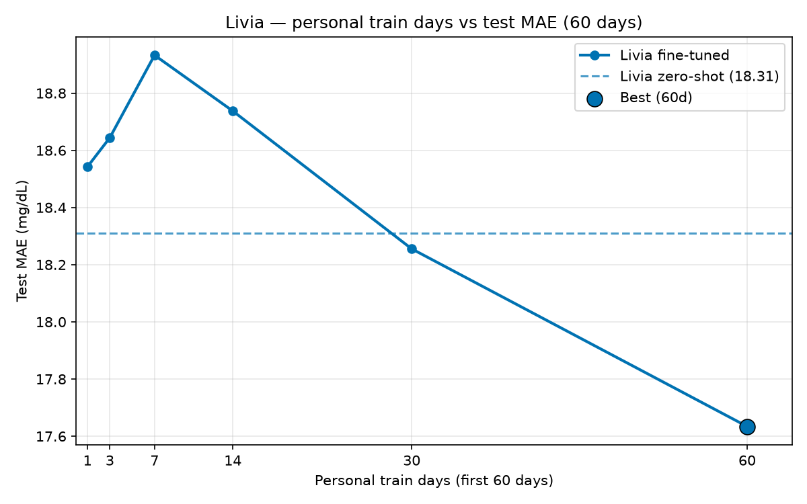

#### User 154

| Days | Used train days | ZS MAE | FT MAE | Δ FT vs ZS |
|------|-----------------|--------|--------|------------|
| 1 | 1.0 | 24.61 | 24.67 | 0.06 |
| 3 | 3.0 | 24.61 | 24.72 | 0.10 |
| 7 | 7.0 | 24.61 | 24.72 | 0.10 |
| 14 | 14.0 | 24.61 | 24.72 | 0.10 |
| 30 | 30.0 | 24.61 | 24.84 | 0.23 |
| 60 | 60.0 | 24.61 | 24.78 | 0.16 |
| all (214d) | 213.6 | 24.61 | 24.10 | -0.52 |

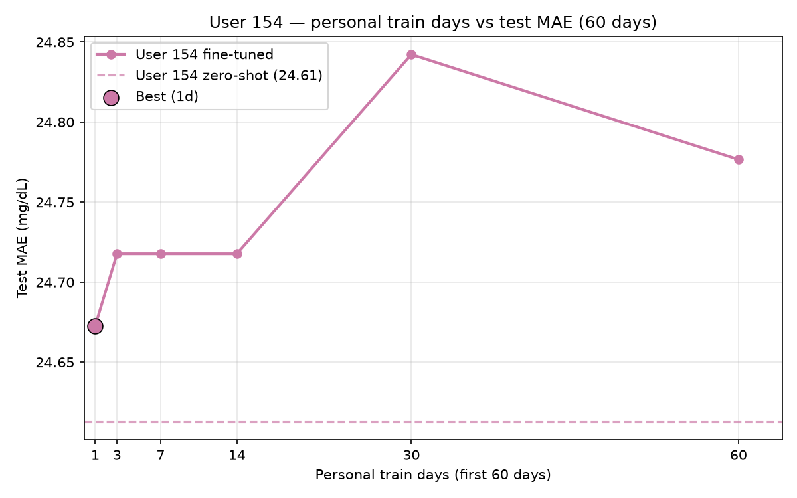

#### User 556

| Days | Used train days | ZS MAE | FT MAE | Δ FT vs ZS |
|------|-----------------|--------|--------|------------|
| 1 | 1.0 | 18.10 | 17.96 | -0.14 |
| 3 | 3.0 | 18.10 | 18.17 | 0.07 |
| 7 | 7.0 | 18.10 | 18.30 | 0.20 |
| 14 | 14.0 | 18.10 | 18.34 | 0.24 |
| 30 | 30.0 | 18.10 | 17.62 | -0.48 |
| 60 | 60.0 | 18.10 | 17.31 | -0.79 |
| all (91d) | 90.9 | 18.10 | 17.14 | -0.96 |

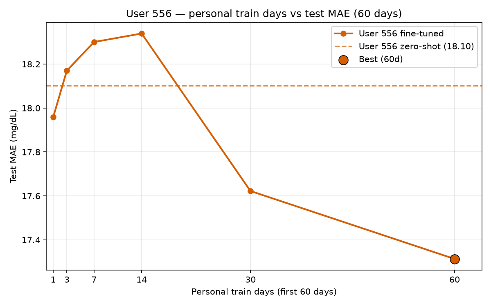

#### User 730

| Days | Used train days | ZS MAE | FT MAE | Δ FT vs ZS |
|------|-----------------|--------|--------|------------|
| 1 | 1.0 | 18.06 | 18.34 | 0.29 |
| 3 | 3.0 | 18.06 | 18.38 | 0.32 |
| 7 | 7.0 | 18.06 | 18.81 | 0.76 |
| 14 | 14.0 | 18.06 | 17.57 | -0.49 |
| 30 | 30.0 | 18.06 | 17.29 | -0.77 |
| 60 | 60.0 | 18.06 | 16.66 | -1.39 |
| all (85d) | 84.6 | 18.06 | 16.57 | -1.49 |

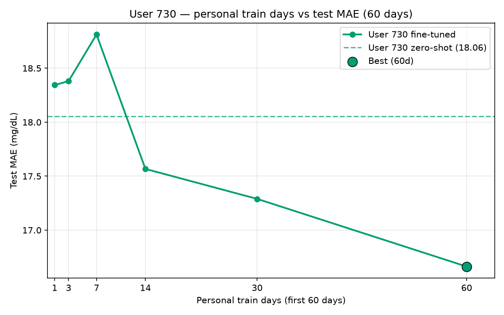

#### User 1017

| Days | Used train days | ZS MAE | FT MAE | Δ FT vs ZS |
|------|-----------------|--------|--------|------------|
| 1 | 1.0 | 17.69 | 17.86 | 0.17 |
| 3 | 3.0 | 17.69 | 17.91 | 0.22 |
| 7 | 7.0 | 17.69 | 17.91 | 0.22 |
| 14 | 14.0 | 17.69 | 18.16 | 0.47 |
| 30 | 30.0 | 17.69 | 18.20 | 0.51 |
| 60 | 60.0 | 17.69 | 17.33 | -0.35 |
| all (97d) | 96.7 | 17.69 | 17.14 | -0.55 |

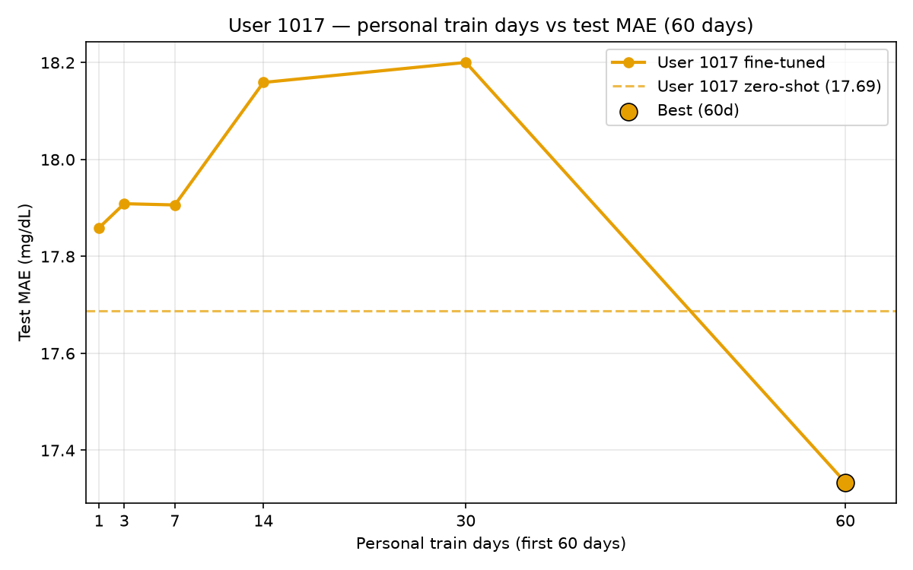

#### User 1029

| Days | Used train days | ZS MAE | FT MAE | Δ FT vs ZS |
|------|-----------------|--------|--------|------------|
| 1 | 1.0 | 22.62 | 22.50 | -0.12 |
| 3 | 3.0 | 22.62 | 23.02 | 0.39 |
| 7 | 7.0 | 22.62 | 22.58 | -0.04 |
| 14 | 14.0 | 22.62 | 23.09 | 0.47 |
| 30 | 30.0 | 22.62 | 21.62 | -1.00 |
| 60 | 60.0 | 22.62 | 21.44 | -1.18 |
| all (136d) | 136.0 | 22.62 | 20.53 | -2.09 |

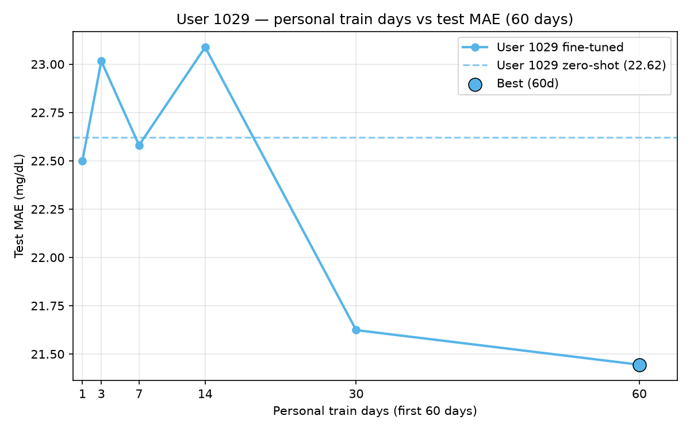

#### User 1082

| Days | Used train days | ZS MAE | FT MAE | Δ FT vs ZS |
|------|-----------------|--------|--------|------------|
| 1 | 1.0 | 17.00 | 17.01 | 0.01 |
| 3 | 3.0 | 17.00 | 17.09 | 0.09 |
| 7 | 7.0 | 17.00 | 17.15 | 0.15 |
| 14 | 14.0 | 17.00 | 17.29 | 0.29 |
| 30 | 30.0 | 17.00 | 17.59 | 0.60 |
| all (37d) | 37.4 | 17.00 | 17.80 | 0.81 |

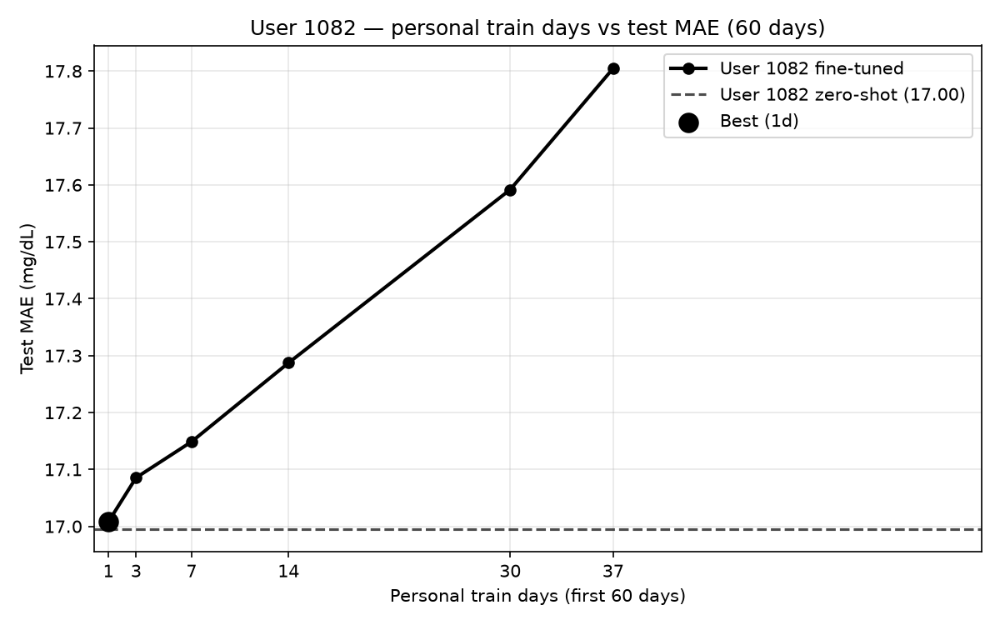

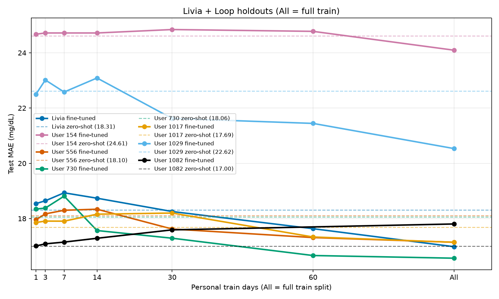

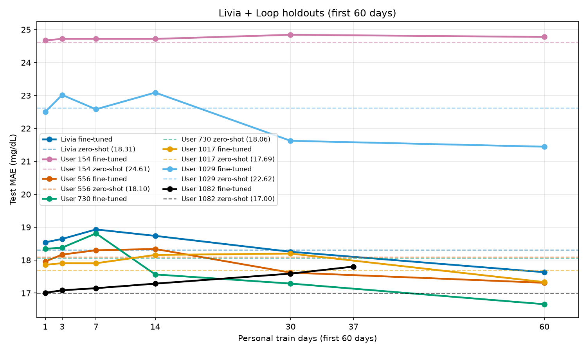

### 6.2 Joined2 test — two users per study group

#### 1030 (Healthy)

| Days | Used train days | ZS MAE | FT MAE | Δ FT vs ZS |
|------|-----------------|--------|--------|------------|
| 1 | 1.0 | 8.30 | 8.18 | -0.12 |
| 3 | 3.0 | 8.30 | 8.08 | -0.21 |
| all (6d) | 6.3 | 8.30 | 8.00 | -0.29 |

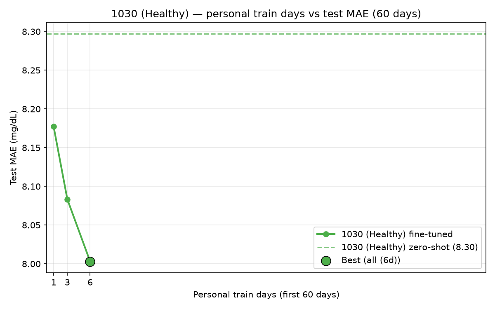

#### 1043 (Healthy)

| Days | Used train days | ZS MAE | FT MAE | Δ FT vs ZS |
|------|-----------------|--------|--------|------------|
| 1 | 1.0 | 10.28 | 10.25 | -0.04 |
| 3 | 3.0 | 10.28 | 11.06 | 0.78 |
| all (6d) | 6.3 | 10.28 | 11.61 | 1.33 |

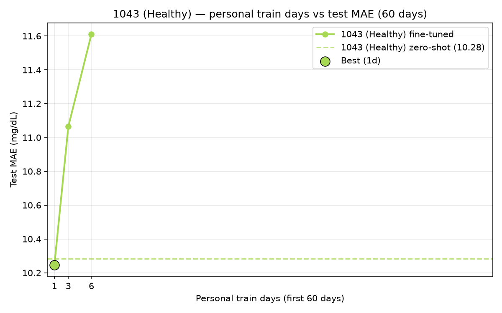

#### 1034 (Pre-T2DM)

| Days | Used train days | ZS MAE | FT MAE | Δ FT vs ZS |
|------|-----------------|--------|--------|------------|
| 1 | 1.0 | 7.84 | 8.25 | 0.41 |
| 3 | 3.0 | 7.84 | 7.86 | 0.01 |
| all (6d) | 6.3 | 7.84 | 8.02 | 0.18 |

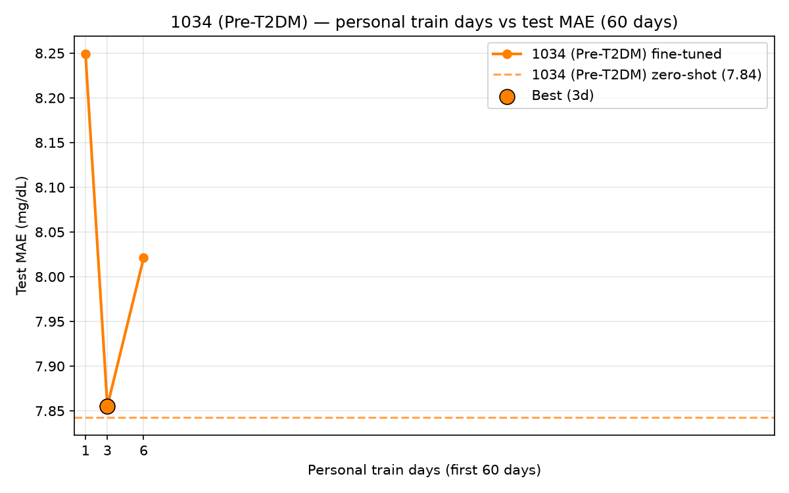

#### 1049 (Pre-T2DM)

| Days | Used train days | ZS MAE | FT MAE | Δ FT vs ZS |
|------|-----------------|--------|--------|------------|
| 1 | 1.0 | 9.66 | 9.63 | -0.03 |
| 3 | 3.0 | 9.66 | 9.62 | -0.04 |
| all (6d) | 6.3 | 9.66 | 9.60 | -0.05 |

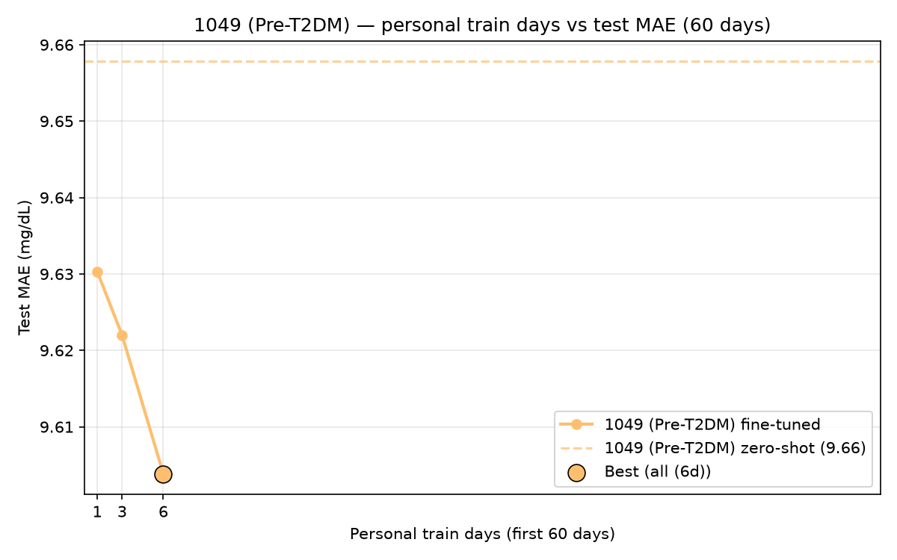

#### 1019 (Oral-T2DM)

| Days | Used train days | ZS MAE | FT MAE | Δ FT vs ZS |
|------|-----------------|--------|--------|------------|
| 1 | 1.0 | 11.75 | 11.77 | 0.02 |
| 3 | 3.0 | 11.75 | 11.71 | -0.04 |
| all (6d) | 6.3 | 11.75 | 11.87 | 0.12 |

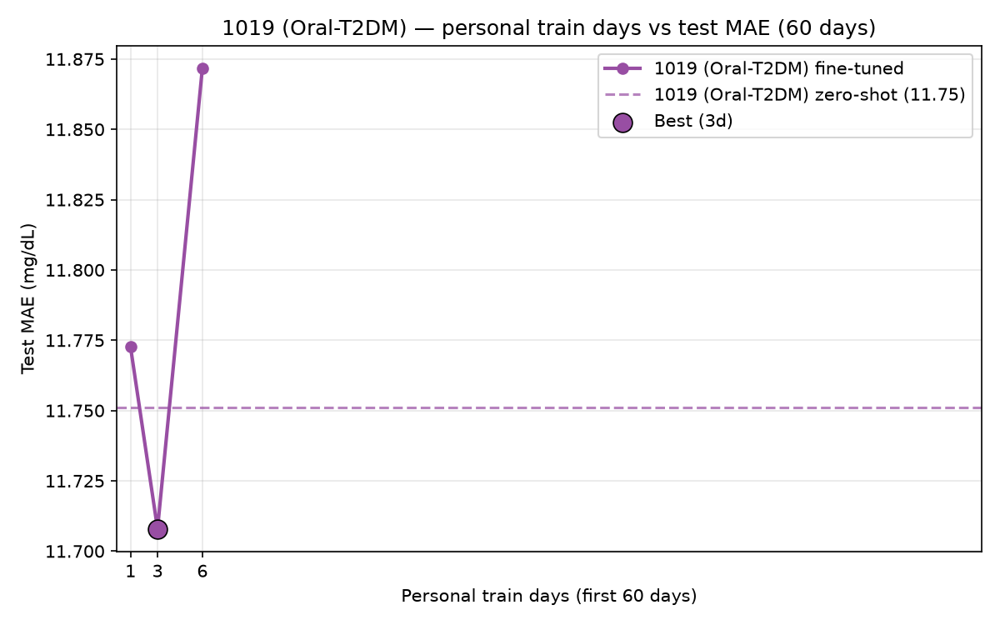

#### 1127 (Oral-T2DM)

| Days | Used train days | ZS MAE | FT MAE | Δ FT vs ZS |
|------|-----------------|--------|--------|------------|
| 1 | 1.0 | 14.77 | 15.67 | 0.90 |
| 3 | 3.0 | 14.77 | 15.77 | 1.00 |
| all (6d) | 6.3 | 14.77 | 15.22 | 0.45 |

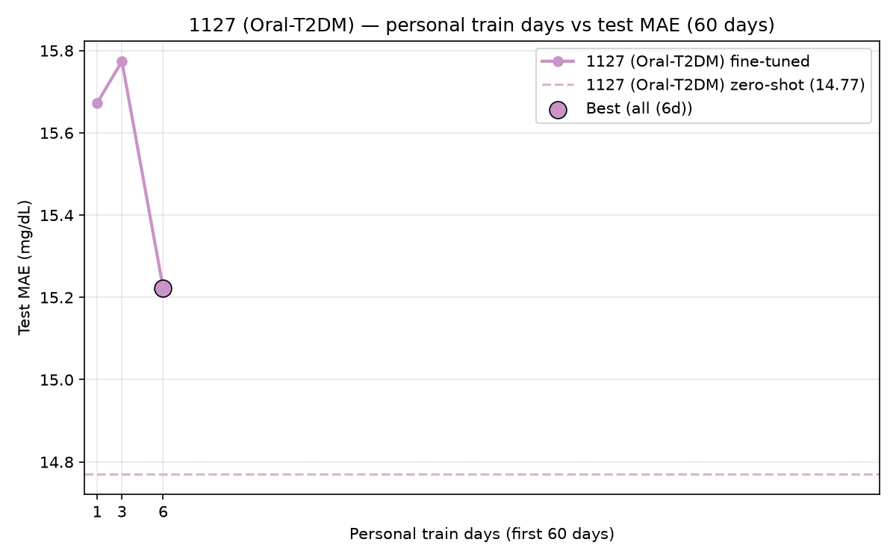

#### 1413 (Insulin-T2DM)

| Days | Used train days | ZS MAE | FT MAE | Δ FT vs ZS |
|------|-----------------|--------|--------|------------|
| 1 | 1.0 | 15.02 | 15.68 | 0.65 |
| 3 | 3.0 | 15.02 | 16.16 | 1.14 |
| 7 | 7.0 | 15.02 | 15.03 | 0.00 |
| all (9d) | 9.1 | 15.02 | 15.41 | 0.39 |

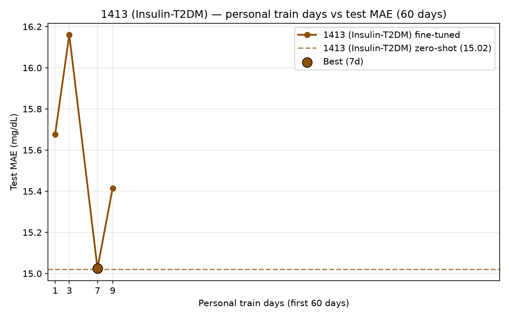

#### 1036 (Insulin-T2DM)

| Days | Used train days | ZS MAE | FT MAE | Δ FT vs ZS |
|------|-----------------|--------|--------|------------|
| 1 | 1.0 | 14.76 | 14.86 | 0.11 |
| 3 | 3.0 | 14.76 | 14.60 | -0.16 |
| all (6d) | 6.3 | 14.76 | 14.19 | -0.57 |

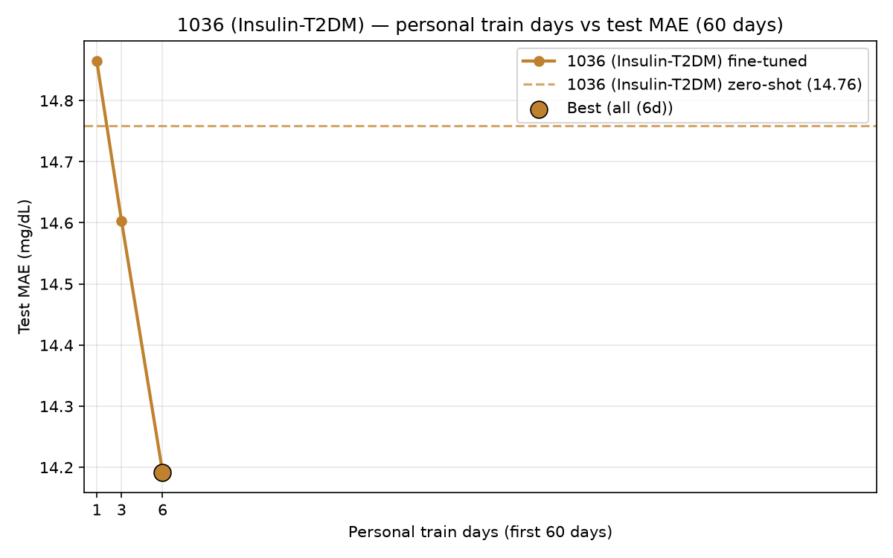

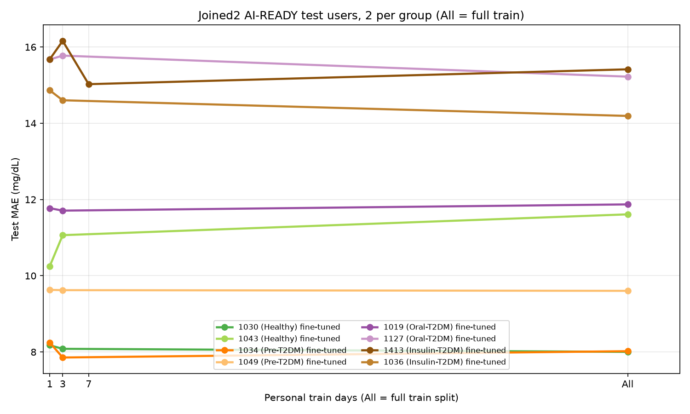

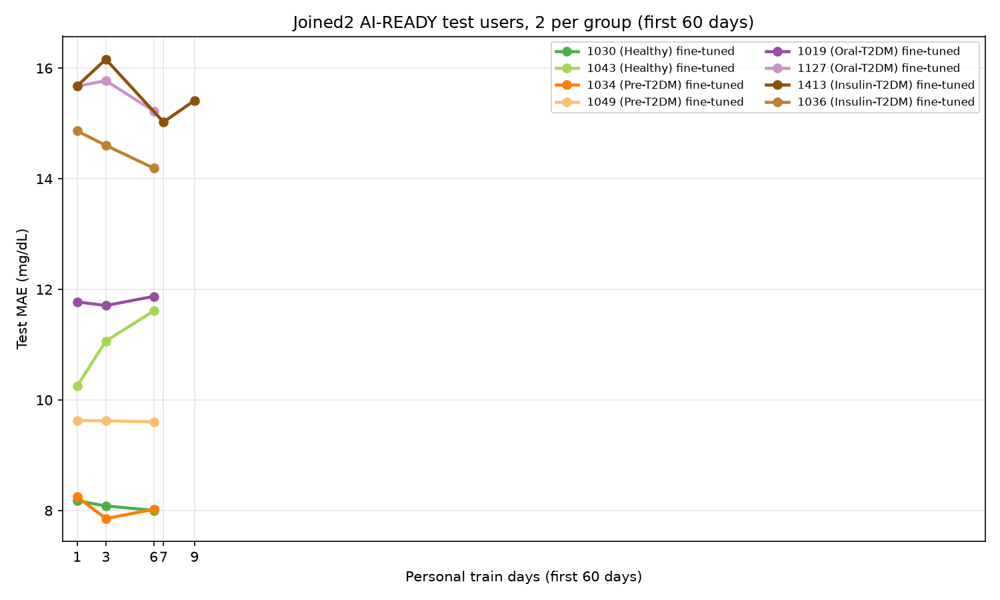

### 6.3 Independent LwF on Livia

Question: a user arrives with **N days** of data. Should we fine-tune the global model on that slice, or keep the frozen checkpoint? Every day budget starts from `fixtures/checkpoints/sugar_one_1.0/`. The LwF teacher is that same checkpoint.

| Kind | Student init | Teacher | λ |
|------|----------------|---------|---|
| Independent | global every budget | none | 0 |
| LwF decay | global every budget | global | 0.5 / 0.4 / 0.3 / 0.2 on 1 / 3 / 7 / 14 days; **0 from 30 days** (copy independent) |
| LwF λ=0.1 | global every budget | global | **0.1 on every budget**, including 30 / 60 / all |

Val and test splits never change. Day budget only lengthens **train**. Scalers stay the global `scalers.json`. Recipe: lr=2e-4, stride=6, bf16, patience=3.

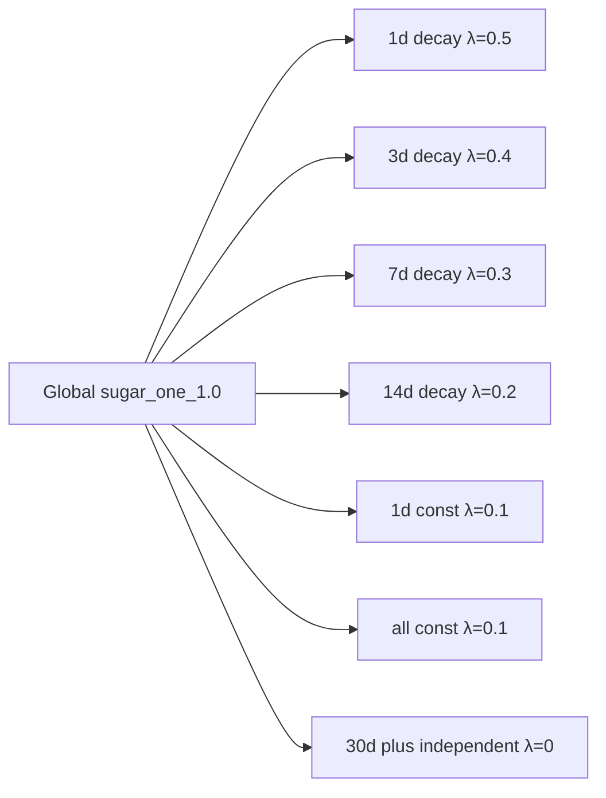
```mermaid
flowchart LR
  G[Global sugar_one_1.0]
  G --> D1[1d decay λ=0.5]
  G --> D3[3d decay λ=0.4]
  G --> D7[7d decay λ=0.3]
  G --> D14[14d decay λ=0.2]
  G --> C1[1d const λ=0.1]
  G --> CAll[all const λ=0.1]
  G --> I30[30d plus independent λ=0]
```

Test MAE (mg/dL). Negative Δ is better than the frozen global model.

| Days | Independent MAE | Decay MAE | Const λ=0.1 MAE | Independent Δ | Decay Δ | Const Δ | λ independent | λ decay | λ const |
|------|------|------|------|------|------|------|------|------|------|
| 1 | 18.54 | 18.59 | 18.55 | 0.23 | 0.28 | 0.24 | 0 | 0.5 | 0.1 |
| 3 | 18.64 | 18.56 | 18.72 | 0.33 | 0.25 | 0.41 | 0 | 0.4 | 0.1 |
| 7 | 18.93 | 19.31 | 19.07 | 0.62 | 1.00 | 0.76 | 0 | 0.3 | 0.1 |
| 14 | 18.74 | 18.91 | 18.82 | 0.43 | 0.60 | 0.51 | 0 | 0.2 | 0.1 |
| 30 | 18.26 | 18.26 | 18.10 | -0.05 | -0.05 | -0.21 | 0 | 0 | 0.1 |
| 60 | 17.63 | 17.63 | 17.70 | -0.68 | -0.68 | -0.61 | 0 | 0 | 0.1 |
| all | 16.98 | 16.98 | 16.99 | -1.33 | -1.33 | -1.32 | 0 | 0 | 0.1 |

Distillation does not remove the short-history penalty. At 7 days, decay (λ=0.3) is **worse** than plain fine-tune. Full-train MAE is essentially identical across λ.

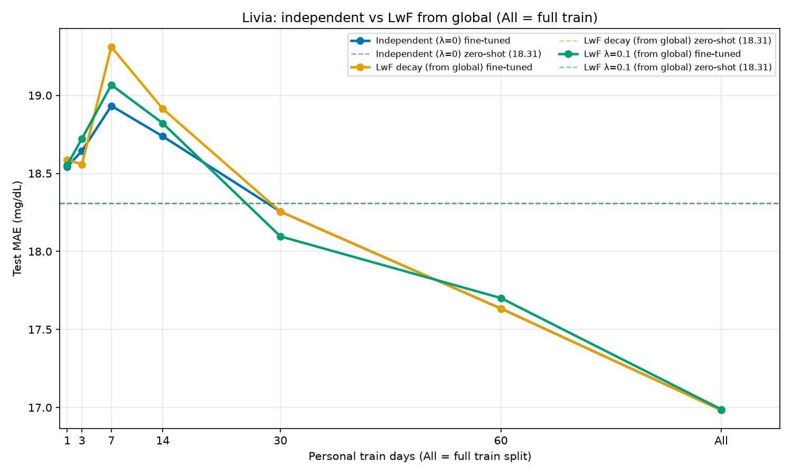

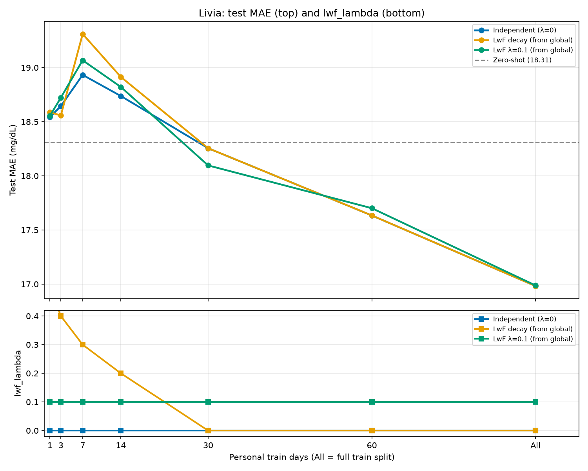

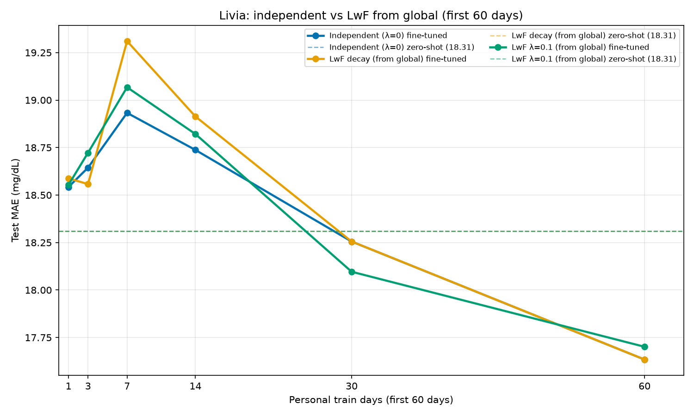

### 6.4 User 154 — same independent LwF protocol

Independent fine-tunes on this user are flat or slightly **worse** than zero-shot until full train. Same teacher and the same two λ policies as Livia.

| Days | Independent MAE | Decay MAE | Const λ=0.1 MAE | Independent Δ | Decay Δ | Const Δ | λ independent | λ decay | λ const |
|------|------|------|------|------|------|------|------|------|------|
| 1 | 24.67 | 24.69 | 24.68 | 0.06 | 0.08 | 0.07 | 0 | 0.5 | 0.1 |
| 3 | 24.72 | 24.87 | 24.81 | 0.10 | 0.26 | 0.20 | 0 | 0.4 | 0.1 |
| 7 | 24.72 | 24.83 | 24.81 | 0.10 | 0.22 | 0.20 | 0 | 0.3 | 0.1 |
| 14 | 24.72 | 24.86 | 24.81 | 0.10 | 0.25 | 0.20 | 0 | 0.2 | 0.1 |
| 30 | 24.84 | 24.84 | 24.88 | 0.23 | 0.23 | 0.27 | 0 | 0 | 0.1 |
| 60 | 24.78 | 24.78 | 24.82 | 0.16 | 0.16 | 0.20 | 0 | 0 | 0.1 |
| all | 24.10 | 24.10 | 24.08 | -0.52 | -0.52 | -0.53 | 0 | 0 | 0.1 |

LwF does not turn the short-history curve below zero-shot. Full-train improvement is about **0.5 mg/dL** with or without λ=0.1.

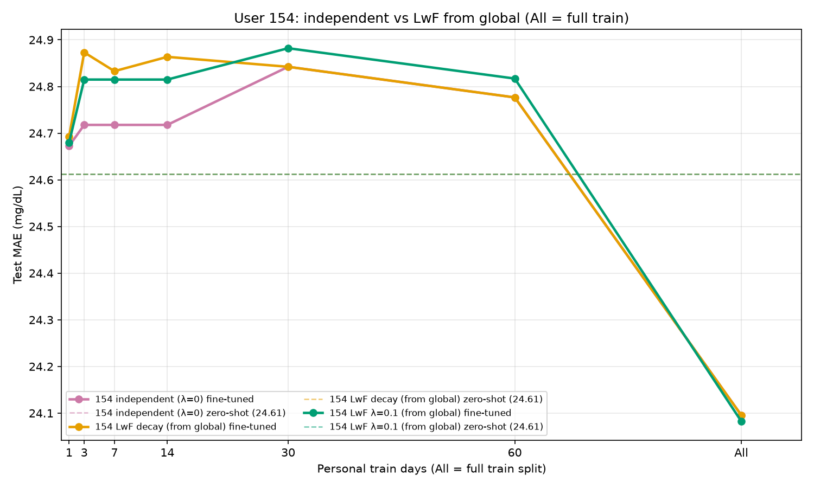

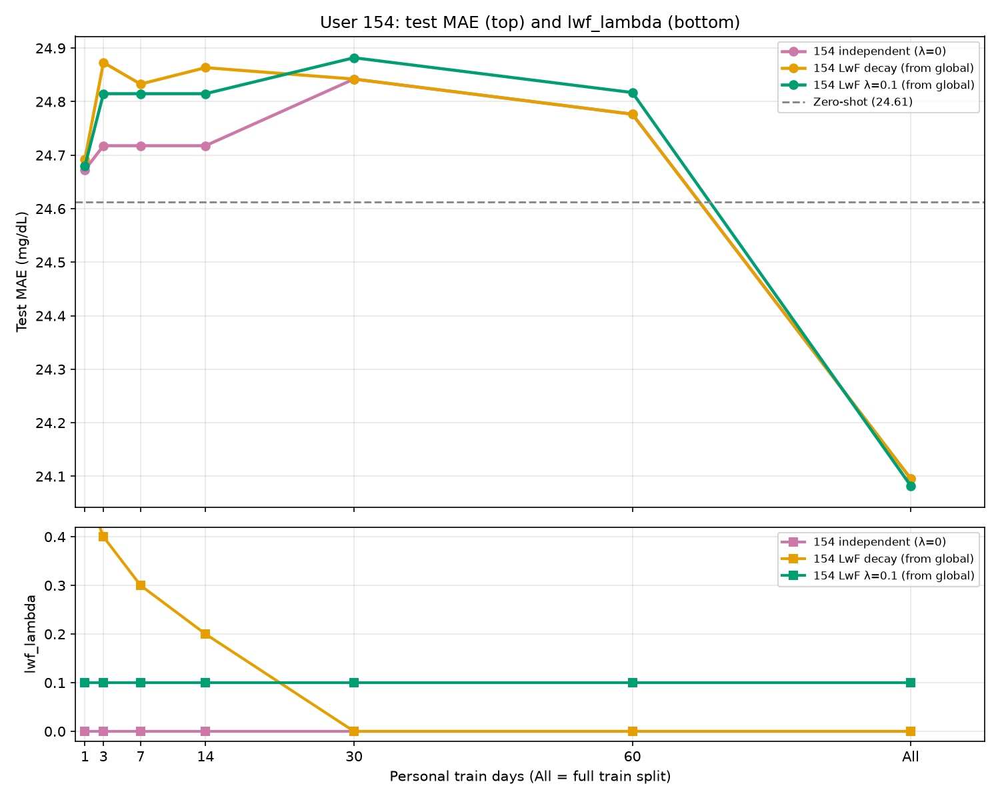

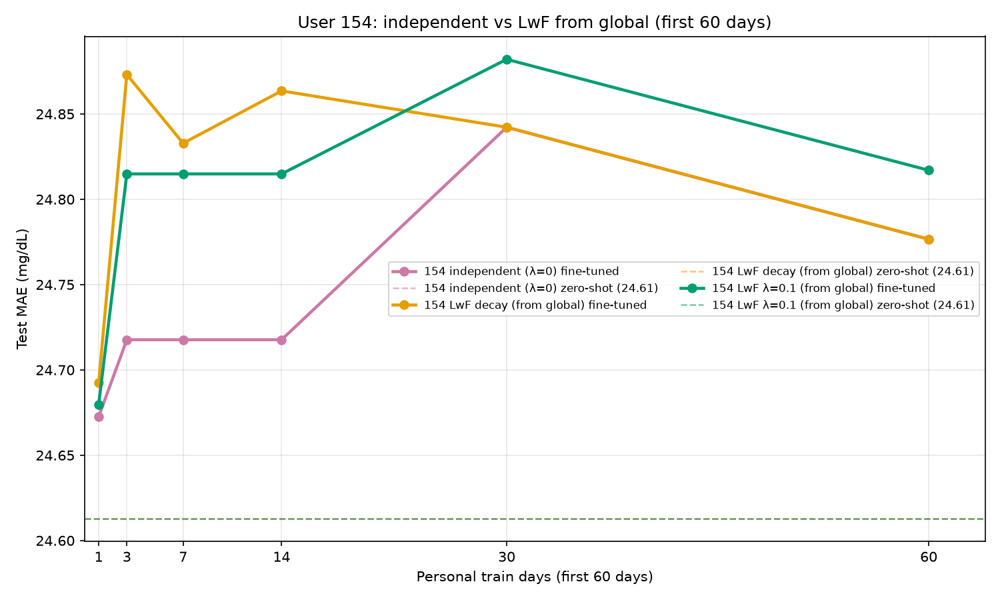

---

## 7. Study completion

| Step | Goal | Status |
|------|------|--------|
| 1 | Chronological CSVs | Done (Livia + 6 holdouts + 8 joined2 AI-READY) |
| 2 | LR search on Livia full train | Done — best LR 2×10⁻⁴ |
| 2b | LR transfer on holdouts | Partial — 3/6 users; not re-run with base scalers |
| 3 | Data-size curve (Livia) | Done (base scalers) |
| 4 | Holdout + joined2 day curves | Done — 15/15 subjects |
| 5 | Aggregate report | This file |

---

## 8. Open questions

1. Re-run the holdout LR grid with base-run scalers (currently personal-scaler era).
2. Whether a production gate should skip fine-tuning when the day budget is short or when a user looks like 1082 / 154 (fine-tune worse than or equal to zero-shot until full history).

Neither item changes the locked recipe: plain fine-tune, stride 6, base scalers, Livia lr=2×10⁻⁴.

---

## 9. Reproducibility and artifacts

How to run the product CLI: `docs/PERSONALIZATION.md`.

To refresh charts from on-disk runs:

```bash
uv run personal-study --report-only
```

| Artifact | Path |
|----------|------|
| Livia best recipe | `data/output/runs/personalization/livia/best_recipe.json` |
| Study status | `data/output/runs/personalization/phase4_status.json` |
| Holdout combined (dummy All) | `data/output/runs/personalization/data_size_curves_combined.png` |
| Holdout combined (60 days) | `data/output/runs/personalization/data_size_curves_combined_60d.png` |
| Joined2 combined (dummy All) | `data/output/runs/personalization/data_size_curves_combined_joined2.png` |
| Joined2 combined (60 days) | `data/output/runs/personalization/data_size_curves_combined_joined2_60d.png` |
| Livia independent LwF overlay | `data/output/runs/personalization/livia_lwf_indep_combined.png` |
| Livia LwF MAE + λ panels | `data/output/runs/personalization/livia_lwf_indep_mae_lambda.png` |
| User 154 independent LwF overlay | `data/output/runs/personalization/loop_154_lwf_indep_combined.png` |
| Independent LwF status | `data/output/runs/personalization/lwf_indep_status.md` |
| Figures in this document | `docs/figures/m8/` |

**Out of scope:** personal vs general data mixing; GluMind HR/steps personalization; SugarOne architecture changes.

---

*Results from on-disk personalization runs, 2026-08-17. Production CLI names updated 2026-08-19.*
