# SugarJEPA personalization — zero-shot vs day-budget fine-tune

**Date:** 2026-08-28  
**Source table:** `temp_docs/jepa_mae_by_days.csv`  
**Personal data:** `data/input/personalization/` (same chronological CSVs as SugarOne)  
**Horizon:** 12 steps (60 minutes at 5-minute sampling)  
**Fine-tune CLI:** `personal-*` with `--base-run-dir` on a `sugar_jepa2` checkpoint  
**Status:** 40 subject×encoder rows in the source table

This report is the SugarJEPA counterpart of [PERSONALIZATION_REPORT.md](PERSONALIZATION_REPORT.md) and [PERSONALIZATION_NF_REPORT.md](PERSONALIZATION_NF_REPORT.md). Each day budget is an **independent** fine-tune from that encoder's global checkpoint (not a curriculum). A day budget only shortens **train**. Val and test never change. Scalers stay the global `scalers.json`.

MAE is reported in mg/dL. **Δ vs zero-shot** is fine-tuned MAE minus frozen-checkpoint MAE (negative means personalization improved on the global model).

SugarOne numbers in this file come from the **same extract** as the SugarJEPA runs so the seven people and splits match. They follow the Milestone 8 protocol but are not identical to [PERSONALIZATION_REPORT.md](PERSONALIZATION_REPORT.md) (that write-up also covers 8 AI-READY users). Use this file for JEPA vs SugarOne on these seven T1DM users.

## 1. Executive summary

| Model | Subjects | Encoder window | Mean ZS MAE | Mean MAE gain at 30 d | 60 d | Full train |
|-------|----------|----------------|-------------|-----------------------|------|------------|
| SugarOne | 7/7 | 128 (10.7 h backbone) | 19.48 (n=7) | -0.08 (n=6) | 0.81 (n=6) | 1.09 (n=6) |
| SugarJEPA-128-64 | 7/7 | 128 (10.7 h) | 19.00 (n=7) | 0.49 (n=6) | 0.94 (n=6) | 1.09 (n=6) |
| SugarJEPA-128 | 7/7 | 128 (10.7 h) | 18.87 (n=7) | 0.29 (n=6) | 0.62 (n=6) | 0.84 (n=6) |
| SugarJEPA-288 | 7/7 | 288 (1 d) | 18.13 (n=7) | 0.34 (n=6) | 0.53 (n=6) | 0.72 (n=6) |
| SugarJEPA-864 | 7/7 | 864 (3 d) | 17.73 (n=7) | -0.04 (n=4) | -0.15 (n=5) | 0.32 (n=6) |
| SugarJEPA-2016 | 5/7 | 2016 (7 d) | 18.96 (n=5) | 0.13 (n=3) | -0.02 (n=3) | -0.81 (n=5) |

**Locked recipe:** plain fine-tune (`lwf_lambda=0`) from the matching global `sugar_jepa2` (or SugarOne) checkpoint, `weight_decay=3e-5`, `train_window_stride=6`, `precision=bf16`, chronological split (last 25% test / 15% of remainder val / rest train), base-run scalers. The JEPA encoder's LR keeps the base run's `jepa_lr / lr` ratio unless `--jepa-lr` is set. A day budget only shortens **train**.

Empty cells are missing runs, not zeros. `jepa-288` has no 1-day fine-tune: lookback is already one day of CGM, so a 1-day train slice cannot build an input window. Longer encoders drop more short budgets (and, for `jepa-2016`, two of the seven people).

Frozen SugarJEPA-288 has lower personal-test MAE than SugarOne fine-tuned for 30 days, for **all 7 T1DM users in this study**.

| User | JEPA-288 zero-shot | SugarOne @ 30 d | Margin (mg/dL) |
|------|--------------------|-----------------|----------------|
| Subject P1 | 17.64 | 18.06 | 0.42 |
| User 154 | 23.13 | 24.84 | 1.70 |
| User 556 | 17.22 | 17.65 | 0.43 |
| User 730 | 16.02 | 18.23 | 2.21 |
| User 1017 | 17.41 | 18.30 | 0.90 |
| User 1029 | 20.30 | 22.81 | 2.51 |
| User 1082 | 15.17 | 17.60 | 2.43 |

The same “all 7” statement is **false** against SugarOne's *full* fine-tune (Subject P1 and User 1017: full SugarOne beats frozen JEPA-288). 30 days is the cutoff that holds for every user in this study.

## 2. Subjects and data coverage

Same 7 T1DM people as the SugarOne holdout cohort in [PERSONALIZATION_REPORT.md](PERSONALIZATION_REPORT.md). The 8 joined2 AI-READY users are **not** in this table: multi-day JEPA windows need long contiguous CGM, and those exports are ~6–9 train days.

| Subject | Source | Study group | Notes |
|---------|--------|-------------|-------|
| **Subject P1** | Personal CGM/pump export | T1DM | Longest history (~345 d train) |
| **User 154** | Loop quality holdout | T1DM |  |
| **User 556** | Loop quality holdout | T1DM |  |
| **User 730** | Loop quality holdout | T1DM |  |
| **User 1017** | Loop quality holdout | T1DM |  |
| **User 1029** | Loop quality holdout | T1DM |  |
| **User 1082** | Loop quality holdout | T1DM | 60-day budget ≈ full train; no 60-day cell |

## 3. Design choices

### 3.1 Independent fine-tune, same as SugarOne

1. **Zero-shot.** Load the global checkpoint and score the person's frozen chronological test windows (stride 1).
2. **Fine-tune.** Each day budget reloads the same global weights and trains on that person's day-limited train split. Not sequential.
3. **Windows.** SugarOne and `jepa-128*` use a 128-step backbone lookback. SugarJEPA2 lookback is `max(input_steps, jepa_window)`.

Production personalization CLIs (`personal-finetune`, `personal-sweep-days`) already resolve `sugar_jepa2` from the base run's `tuning_meta.json`. Point `--base-run-dir` at the encoder you want. See `docs/PERSONALIZATION.md`.

### 3.2 Why some day cells are empty

A training window needs `lookback + horizon` contiguous rows. At `jepa_window=288` that is 300 steps (~25 h), so a **1-day** train budget cannot yield a window. At 864 / 2016 the 3-day and 7-day budgets drop in the same way. User 1082 has no 60-day cell on any model (full train ≈ 37 d).

`jepa-2016` has no rows for Users 1017 and 1082. Do not average those people in as if they ran.

### 3.3 No LwF arm, no new LR grid

LwF on SugarOne did not rescue short-history harm ([PERSONALIZATION_REPORT.md](PERSONALIZATION_REPORT.md) §6.3–6.4). This extract keeps `λ=0`. Learning rate is the frozen Subject P1 recipe (`2×10⁻⁴`) used for SugarOne day curves, with the JEPA param-group ratio inherited from the global run.

## SugarOne

Encoder window **128 (10.7 h backbone)**. No JEPA branch. Same 7 T1DM people as the SugarJEPA curves.

### Full train, independent fine-tune from global weights

| Subject | Cohort | Study group | Train span (d) | ZS MAE | FT MAE (all) | Δ vs ZS |
|---------|--------|-------------|----------------|--------|--------------|---------|
| Subject P1 | Subject P1 | T1DM | 344.6 | 18.31 | 16.98 | -1.33 |
| User 154 | Loop holdout | T1DM | 213.6 | 24.61 | 24.12 | -0.50 |
| User 556 | Loop holdout | T1DM | 90.9 | 18.10 | 17.39 | -0.71 |
| User 730 | Loop holdout | T1DM | 84.6 | 18.06 | 16.50 | -1.56 |
| User 1017 | Loop holdout | T1DM | 96.7 | 17.69 | 16.95 | -0.74 |
| User 1029 | Loop holdout | T1DM | 136.0 | 22.62 | 20.94 | -1.68 |
| User 1082 | Loop holdout | T1DM | 37.4 | 17.00 | 17.79 | 0.80 |

### Subject P1 and Loop quality holdouts

#### Subject P1

| Days | Used train days | ZS MAE | FT MAE | Δ FT vs ZS |
|------|-----------------|--------|--------|------------|
| 1 | 1.0 | 18.31 | 18.42 | 0.12 |
| 3 | 3.0 | 18.31 | 18.60 | 0.30 |
| 7 | 7.0 | 18.31 | 18.88 | 0.57 |
| 14 | 14.0 | 18.31 | 18.48 | 0.17 |
| 30 | 30.0 | 18.31 | 18.06 | -0.25 |
| 60 | 60.0 | 18.31 | 17.54 | -0.76 |
| all (345d) | 344.6 | 18.31 | 16.98 | -1.33 |


#### User 154

| Days | Used train days | ZS MAE | FT MAE | Δ FT vs ZS |
|------|-----------------|--------|--------|------------|
| 1 | 1.0 | 24.61 | 24.74 | 0.13 |
| 3 | 3.0 | 24.61 | 24.57 | -0.04 |
| 7 | 7.0 | 24.61 | 24.57 | -0.04 |
| 14 | 14.0 | 24.61 | 24.57 | -0.04 |
| 30 | 30.0 | 24.61 | 24.84 | 0.22 |
| 60 | 60.0 | 24.61 | 24.81 | 0.19 |
| all (214d) | 213.6 | 24.61 | 24.12 | -0.50 |

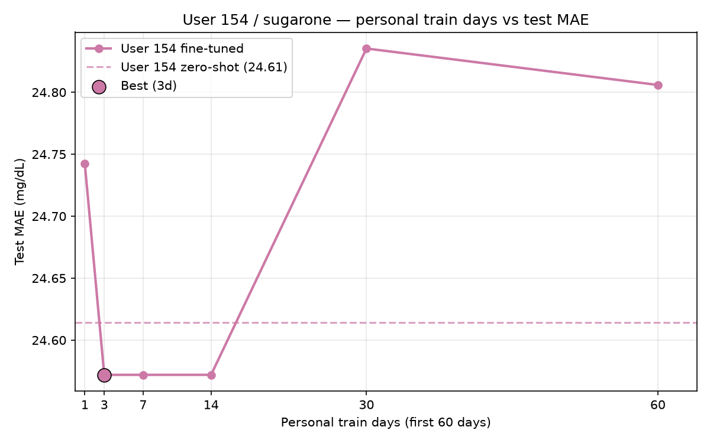


#### User 556

| Days | Used train days | ZS MAE | FT MAE | Δ FT vs ZS |
|------|-----------------|--------|--------|------------|
| 1 | 1.0 | 18.10 | 17.74 | -0.36 |
| 3 | 3.0 | 18.10 | 18.00 | -0.10 |
| 7 | 7.0 | 18.10 | 17.89 | -0.21 |
| 14 | 14.0 | 18.10 | 18.40 | 0.30 |
| 30 | 30.0 | 18.10 | 17.65 | -0.45 |
| 60 | 60.0 | 18.10 | 17.25 | -0.86 |
| all (91d) | 90.9 | 18.10 | 17.39 | -0.71 |

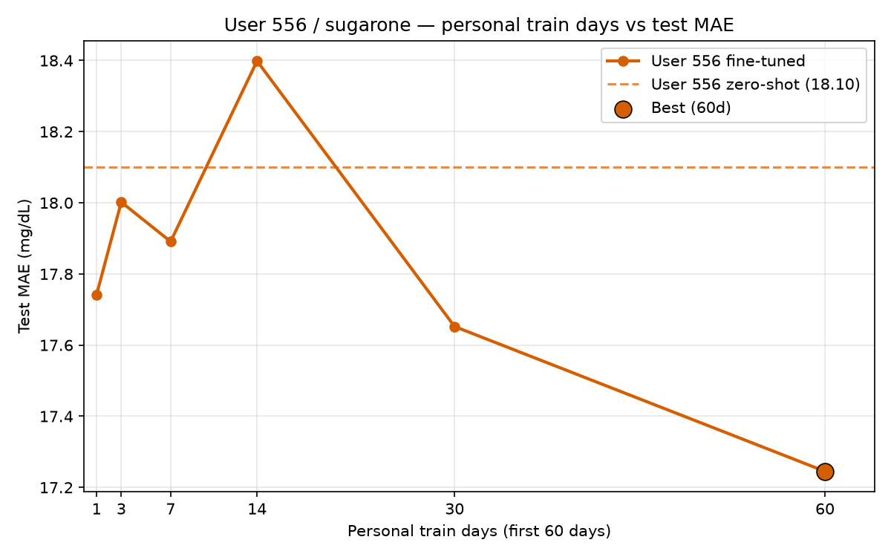


#### User 730

| Days | Used train days | ZS MAE | FT MAE | Δ FT vs ZS |
|------|-----------------|--------|--------|------------|
| 1 | 1.0 | 18.06 | 18.27 | 0.22 |
| 3 | 3.0 | 18.06 | 18.42 | 0.37 |
| 7 | 7.0 | 18.06 | 18.31 | 0.26 |
| 14 | 14.0 | 18.06 | 18.02 | -0.03 |
| 30 | 30.0 | 18.06 | 18.23 | 0.18 |
| 60 | 60.0 | 18.06 | 16.52 | -1.54 |
| all (85d) | 84.6 | 18.06 | 16.50 | -1.56 |

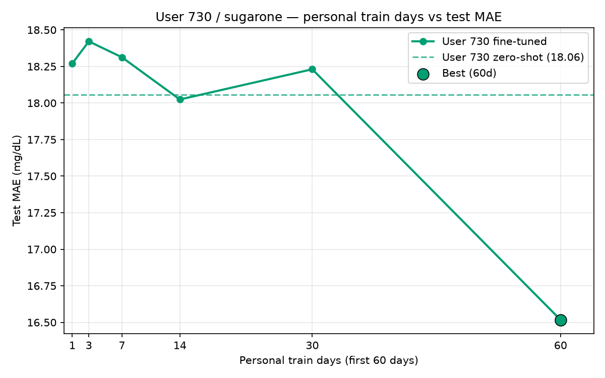


#### User 1017

| Days | Used train days | ZS MAE | FT MAE | Δ FT vs ZS |
|------|-----------------|--------|--------|------------|
| 1 | 1.0 | 17.69 | 17.85 | 0.16 |
| 3 | 3.0 | 17.69 | 17.89 | 0.20 |
| 7 | 7.0 | 17.69 | 17.91 | 0.22 |
| 14 | 14.0 | 17.69 | 18.01 | 0.32 |
| 30 | 30.0 | 17.69 | 18.30 | 0.61 |
| 60 | 60.0 | 17.69 | 17.38 | -0.31 |
| all (97d) | 96.7 | 17.69 | 16.95 | -0.74 |

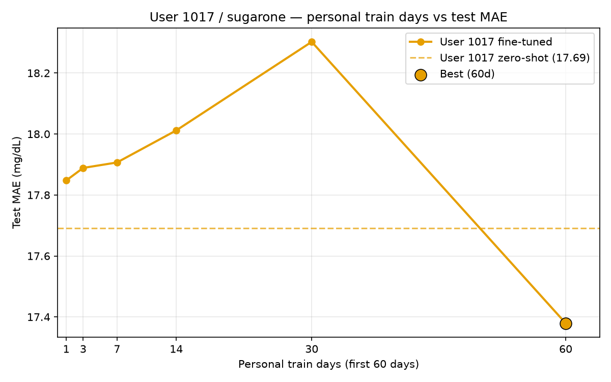


#### User 1029

| Days | Used train days | ZS MAE | FT MAE | Δ FT vs ZS |
|------|-----------------|--------|--------|------------|
| 1 | 1.0 | 22.62 | 22.66 | 0.04 |
| 3 | 3.0 | 22.62 | 22.67 | 0.05 |
| 7 | 7.0 | 22.62 | 22.68 | 0.06 |
| 14 | 14.0 | 22.62 | 22.22 | -0.40 |
| 30 | 30.0 | 22.62 | 22.81 | 0.19 |
| 60 | 60.0 | 22.62 | 21.04 | -1.58 |
| all (136d) | 136.0 | 22.62 | 20.94 | -1.68 |

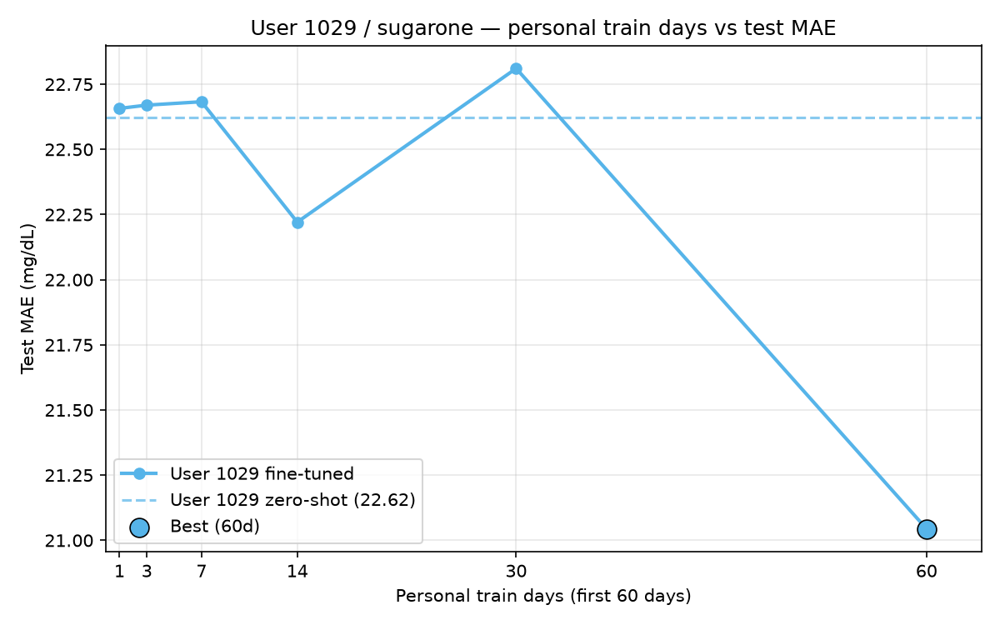


#### User 1082

| Days | Used train days | ZS MAE | FT MAE | Δ FT vs ZS |
|------|-----------------|--------|--------|------------|
| 1 | 1.0 | 17.00 | 16.97 | -0.03 |
| 3 | 3.0 | 17.00 | 17.08 | 0.09 |
| 7 | 7.0 | 17.00 | 17.13 | 0.13 |
| 14 | 14.0 | 17.00 | 17.20 | 0.21 |
| 30 | 30.0 | 17.00 | 17.60 | 0.60 |
| all (37d) | 37.4 | 17.00 | 17.79 | 0.80 |

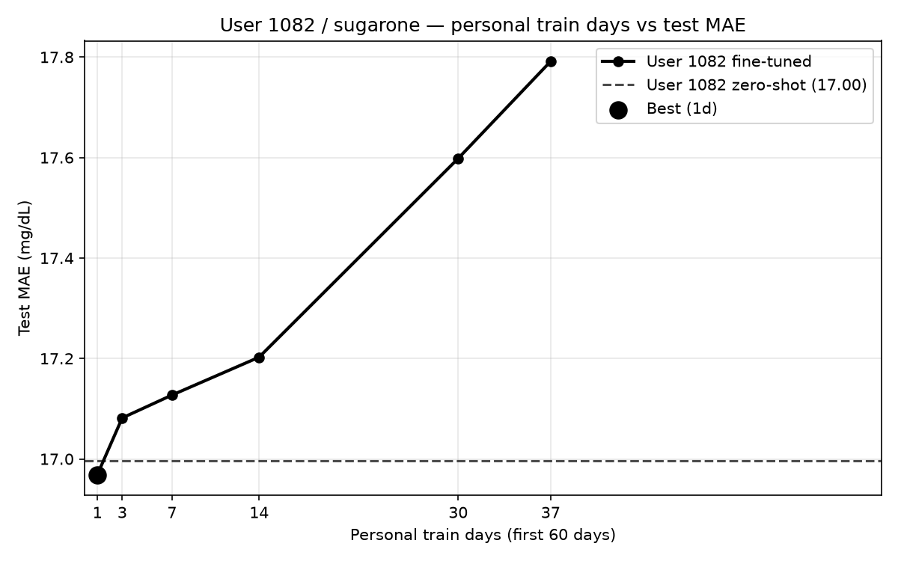


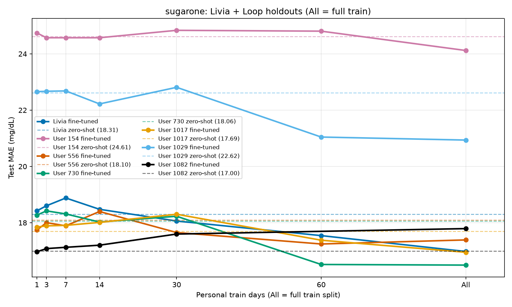

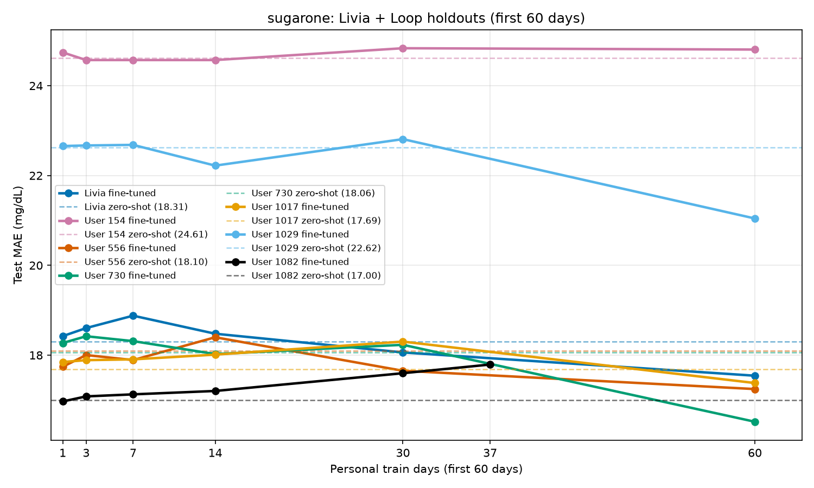


### Average MAE improvement by train budget

Mean test-MAE reduction versus zero-shot on T1DM users with at least 60 train days (Subject P1 + Loop holdouts except User 1082 when the budget exceeds their span, and except users with no run at that budget). Negative Δ is better than frozen global. Empty cells are not filled with zeros.

| Train budget | Mean Δ vs ZS | Mean MAE improvement | n |
|--------------|--------------|----------------------|---|
| 30 days | 0.08 | -0.08 | 6 |
| 60 days | -0.81 | 0.81 | 6 |
| Full train (≥60 d) | -1.09 | 1.09 | 6 |

## SugarJEPA-128-64

Encoder window **128 (10.7 h)**. Embed dim **64**. Matched SugarOne lookback; 64-d encoder.

### Full train, independent fine-tune from global weights

| Subject | Cohort | Study group | Train span (d) | ZS MAE | FT MAE (all) | Δ vs ZS |
|---------|--------|-------------|----------------|--------|--------------|---------|
| Subject P1 | Subject P1 | T1DM | 344.6 | 18.05 | 16.76 | -1.30 |
| User 154 | Loop holdout | T1DM | 213.6 | 25.40 | 23.64 | -1.76 |
| User 556 | Loop holdout | T1DM | 90.9 | 17.52 | 16.92 | -0.60 |
| User 730 | Loop holdout | T1DM | 84.6 | 16.35 | 16.06 | -0.29 |
| User 1017 | Loop holdout | T1DM | 96.7 | 18.20 | 16.62 | -1.58 |
| User 1029 | Loop holdout | T1DM | 136.0 | 20.93 | 19.90 | -1.03 |
| User 1082 | Loop holdout | T1DM | 37.4 | 16.54 | 16.65 | 0.11 |

### Subject P1 and Loop quality holdouts

#### Subject P1

| Days | Used train days | ZS MAE | FT MAE | Δ FT vs ZS |
|------|-----------------|--------|--------|------------|
| 1 | 1.0 | 18.05 | 19.14 | 1.09 |
| 3 | 3.0 | 18.05 | 17.56 | -0.49 |
| 7 | 7.0 | 18.05 | 17.30 | -0.76 |
| 14 | 14.0 | 18.05 | 17.26 | -0.79 |
| 30 | 30.0 | 18.05 | 17.31 | -0.74 |
| 60 | 60.0 | 18.05 | 16.90 | -1.15 |
| all (345d) | 344.6 | 18.05 | 16.76 | -1.30 |


#### User 154

| Days | Used train days | ZS MAE | FT MAE | Δ FT vs ZS |
|------|-----------------|--------|--------|------------|
| 1 | 1.0 | 25.40 | 24.89 | -0.51 |
| 3 | 3.0 | 25.40 | 24.30 | -1.10 |
| 7 | 7.0 | 25.40 | 24.30 | -1.10 |
| 14 | 14.0 | 25.40 | 24.30 | -1.10 |
| 30 | 30.0 | 25.40 | 24.47 | -0.93 |
| 60 | 60.0 | 25.40 | 24.01 | -1.39 |
| all (214d) | 213.6 | 25.40 | 23.64 | -1.76 |

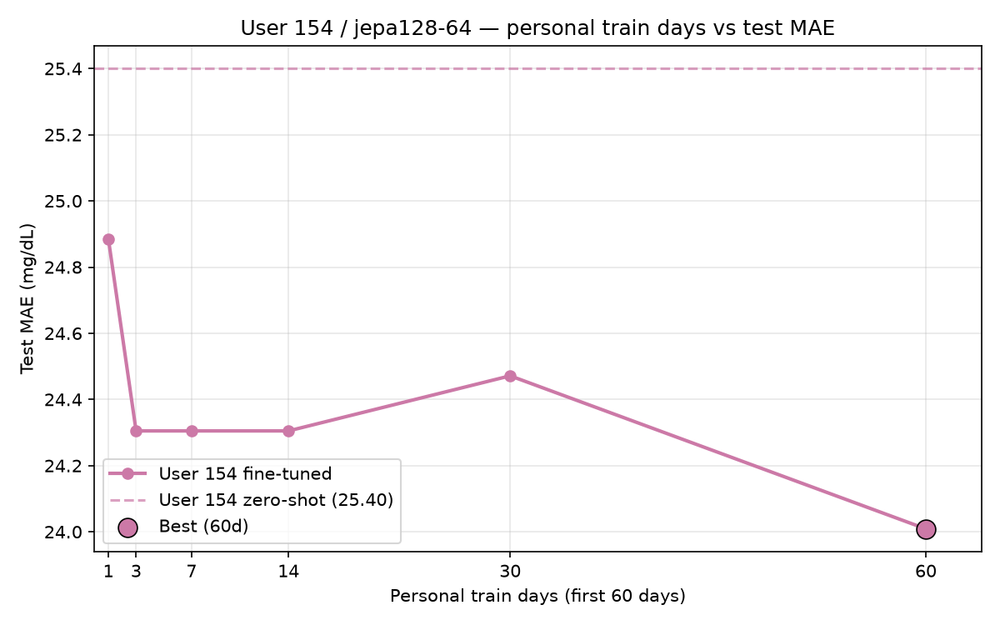


#### User 556

| Days | Used train days | ZS MAE | FT MAE | Δ FT vs ZS |
|------|-----------------|--------|--------|------------|
| 1 | 1.0 | 17.52 | 17.47 | -0.05 |
| 3 | 3.0 | 17.52 | 17.40 | -0.12 |
| 7 | 7.0 | 17.52 | 17.36 | -0.16 |
| 14 | 14.0 | 17.52 | 17.50 | -0.02 |
| 30 | 30.0 | 17.52 | 17.19 | -0.33 |
| 60 | 60.0 | 17.52 | 16.90 | -0.62 |
| all (91d) | 90.9 | 17.52 | 16.92 | -0.60 |

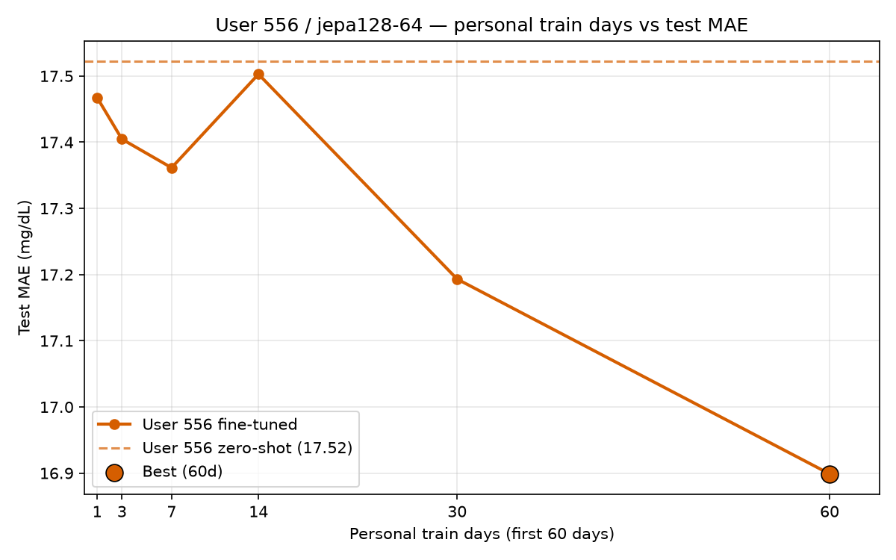


#### User 730

| Days | Used train days | ZS MAE | FT MAE | Δ FT vs ZS |
|------|-----------------|--------|--------|------------|
| 1 | 1.0 | 16.35 | 16.43 | 0.08 |
| 3 | 3.0 | 16.35 | 16.50 | 0.15 |
| 7 | 7.0 | 16.35 | 16.24 | -0.11 |
| 14 | 14.0 | 16.35 | 16.23 | -0.11 |
| 30 | 30.0 | 16.35 | 16.39 | 0.04 |
| 60 | 60.0 | 16.35 | 16.13 | -0.22 |
| all (85d) | 84.6 | 16.35 | 16.06 | -0.29 |

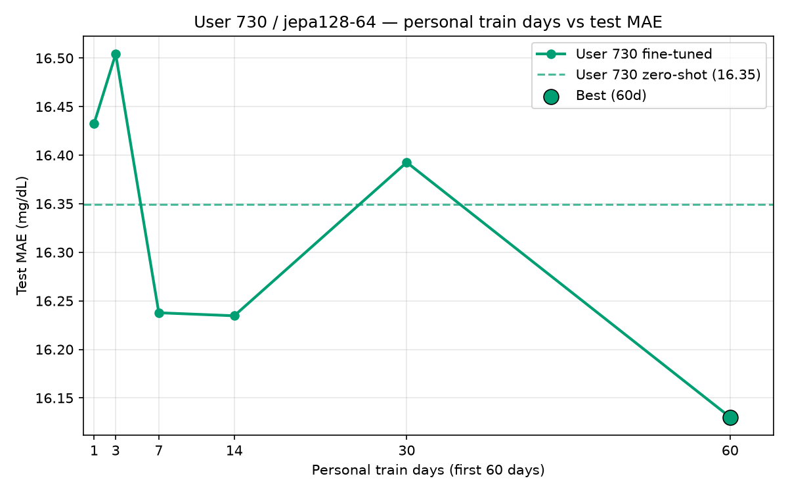


#### User 1017

| Days | Used train days | ZS MAE | FT MAE | Δ FT vs ZS |
|------|-----------------|--------|--------|------------|
| 1 | 1.0 | 18.20 | 17.88 | -0.31 |
| 3 | 3.0 | 18.20 | 17.95 | -0.25 |
| 7 | 7.0 | 18.20 | 17.96 | -0.24 |
| 14 | 14.0 | 18.20 | 17.93 | -0.26 |
| 30 | 30.0 | 18.20 | 17.72 | -0.48 |
| 60 | 60.0 | 18.20 | 16.89 | -1.30 |
| all (97d) | 96.7 | 18.20 | 16.62 | -1.58 |

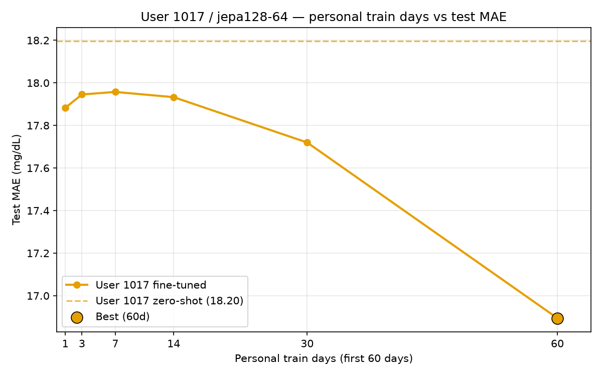


#### User 1029

| Days | Used train days | ZS MAE | FT MAE | Δ FT vs ZS |
|------|-----------------|--------|--------|------------|
| 1 | 1.0 | 20.93 | 20.97 | 0.04 |
| 3 | 3.0 | 20.93 | 20.88 | -0.05 |
| 7 | 7.0 | 20.93 | 20.49 | -0.44 |
| 14 | 14.0 | 20.93 | 20.57 | -0.36 |
| 30 | 30.0 | 20.93 | 20.40 | -0.53 |
| 60 | 60.0 | 20.93 | 19.96 | -0.97 |
| all (136d) | 136.0 | 20.93 | 19.90 | -1.03 |

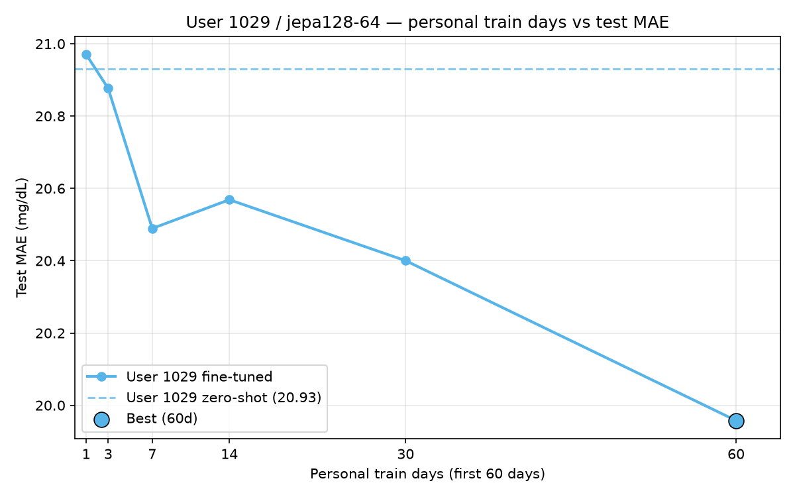


#### User 1082

| Days | Used train days | ZS MAE | FT MAE | Δ FT vs ZS |
|------|-----------------|--------|--------|------------|
| 1 | 1.0 | 16.54 | 16.55 | 0.01 |
| 3 | 3.0 | 16.54 | 16.55 | 0.01 |
| 7 | 7.0 | 16.54 | 16.36 | -0.18 |
| 14 | 14.0 | 16.54 | 16.41 | -0.13 |
| 30 | 30.0 | 16.54 | 16.56 | 0.02 |
| all (37d) | 37.4 | 16.54 | 16.65 | 0.11 |

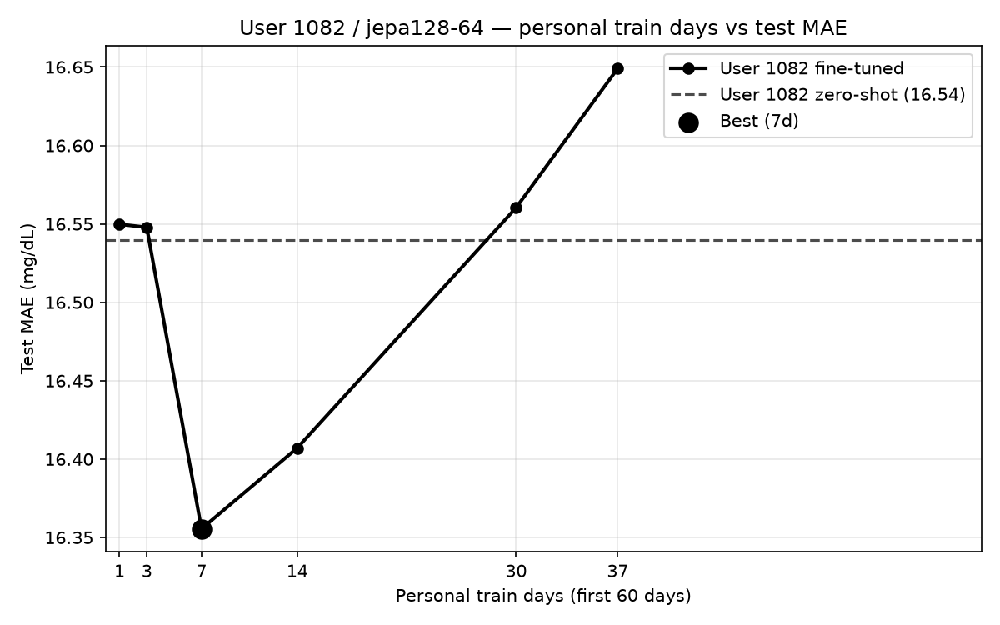


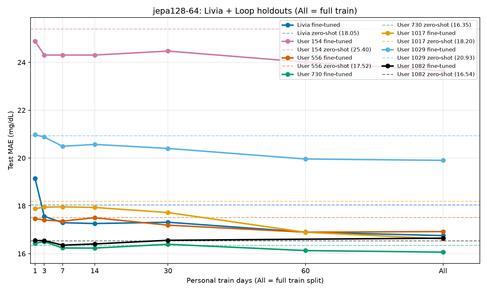

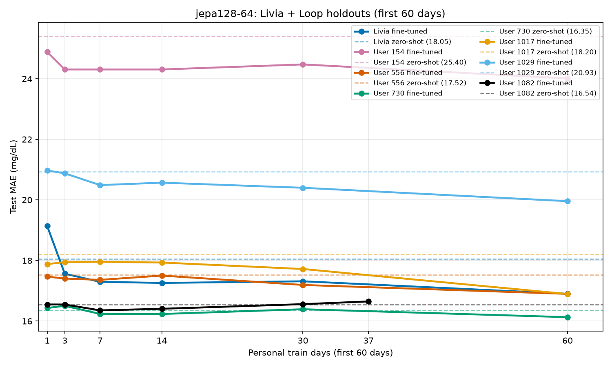


### Average MAE improvement by train budget

Mean test-MAE reduction versus zero-shot on T1DM users with at least 60 train days (Subject P1 + Loop holdouts except User 1082 when the budget exceeds their span, and except users with no run at that budget). Negative Δ is better than frozen global. Empty cells are not filled with zeros.

| Train budget | Mean Δ vs ZS | Mean MAE improvement | n |
|--------------|--------------|----------------------|---|
| 30 days | -0.49 | 0.49 | 6 |
| 60 days | -0.94 | 0.94 | 6 |
| Full train (≥60 d) | -1.09 | 1.09 | 6 |

## SugarJEPA-128

Encoder window **128 (10.7 h)**. Embed dim **96**. Matched SugarOne lookback; 96-d encoder.

### Full train, independent fine-tune from global weights

| Subject | Cohort | Study group | Train span (d) | ZS MAE | FT MAE (all) | Δ vs ZS |
|---------|--------|-------------|----------------|--------|--------------|---------|
| Subject P1 | Subject P1 | T1DM | 344.6 | 17.67 | 16.69 | -0.98 |
| User 154 | Loop holdout | T1DM | 213.6 | 25.48 | 23.90 | -1.58 |
| User 556 | Loop holdout | T1DM | 90.9 | 17.46 | 17.01 | -0.46 |
| User 730 | Loop holdout | T1DM | 84.6 | 16.36 | 16.14 | -0.23 |
| User 1017 | Loop holdout | T1DM | 96.7 | 17.97 | 16.75 | -1.23 |
| User 1029 | Loop holdout | T1DM | 136.0 | 20.60 | 20.01 | -0.59 |
| User 1082 | Loop holdout | T1DM | 37.4 | 16.57 | 16.66 | 0.09 |

### Subject P1 and Loop quality holdouts

#### Subject P1

| Days | Used train days | ZS MAE | FT MAE | Δ FT vs ZS |
|------|-----------------|--------|--------|------------|
| 1 | 1.0 | 17.67 | 18.10 | 0.43 |
| 3 | 3.0 | 17.67 | 17.55 | -0.12 |
| 7 | 7.0 | 17.67 | 17.24 | -0.44 |
| 14 | 14.0 | 17.67 | 17.24 | -0.43 |
| 30 | 30.0 | 17.67 | 17.20 | -0.47 |
| 60 | 60.0 | 17.67 | 16.95 | -0.72 |
| all (345d) | 344.6 | 17.67 | 16.69 | -0.98 |


#### User 154

| Days | Used train days | ZS MAE | FT MAE | Δ FT vs ZS |
|------|-----------------|--------|--------|------------|
| 1 | 1.0 | 25.48 | 25.22 | -0.25 |
| 3 | 3.0 | 25.48 | 24.59 | -0.89 |
| 7 | 7.0 | 25.48 | 24.59 | -0.89 |
| 14 | 14.0 | 25.48 | 24.59 | -0.89 |
| 30 | 30.0 | 25.48 | 24.67 | -0.81 |
| 60 | 60.0 | 25.48 | 24.33 | -1.15 |
| all (214d) | 213.6 | 25.48 | 23.90 | -1.58 |

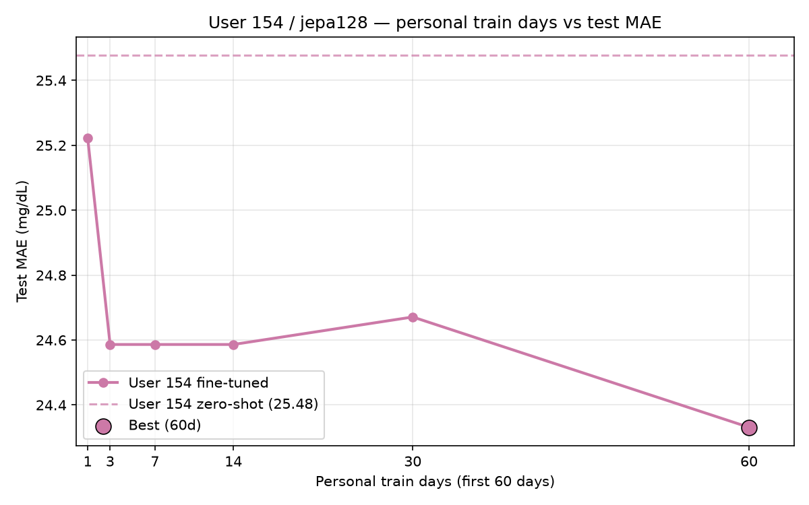


#### User 556

| Days | Used train days | ZS MAE | FT MAE | Δ FT vs ZS |
|------|-----------------|--------|--------|------------|
| 1 | 1.0 | 17.46 | 17.79 | 0.33 |
| 3 | 3.0 | 17.46 | 17.52 | 0.06 |
| 7 | 7.0 | 17.46 | 17.55 | 0.08 |
| 14 | 14.0 | 17.46 | 17.64 | 0.17 |
| 30 | 30.0 | 17.46 | 17.61 | 0.14 |
| 60 | 60.0 | 17.46 | 17.25 | -0.21 |
| all (91d) | 90.9 | 17.46 | 17.01 | -0.46 |

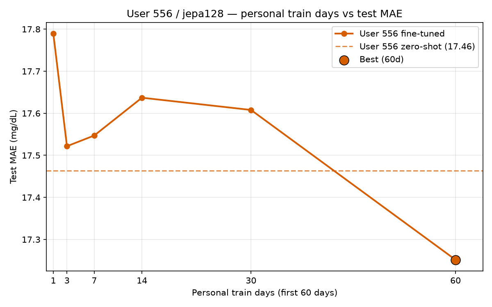


#### User 730

| Days | Used train days | ZS MAE | FT MAE | Δ FT vs ZS |
|------|-----------------|--------|--------|------------|
| 1 | 1.0 | 16.36 | 16.44 | 0.07 |
| 3 | 3.0 | 16.36 | 16.46 | 0.09 |
| 7 | 7.0 | 16.36 | 16.24 | -0.12 |
| 14 | 14.0 | 16.36 | 16.31 | -0.05 |
| 30 | 30.0 | 16.36 | 16.47 | 0.11 |
| 60 | 60.0 | 16.36 | 16.24 | -0.12 |
| all (85d) | 84.6 | 16.36 | 16.14 | -0.23 |

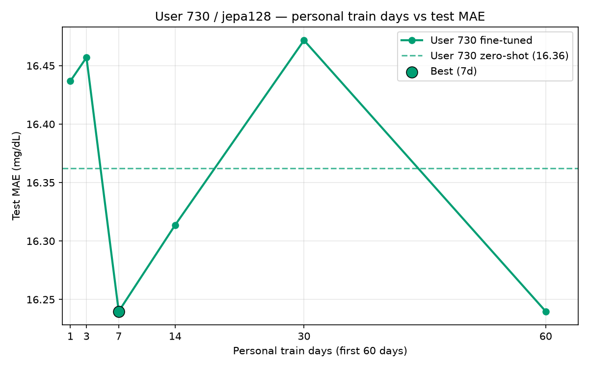


#### User 1017

| Days | Used train days | ZS MAE | FT MAE | Δ FT vs ZS |
|------|-----------------|--------|--------|------------|
| 1 | 1.0 | 17.97 | 17.81 | -0.17 |
| 3 | 3.0 | 17.97 | 17.80 | -0.18 |
| 7 | 7.0 | 17.97 | 17.78 | -0.20 |
| 14 | 14.0 | 17.97 | 17.88 | -0.10 |
| 30 | 30.0 | 17.97 | 17.63 | -0.34 |
| 60 | 60.0 | 17.97 | 17.00 | -0.97 |
| all (97d) | 96.7 | 17.97 | 16.75 | -1.23 |

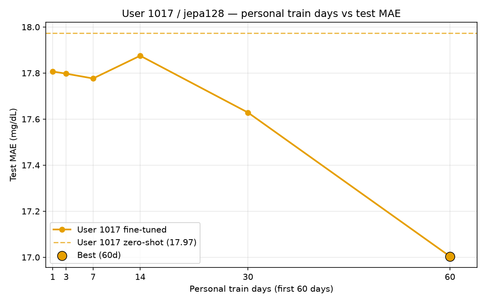


#### User 1029

| Days | Used train days | ZS MAE | FT MAE | Δ FT vs ZS |
|------|-----------------|--------|--------|------------|
| 1 | 1.0 | 20.60 | 20.81 | 0.20 |
| 3 | 3.0 | 20.60 | 20.56 | -0.05 |
| 7 | 7.0 | 20.60 | 20.41 | -0.19 |
| 14 | 14.0 | 20.60 | 20.36 | -0.25 |
| 30 | 30.0 | 20.60 | 20.24 | -0.37 |
| 60 | 60.0 | 20.60 | 20.04 | -0.57 |
| all (136d) | 136.0 | 20.60 | 20.01 | -0.59 |

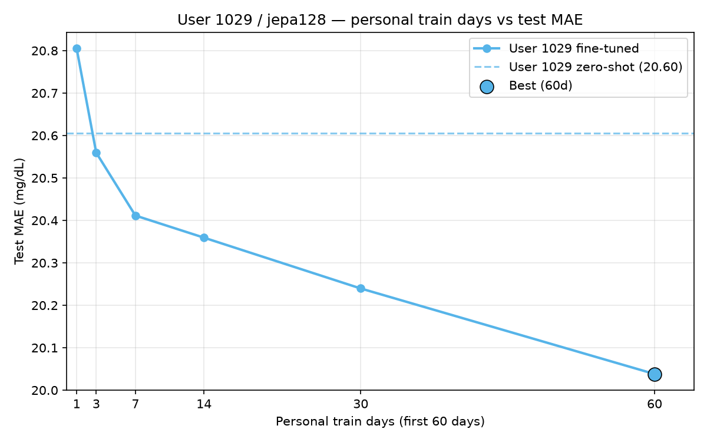


#### User 1082

| Days | Used train days | ZS MAE | FT MAE | Δ FT vs ZS |
|------|-----------------|--------|--------|------------|
| 1 | 1.0 | 16.57 | 16.54 | -0.02 |
| 3 | 3.0 | 16.57 | 16.54 | -0.03 |
| 7 | 7.0 | 16.57 | 16.48 | -0.08 |
| 14 | 14.0 | 16.57 | 16.51 | -0.05 |
| 30 | 30.0 | 16.57 | 16.62 | 0.05 |
| all (37d) | 37.4 | 16.57 | 16.66 | 0.09 |

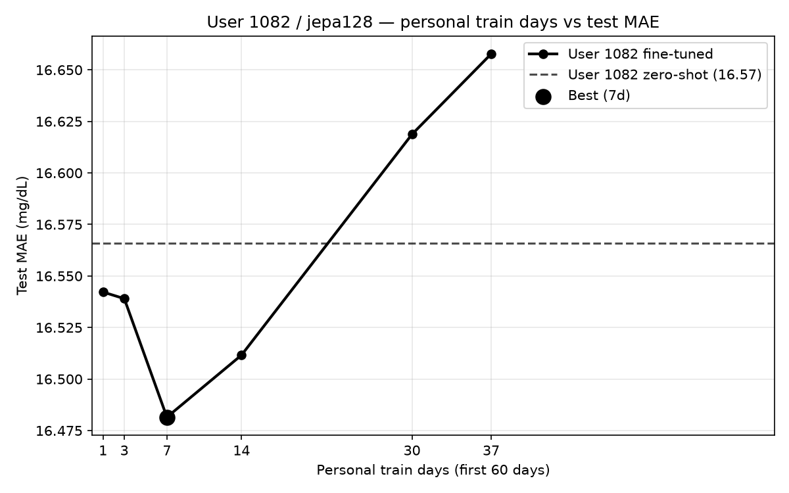


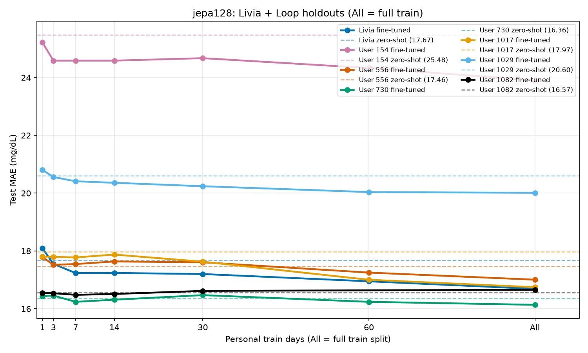

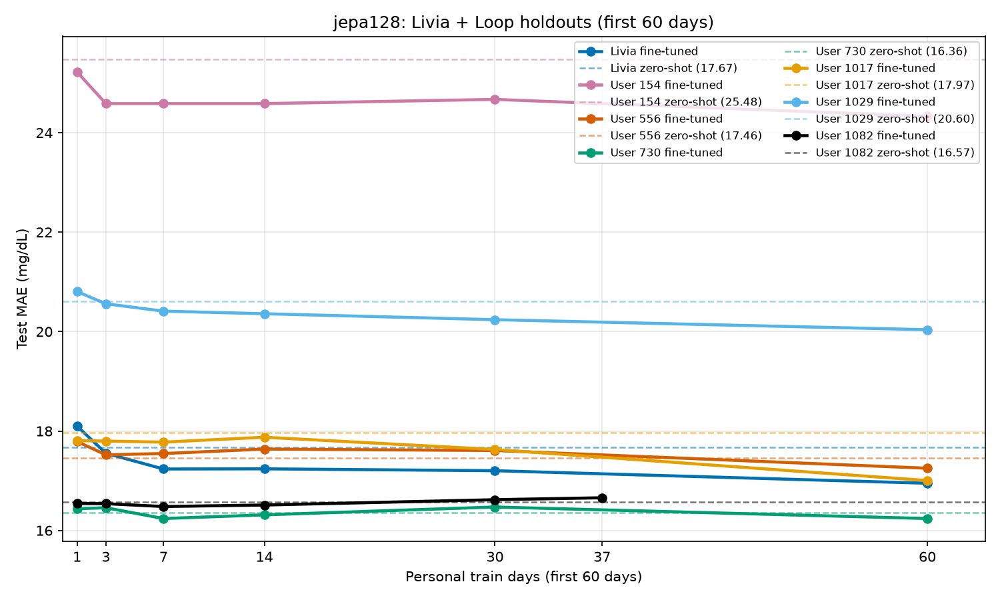


### Average MAE improvement by train budget

Mean test-MAE reduction versus zero-shot on T1DM users with at least 60 train days (Subject P1 + Loop holdouts except User 1082 when the budget exceeds their span, and except users with no run at that budget). Negative Δ is better than frozen global. Empty cells are not filled with zeros.

| Train budget | Mean Δ vs ZS | Mean MAE improvement | n |
|--------------|--------------|----------------------|---|
| 30 days | -0.29 | 0.29 | 6 |
| 60 days | -0.62 | 0.62 | 6 |
| Full train (≥60 d) | -0.84 | 0.84 | 6 |

## SugarJEPA-288

Encoder window **288 (1 d)**. Embed dim **96**. Hero encoder. 1-day train cannot form a window.

### Full train, independent fine-tune from global weights

| Subject | Cohort | Study group | Train span (d) | ZS MAE | FT MAE (all) | Δ vs ZS |
|---------|--------|-------------|----------------|--------|--------------|---------|
| Subject P1 | Subject P1 | T1DM | 344.6 | 17.64 | 16.53 | -1.11 |
| User 154 | Loop holdout | T1DM | 213.6 | 23.13 | 22.66 | -0.47 |
| User 556 | Loop holdout | T1DM | 90.9 | 17.22 | 16.65 | -0.57 |
| User 730 | Loop holdout | T1DM | 84.6 | 16.02 | 15.62 | -0.40 |
| User 1017 | Loop holdout | T1DM | 96.7 | 17.41 | 16.38 | -1.03 |
| User 1029 | Loop holdout | T1DM | 136.0 | 20.30 | 19.55 | -0.74 |
| User 1082 | Loop holdout | T1DM | 37.4 | 15.17 | 15.19 | 0.03 |

### Subject P1 and Loop quality holdouts

#### Subject P1

| Days | Used train days | ZS MAE | FT MAE | Δ FT vs ZS |
|------|-----------------|--------|--------|------------|
| 3 | 3.0 | 17.64 | 17.61 | -0.03 |
| 7 | 7.0 | 17.64 | 17.21 | -0.43 |
| 14 | 14.0 | 17.64 | 17.09 | -0.55 |
| 30 | 30.0 | 17.64 | 17.12 | -0.52 |
| 60 | 60.0 | 17.64 | 16.83 | -0.81 |
| all (345d) | 344.6 | 17.64 | 16.53 | -1.11 |


#### User 154

| Days | Used train days | ZS MAE | FT MAE | Δ FT vs ZS |
|------|-----------------|--------|--------|------------|
| 3 | 3.0 | 23.13 | 22.84 | -0.29 |
| 7 | 7.0 | 23.13 | 22.84 | -0.29 |
| 14 | 14.0 | 23.13 | 22.84 | -0.29 |
| 30 | 30.0 | 23.13 | 22.82 | -0.31 |
| 60 | 60.0 | 23.13 | 22.87 | -0.26 |
| all (214d) | 213.6 | 23.13 | 22.66 | -0.47 |

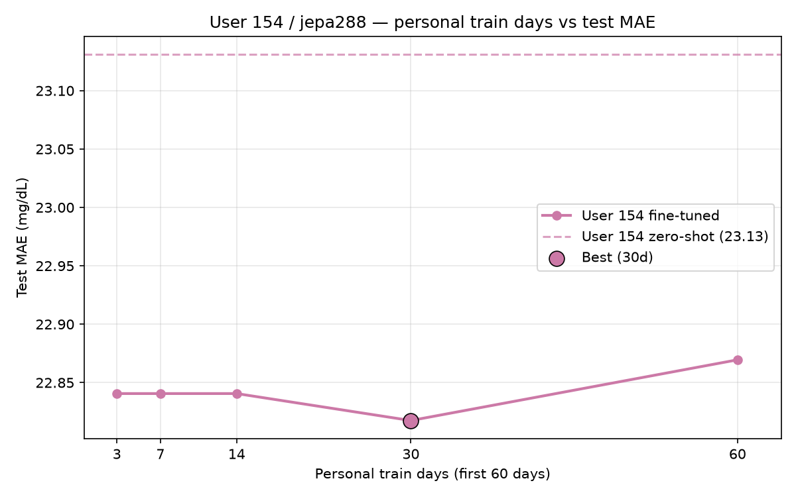


#### User 556

| Days | Used train days | ZS MAE | FT MAE | Δ FT vs ZS |
|------|-----------------|--------|--------|------------|
| 3 | 3.0 | 17.22 | 16.94 | -0.28 |
| 7 | 7.0 | 17.22 | 16.94 | -0.28 |
| 14 | 14.0 | 17.22 | 16.96 | -0.26 |
| 30 | 30.0 | 17.22 | 17.11 | -0.11 |
| 60 | 60.0 | 17.22 | 17.03 | -0.19 |
| all (91d) | 90.9 | 17.22 | 16.65 | -0.57 |

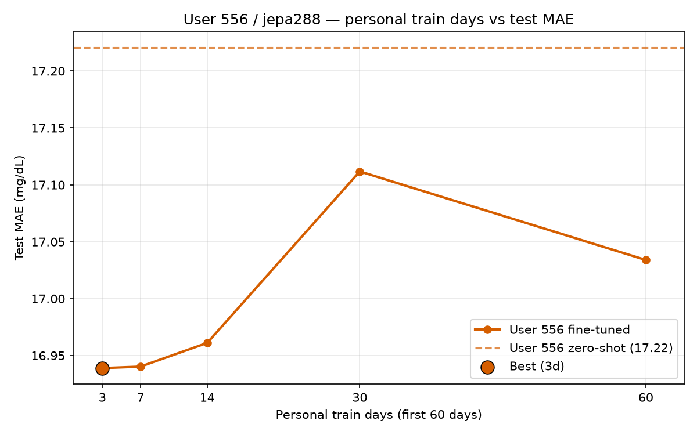


#### User 730

| Days | Used train days | ZS MAE | FT MAE | Δ FT vs ZS |
|------|-----------------|--------|--------|------------|
| 3 | 3.0 | 16.02 | 15.90 | -0.12 |
| 7 | 7.0 | 16.02 | 15.92 | -0.10 |
| 14 | 14.0 | 16.02 | 15.80 | -0.22 |
| 30 | 30.0 | 16.02 | 15.73 | -0.29 |
| 60 | 60.0 | 16.02 | 15.71 | -0.31 |
| all (85d) | 84.6 | 16.02 | 15.62 | -0.40 |

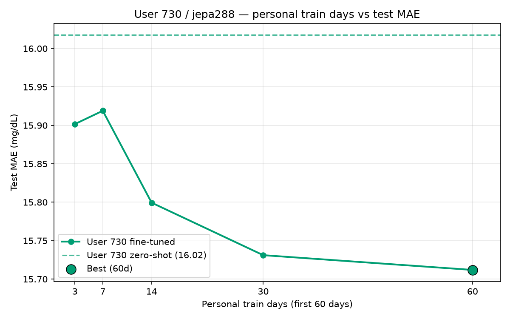


#### User 1017

| Days | Used train days | ZS MAE | FT MAE | Δ FT vs ZS |
|------|-----------------|--------|--------|------------|
| 3 | 3.0 | 17.41 | 17.37 | -0.03 |
| 7 | 7.0 | 17.41 | 17.37 | -0.03 |
| 14 | 14.0 | 17.41 | 16.93 | -0.47 |
| 30 | 30.0 | 17.41 | 16.94 | -0.47 |
| 60 | 60.0 | 17.41 | 16.58 | -0.82 |
| all (97d) | 96.7 | 17.41 | 16.38 | -1.03 |

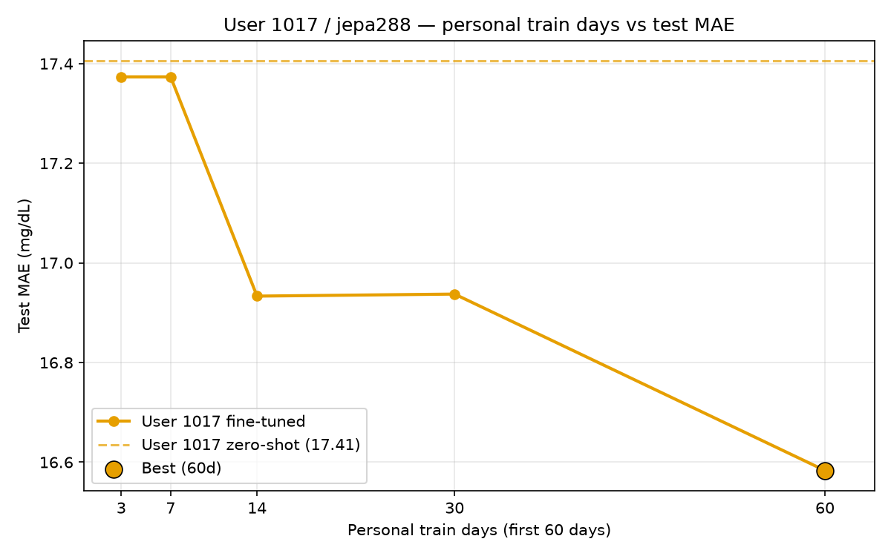


#### User 1029

| Days | Used train days | ZS MAE | FT MAE | Δ FT vs ZS |
|------|-----------------|--------|--------|------------|
| 3 | 3.0 | 20.30 | 20.28 | -0.02 |
| 7 | 7.0 | 20.30 | 20.28 | -0.02 |
| 14 | 14.0 | 20.30 | 20.78 | 0.49 |
| 30 | 30.0 | 20.30 | 19.94 | -0.35 |
| 60 | 60.0 | 20.30 | 19.52 | -0.77 |
| all (136d) | 136.0 | 20.30 | 19.55 | -0.74 |

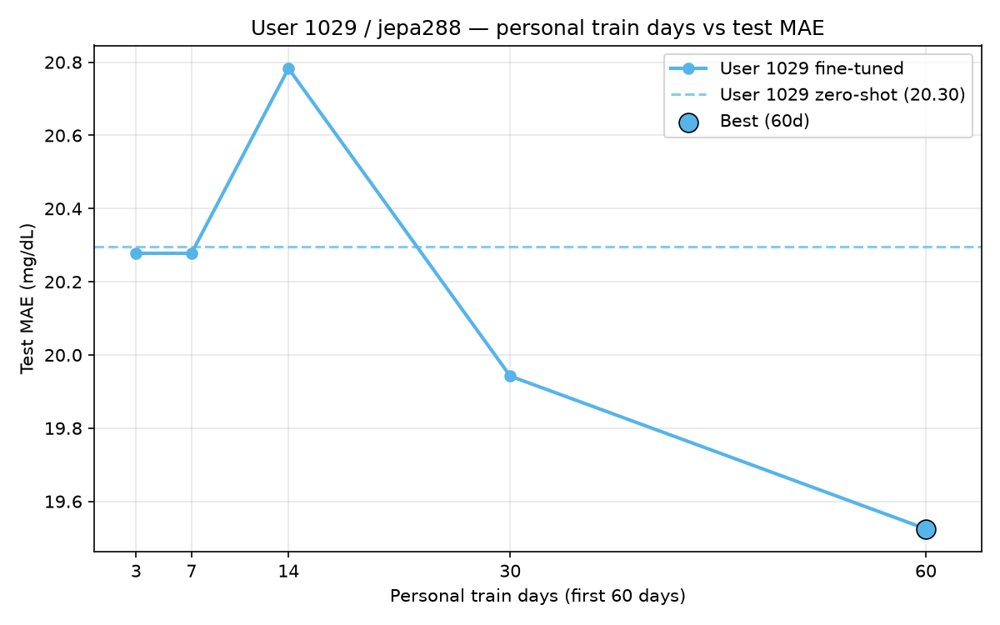


#### User 1082

| Days | Used train days | ZS MAE | FT MAE | Δ FT vs ZS |
|------|-----------------|--------|--------|------------|
| 3 | 3.0 | 15.17 | 15.59 | 0.42 |
| 7 | 7.0 | 15.17 | 15.36 | 0.20 |
| 14 | 14.0 | 15.17 | 15.04 | -0.13 |
| 30 | 30.0 | 15.17 | 15.10 | -0.07 |
| all (37d) | 37.4 | 15.17 | 15.19 | 0.03 |

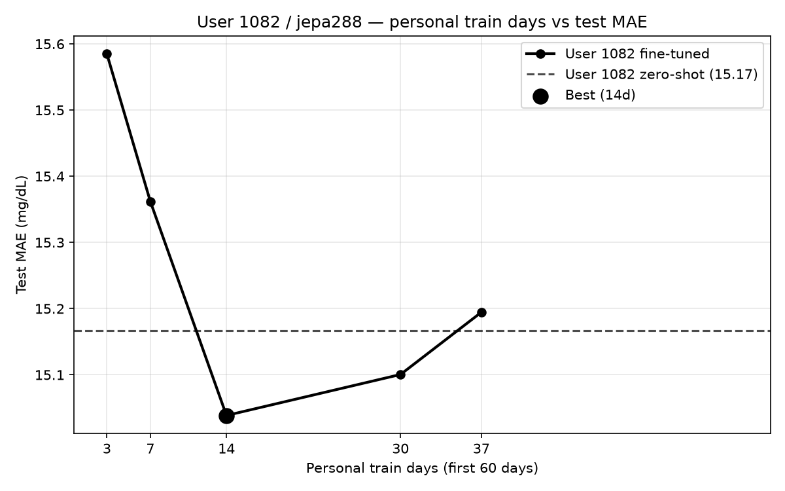


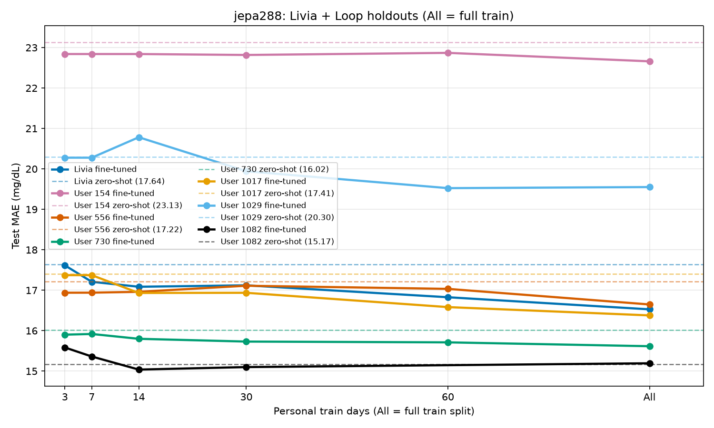

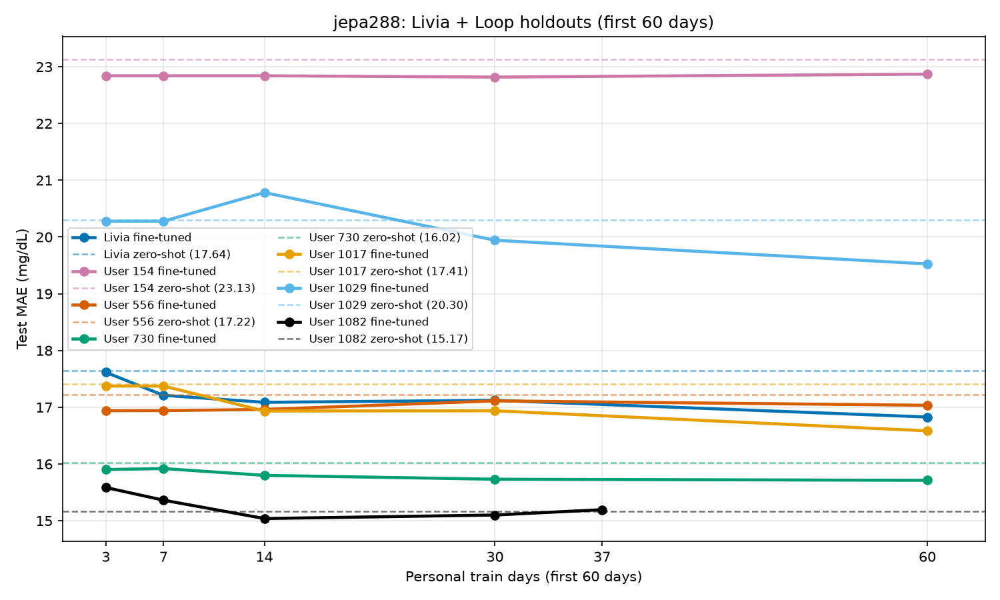


### Average MAE improvement by train budget

Mean test-MAE reduction versus zero-shot on T1DM users with at least 60 train days (Subject P1 + Loop holdouts except User 1082 when the budget exceeds their span, and except users with no run at that budget). Negative Δ is better than frozen global. Empty cells are not filled with zeros.

| Train budget | Mean Δ vs ZS | Mean MAE improvement | n |
|--------------|--------------|----------------------|---|
| 30 days | -0.34 | 0.34 | 6 |
| 60 days | -0.53 | 0.53 | 6 |
| Full train (≥60 d) | -0.72 | 0.72 | 6 |

## SugarJEPA-864

Encoder window **864 (3 d)**. Embed dim **96**. Sparse day budgets; some users only have zero-shot and full train.

### Full train, independent fine-tune from global weights

| Subject | Cohort | Study group | Train span (d) | ZS MAE | FT MAE (all) | Δ vs ZS |
|---------|--------|-------------|----------------|--------|--------------|---------|
| Subject P1 | Subject P1 | T1DM | 344.6 | 17.97 | 16.69 | -1.28 |
| User 154 | Loop holdout | T1DM | 213.6 | 22.74 | 22.58 | -0.16 |
| User 556 | Loop holdout | T1DM | 90.9 | 16.46 | 16.00 | -0.46 |
| User 730 | Loop holdout | T1DM | 84.6 | 16.17 | 15.83 | -0.34 |
| User 1017 | Loop holdout | T1DM | 96.7 | 16.62 | 16.83 | 0.21 |
| User 1029 | Loop holdout | T1DM | 136.0 | 19.37 | 19.45 | 0.08 |
| User 1082 | Loop holdout | T1DM | 37.4 | 14.78 | 14.97 | 0.19 |

### Subject P1 and Loop quality holdouts

#### Subject P1

| Days | Used train days | ZS MAE | FT MAE | Δ FT vs ZS |
|------|-----------------|--------|--------|------------|
| 7 | 7.0 | 17.97 | 17.91 | -0.06 |
| 14 | 14.0 | 17.97 | 17.69 | -0.27 |
| 30 | 30.0 | 17.97 | 17.96 | -0.01 |
| 60 | 60.0 | 17.97 | 17.42 | -0.55 |
| all (345d) | 344.6 | 17.97 | 16.69 | -1.28 |


#### User 154

| Days | Used train days | ZS MAE | FT MAE | Δ FT vs ZS |
|------|-----------------|--------|--------|------------|
| all (214d) | 213.6 | 22.74 | 22.58 | -0.16 |

#### User 556

| Days | Used train days | ZS MAE | FT MAE | Δ FT vs ZS |
|------|-----------------|--------|--------|------------|
| 7 | 7.0 | 16.46 | 16.38 | -0.08 |
| 14 | 14.0 | 16.46 | 16.62 | 0.16 |
| 30 | 30.0 | 16.46 | 16.52 | 0.06 |
| 60 | 60.0 | 16.46 | 16.60 | 0.14 |
| all (91d) | 90.9 | 16.46 | 16.00 | -0.46 |

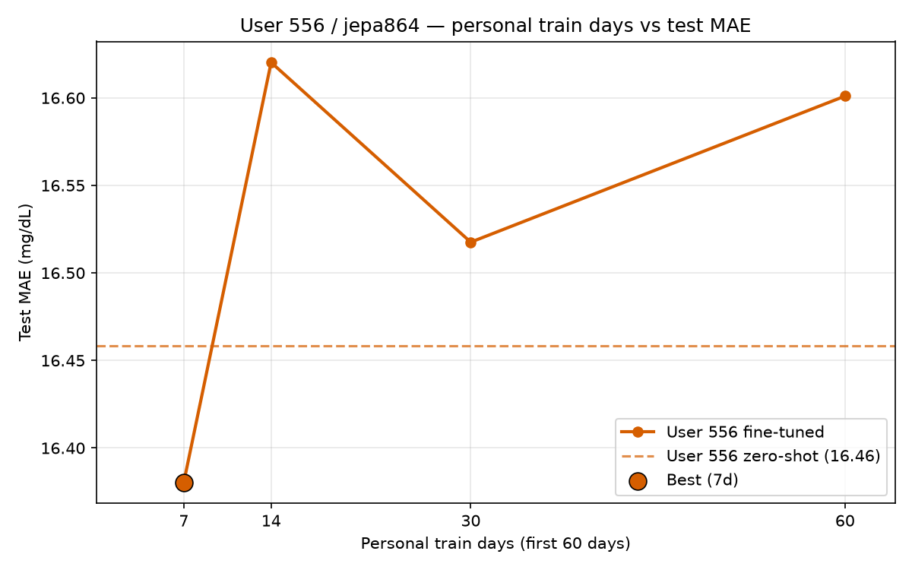


#### User 730

| Days | Used train days | ZS MAE | FT MAE | Δ FT vs ZS |
|------|-----------------|--------|--------|------------|
| 7 | 7.0 | 16.17 | 16.05 | -0.13 |
| 14 | 14.0 | 16.17 | 16.05 | -0.12 |
| 30 | 30.0 | 16.17 | 16.04 | -0.13 |
| 60 | 60.0 | 16.17 | 15.91 | -0.26 |
| all (85d) | 84.6 | 16.17 | 15.83 | -0.34 |

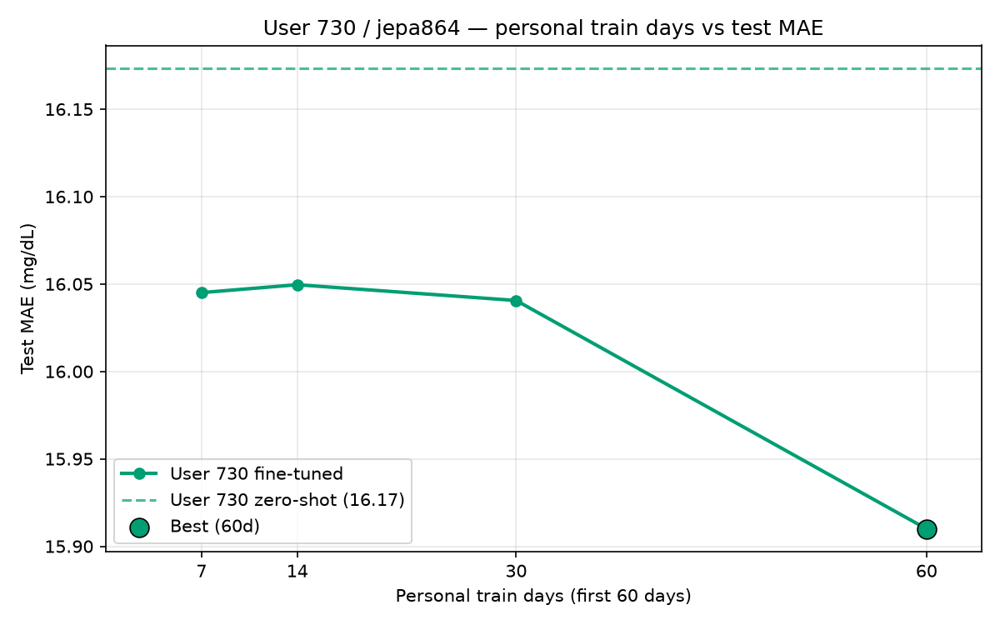


#### User 1017

| Days | Used train days | ZS MAE | FT MAE | Δ FT vs ZS |
|------|-----------------|--------|--------|------------|
| 30 | 30.0 | 16.62 | 16.85 | 0.23 |
| 60 | 60.0 | 16.62 | 17.01 | 0.40 |
| all (97d) | 96.7 | 16.62 | 16.83 | 0.21 |

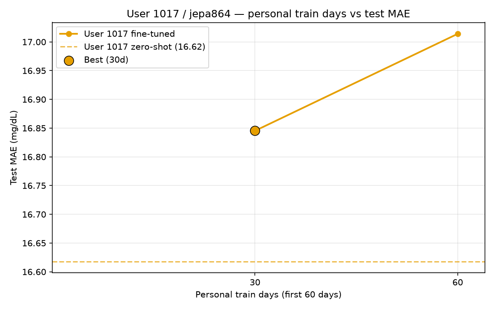


#### User 1029

| Days | Used train days | ZS MAE | FT MAE | Δ FT vs ZS |
|------|-----------------|--------|--------|------------|
| 60 | 60.0 | 19.37 | 20.38 | 1.01 |
| all (136d) | 136.0 | 19.37 | 19.45 | 0.08 |

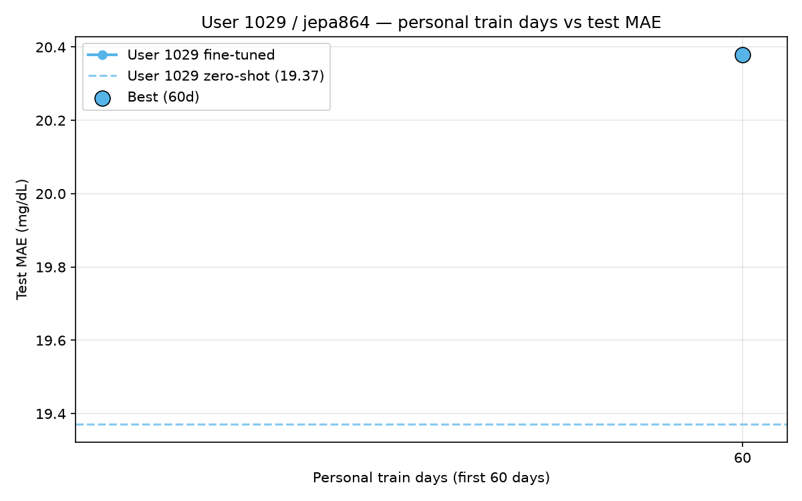


#### User 1082

| Days | Used train days | ZS MAE | FT MAE | Δ FT vs ZS |
|------|-----------------|--------|--------|------------|
| 7 | 7.0 | 14.78 | 14.83 | 0.05 |
| 14 | 14.0 | 14.78 | 14.97 | 0.19 |
| 30 | 30.0 | 14.78 | 14.97 | 0.19 |
| all (37d) | 37.4 | 14.78 | 14.97 | 0.19 |

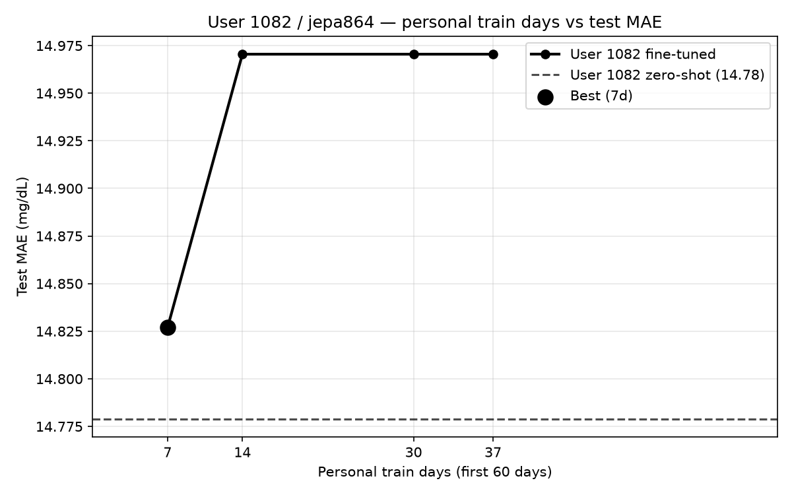


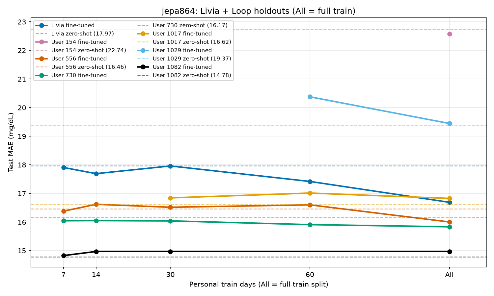

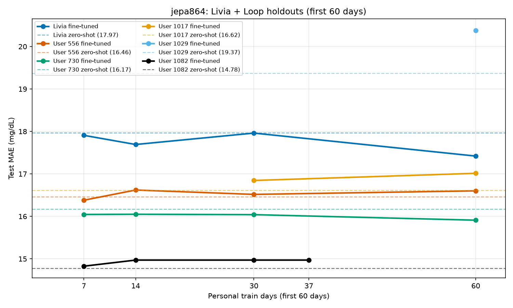


### Average MAE improvement by train budget

Mean test-MAE reduction versus zero-shot on T1DM users with at least 60 train days (Subject P1 + Loop holdouts except User 1082 when the budget exceeds their span, and except users with no run at that budget). Negative Δ is better than frozen global. Empty cells are not filled with zeros.

| Train budget | Mean Δ vs ZS | Mean MAE improvement | n |
|--------------|--------------|----------------------|---|
| 30 days | 0.04 | -0.04 | 4 |
| 60 days | 0.15 | -0.15 | 5 |
| Full train (≥60 d) | -0.32 | 0.32 | 6 |

## SugarJEPA-2016

Encoder window **2016 (7 d)**. Embed dim **96**. 5/7 subjects. Full fine-tune can raise MAE (negative control).

### Full train, independent fine-tune from global weights

| Subject | Cohort | Study group | Train span (d) | ZS MAE | FT MAE (all) | Δ vs ZS |
|---------|--------|-------------|----------------|--------|--------------|---------|
| Subject P1 | Subject P1 | T1DM | 344.6 | 18.61 | 17.79 | -0.82 |
| User 154 | Loop holdout | T1DM | 213.6 | 21.93 | 27.28 | 5.35 |
| User 556 | Loop holdout | T1DM | 90.9 | 15.30 | 15.49 | 0.19 |
| User 730 | Loop holdout | T1DM | 84.6 | 14.73 | 15.39 | 0.66 |
| User 1029 | Loop holdout | T1DM | 136.0 | 24.22 | 22.91 | -1.31 |

### Subject P1 and Loop quality holdouts

#### Subject P1

| Days | Used train days | ZS MAE | FT MAE | Δ FT vs ZS |
|------|-----------------|--------|--------|------------|
| 14 | 14.0 | 18.61 | 18.07 | -0.54 |
| 30 | 30.0 | 18.61 | 18.15 | -0.46 |
| 60 | 60.0 | 18.61 | 17.46 | -1.15 |
| all (345d) | 344.6 | 18.61 | 17.79 | -0.82 |


#### User 154

| Days | Used train days | ZS MAE | FT MAE | Δ FT vs ZS |
|------|-----------------|--------|--------|------------|
| all (214d) | 213.6 | 21.93 | 27.28 | 5.35 |

#### User 556

| Days | Used train days | ZS MAE | FT MAE | Δ FT vs ZS |
|------|-----------------|--------|--------|------------|
| 14 | 14.0 | 15.30 | 19.69 | 4.39 |
| 30 | 30.0 | 15.30 | 15.18 | -0.12 |
| 60 | 60.0 | 15.30 | 15.49 | 0.19 |
| all (91d) | 90.9 | 15.30 | 15.49 | 0.19 |

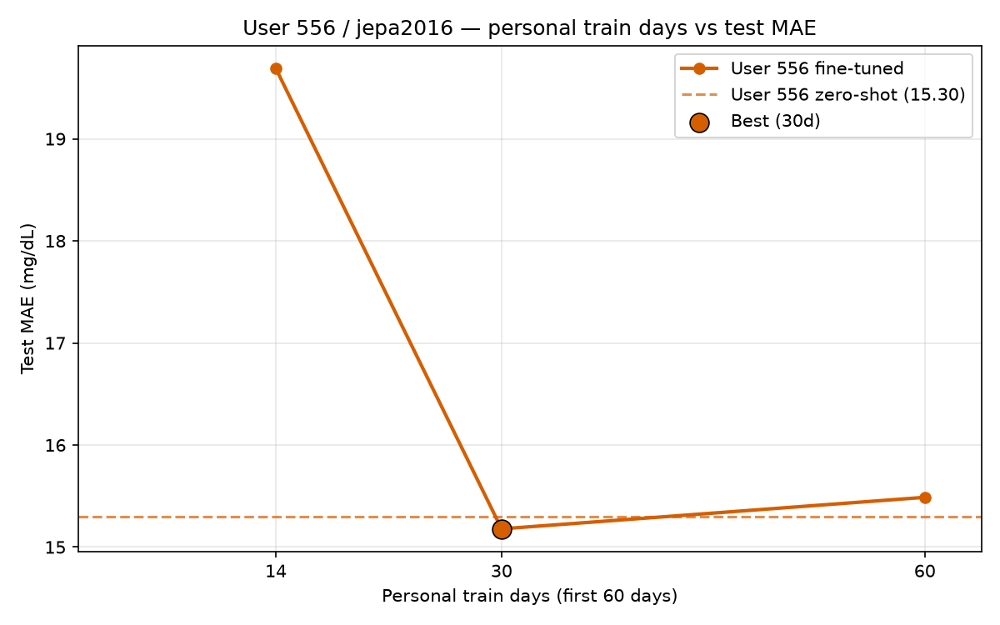


#### User 730

| Days | Used train days | ZS MAE | FT MAE | Δ FT vs ZS |
|------|-----------------|--------|--------|------------|
| 14 | 14.0 | 14.73 | 14.95 | 0.22 |
| 30 | 30.0 | 14.73 | 14.93 | 0.20 |
| 60 | 60.0 | 14.73 | 15.75 | 1.02 |
| all (85d) | 84.6 | 14.73 | 15.39 | 0.66 |

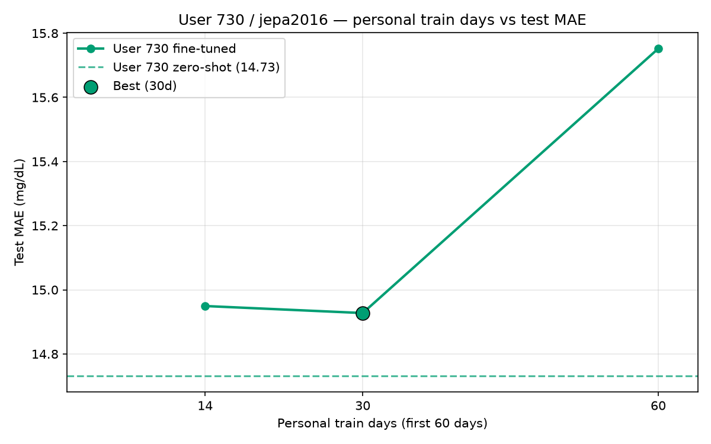


#### User 1029

| Days | Used train days | ZS MAE | FT MAE | Δ FT vs ZS |
|------|-----------------|--------|--------|------------|
| all (136d) | 136.0 | 24.22 | 22.91 | -1.31 |


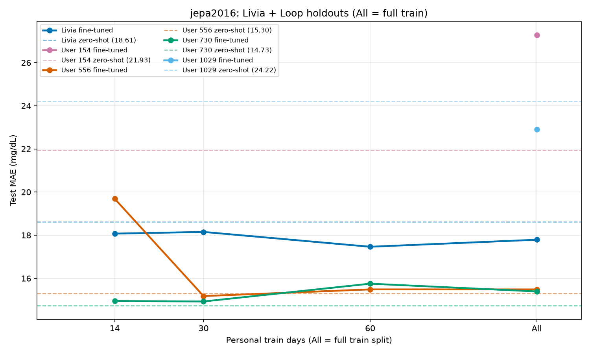

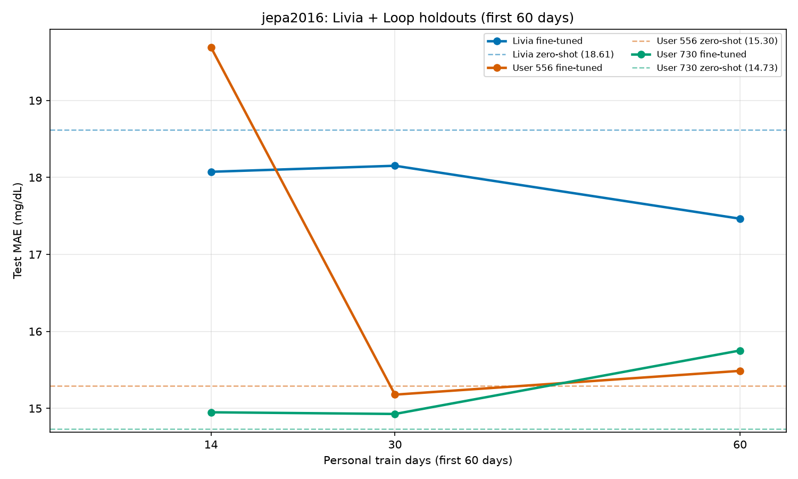


### Average MAE improvement by train budget

Mean test-MAE reduction versus zero-shot on T1DM users with at least 60 train days (Subject P1 + Loop holdouts except User 1082 when the budget exceeds their span, and except users with no run at that budget). Negative Δ is better than frozen global. Empty cells are not filled with zeros.

| Train budget | Mean Δ vs ZS | Mean MAE improvement | n |
|--------------|--------------|----------------------|---|
| 30 days | -0.13 | 0.13 | 3 |
| 60 days | 0.02 | -0.02 | 3 |
| Full train (≥60 d) | 0.81 | -0.81 | 5 |

## Reproducibility and artifacts

```bash
uv run python src/sugar_jepa/jepa_report.py
```

Fine-tune a SugarJEPA2 checkpoint on one person (same recipe as SugarOne):

```bash
uv run personal-sweep-days --base-run-dir <sugar_jepa2_run> \
  --personal-csv data/input/personalization/prepared/subject_p1_chronological.csv
```

| Artifact | Path |
|----------|------|
| Source table | `temp_docs/jepa_mae_by_days.csv` |
| This report | `docs/PERSONALIZATION_JEPA_REPORT.md` |
| Figures | `docs/figures/personalization_jepa` |
| SugarOne 15-person study | `docs/PERSONALIZATION_REPORT.md` |
| NeuralForecast continue-fit | `docs/PERSONALIZATION_NF_REPORT.md` |

*Results from the on-disk JEPA day-budget MAE table. Fact-check against run `*_metrics_overall.csv` before citing in LaTeX.*
