# NeuralForecast personalization — zero-shot vs continue-fit

**Date:** 2026-08-28  
**Base models:** `data/output/runs/nf_holdout/__ALL__/`  
**Personal data:** `data/input/personalization/` (same chronological CSVs as SugarOne)  
**Horizon:** 12 steps (60 minutes at 5-minute sampling)  
**CLI:** `personal-nf-study`  
**Status:** done (75 subject×model jobs recorded)

This report is the NeuralForecast counterpart of [PERSONALIZATION_REPORT.md](PERSONALIZATION_REPORT.md). There is no Learning without Forgetting and no learning-rate search. Personalization is **continue-fit** from the saved global bundle (`NeuralForecast.fit(..., use_init_models=False)`): each day budget starts from the same `nf_holdout` weights, trains on that person's chronological train slice, and is scored on the frozen personal test split.

MAE is reported in mg/dL. **Δ vs zero-shot** is continue-fit MAE minus frozen-bundle MAE (negative means personalization improved on the global model).

## 1. Executive summary

| Model | Subjects with runs | Global val MAE | Mean MAE gain at 30 d | 60 d | Full train |
|-------|--------------------|----------------|-----------------------|------|------------|
| NBEATSx | 15/15 | 11.71 | -2.71 (n=6) | -0.35 (n=6) | 2.16 (n=6) |
| NHITS | 15/15 | 11.72 | -2.24 (n=6) | -0.16 (n=6) | 1.92 (n=6) |
| TFT | 15/15 | 11.95 | 1.78 (n=6) | 3.38 (n=6) | 4.72 (n=6) |
| TiDE | 15/15 | 15.90 | 7.01 (n=6) | 7.17 (n=6) | 7.47 (n=6) |
| LSTM | 15/15 | 16.80 | -6.00 (n=6) | -0.13 (n=6) | 3.06 (n=6) |

## Global holdout metrics (joined2)

MAE, RMSE, and MARD from the saved `nf_holdout` bundles (`val_metrics_overall.csv` / `test_metrics_overall.csv`). **Val** is the split used to pick these runs. **Test** is the joined-corpus holdout used in the manuscript global-test table (same question as SugarOne and SugarJEPA-288). These are population-model numbers, not the personal chronological test in the curves below.

| Model | Val MAE | Val RMSE | Val MARD | Test MAE | Test RMSE | Test MARD |
|-------|---------|----------|----------|----------|-----------|-----------|
| NBEATSx | 11.71 | 18.37 | 8.30% | 11.81 | 19.10 | 8.05% |
| NHITS | 11.72 | 18.47 | 8.26% | 11.94 | 19.38 | 8.08% |
| TFT | 11.95 | 18.62 | 8.35% | 12.69 | 20.36 | 8.47% |
| TiDE | 15.90 | 23.10 | 11.41% | 16.12 | 24.01 | 11.07% |
| LSTM | 16.80 | 24.82 | 11.74% | 17.37 | 26.30 | 11.57% |

Source runs under `data/output/runs/nf_holdout/__ALL__/`:

| Model | Run directory |
|-------|---------------|
| NBEATSx | `NBEATSx_20260811T160552Z` |
| NHITS | `NHITS_20260811T160526Z` |
| TFT | `TFT_20260811T160708Z` |
| TiDE | `TiDE_20260811T160931Z` |
| LSTM | `LSTM_20260811T160617Z` |

The manuscript Table 2 uses the **test** columns for NBEATSx and TFT. The 11.71 / 11.95 figures previously quoted for those models were **val** MAE.

**Locked recipe:** continue-fit from the global bundle, same learning rate and `max_steps` as the source holdout run, train-tail early stopping (patience 10) when the day budget still leaves one input+horizon window, sugarone-compatible dense 128/12 evaluation. A day budget only shortens **train**. Val and test never change.

Mixing a few personal days into the original joined2 training CSV and retraining from scratch was rejected: that corpus is ~12 million rows, so 1–60 days of one user would not move the fit, and it would cost a full global retrain per subject×day×model. Continue-fit on personal data is the transfer-learning analogue of SugarOne fine-tuning.

## 2. Subjects and data coverage

Same 15-person cohort as the SugarOne study. Each personal CSV already has the chronological split (last 25% test / 15% of remainder val / rest train).

| Subject | Source | Study group | Notes |
|---------|--------|-------------|-------|
| **Subject P1** | Personal CGM/pump export | T1DM | Longest history (~345 d train) |
| **User 154** | Loop quality holdout | T1DM |  |
| **User 556** | Loop quality holdout | T1DM |  |
| **User 730** | Loop quality holdout | T1DM |  |
| **User 1017** | Loop quality holdout | T1DM |  |
| **User 1029** | Loop quality holdout | T1DM |  |
| **User 1082** | Loop quality holdout | T1DM | 60-day budget ≈ full train |
| **1030 (Healthy)** | joined2 test | Healthy | AI-READY CGM; insulin/carbs absent (zero-filled) |
| **1043 (Healthy)** | joined2 test | Healthy | AI-READY CGM; insulin/carbs absent (zero-filled) |
| **1034 (Pre-T2DM)** | joined2 test | Pre-T2DM | AI-READY CGM; insulin/carbs absent (zero-filled) |
| **1049 (Pre-T2DM)** | joined2 test | Pre-T2DM | AI-READY CGM; insulin/carbs absent (zero-filled) |
| **1019 (Oral-T2DM)** | joined2 test | Oral-T2DM | AI-READY CGM; insulin/carbs absent (zero-filled) |
| **1127 (Oral-T2DM)** | joined2 test | Oral-T2DM | AI-READY CGM; insulin/carbs absent (zero-filled) |
| **1413 (Insulin-T2DM)** | joined2 test | Insulin-T2DM | AI-READY CGM; insulin/carbs absent (zero-filled) |
| **1036 (Insulin-T2DM)** | joined2 test | Insulin-T2DM | AI-READY CGM; insulin/carbs absent (zero-filled) |

## 3. Design choices

### 3.1 Continue-fit, not mix-and-retrain

1. **Zero-shot.** Load `neuralforecast/` from the global holdout run and score the person's chronological test windows (`cross_validation`, `use_fitted=True`, stride 1).
2. **Continue-fit.** Call `fit` on the day-limited personal train split with `use_init_models=False`, so Lightning keeps the loaded weights. Every day budget reloads the global bundle (independent, not sequential).
3. **Early stopping.** NeuralForecast `val_df` requires equal-length series; personal CSVs have many `sequence_id`s of different lengths. ES therefore uses a train-tail `val_size` (≤20% of the shortest series, and never large enough to remove the last input+horizon window). The chronological val split is only used for reporting.

### 3.2 No LwF, no LR grid

Source holdout runs already used `learning_rate=1e-3` and `max_steps=400`. Personalization keeps those values. Short histories that overfit are a result, not something we hide with extra knobs.

## NBEATSx

Global holdout run: `data/output/runs/nf_holdout/__ALL__/NBEATSx_20260811T160552Z`. Joined2 val MAE **11.71** (RMSE 18.37, MARD 8.30%); test MAE **11.81** (RMSE 19.10, MARD 8.05%). Population-model numbers, not the personal chronological test below.

### Full train, continue-fit from global weights

| Subject | Cohort | Study group | Train span (d) | ZS MAE | FT MAE (all) | Δ vs ZS |
|---------|--------|-------------|----------------|--------|--------------|---------|
| Subject P1 | Subject P1 | T1DM | 344.6 | 22.09 | 19.00 | -3.09 |
| User 154 | Loop holdout | T1DM | 213.6 | 29.85 | 28.58 | -1.27 |
| User 556 | Loop holdout | T1DM | 90.9 | 21.83 | 19.79 | -2.04 |
| User 730 | Loop holdout | T1DM | 84.6 | 19.88 | 18.33 | -1.55 |
| User 1017 | Loop holdout | T1DM | 96.7 | 21.39 | 19.38 | -2.02 |
| User 1029 | Loop holdout | T1DM | 136.0 | 26.28 | 23.32 | -2.97 |
| User 1082 | Loop holdout | T1DM | 37.4 | 20.02 | 22.69 | 2.67 |
| 1030 (Healthy) | joined2 test | Healthy | 6.3 | 8.26 | 9.63 | 1.37 |
| 1043 (Healthy) | joined2 test | Healthy | 6.3 | 10.94 | 14.88 | 3.94 |
| 1034 (Pre-T2DM) | joined2 test | Pre-T2DM | 6.3 | 8.66 | 14.90 | 6.23 |
| 1049 (Pre-T2DM) | joined2 test | Pre-T2DM | 6.3 | 11.04 | 11.10 | 0.06 |
| 1019 (Oral-T2DM) | joined2 test | Oral-T2DM | 6.3 | 12.61 | 16.92 | 4.31 |
| 1127 (Oral-T2DM) | joined2 test | Oral-T2DM | 6.3 | 15.58 | 19.31 | 3.73 |
| 1413 (Insulin-T2DM) | joined2 test | Insulin-T2DM | 9.1 | 13.35 | 16.74 | 3.39 |
| 1036 (Insulin-T2DM) | joined2 test | Insulin-T2DM | 6.3 | 17.14 | 21.74 | 4.60 |

### Subject P1 and Loop quality holdouts

#### Subject P1

| Days | Used train days | ZS MAE | FT MAE | Δ FT vs ZS |
|------|-----------------|--------|--------|------------|
| 1 | 1.0 | 22.09 | 28.69 | 6.60 |
| 3 | 3.0 | 22.09 | 27.41 | 5.32 |
| 7 | 7.0 | 22.09 | 25.84 | 3.75 |
| 14 | 14.0 | 22.09 | 24.50 | 2.41 |
| 30 | 30.0 | 22.09 | 24.46 | 2.37 |
| 60 | 60.0 | 22.09 | 20.47 | -1.61 |
| all (345d) | 344.6 | 22.09 | 19.00 | -3.09 |


#### User 154

| Days | Used train days | ZS MAE | FT MAE | Δ FT vs ZS |
|------|-----------------|--------|--------|------------|
| 1 | 1.0 | 29.85 | 36.93 | 7.08 |
| 3 | 2.9 | 29.85 | 33.36 | 3.51 |
| 7 | 2.9 | 29.85 | 33.36 | 3.51 |
| 14 | 2.9 | 29.85 | 33.36 | 3.51 |
| 30 | 30.0 | 29.85 | 33.62 | 3.77 |
| 60 | 60.0 | 29.85 | 35.48 | 5.63 |
| all (214d) | 213.6 | 29.85 | 28.58 | -1.27 |

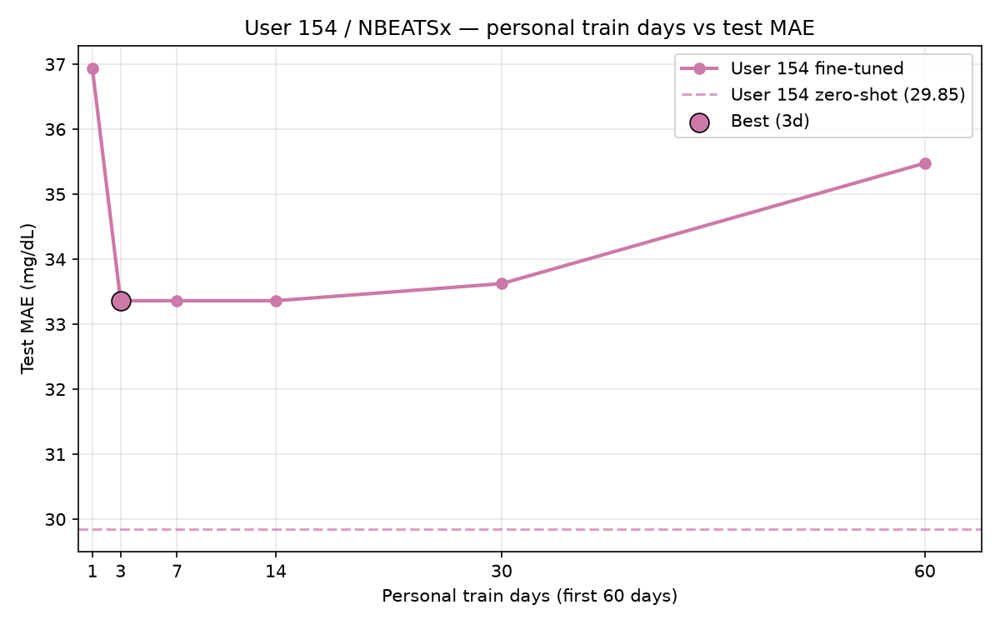


#### User 556

| Days | Used train days | ZS MAE | FT MAE | Δ FT vs ZS |
|------|-----------------|--------|--------|------------|
| 1 | 1.0 | 21.83 | 27.48 | 5.65 |
| 3 | 3.0 | 21.83 | 27.23 | 5.40 |
| 7 | 7.0 | 21.83 | 26.87 | 5.04 |
| 14 | 14.0 | 21.83 | 24.86 | 3.04 |
| 30 | 30.0 | 21.83 | 24.18 | 2.36 |
| 60 | 60.0 | 21.83 | 20.70 | -1.13 |
| all (91d) | 90.9 | 21.83 | 19.79 | -2.04 |

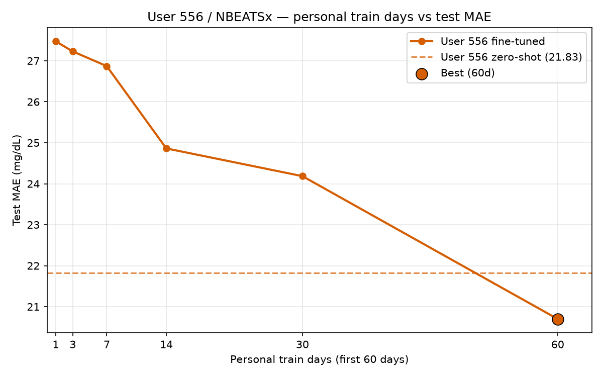


#### User 730

| Days | Used train days | ZS MAE | FT MAE | Δ FT vs ZS |
|------|-----------------|--------|--------|------------|
| 1 | 1.0 | 19.88 | 26.10 | 6.22 |
| 3 | 3.0 | 19.88 | 26.19 | 6.31 |
| 7 | 7.0 | 19.88 | 28.82 | 8.94 |
| 14 | 14.0 | 19.88 | 25.15 | 5.27 |
| 30 | 30.0 | 19.88 | 21.11 | 1.23 |
| 60 | 60.0 | 19.88 | 19.10 | -0.79 |
| all (85d) | 84.6 | 19.88 | 18.33 | -1.55 |

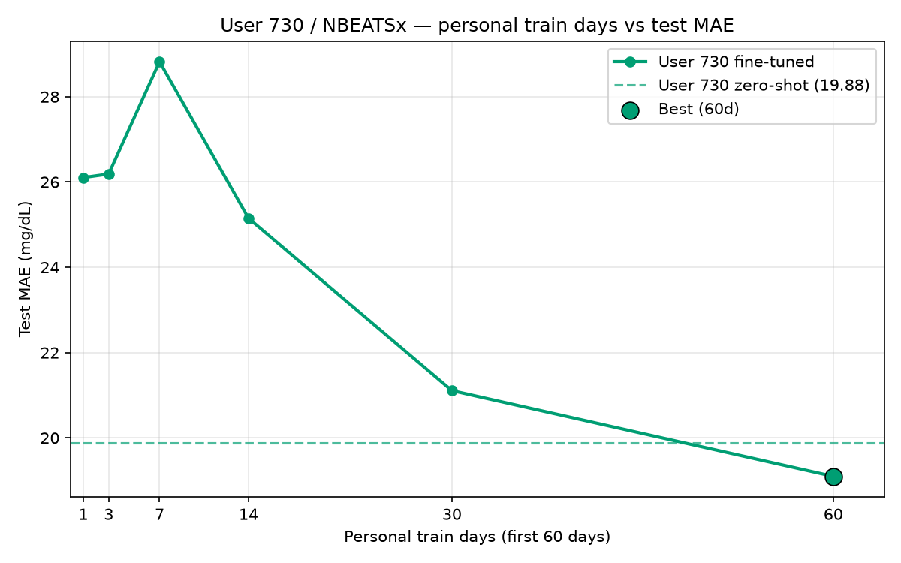


#### User 1017

| Days | Used train days | ZS MAE | FT MAE | Δ FT vs ZS |
|------|-----------------|--------|--------|------------|
| 1 | 1.0 | 21.39 | 43.56 | 22.17 |
| 3 | 3.0 | 21.39 | 31.69 | 10.30 |
| 7 | 6.5 | 21.39 | 28.98 | 7.58 |
| 14 | 14.0 | 21.39 | 26.77 | 5.38 |
| 30 | 30.0 | 21.39 | 24.79 | 3.40 |
| 60 | 60.0 | 21.39 | 20.41 | -0.99 |
| all (97d) | 96.7 | 21.39 | 19.38 | -2.02 |

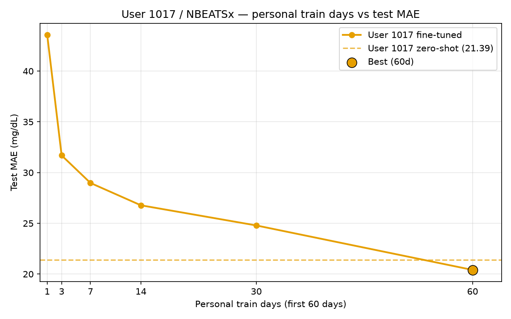


#### User 1029

| Days | Used train days | ZS MAE | FT MAE | Δ FT vs ZS |
|------|-----------------|--------|--------|------------|
| 1 | 1.0 | 26.28 | 38.79 | 12.51 |
| 3 | 3.0 | 26.28 | 31.75 | 5.47 |
| 7 | 6.3 | 26.28 | 30.82 | 4.53 |
| 14 | 14.0 | 26.28 | 29.32 | 3.04 |
| 30 | 30.0 | 26.28 | 29.40 | 3.12 |
| 60 | 59.9 | 26.28 | 27.28 | 0.99 |
| all (136d) | 136.0 | 26.28 | 23.32 | -2.97 |

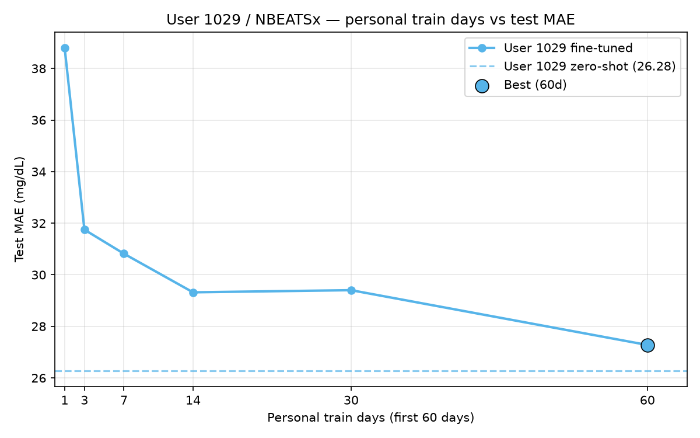


#### User 1082

| Days | Used train days | ZS MAE | FT MAE | Δ FT vs ZS |
|------|-----------------|--------|--------|------------|
| 1 | 1.0 | 20.02 | 24.28 | 4.26 |
| 3 | 3.0 | 20.02 | 30.51 | 10.49 |
| 7 | 7.0 | 20.02 | 25.53 | 5.51 |
| 14 | 14.0 | 20.02 | 24.03 | 4.02 |
| 30 | 29.6 | 20.02 | 22.05 | 2.03 |
| all (37d) | 37.4 | 20.02 | 22.69 | 2.67 |

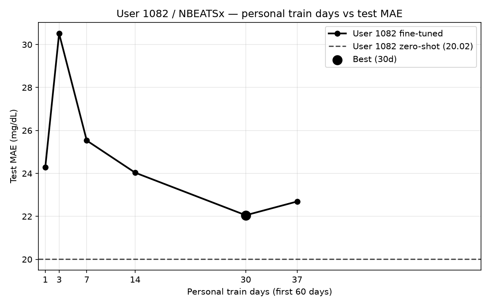


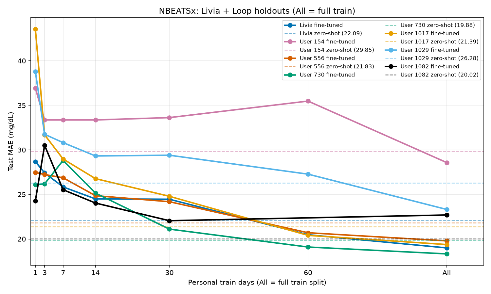

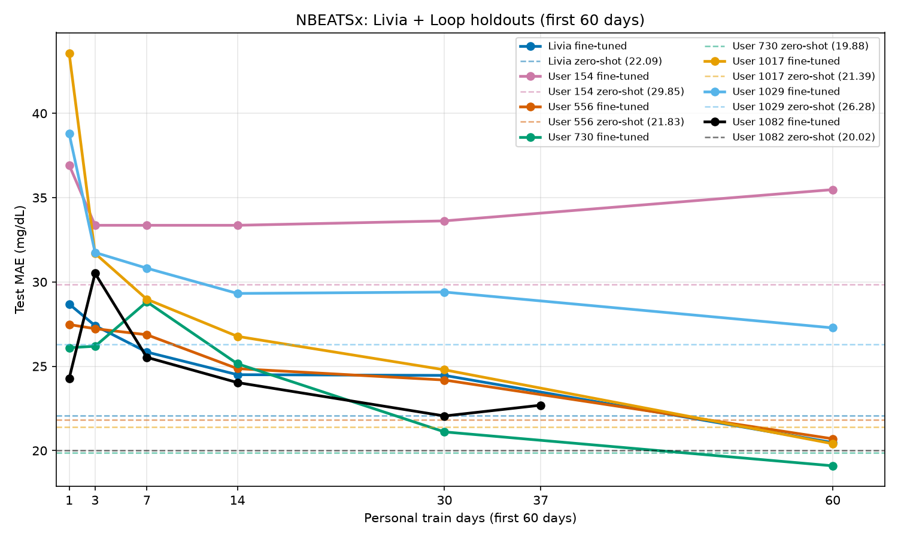

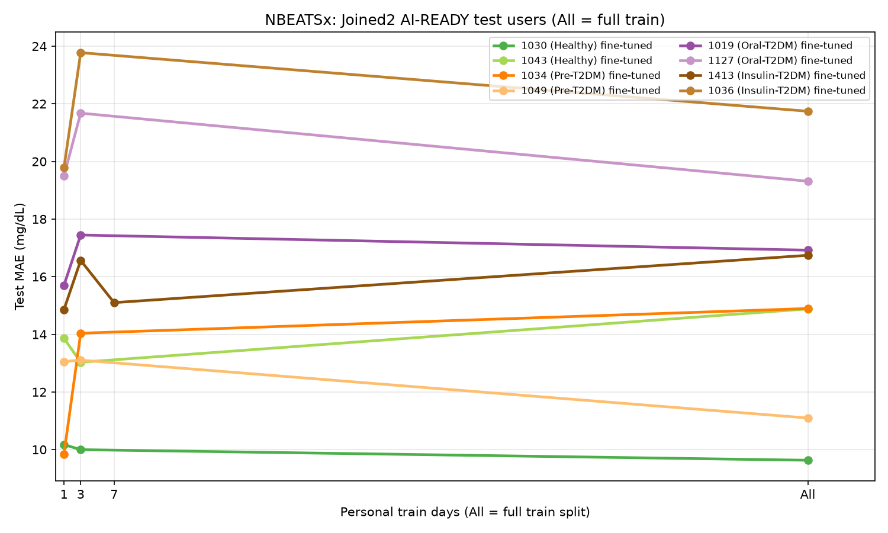


### Average MAE improvement by train budget

Mean test-MAE reduction versus zero-shot on T1DM users with at least 60 train days (Subject P1 + Loop holdouts except User 1082 when the budget exceeds their span). Negative Δ is better than frozen global.

| Train budget | Mean Δ vs ZS | Mean MAE improvement | n |
|--------------|--------------|----------------------|---|
| 30 days | 2.71 | -2.71 | 6 |
| 60 days | 0.35 | -0.35 | 6 |
| Full train (≥60 d) | -2.16 | 2.16 | 6 |

### Joined2 test — two users per study group

#### 1030 (Healthy)

| Days | Used train days | ZS MAE | FT MAE | Δ FT vs ZS |
|------|-----------------|--------|--------|------------|
| 1 | 1.0 | 8.26 | 10.17 | 1.92 |
| 3 | 3.0 | 8.26 | 10.00 | 1.74 |
| all (6d) | 6.3 | 8.26 | 9.63 | 1.37 |

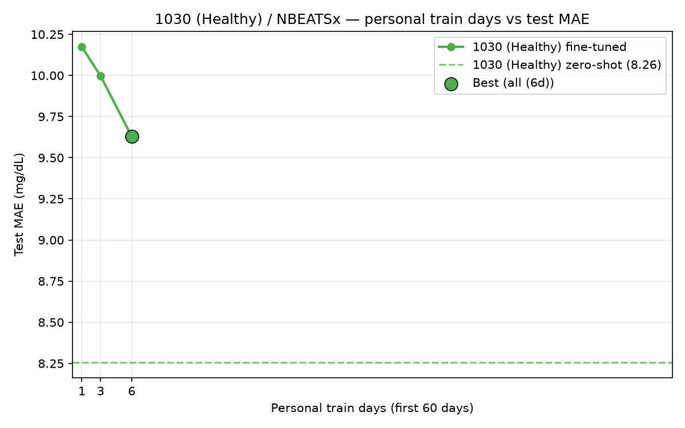


#### 1043 (Healthy)

| Days | Used train days | ZS MAE | FT MAE | Δ FT vs ZS |
|------|-----------------|--------|--------|------------|
| 1 | 1.0 | 10.94 | 13.86 | 2.92 |
| 3 | 3.0 | 10.94 | 13.03 | 2.09 |
| all (6d) | 6.3 | 10.94 | 14.88 | 3.94 |

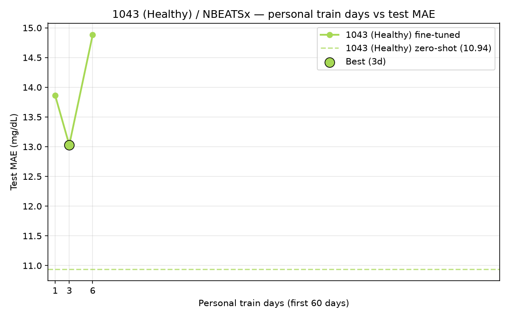


#### 1034 (Pre-T2DM)

| Days | Used train days | ZS MAE | FT MAE | Δ FT vs ZS |
|------|-----------------|--------|--------|------------|
| 1 | 1.0 | 8.66 | 9.85 | 1.18 |
| 3 | 3.0 | 8.66 | 14.04 | 5.38 |
| all (6d) | 6.3 | 8.66 | 14.90 | 6.23 |

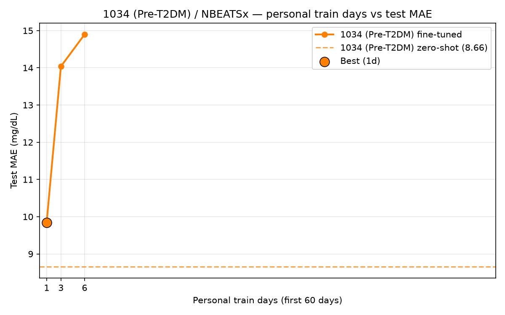


#### 1049 (Pre-T2DM)

| Days | Used train days | ZS MAE | FT MAE | Δ FT vs ZS |
|------|-----------------|--------|--------|------------|
| 1 | 1.0 | 11.04 | 13.06 | 2.02 |
| 3 | 3.0 | 11.04 | 13.10 | 2.07 |
| all (6d) | 6.3 | 11.04 | 11.10 | 0.06 |

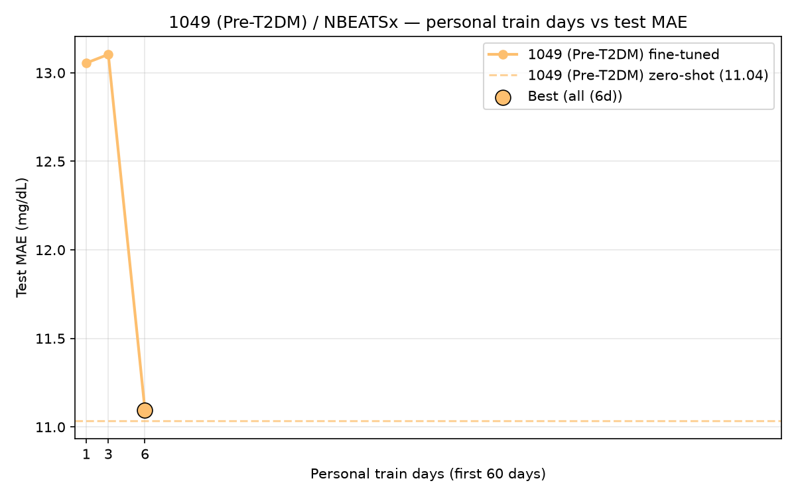


#### 1019 (Oral-T2DM)

| Days | Used train days | ZS MAE | FT MAE | Δ FT vs ZS |
|------|-----------------|--------|--------|------------|
| 1 | 1.0 | 12.61 | 15.70 | 3.09 |
| 3 | 3.0 | 12.61 | 17.45 | 4.84 |
| all (6d) | 6.3 | 12.61 | 16.92 | 4.31 |

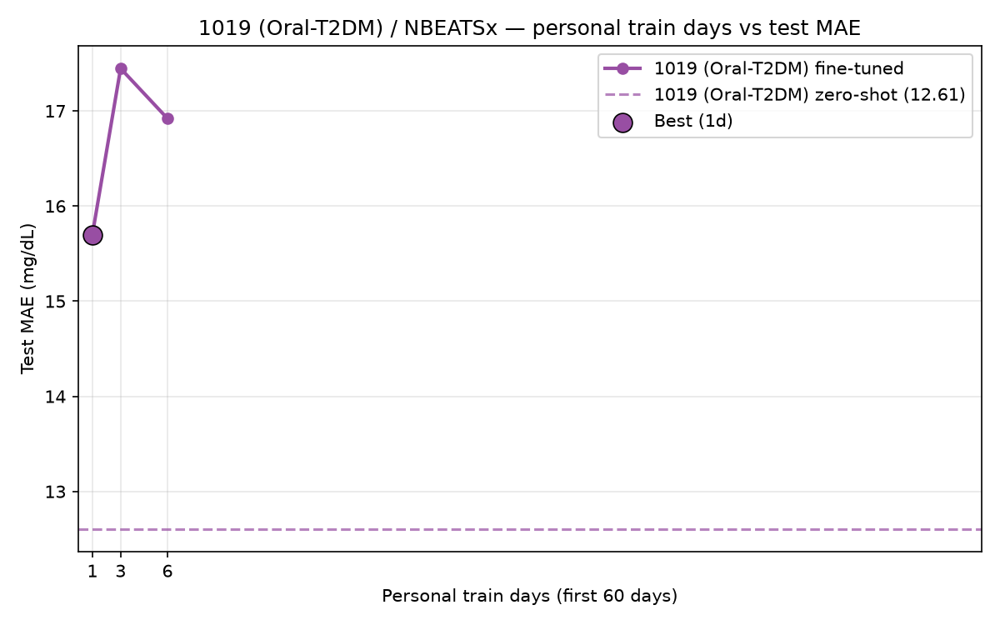


#### 1127 (Oral-T2DM)

| Days | Used train days | ZS MAE | FT MAE | Δ FT vs ZS |
|------|-----------------|--------|--------|------------|
| 1 | 1.0 | 15.58 | 19.50 | 3.92 |
| 3 | 3.0 | 15.58 | 21.68 | 6.10 |
| all (6d) | 6.3 | 15.58 | 19.31 | 3.73 |

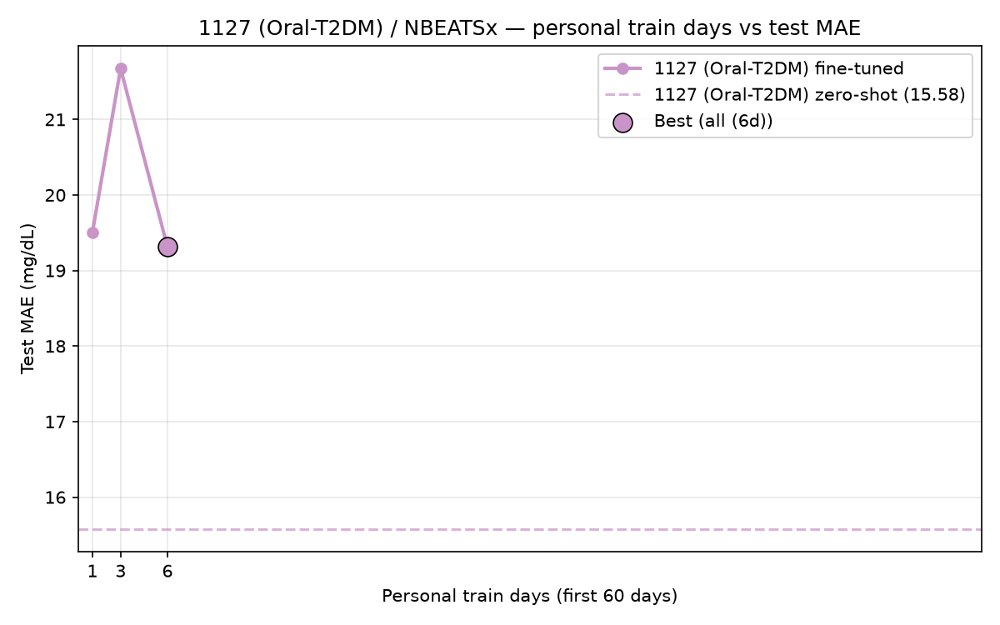


#### 1413 (Insulin-T2DM)

| Days | Used train days | ZS MAE | FT MAE | Δ FT vs ZS |
|------|-----------------|--------|--------|------------|
| 1 | 1.0 | 13.35 | 14.86 | 1.51 |
| 3 | 2.6 | 13.35 | 16.56 | 3.21 |
| 7 | 7.0 | 13.35 | 15.10 | 1.75 |
| all (9d) | 9.1 | 13.35 | 16.74 | 3.39 |

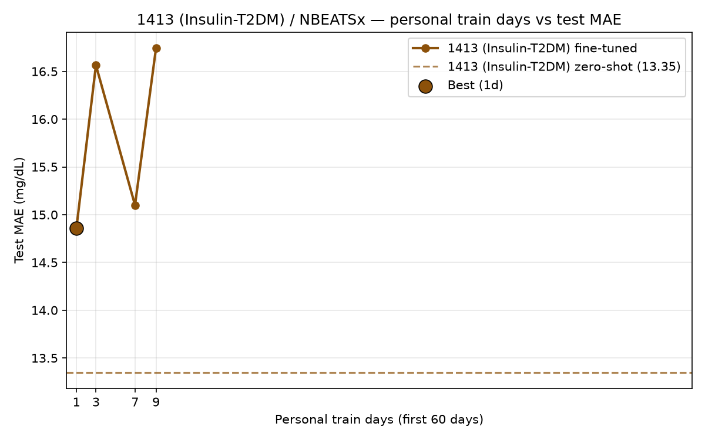


#### 1036 (Insulin-T2DM)

| Days | Used train days | ZS MAE | FT MAE | Δ FT vs ZS |
|------|-----------------|--------|--------|------------|
| 1 | 1.0 | 17.14 | 19.78 | 2.64 |
| 3 | 3.0 | 17.14 | 23.78 | 6.63 |
| all (6d) | 6.3 | 17.14 | 21.74 | 4.60 |

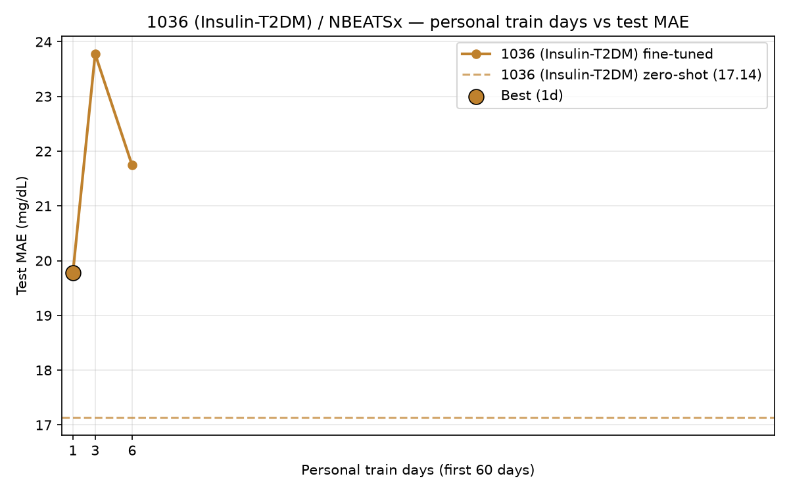


## NHITS

Global holdout run: `data/output/runs/nf_holdout/__ALL__/NHITS_20260811T160526Z`. Joined2 val MAE **11.72** (RMSE 18.47, MARD 8.26%); test MAE **11.94** (RMSE 19.38, MARD 8.08%). Population-model numbers, not the personal chronological test below.

### Full train, continue-fit from global weights

| Subject | Cohort | Study group | Train span (d) | ZS MAE | FT MAE (all) | Δ vs ZS |
|---------|--------|-------------|----------------|--------|--------------|---------|
| Subject P1 | Subject P1 | T1DM | 344.6 | 22.06 | 19.15 | -2.91 |
| User 154 | Loop holdout | T1DM | 213.6 | 29.52 | 28.65 | -0.87 |
| User 556 | Loop holdout | T1DM | 90.9 | 21.53 | 19.84 | -1.70 |
| User 730 | Loop holdout | T1DM | 84.6 | 20.16 | 18.50 | -1.66 |
| User 1017 | Loop holdout | T1DM | 96.7 | 21.40 | 19.78 | -1.63 |
| User 1029 | Loop holdout | T1DM | 136.0 | 26.53 | 23.78 | -2.75 |
| User 1082 | Loop holdout | T1DM | 37.4 | 19.75 | 22.38 | 2.63 |
| 1030 (Healthy) | joined2 test | Healthy | 6.3 | 8.42 | 8.99 | 0.57 |
| 1043 (Healthy) | joined2 test | Healthy | 6.3 | 10.98 | 13.32 | 2.34 |
| 1034 (Pre-T2DM) | joined2 test | Pre-T2DM | 6.3 | 8.67 | 10.54 | 1.87 |
| 1049 (Pre-T2DM) | joined2 test | Pre-T2DM | 6.3 | 11.11 | 11.86 | 0.75 |
| 1019 (Oral-T2DM) | joined2 test | Oral-T2DM | 6.3 | 12.86 | 16.59 | 3.73 |
| 1127 (Oral-T2DM) | joined2 test | Oral-T2DM | 6.3 | 16.50 | 22.01 | 5.51 |
| 1413 (Insulin-T2DM) | joined2 test | Insulin-T2DM | 9.1 | 13.70 | 13.43 | -0.27 |
| 1036 (Insulin-T2DM) | joined2 test | Insulin-T2DM | 6.3 | 17.07 | 20.31 | 3.24 |

### Subject P1 and Loop quality holdouts

#### Subject P1

| Days | Used train days | ZS MAE | FT MAE | Δ FT vs ZS |
|------|-----------------|--------|--------|------------|
| 1 | 1.0 | 22.06 | 33.50 | 11.44 |
| 3 | 3.0 | 22.06 | 27.10 | 5.04 |
| 7 | 7.0 | 22.06 | 25.17 | 3.11 |
| 14 | 14.0 | 22.06 | 24.71 | 2.65 |
| 30 | 30.0 | 22.06 | 24.04 | 1.98 |
| 60 | 60.0 | 22.06 | 20.61 | -1.45 |
| all (345d) | 344.6 | 22.06 | 19.15 | -2.91 |


#### User 154

| Days | Used train days | ZS MAE | FT MAE | Δ FT vs ZS |
|------|-----------------|--------|--------|------------|
| 1 | 1.0 | 29.52 | 39.51 | 9.99 |
| 3 | 2.9 | 29.52 | 33.75 | 4.23 |
| 7 | 2.9 | 29.52 | 33.75 | 4.23 |
| 14 | 2.9 | 29.52 | 33.75 | 4.23 |
| 30 | 30.0 | 29.52 | 34.51 | 4.99 |
| 60 | 60.0 | 29.52 | 35.54 | 6.02 |
| all (214d) | 213.6 | 29.52 | 28.65 | -0.87 |

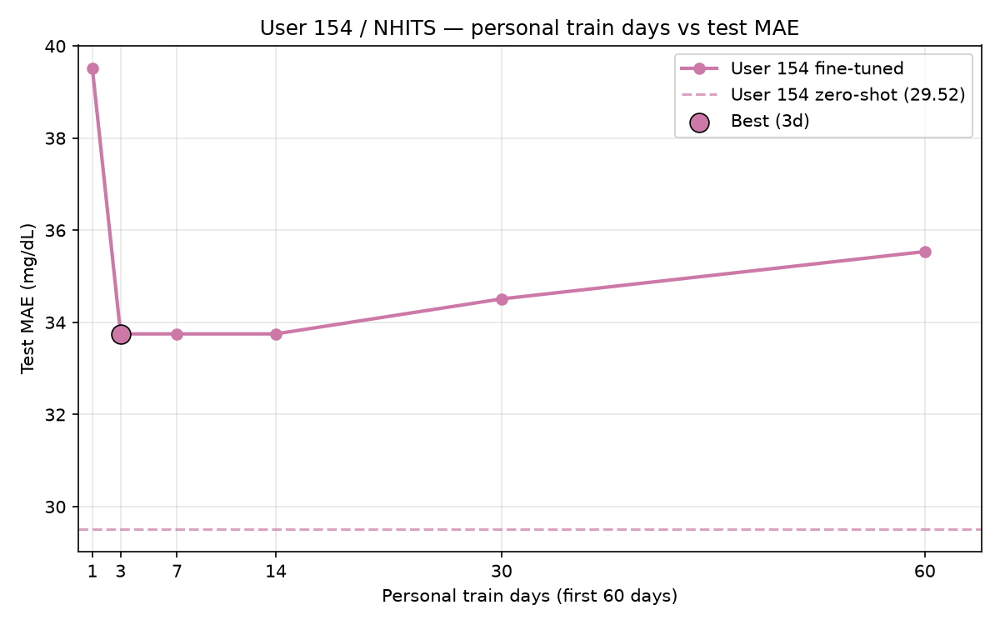


#### User 556

| Days | Used train days | ZS MAE | FT MAE | Δ FT vs ZS |
|------|-----------------|--------|--------|------------|
| 1 | 1.0 | 21.53 | 26.37 | 4.84 |
| 3 | 3.0 | 21.53 | 26.53 | 4.99 |
| 7 | 7.0 | 21.53 | 26.35 | 4.81 |
| 14 | 14.0 | 21.53 | 24.75 | 3.22 |
| 30 | 30.0 | 21.53 | 23.45 | 1.92 |
| 60 | 60.0 | 21.53 | 20.55 | -0.99 |
| all (91d) | 90.9 | 21.53 | 19.84 | -1.70 |

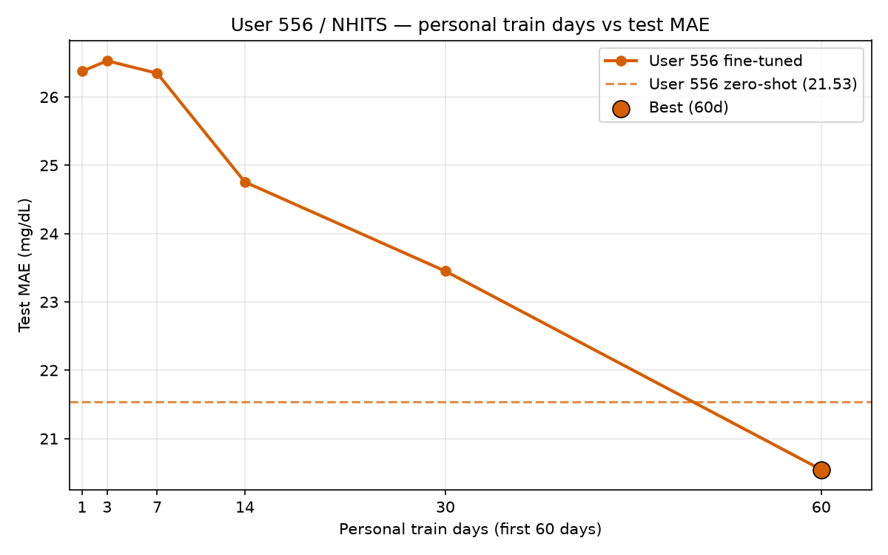


#### User 730

| Days | Used train days | ZS MAE | FT MAE | Δ FT vs ZS |
|------|-----------------|--------|--------|------------|
| 1 | 1.0 | 20.16 | 25.91 | 5.74 |
| 3 | 3.0 | 20.16 | 25.11 | 4.95 |
| 7 | 7.0 | 20.16 | 27.34 | 7.18 |
| 14 | 14.0 | 20.16 | 23.15 | 2.98 |
| 30 | 30.0 | 20.16 | 20.17 | 0.01 |
| 60 | 60.0 | 20.16 | 18.99 | -1.17 |
| all (85d) | 84.6 | 20.16 | 18.50 | -1.66 |

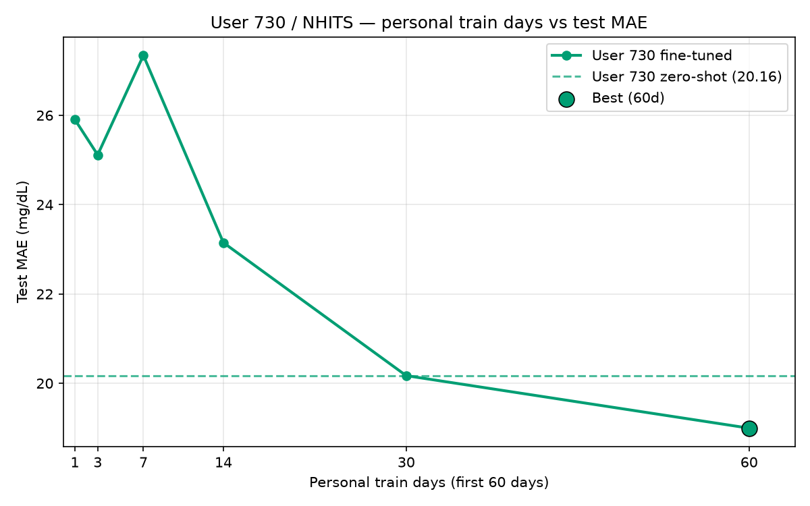


#### User 1017

| Days | Used train days | ZS MAE | FT MAE | Δ FT vs ZS |
|------|-----------------|--------|--------|------------|
| 1 | 1.0 | 21.40 | 44.44 | 23.04 |
| 3 | 3.0 | 21.40 | 29.66 | 8.26 |
| 7 | 6.5 | 21.40 | 27.95 | 6.55 |
| 14 | 14.0 | 21.40 | 26.66 | 5.26 |
| 30 | 30.0 | 21.40 | 23.51 | 2.10 |
| 60 | 60.0 | 21.40 | 19.86 | -1.54 |
| all (97d) | 96.7 | 21.40 | 19.78 | -1.63 |

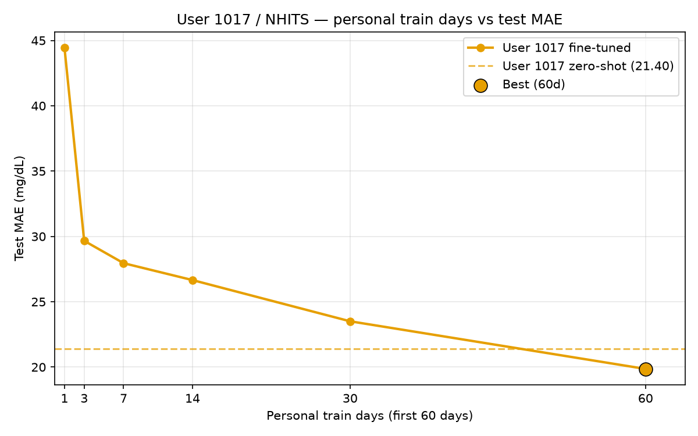


#### User 1029

| Days | Used train days | ZS MAE | FT MAE | Δ FT vs ZS |
|------|-----------------|--------|--------|------------|
| 1 | 1.0 | 26.53 | 35.03 | 8.50 |
| 3 | 3.0 | 26.53 | 31.28 | 4.75 |
| 7 | 6.3 | 26.53 | 31.42 | 4.89 |
| 14 | 14.0 | 26.53 | 29.43 | 2.90 |
| 30 | 30.0 | 26.53 | 28.99 | 2.46 |
| 60 | 59.9 | 26.53 | 26.60 | 0.07 |
| all (136d) | 136.0 | 26.53 | 23.78 | -2.75 |

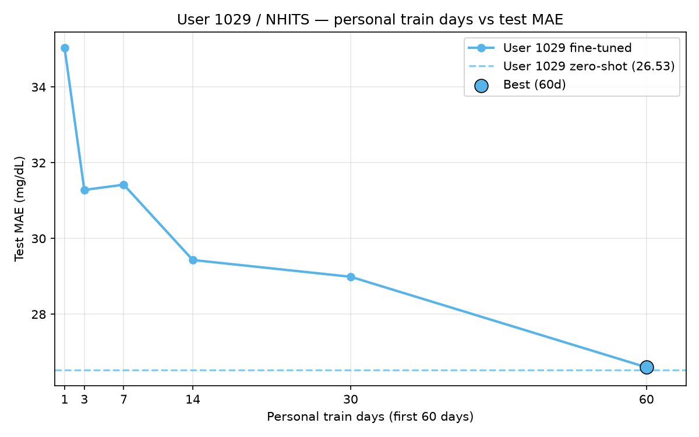


#### User 1082

| Days | Used train days | ZS MAE | FT MAE | Δ FT vs ZS |
|------|-----------------|--------|--------|------------|
| 1 | 1.0 | 19.75 | 26.18 | 6.43 |
| 3 | 3.0 | 19.75 | 26.47 | 6.72 |
| 7 | 7.0 | 19.75 | 27.27 | 7.52 |
| 14 | 14.0 | 19.75 | 25.54 | 5.80 |
| 30 | 29.6 | 19.75 | 22.13 | 2.38 |
| all (37d) | 37.4 | 19.75 | 22.38 | 2.63 |

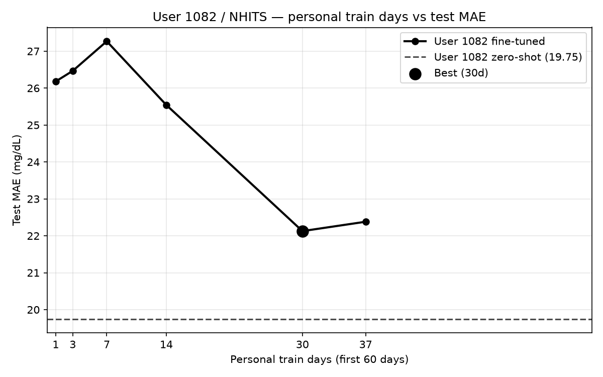


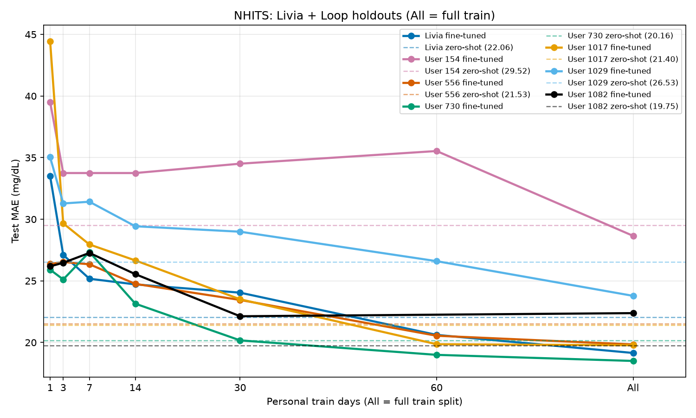

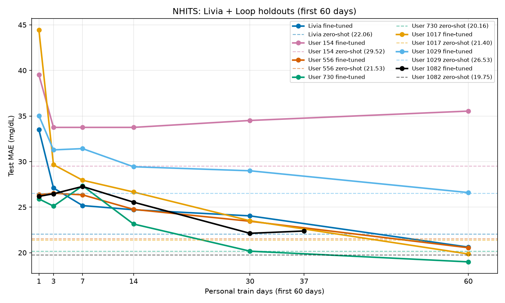

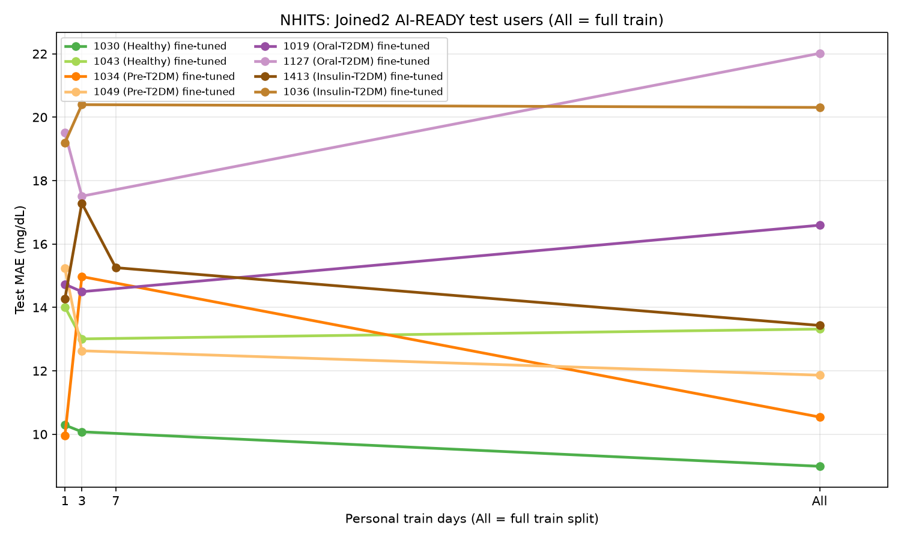


### Average MAE improvement by train budget

Mean test-MAE reduction versus zero-shot on T1DM users with at least 60 train days (Subject P1 + Loop holdouts except User 1082 when the budget exceeds their span). Negative Δ is better than frozen global.

| Train budget | Mean Δ vs ZS | Mean MAE improvement | n |
|--------------|--------------|----------------------|---|
| 30 days | 2.24 | -2.24 | 6 |
| 60 days | 0.16 | -0.16 | 6 |
| Full train (≥60 d) | -1.92 | 1.92 | 6 |

### Joined2 test — two users per study group

#### 1030 (Healthy)

| Days | Used train days | ZS MAE | FT MAE | Δ FT vs ZS |
|------|-----------------|--------|--------|------------|
| 1 | 1.0 | 8.42 | 10.29 | 1.87 |
| 3 | 3.0 | 8.42 | 10.08 | 1.66 |
| all (6d) | 6.3 | 8.42 | 8.99 | 0.57 |

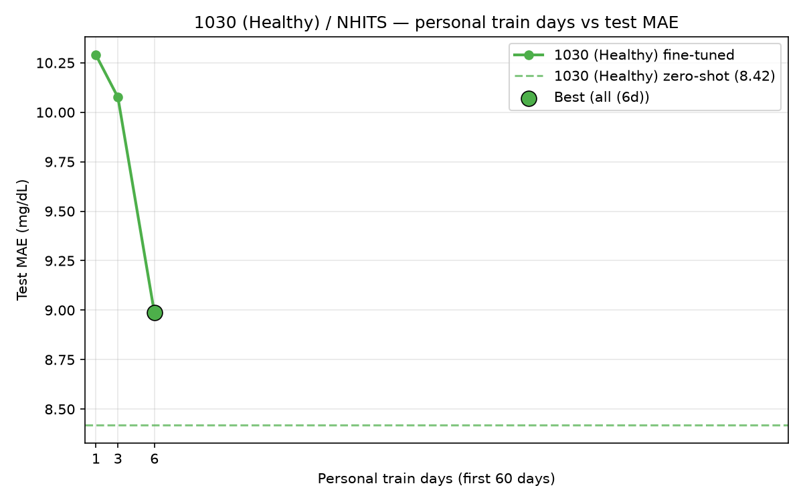


#### 1043 (Healthy)

| Days | Used train days | ZS MAE | FT MAE | Δ FT vs ZS |
|------|-----------------|--------|--------|------------|
| 1 | 1.0 | 10.98 | 14.02 | 3.04 |
| 3 | 3.0 | 10.98 | 13.01 | 2.03 |
| all (6d) | 6.3 | 10.98 | 13.32 | 2.34 |

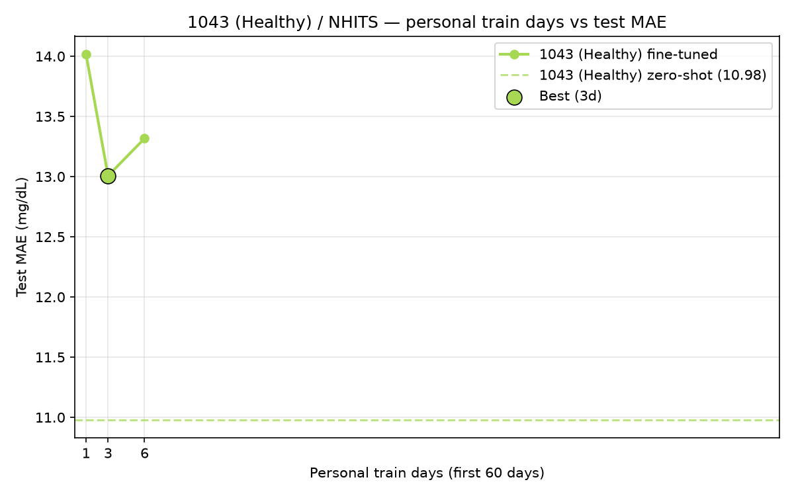


#### 1034 (Pre-T2DM)

| Days | Used train days | ZS MAE | FT MAE | Δ FT vs ZS |
|------|-----------------|--------|--------|------------|
| 1 | 1.0 | 8.67 | 9.95 | 1.27 |
| 3 | 3.0 | 8.67 | 14.97 | 6.30 |
| all (6d) | 6.3 | 8.67 | 10.54 | 1.87 |

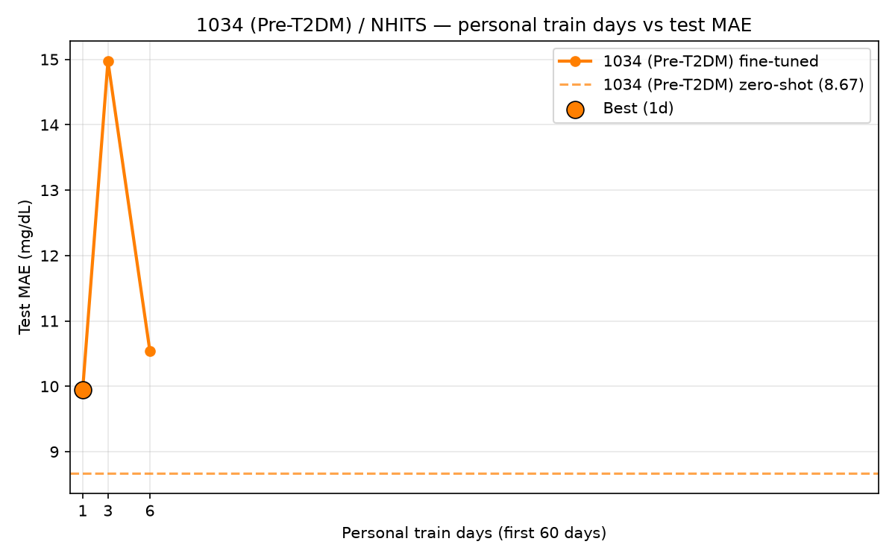


#### 1049 (Pre-T2DM)

| Days | Used train days | ZS MAE | FT MAE | Δ FT vs ZS |
|------|-----------------|--------|--------|------------|
| 1 | 1.0 | 11.11 | 15.23 | 4.12 |
| 3 | 3.0 | 11.11 | 12.63 | 1.52 |
| all (6d) | 6.3 | 11.11 | 11.86 | 0.75 |

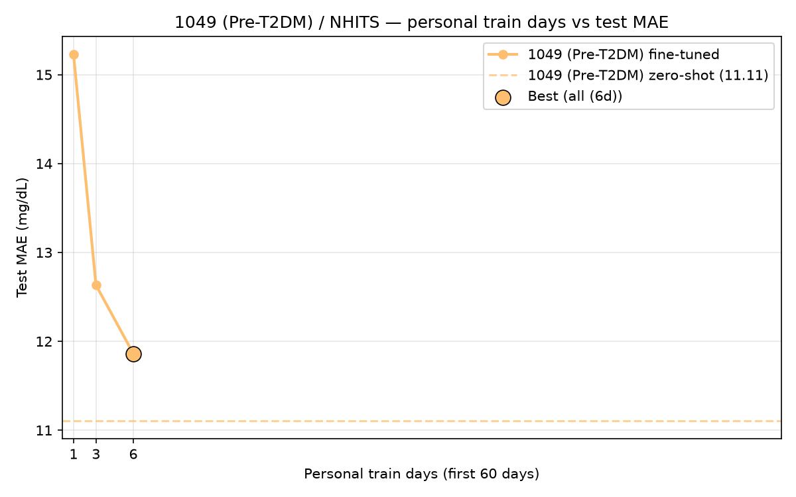


#### 1019 (Oral-T2DM)

| Days | Used train days | ZS MAE | FT MAE | Δ FT vs ZS |
|------|-----------------|--------|--------|------------|
| 1 | 1.0 | 12.86 | 14.73 | 1.87 |
| 3 | 3.0 | 12.86 | 14.50 | 1.64 |
| all (6d) | 6.3 | 12.86 | 16.59 | 3.73 |

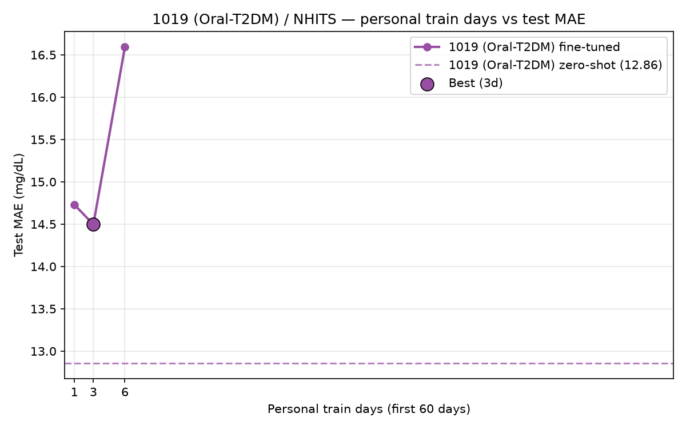


#### 1127 (Oral-T2DM)

| Days | Used train days | ZS MAE | FT MAE | Δ FT vs ZS |
|------|-----------------|--------|--------|------------|
| 1 | 1.0 | 16.50 | 19.51 | 3.01 |
| 3 | 3.0 | 16.50 | 17.51 | 1.01 |
| all (6d) | 6.3 | 16.50 | 22.01 | 5.51 |

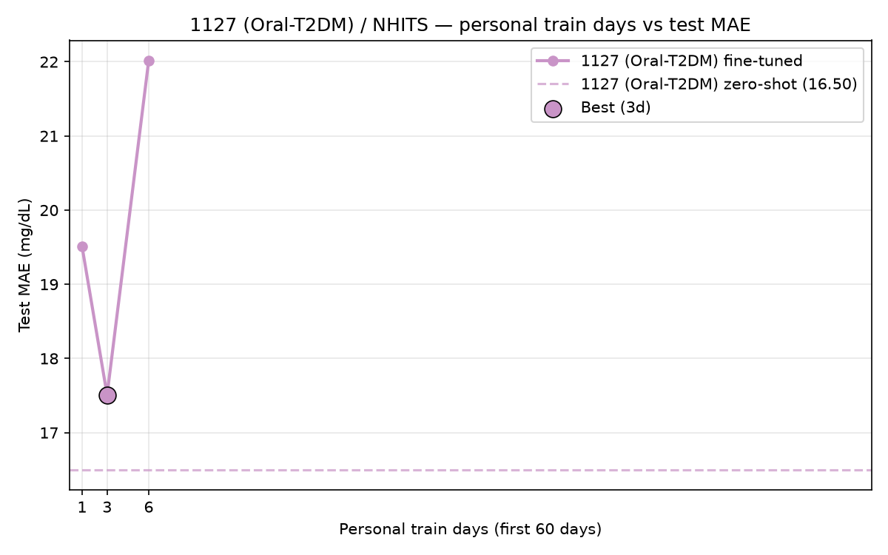


#### 1413 (Insulin-T2DM)

| Days | Used train days | ZS MAE | FT MAE | Δ FT vs ZS |
|------|-----------------|--------|--------|------------|
| 1 | 1.0 | 13.70 | 14.27 | 0.56 |
| 3 | 2.6 | 13.70 | 17.29 | 3.58 |
| 7 | 7.0 | 13.70 | 15.25 | 1.55 |
| all (9d) | 9.1 | 13.70 | 13.43 | -0.27 |

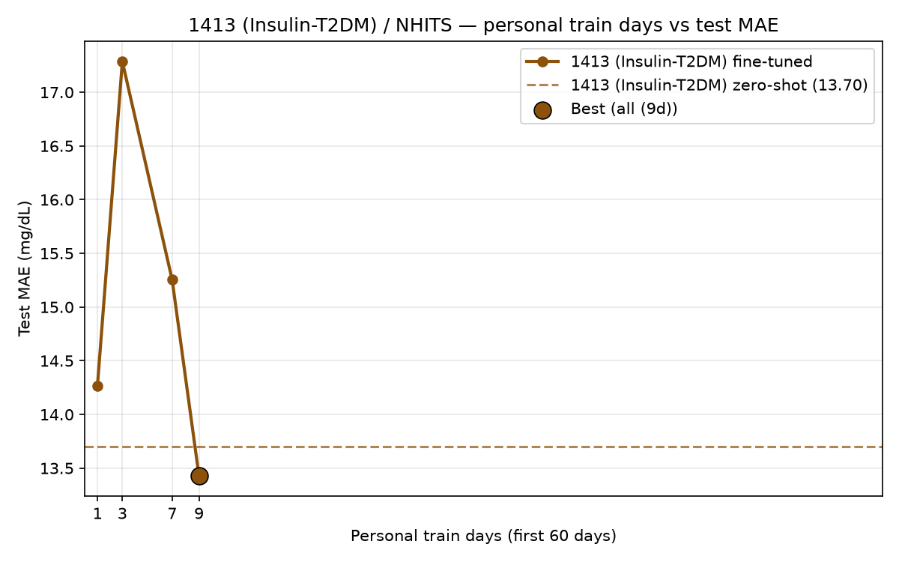


#### 1036 (Insulin-T2DM)

| Days | Used train days | ZS MAE | FT MAE | Δ FT vs ZS |
|------|-----------------|--------|--------|------------|
| 1 | 1.0 | 17.07 | 19.19 | 2.12 |
| 3 | 3.0 | 17.07 | 20.40 | 3.33 |
| all (6d) | 6.3 | 17.07 | 20.31 | 3.24 |

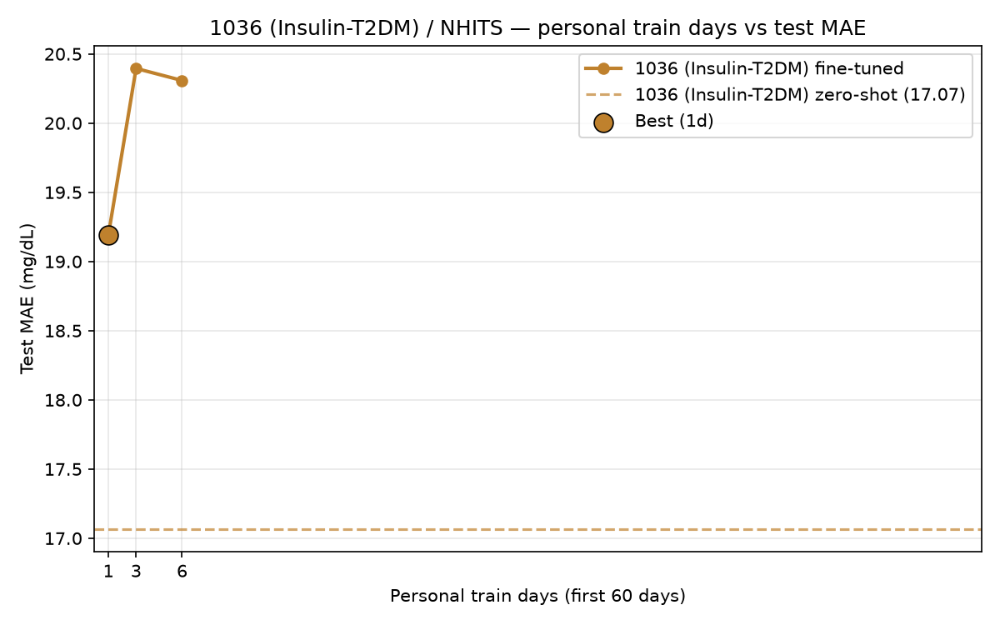


## TFT

Global holdout run: `data/output/runs/nf_holdout/__ALL__/TFT_20260811T160708Z`. Joined2 val MAE **11.95** (RMSE 18.62, MARD 8.35%); test MAE **12.69** (RMSE 20.36, MARD 8.47%). Population-model numbers, not the personal chronological test below.

### Full train, continue-fit from global weights

| Subject | Cohort | Study group | Train span (d) | ZS MAE | FT MAE (all) | Δ vs ZS |
|---------|--------|-------------|----------------|--------|--------------|---------|
| Subject P1 | Subject P1 | T1DM | 344.6 | 24.16 | 18.61 | -5.56 |
| User 154 | Loop holdout | T1DM | 213.6 | 29.28 | 25.21 | -4.07 |
| User 556 | Loop holdout | T1DM | 90.9 | 21.85 | 17.81 | -4.04 |
| User 730 | Loop holdout | T1DM | 84.6 | 23.10 | 17.42 | -5.68 |
| User 1017 | Loop holdout | T1DM | 96.7 | 21.70 | 18.98 | -2.72 |
| User 1029 | Loop holdout | T1DM | 136.0 | 29.37 | 23.09 | -6.28 |
| User 1082 | Loop holdout | T1DM | 37.4 | 21.42 | 18.00 | -3.42 |
| 1030 (Healthy) | joined2 test | Healthy | 6.3 | 8.45 | 11.20 | 2.75 |
| 1043 (Healthy) | joined2 test | Healthy | 6.3 | 10.97 | 16.27 | 5.30 |
| 1034 (Pre-T2DM) | joined2 test | Pre-T2DM | 6.3 | 8.78 | 10.75 | 1.96 |
| 1049 (Pre-T2DM) | joined2 test | Pre-T2DM | 6.3 | 10.57 | 11.58 | 1.01 |
| 1019 (Oral-T2DM) | joined2 test | Oral-T2DM | 6.3 | 12.11 | 17.34 | 5.23 |
| 1127 (Oral-T2DM) | joined2 test | Oral-T2DM | 6.3 | 17.92 | 22.33 | 4.41 |
| 1413 (Insulin-T2DM) | joined2 test | Insulin-T2DM | 9.1 | 17.39 | 16.90 | -0.49 |
| 1036 (Insulin-T2DM) | joined2 test | Insulin-T2DM | 6.3 | 19.31 | 21.50 | 2.18 |

### Subject P1 and Loop quality holdouts

#### Subject P1

| Days | Used train days | ZS MAE | FT MAE | Δ FT vs ZS |
|------|-----------------|--------|--------|------------|
| 1 | 1.0 | 24.16 | 31.74 | 7.58 |
| 3 | 3.0 | 24.16 | 28.95 | 4.79 |
| 7 | 7.0 | 24.16 | 25.33 | 1.16 |
| 14 | 14.0 | 24.16 | 21.94 | -2.22 |
| 30 | 30.0 | 24.16 | 18.57 | -5.59 |
| 60 | 60.0 | 24.16 | 18.58 | -5.58 |
| all (345d) | 344.6 | 24.16 | 18.61 | -5.56 |


#### User 154

| Days | Used train days | ZS MAE | FT MAE | Δ FT vs ZS |
|------|-----------------|--------|--------|------------|
| 1 | 1.0 | 29.28 | 45.97 | 16.70 |
| 3 | 2.9 | 29.28 | 42.11 | 12.83 |
| 7 | 2.9 | 29.28 | 42.11 | 12.83 |
| 14 | 2.9 | 29.28 | 42.11 | 12.83 |
| 30 | 30.0 | 29.28 | 36.87 | 7.59 |
| 60 | 60.0 | 29.28 | 31.82 | 2.54 |
| all (214d) | 213.6 | 29.28 | 25.21 | -4.07 |

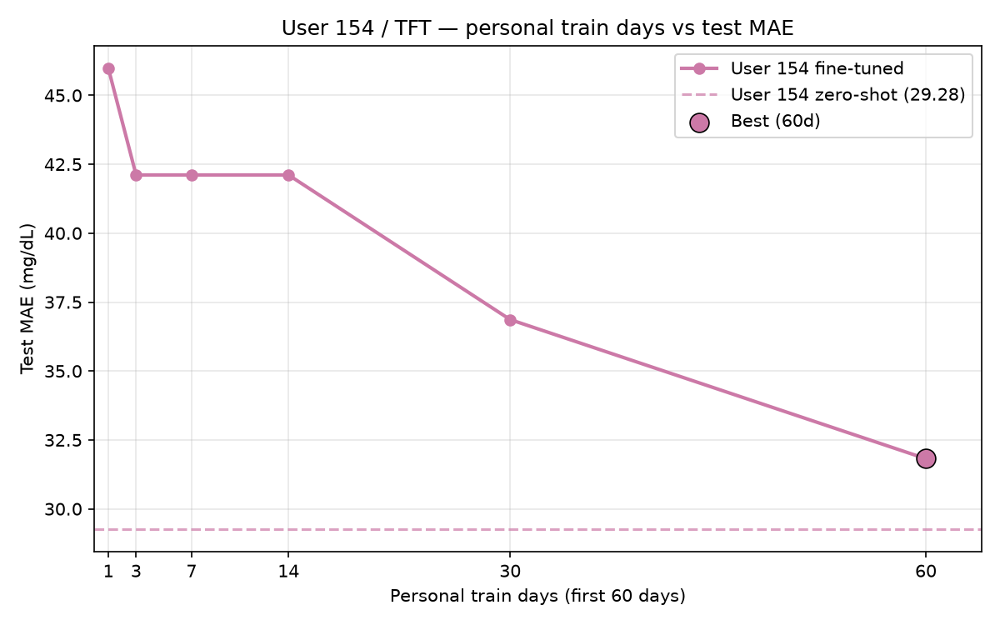


#### User 556

| Days | Used train days | ZS MAE | FT MAE | Δ FT vs ZS |
|------|-----------------|--------|--------|------------|
| 1 | 1.0 | 21.85 | 29.07 | 7.22 |
| 3 | 3.0 | 21.85 | 25.83 | 3.98 |
| 7 | 7.0 | 21.85 | 23.60 | 1.76 |
| 14 | 14.0 | 21.85 | 23.01 | 1.16 |
| 30 | 30.0 | 21.85 | 18.58 | -3.27 |
| 60 | 60.0 | 21.85 | 18.38 | -3.47 |
| all (91d) | 90.9 | 21.85 | 17.81 | -4.04 |

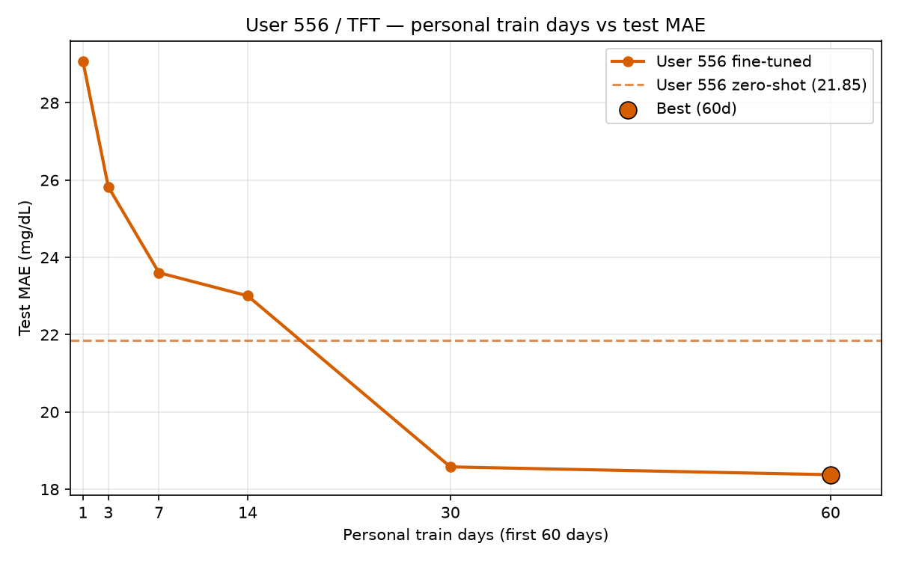


#### User 730

| Days | Used train days | ZS MAE | FT MAE | Δ FT vs ZS |
|------|-----------------|--------|--------|------------|
| 1 | 1.0 | 23.10 | 41.51 | 18.41 |
| 3 | 3.0 | 23.10 | 31.36 | 8.27 |
| 7 | 7.0 | 23.10 | 29.14 | 6.04 |
| 14 | 14.0 | 23.10 | 26.52 | 3.43 |
| 30 | 30.0 | 23.10 | 19.41 | -3.68 |
| 60 | 60.0 | 23.10 | 17.98 | -5.12 |
| all (85d) | 84.6 | 23.10 | 17.42 | -5.68 |

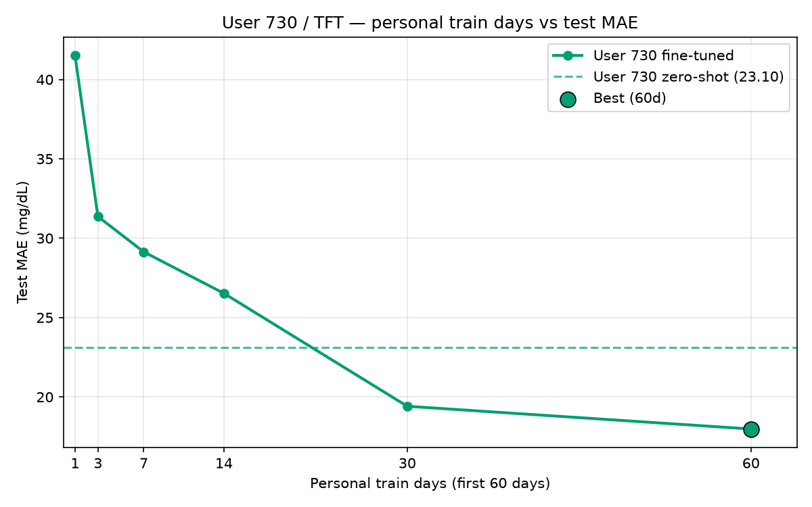


#### User 1017

| Days | Used train days | ZS MAE | FT MAE | Δ FT vs ZS |
|------|-----------------|--------|--------|------------|
| 1 | 1.0 | 21.70 | 52.81 | 31.11 |
| 3 | 3.0 | 21.70 | 33.87 | 12.17 |
| 7 | 6.5 | 21.70 | 28.62 | 6.92 |
| 14 | 14.0 | 21.70 | 25.13 | 3.43 |
| 30 | 30.0 | 21.70 | 20.21 | -1.49 |
| 60 | 60.0 | 21.70 | 18.62 | -3.08 |
| all (97d) | 96.7 | 21.70 | 18.98 | -2.72 |

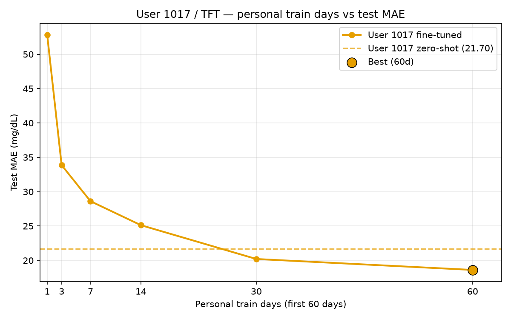


#### User 1029

| Days | Used train days | ZS MAE | FT MAE | Δ FT vs ZS |
|------|-----------------|--------|--------|------------|
| 1 | 1.0 | 29.37 | 64.57 | 35.20 |
| 3 | 3.0 | 29.37 | 32.57 | 3.20 |
| 7 | 6.3 | 29.37 | 32.47 | 3.10 |
| 14 | 14.0 | 29.37 | 28.14 | -1.23 |
| 30 | 30.0 | 29.37 | 25.16 | -4.21 |
| 60 | 59.9 | 29.37 | 23.79 | -5.58 |
| all (136d) | 136.0 | 29.37 | 23.09 | -6.28 |

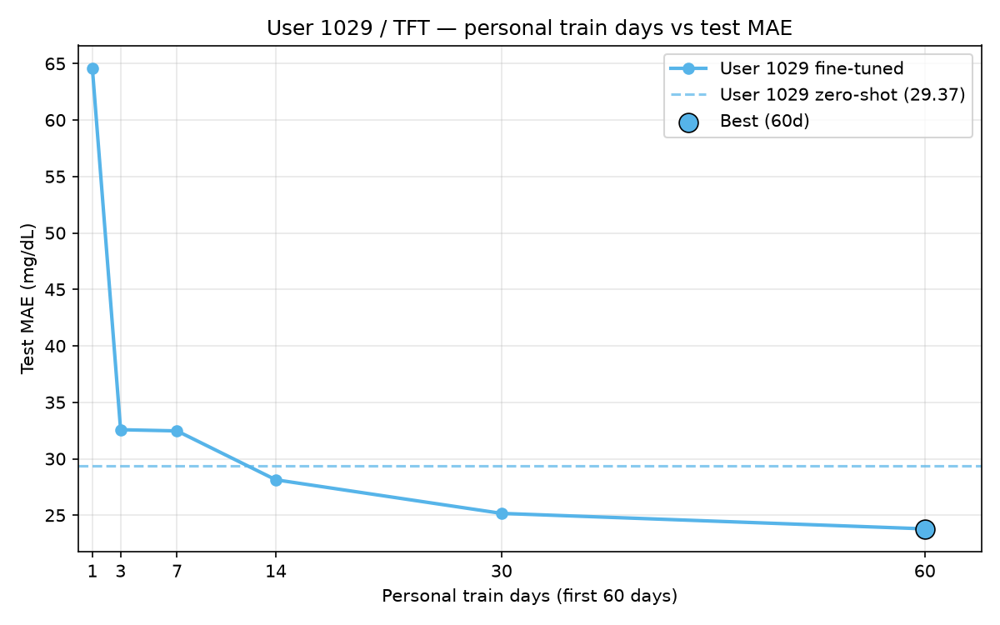


#### User 1082

| Days | Used train days | ZS MAE | FT MAE | Δ FT vs ZS |
|------|-----------------|--------|--------|------------|
| 1 | 1.0 | 21.42 | 30.13 | 8.71 |
| 3 | 3.0 | 21.42 | 34.75 | 13.33 |
| 7 | 7.0 | 21.42 | 25.67 | 4.25 |
| 14 | 14.0 | 21.42 | 22.45 | 1.03 |
| 30 | 29.6 | 21.42 | 19.73 | -1.69 |
| all (37d) | 37.4 | 21.42 | 18.00 | -3.42 |

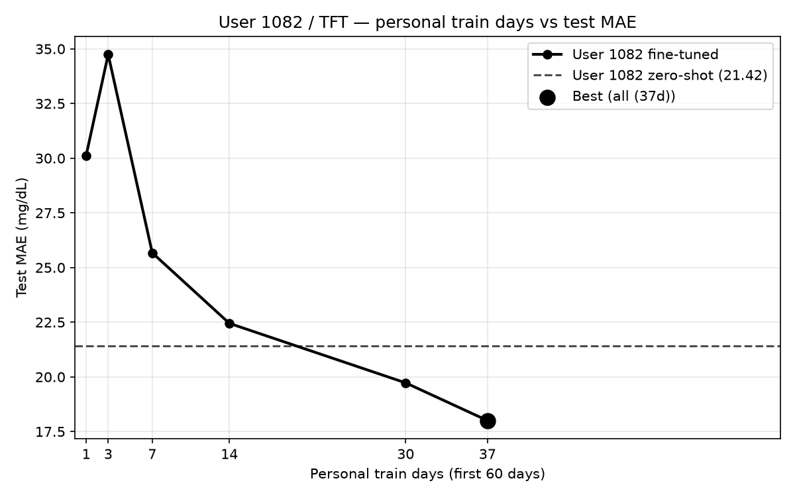


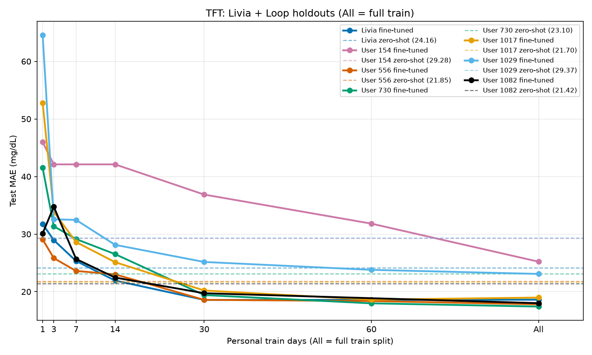

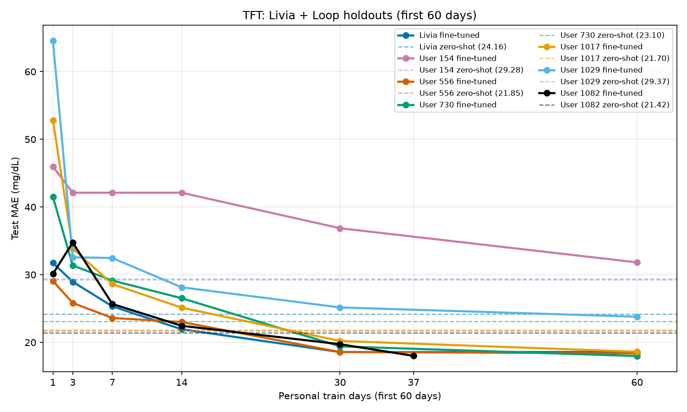

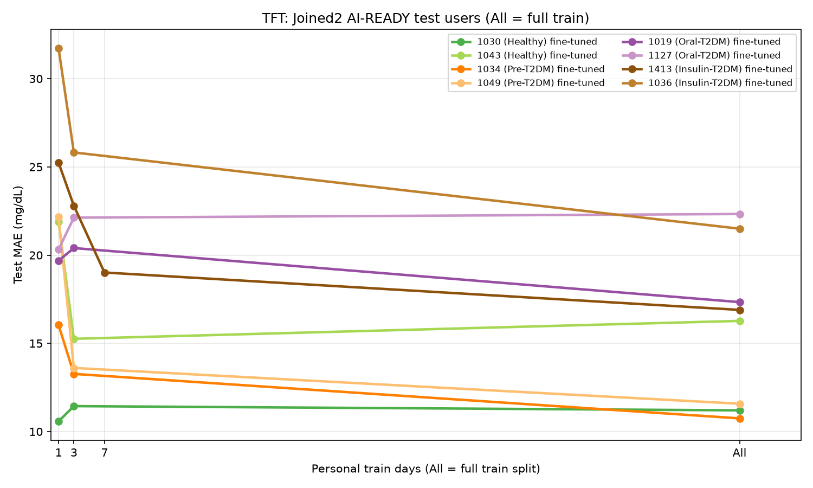


### Average MAE improvement by train budget

Mean test-MAE reduction versus zero-shot on T1DM users with at least 60 train days (Subject P1 + Loop holdouts except User 1082 when the budget exceeds their span). Negative Δ is better than frozen global.

| Train budget | Mean Δ vs ZS | Mean MAE improvement | n |
|--------------|--------------|----------------------|---|
| 30 days | -1.78 | 1.78 | 6 |
| 60 days | -3.38 | 3.38 | 6 |
| Full train (≥60 d) | -4.72 | 4.72 | 6 |

### Joined2 test — two users per study group

#### 1030 (Healthy)

| Days | Used train days | ZS MAE | FT MAE | Δ FT vs ZS |
|------|-----------------|--------|--------|------------|
| 1 | 1.0 | 8.45 | 10.58 | 2.12 |
| 3 | 3.0 | 8.45 | 11.44 | 2.99 |
| all (6d) | 6.3 | 8.45 | 11.20 | 2.75 |

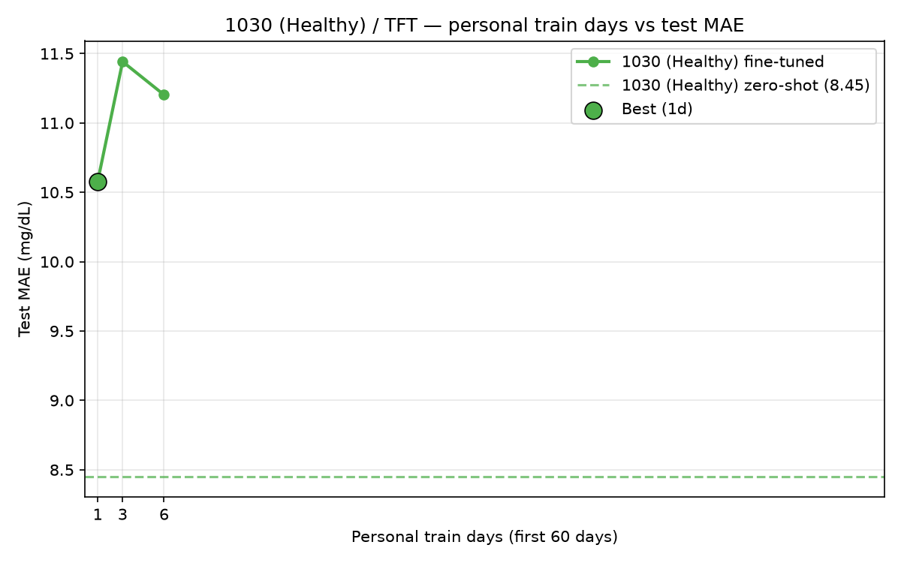


#### 1043 (Healthy)

| Days | Used train days | ZS MAE | FT MAE | Δ FT vs ZS |
|------|-----------------|--------|--------|------------|
| 1 | 1.0 | 10.97 | 21.90 | 10.93 |
| 3 | 3.0 | 10.97 | 15.26 | 4.29 |
| all (6d) | 6.3 | 10.97 | 16.27 | 5.30 |

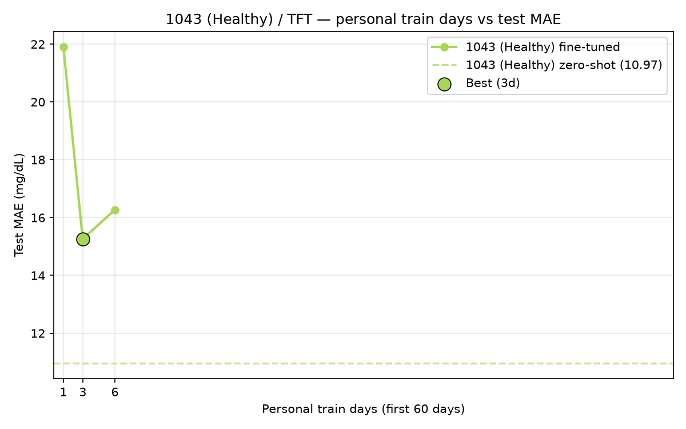


#### 1034 (Pre-T2DM)

| Days | Used train days | ZS MAE | FT MAE | Δ FT vs ZS |
|------|-----------------|--------|--------|------------|
| 1 | 1.0 | 8.78 | 16.04 | 7.26 |
| 3 | 3.0 | 8.78 | 13.27 | 4.49 |
| all (6d) | 6.3 | 8.78 | 10.75 | 1.96 |

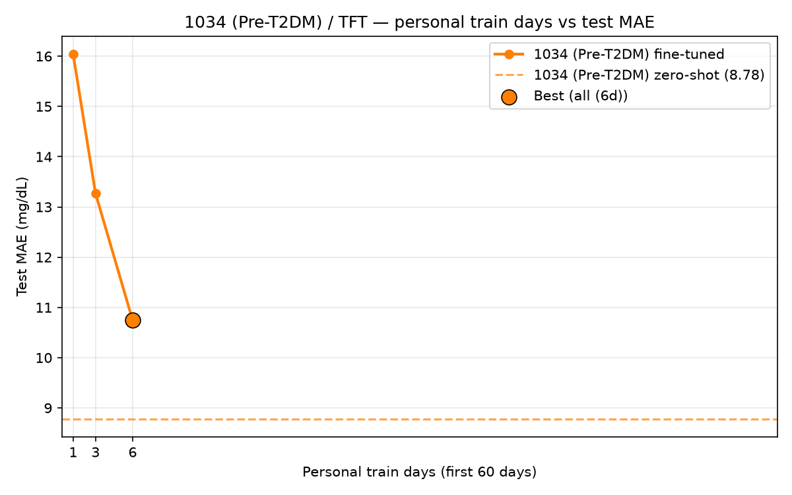


#### 1049 (Pre-T2DM)

| Days | Used train days | ZS MAE | FT MAE | Δ FT vs ZS |
|------|-----------------|--------|--------|------------|
| 1 | 1.0 | 10.57 | 22.16 | 11.60 |
| 3 | 3.0 | 10.57 | 13.61 | 3.04 |
| all (6d) | 6.3 | 10.57 | 11.58 | 1.01 |

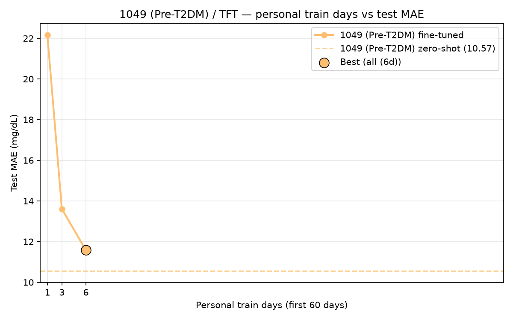


#### 1019 (Oral-T2DM)

| Days | Used train days | ZS MAE | FT MAE | Δ FT vs ZS |
|------|-----------------|--------|--------|------------|
| 1 | 1.0 | 12.11 | 19.68 | 7.58 |
| 3 | 3.0 | 12.11 | 20.40 | 8.29 |
| all (6d) | 6.3 | 12.11 | 17.34 | 5.23 |

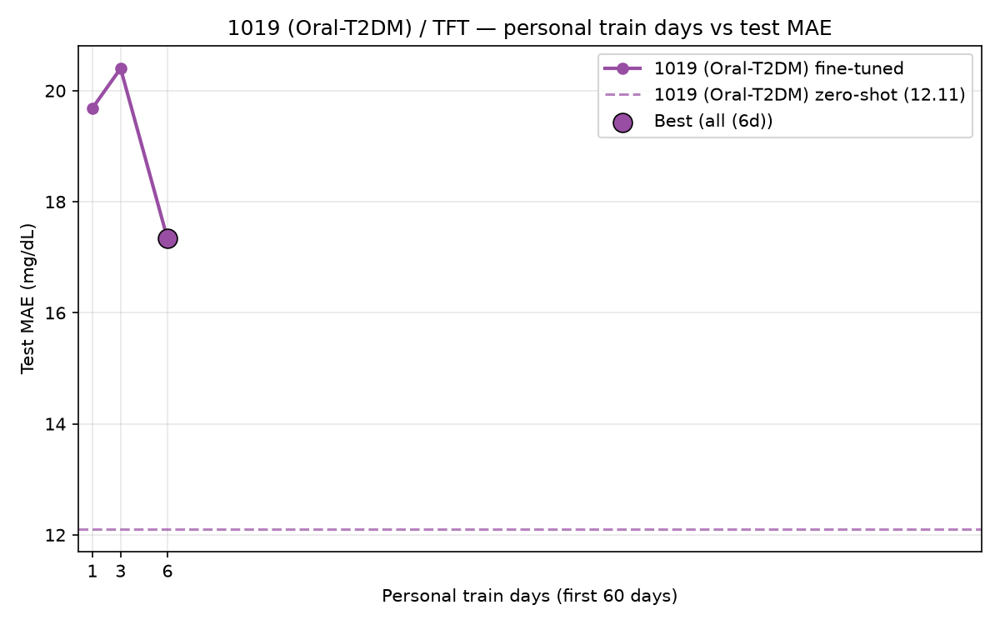


#### 1127 (Oral-T2DM)

| Days | Used train days | ZS MAE | FT MAE | Δ FT vs ZS |
|------|-----------------|--------|--------|------------|
| 1 | 1.0 | 17.92 | 20.32 | 2.40 |
| 3 | 3.0 | 17.92 | 22.12 | 4.21 |
| all (6d) | 6.3 | 17.92 | 22.33 | 4.41 |

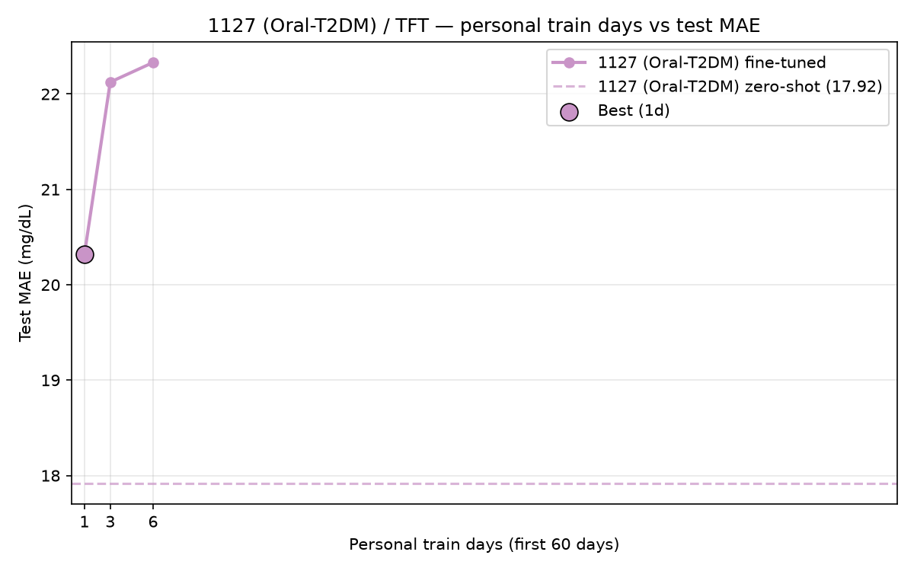


#### 1413 (Insulin-T2DM)

| Days | Used train days | ZS MAE | FT MAE | Δ FT vs ZS |
|------|-----------------|--------|--------|------------|
| 1 | 1.0 | 17.39 | 25.24 | 7.85 |
| 3 | 2.6 | 17.39 | 22.80 | 5.41 |
| 7 | 7.0 | 17.39 | 19.02 | 1.63 |
| all (9d) | 9.1 | 17.39 | 16.90 | -0.49 |

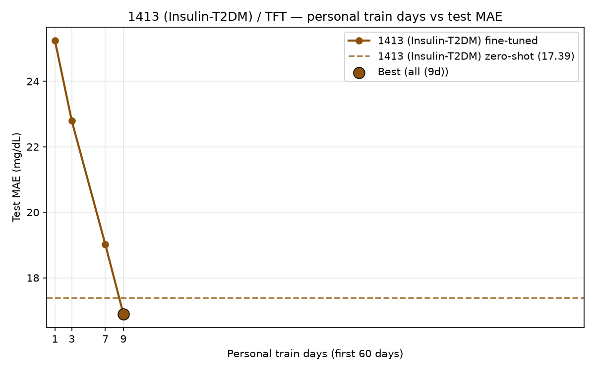


#### 1036 (Insulin-T2DM)

| Days | Used train days | ZS MAE | FT MAE | Δ FT vs ZS |
|------|-----------------|--------|--------|------------|
| 1 | 1.0 | 19.31 | 31.73 | 12.41 |
| 3 | 3.0 | 19.31 | 25.82 | 6.51 |
| all (6d) | 6.3 | 19.31 | 21.50 | 2.18 |

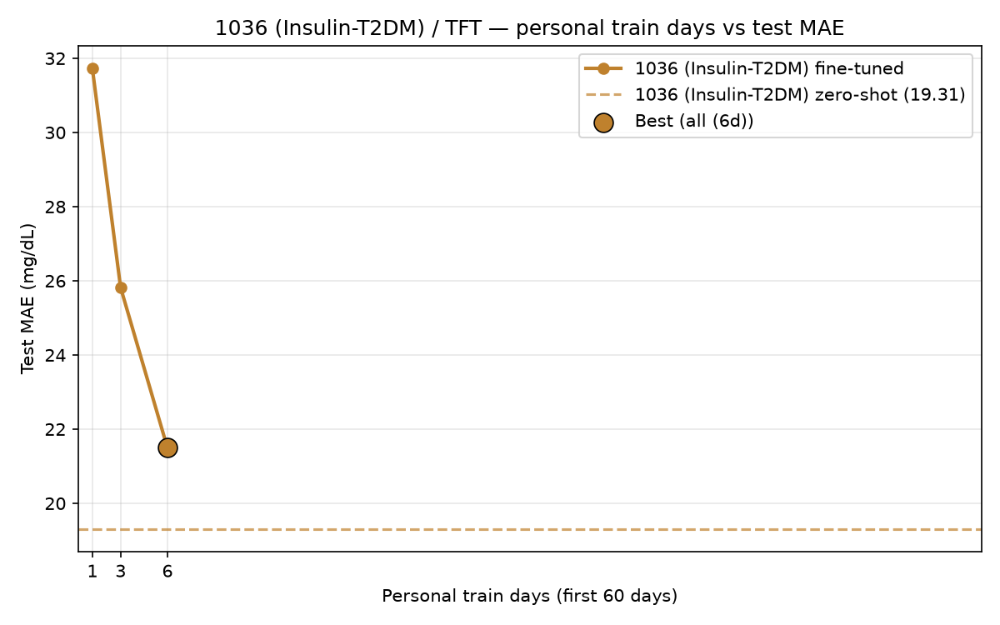


## TiDE

Global holdout run: `data/output/runs/nf_holdout/__ALL__/TiDE_20260811T160931Z`. Joined2 val MAE **15.90** (RMSE 23.10, MARD 11.41%); test MAE **16.12** (RMSE 24.01, MARD 11.07%). Population-model numbers, not the personal chronological test below.

### Full train, continue-fit from global weights

| Subject | Cohort | Study group | Train span (d) | ZS MAE | FT MAE (all) | Δ vs ZS |
|---------|--------|-------------|----------------|--------|--------------|---------|
| Subject P1 | Subject P1 | T1DM | 344.6 | 33.28 | 24.45 | -8.83 |
| User 154 | Loop holdout | T1DM | 213.6 | 39.19 | 31.97 | -7.22 |
| User 556 | Loop holdout | T1DM | 90.9 | 31.32 | 24.60 | -6.72 |
| User 730 | Loop holdout | T1DM | 84.6 | 29.23 | 22.98 | -6.25 |
| User 1017 | Loop holdout | T1DM | 96.7 | 31.13 | 24.48 | -6.65 |
| User 1029 | Loop holdout | T1DM | 136.0 | 38.99 | 29.87 | -9.12 |
| User 1082 | Loop holdout | T1DM | 37.4 | 28.54 | 22.64 | -5.90 |
| 1030 (Healthy) | joined2 test | Healthy | 6.3 | 9.86 | 9.18 | -0.68 |
| 1043 (Healthy) | joined2 test | Healthy | 6.3 | 14.76 | 13.58 | -1.18 |
| 1034 (Pre-T2DM) | joined2 test | Pre-T2DM | 6.3 | 12.75 | 11.28 | -1.47 |
| 1049 (Pre-T2DM) | joined2 test | Pre-T2DM | 6.3 | 14.08 | 12.53 | -1.55 |
| 1019 (Oral-T2DM) | joined2 test | Oral-T2DM | 6.3 | 14.43 | 13.81 | -0.62 |
| 1127 (Oral-T2DM) | joined2 test | Oral-T2DM | 6.3 | 24.11 | 19.36 | -4.75 |
| 1413 (Insulin-T2DM) | joined2 test | Insulin-T2DM | 9.1 | 21.05 | 15.38 | -5.67 |
| 1036 (Insulin-T2DM) | joined2 test | Insulin-T2DM | 6.3 | 26.37 | 20.04 | -6.33 |

### Subject P1 and Loop quality holdouts

#### Subject P1

| Days | Used train days | ZS MAE | FT MAE | Δ FT vs ZS |
|------|-----------------|--------|--------|------------|
| 1 | 1.0 | 33.28 | 55.95 | 22.67 |
| 3 | 3.0 | 33.28 | 27.92 | -5.36 |
| 7 | 7.0 | 33.28 | 25.31 | -7.98 |
| 14 | 14.0 | 33.28 | 25.30 | -7.99 |
| 30 | 30.0 | 33.28 | 25.64 | -7.64 |
| 60 | 60.0 | 33.28 | 24.88 | -8.41 |
| all (345d) | 344.6 | 33.28 | 24.45 | -8.83 |


#### User 154

| Days | Used train days | ZS MAE | FT MAE | Δ FT vs ZS |
|------|-----------------|--------|--------|------------|
| 1 | 1.0 | 39.19 | 55.78 | 16.59 |
| 3 | 2.9 | 39.19 | 35.57 | -3.63 |
| 7 | 2.9 | 39.19 | 35.57 | -3.63 |
| 14 | 2.9 | 39.19 | 35.57 | -3.63 |
| 30 | 30.0 | 39.19 | 32.50 | -6.70 |
| 60 | 60.0 | 39.19 | 32.48 | -6.71 |
| all (214d) | 213.6 | 39.19 | 31.97 | -7.22 |

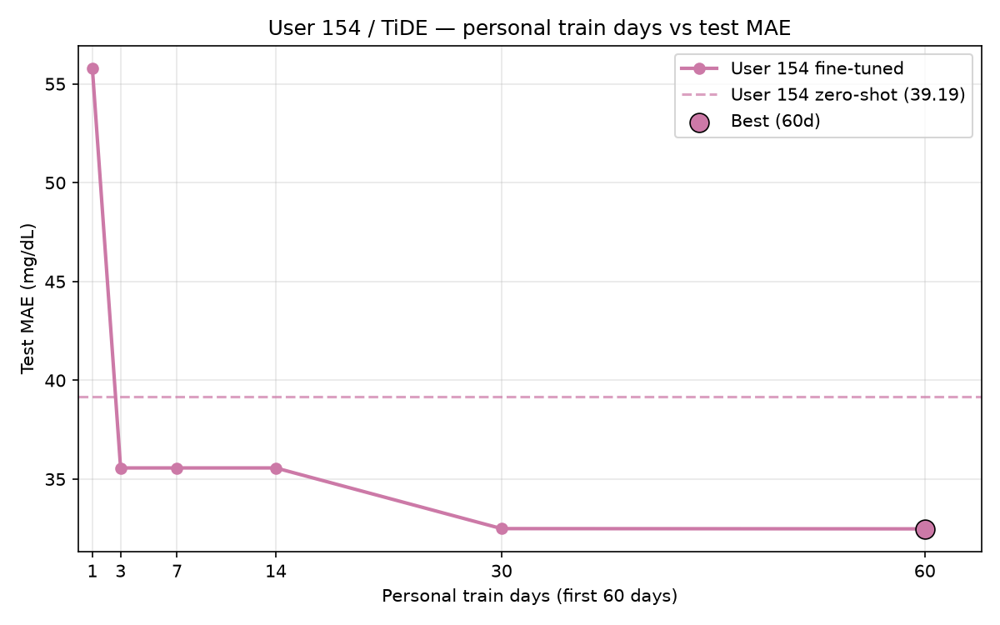


#### User 556

| Days | Used train days | ZS MAE | FT MAE | Δ FT vs ZS |
|------|-----------------|--------|--------|------------|
| 1 | 1.0 | 31.32 | 41.10 | 9.78 |
| 3 | 3.0 | 31.32 | 26.51 | -4.81 |
| 7 | 7.0 | 31.32 | 24.99 | -6.33 |
| 14 | 14.0 | 31.32 | 24.62 | -6.70 |
| 30 | 30.0 | 31.32 | 24.49 | -6.83 |
| 60 | 60.0 | 31.32 | 24.85 | -6.47 |
| all (91d) | 90.9 | 31.32 | 24.60 | -6.72 |

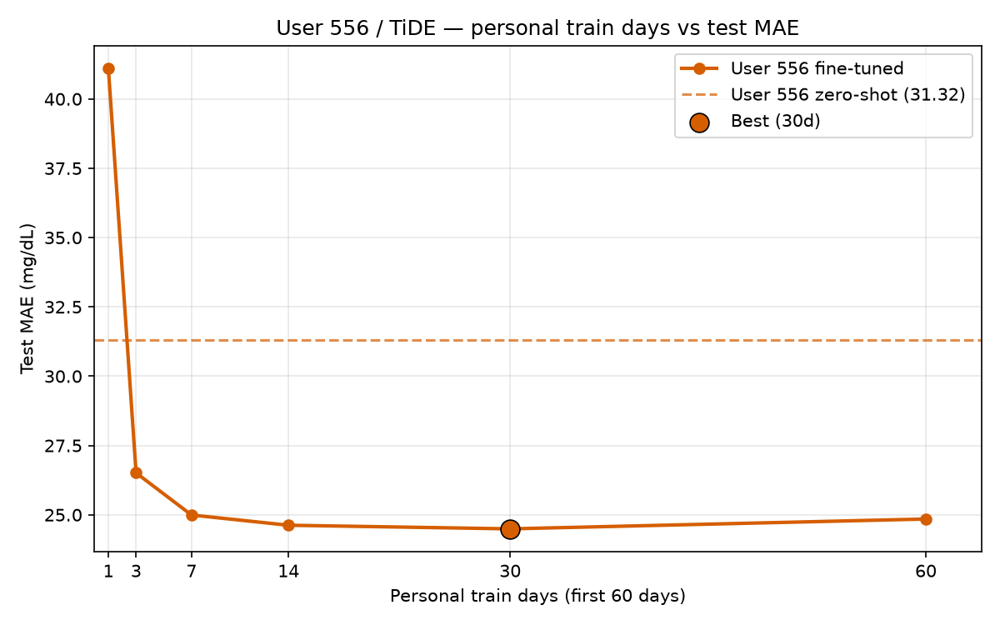


#### User 730

| Days | Used train days | ZS MAE | FT MAE | Δ FT vs ZS |
|------|-----------------|--------|--------|------------|
| 1 | 1.0 | 29.23 | 48.92 | 19.69 |
| 3 | 3.0 | 29.23 | 24.84 | -4.39 |
| 7 | 7.0 | 29.23 | 24.50 | -4.73 |
| 14 | 14.0 | 29.23 | 23.60 | -5.63 |
| 30 | 30.0 | 29.23 | 23.17 | -6.06 |
| 60 | 60.0 | 29.23 | 23.18 | -6.05 |
| all (85d) | 84.6 | 29.23 | 22.98 | -6.25 |

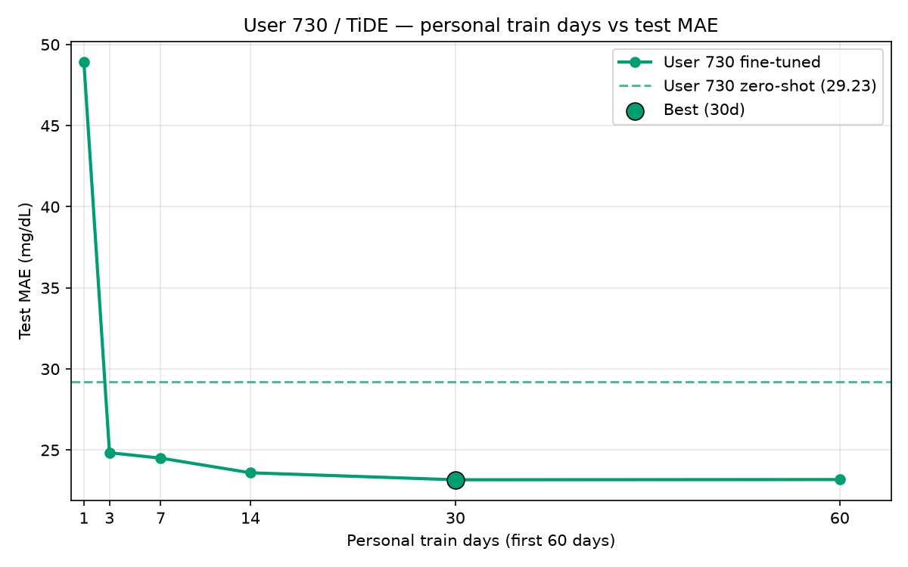


#### User 1017

| Days | Used train days | ZS MAE | FT MAE | Δ FT vs ZS |
|------|-----------------|--------|--------|------------|
| 1 | 1.0 | 31.13 | 72.85 | 41.72 |
| 3 | 3.0 | 31.13 | 26.49 | -4.64 |
| 7 | 6.5 | 31.13 | 26.99 | -4.14 |
| 14 | 14.0 | 31.13 | 25.65 | -5.48 |
| 30 | 30.0 | 31.13 | 24.84 | -6.29 |
| 60 | 60.0 | 31.13 | 24.62 | -6.51 |
| all (97d) | 96.7 | 31.13 | 24.48 | -6.65 |

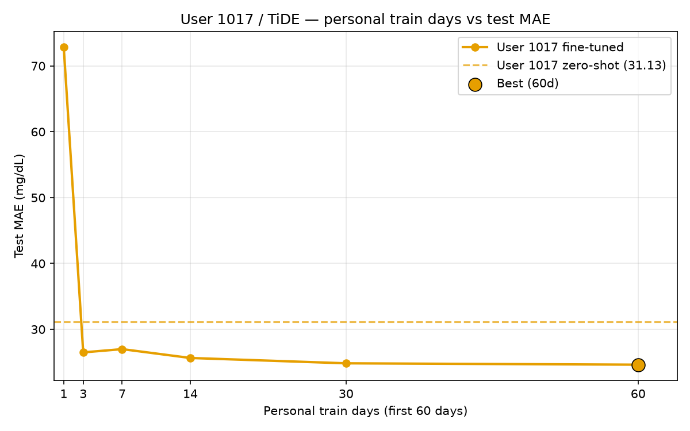


#### User 1029

| Days | Used train days | ZS MAE | FT MAE | Δ FT vs ZS |
|------|-----------------|--------|--------|------------|
| 1 | 1.0 | 38.99 | 61.99 | 23.00 |
| 3 | 3.0 | 38.99 | 34.66 | -4.33 |
| 7 | 6.3 | 38.99 | 33.13 | -5.86 |
| 14 | 14.0 | 38.99 | 30.50 | -8.49 |
| 30 | 30.0 | 38.99 | 30.45 | -8.54 |
| 60 | 59.9 | 38.99 | 30.09 | -8.90 |
| all (136d) | 136.0 | 38.99 | 29.87 | -9.12 |

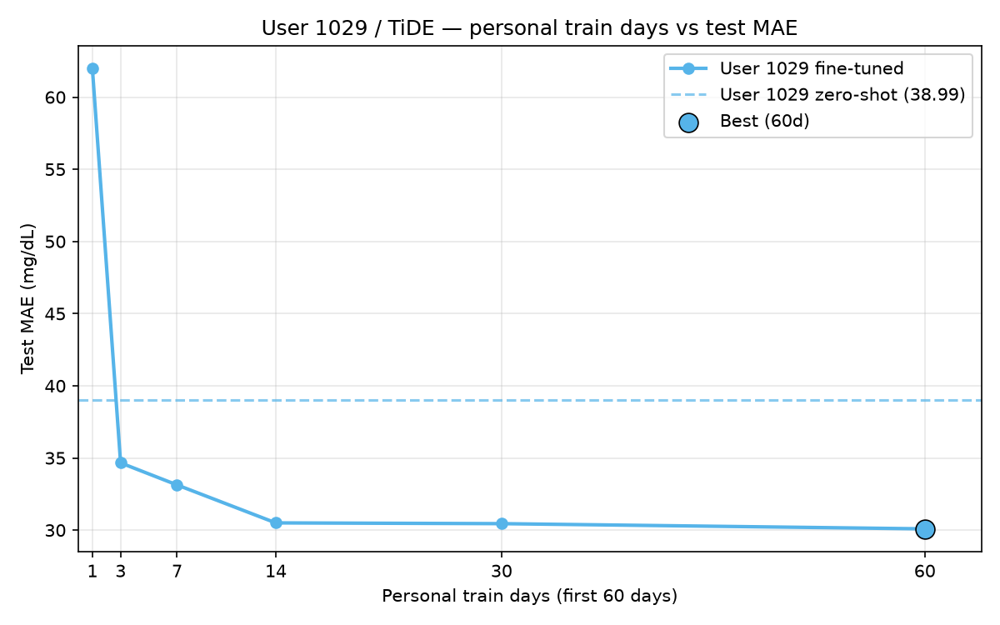


#### User 1082

| Days | Used train days | ZS MAE | FT MAE | Δ FT vs ZS |
|------|-----------------|--------|--------|------------|
| 1 | 1.0 | 28.54 | 47.07 | 18.53 |
| 3 | 3.0 | 28.54 | 31.73 | 3.19 |
| 7 | 7.0 | 28.54 | 21.99 | -6.55 |
| 14 | 14.0 | 28.54 | 22.09 | -6.45 |
| 30 | 29.6 | 28.54 | 22.60 | -5.94 |
| all (37d) | 37.4 | 28.54 | 22.64 | -5.90 |

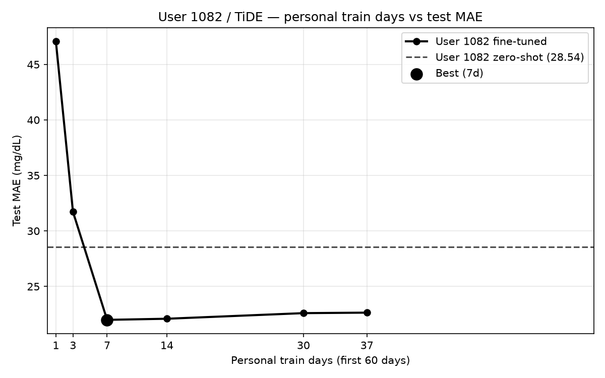


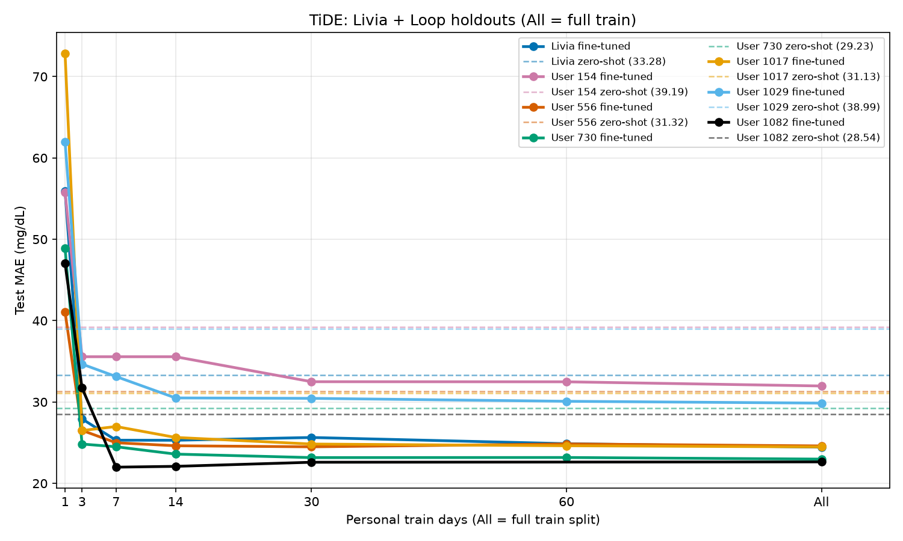

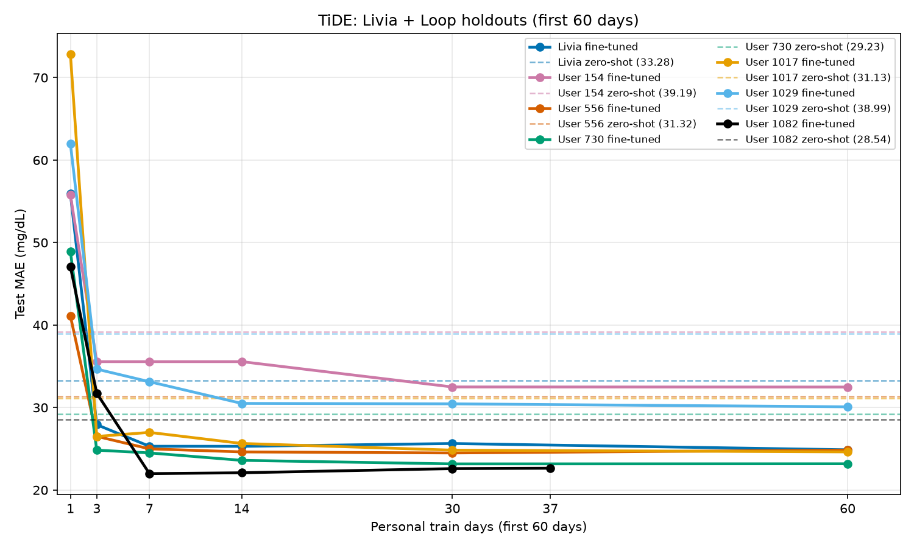

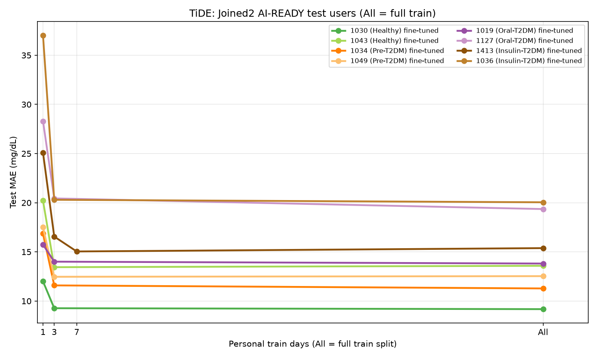


### Average MAE improvement by train budget

Mean test-MAE reduction versus zero-shot on T1DM users with at least 60 train days (Subject P1 + Loop holdouts except User 1082 when the budget exceeds their span). Negative Δ is better than frozen global.

| Train budget | Mean Δ vs ZS | Mean MAE improvement | n |
|--------------|--------------|----------------------|---|
| 30 days | -7.01 | 7.01 | 6 |
| 60 days | -7.17 | 7.17 | 6 |
| Full train (≥60 d) | -7.47 | 7.47 | 6 |

### Joined2 test — two users per study group

#### 1030 (Healthy)

| Days | Used train days | ZS MAE | FT MAE | Δ FT vs ZS |
|------|-----------------|--------|--------|------------|
| 1 | 1.0 | 9.86 | 12.00 | 2.14 |
| 3 | 3.0 | 9.86 | 9.27 | -0.59 |
| all (6d) | 6.3 | 9.86 | 9.18 | -0.68 |

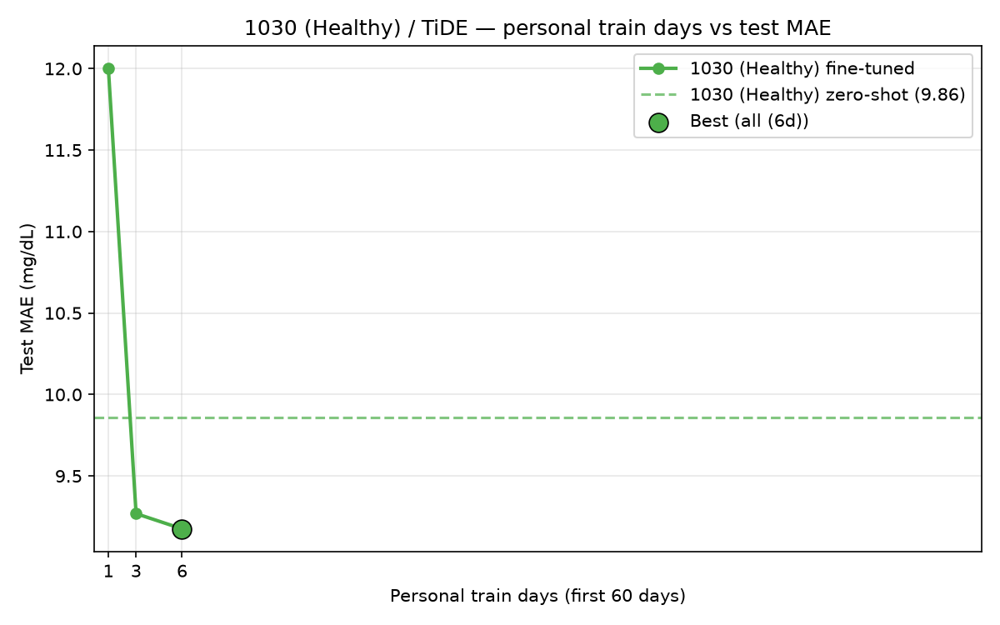


#### 1043 (Healthy)

| Days | Used train days | ZS MAE | FT MAE | Δ FT vs ZS |
|------|-----------------|--------|--------|------------|
| 1 | 1.0 | 14.76 | 20.21 | 5.45 |
| 3 | 3.0 | 14.76 | 13.44 | -1.32 |
| all (6d) | 6.3 | 14.76 | 13.58 | -1.18 |

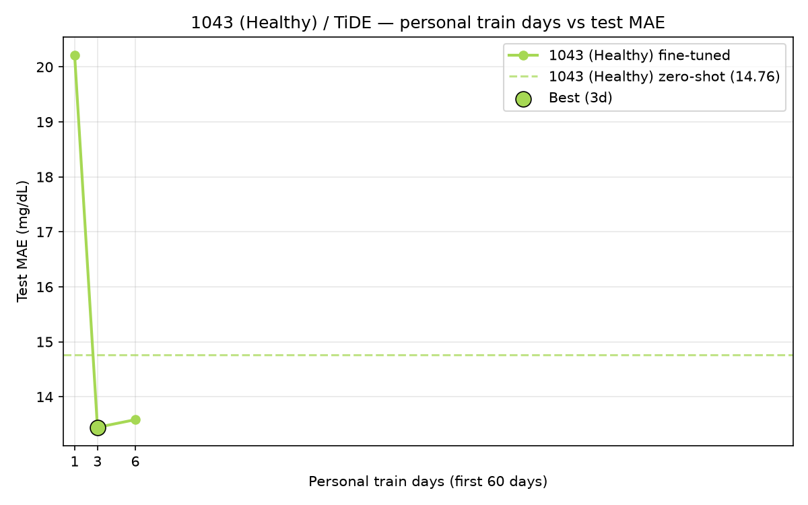


#### 1034 (Pre-T2DM)

| Days | Used train days | ZS MAE | FT MAE | Δ FT vs ZS |
|------|-----------------|--------|--------|------------|
| 1 | 1.0 | 12.75 | 16.86 | 4.11 |
| 3 | 3.0 | 12.75 | 11.59 | -1.16 |
| all (6d) | 6.3 | 12.75 | 11.28 | -1.47 |

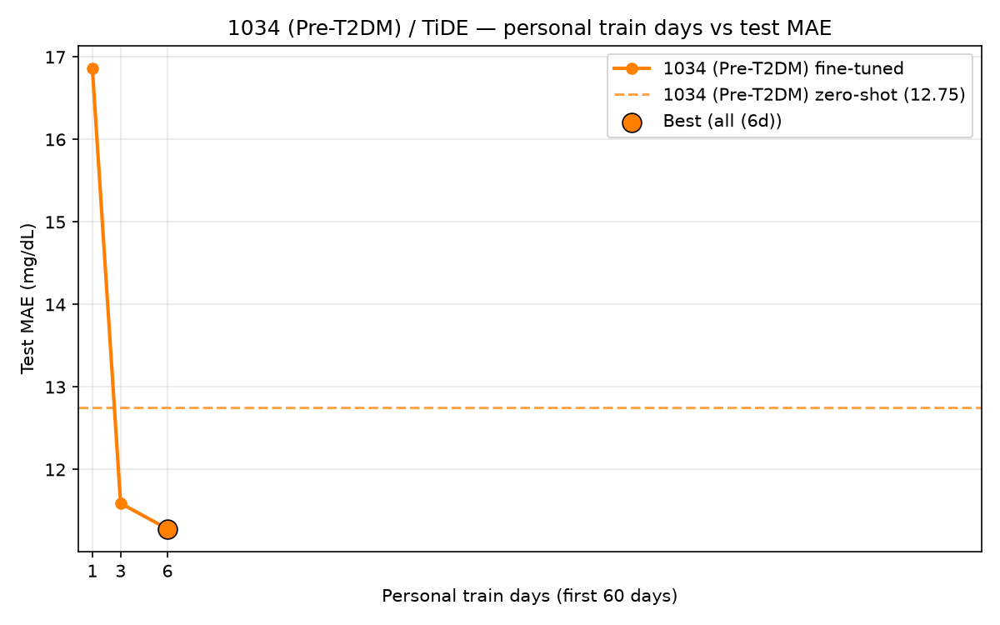


#### 1049 (Pre-T2DM)

| Days | Used train days | ZS MAE | FT MAE | Δ FT vs ZS |
|------|-----------------|--------|--------|------------|
| 1 | 1.0 | 14.08 | 17.52 | 3.44 |
| 3 | 3.0 | 14.08 | 12.47 | -1.61 |
| all (6d) | 6.3 | 14.08 | 12.53 | -1.55 |

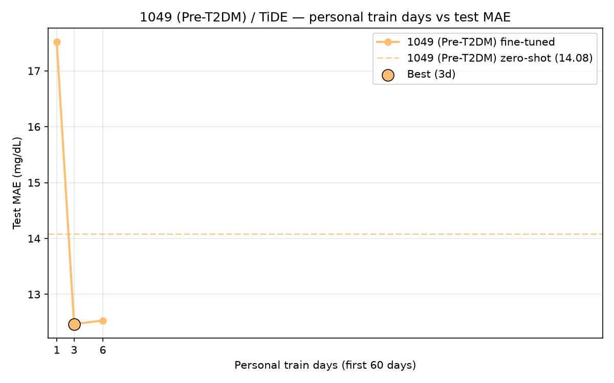


#### 1019 (Oral-T2DM)

| Days | Used train days | ZS MAE | FT MAE | Δ FT vs ZS |
|------|-----------------|--------|--------|------------|
| 1 | 1.0 | 14.43 | 15.74 | 1.30 |
| 3 | 3.0 | 14.43 | 14.00 | -0.43 |
| all (6d) | 6.3 | 14.43 | 13.81 | -0.62 |

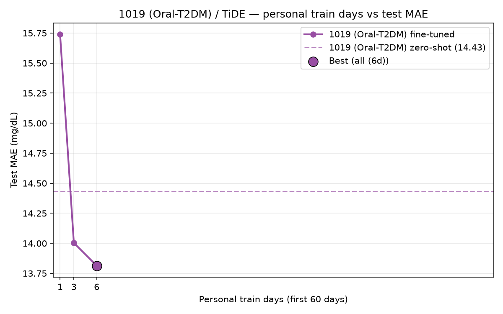


#### 1127 (Oral-T2DM)

| Days | Used train days | ZS MAE | FT MAE | Δ FT vs ZS |
|------|-----------------|--------|--------|------------|
| 1 | 1.0 | 24.11 | 28.30 | 4.19 |
| 3 | 3.0 | 24.11 | 20.44 | -3.67 |
| all (6d) | 6.3 | 24.11 | 19.36 | -4.75 |

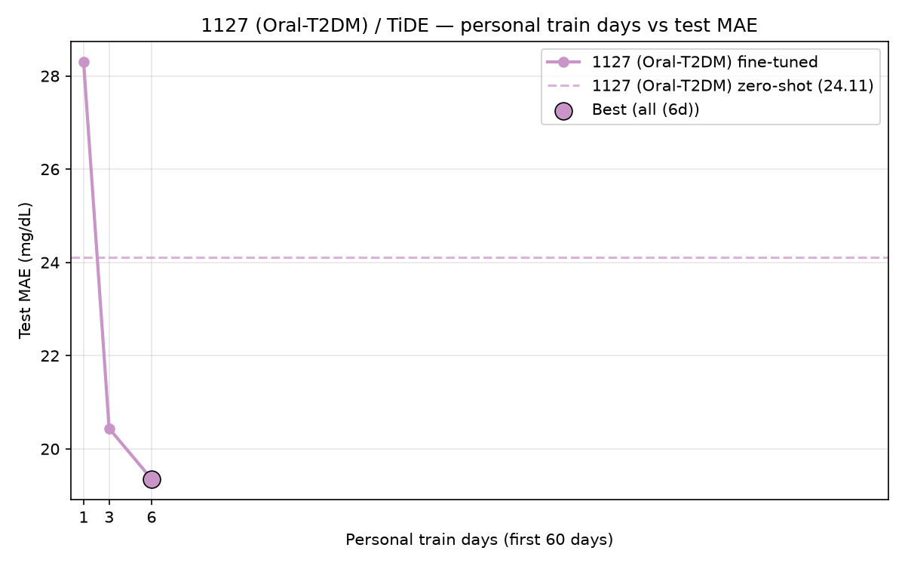


#### 1413 (Insulin-T2DM)

| Days | Used train days | ZS MAE | FT MAE | Δ FT vs ZS |
|------|-----------------|--------|--------|------------|
| 1 | 1.0 | 21.05 | 25.10 | 4.05 |
| 3 | 2.6 | 21.05 | 16.56 | -4.49 |
| 7 | 7.0 | 21.05 | 15.04 | -6.01 |
| all (9d) | 9.1 | 21.05 | 15.38 | -5.67 |

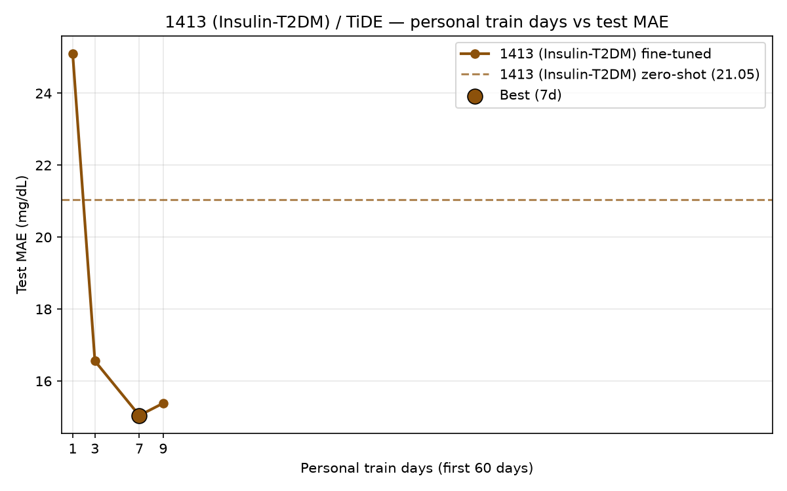


#### 1036 (Insulin-T2DM)

| Days | Used train days | ZS MAE | FT MAE | Δ FT vs ZS |
|------|-----------------|--------|--------|------------|
| 1 | 1.0 | 26.37 | 37.02 | 10.65 |
| 3 | 3.0 | 26.37 | 20.30 | -6.08 |
| all (6d) | 6.3 | 26.37 | 20.04 | -6.33 |

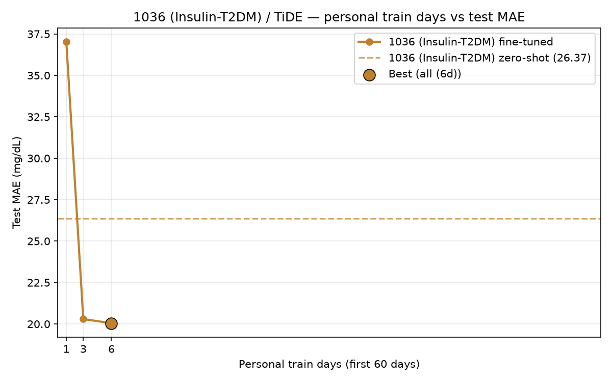


## LSTM

Global holdout run: `data/output/runs/nf_holdout/__ALL__/LSTM_20260811T160617Z`. Joined2 val MAE **16.80** (RMSE 24.82, MARD 11.74%); test MAE **17.37** (RMSE 26.30, MARD 11.57%). Population-model numbers, not the personal chronological test below.

### Full train, continue-fit from global weights

| Subject | Cohort | Study group | Train span (d) | ZS MAE | FT MAE (all) | Δ vs ZS |
|---------|--------|-------------|----------------|--------|--------------|---------|
| Subject P1 | Subject P1 | T1DM | 344.6 | 36.09 | 30.52 | -5.57 |
| User 154 | Loop holdout | T1DM | 213.6 | 43.16 | 42.40 | -0.76 |
| User 556 | Loop holdout | T1DM | 90.9 | 33.21 | 30.73 | -2.48 |
| User 730 | Loop holdout | T1DM | 84.6 | 33.10 | 31.45 | -1.65 |
| User 1017 | Loop holdout | T1DM | 96.7 | 33.22 | 30.83 | -2.39 |
| User 1029 | Loop holdout | T1DM | 136.0 | 42.40 | 36.88 | -5.51 |
| User 1082 | Loop holdout | T1DM | 37.4 | 31.46 | 35.20 | 3.74 |
| 1030 (Healthy) | joined2 test | Healthy | 6.3 | 10.22 | 14.28 | 4.06 |
| 1043 (Healthy) | joined2 test | Healthy | 6.3 | 15.62 | 16.80 | 1.18 |
| 1034 (Pre-T2DM) | joined2 test | Pre-T2DM | 6.3 | 12.92 | 21.17 | 8.25 |
| 1049 (Pre-T2DM) | joined2 test | Pre-T2DM | 6.3 | 14.96 | 18.34 | 3.38 |
| 1019 (Oral-T2DM) | joined2 test | Oral-T2DM | 6.3 | 15.11 | 20.58 | 5.47 |
| 1127 (Oral-T2DM) | joined2 test | Oral-T2DM | 6.3 | 25.40 | 31.28 | 5.87 |
| 1413 (Insulin-T2DM) | joined2 test | Insulin-T2DM | 9.1 | 23.25 | 28.03 | 4.78 |
| 1036 (Insulin-T2DM) | joined2 test | Insulin-T2DM | 6.3 | 28.51 | 40.93 | 12.42 |

### Subject P1 and Loop quality holdouts

#### Subject P1

| Days | Used train days | ZS MAE | FT MAE | Δ FT vs ZS |
|------|-----------------|--------|--------|------------|
| 1 | 1.0 | 36.09 | 51.97 | 15.87 |
| 3 | 3.0 | 36.09 | 40.33 | 4.23 |
| 7 | 7.0 | 36.09 | 43.81 | 7.72 |
| 14 | 14.0 | 36.09 | 43.12 | 7.02 |
| 30 | 30.0 | 36.09 | 36.50 | 0.41 |
| 60 | 60.0 | 36.09 | 33.48 | -2.61 |
| all (345d) | 344.6 | 36.09 | 30.52 | -5.57 |


#### User 154

| Days | Used train days | ZS MAE | FT MAE | Δ FT vs ZS |
|------|-----------------|--------|--------|------------|
| 1 | 1.0 | 43.16 | 63.30 | 20.14 |
| 3 | 2.9 | 43.16 | 54.94 | 11.78 |
| 7 | 2.9 | 43.16 | 54.94 | 11.78 |
| 14 | 2.9 | 43.16 | 54.94 | 11.78 |
| 30 | 30.0 | 43.16 | 61.26 | 18.10 |
| 60 | 60.0 | 43.16 | 53.44 | 10.28 |
| all (214d) | 213.6 | 43.16 | 42.40 | -0.76 |

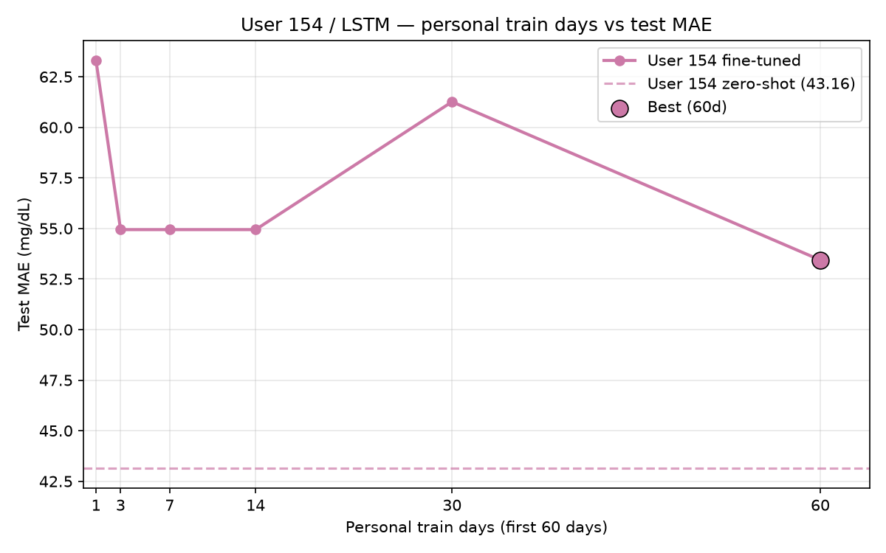


#### User 556

| Days | Used train days | ZS MAE | FT MAE | Δ FT vs ZS |
|------|-----------------|--------|--------|------------|
| 1 | 1.0 | 33.21 | 47.52 | 14.32 |
| 3 | 3.0 | 33.21 | 42.88 | 9.68 |
| 7 | 7.0 | 33.21 | 43.88 | 10.67 |
| 14 | 14.0 | 33.21 | 47.26 | 14.05 |
| 30 | 30.0 | 33.21 | 37.22 | 4.02 |
| 60 | 60.0 | 33.21 | 31.19 | -2.01 |
| all (91d) | 90.9 | 33.21 | 30.73 | -2.48 |

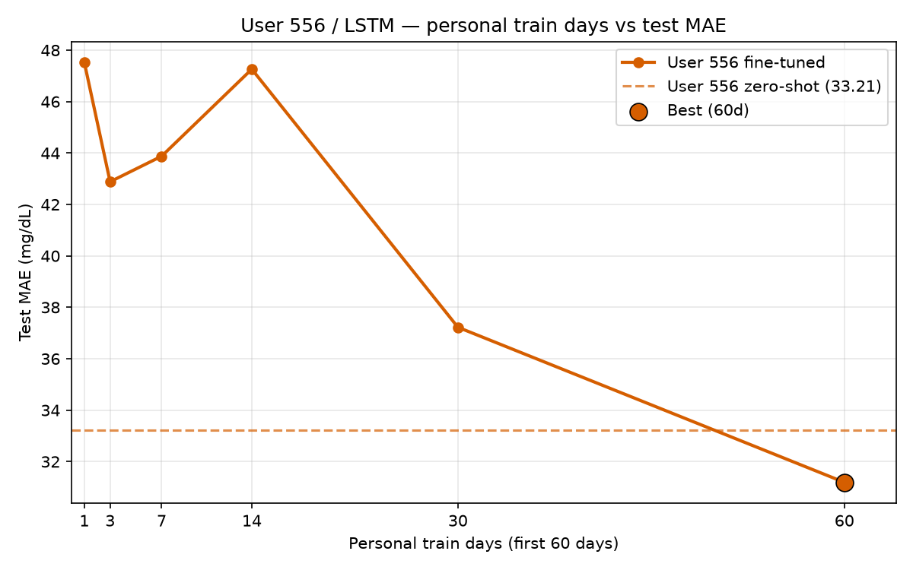


#### User 730

| Days | Used train days | ZS MAE | FT MAE | Δ FT vs ZS |
|------|-----------------|--------|--------|------------|
| 1 | 1.0 | 33.10 | 49.45 | 16.35 |
| 3 | 3.0 | 33.10 | 38.95 | 5.86 |
| 7 | 7.0 | 33.10 | 43.71 | 10.62 |
| 14 | 14.0 | 33.10 | 45.31 | 12.21 |
| 30 | 30.0 | 33.10 | 36.08 | 2.98 |
| 60 | 60.0 | 33.10 | 31.79 | -1.31 |
| all (85d) | 84.6 | 33.10 | 31.45 | -1.65 |

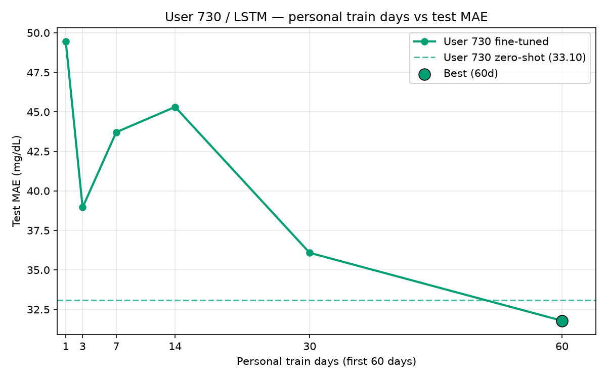


#### User 1017

| Days | Used train days | ZS MAE | FT MAE | Δ FT vs ZS |
|------|-----------------|--------|--------|------------|
| 1 | 1.0 | 33.22 | 79.10 | 45.88 |
| 3 | 3.0 | 33.22 | 53.94 | 20.71 |
| 7 | 6.5 | 33.22 | 50.46 | 17.24 |
| 14 | 14.0 | 33.22 | 44.45 | 11.23 |
| 30 | 30.0 | 33.22 | 39.88 | 6.65 |
| 60 | 60.0 | 33.22 | 31.88 | -1.35 |
| all (97d) | 96.7 | 33.22 | 30.83 | -2.39 |

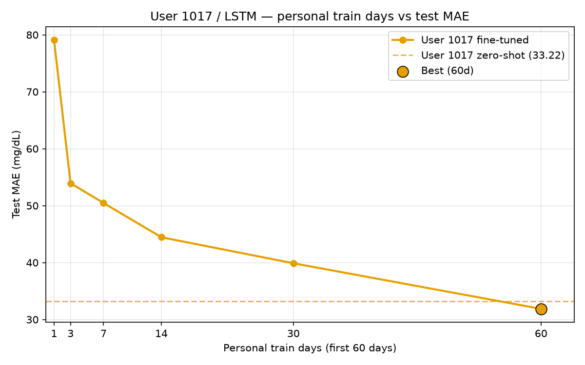


#### User 1029

| Days | Used train days | ZS MAE | FT MAE | Δ FT vs ZS |
|------|-----------------|--------|--------|------------|
| 1 | 1.0 | 42.40 | 59.56 | 17.16 |
| 3 | 3.0 | 42.40 | 53.74 | 11.34 |
| 7 | 6.3 | 42.40 | 51.60 | 9.20 |
| 14 | 14.0 | 42.40 | 48.83 | 6.43 |
| 30 | 30.0 | 42.40 | 46.22 | 3.82 |
| 60 | 59.9 | 42.40 | 40.17 | -2.23 |
| all (136d) | 136.0 | 42.40 | 36.88 | -5.51 |

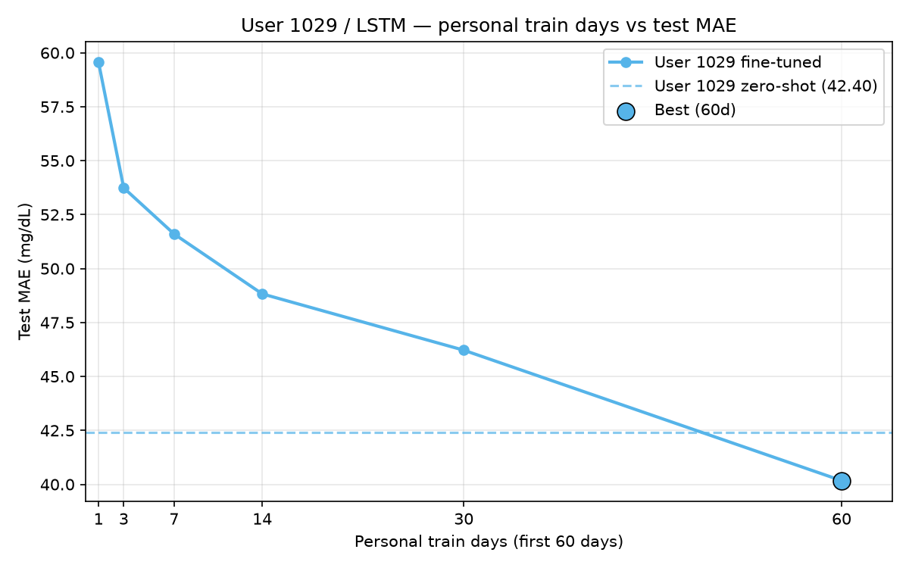


#### User 1082

| Days | Used train days | ZS MAE | FT MAE | Δ FT vs ZS |
|------|-----------------|--------|--------|------------|
| 1 | 1.0 | 31.46 | 54.58 | 23.12 |
| 3 | 3.0 | 31.46 | 77.86 | 46.40 |
| 7 | 7.0 | 31.46 | 49.83 | 18.37 |
| 14 | 14.0 | 31.46 | 40.85 | 9.39 |
| 30 | 29.6 | 31.46 | 35.81 | 4.35 |
| all (37d) | 37.4 | 31.46 | 35.20 | 3.74 |

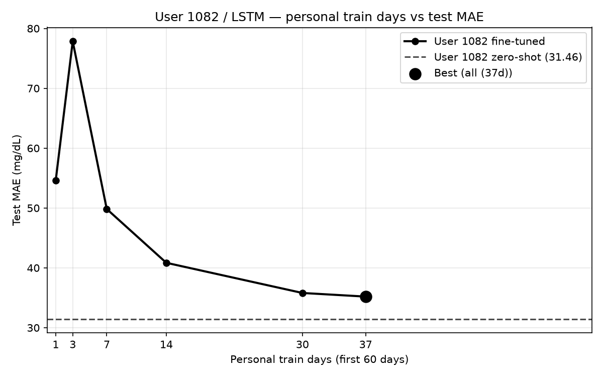


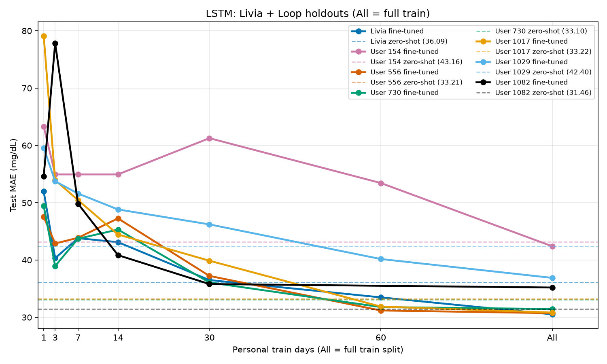

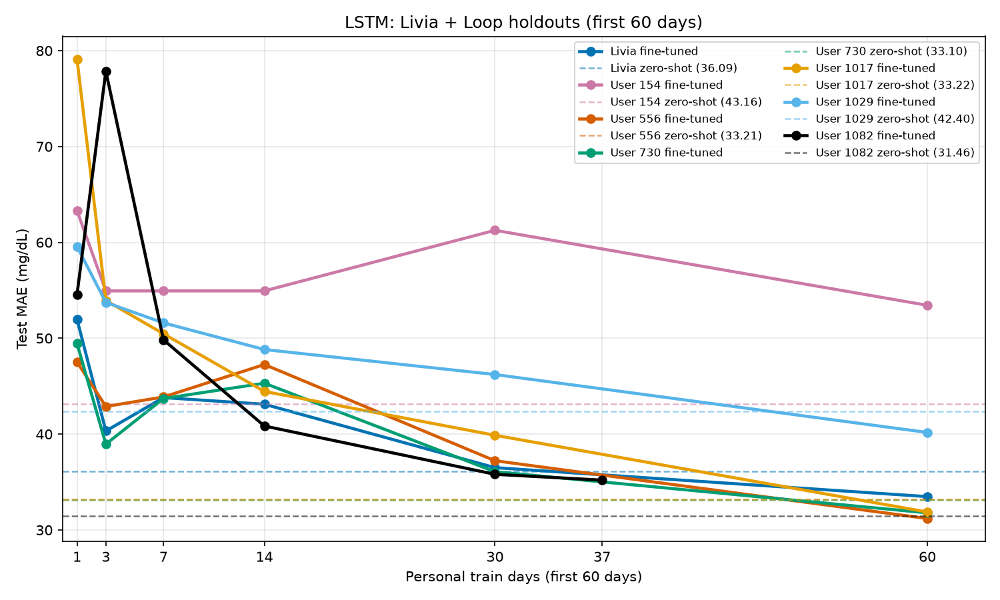

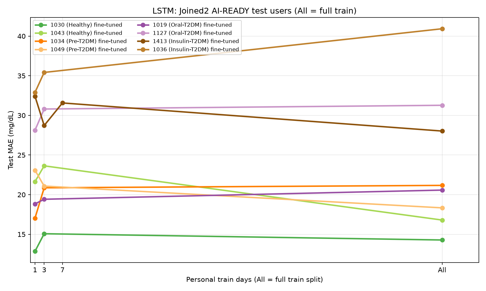


### Average MAE improvement by train budget

Mean test-MAE reduction versus zero-shot on T1DM users with at least 60 train days (Subject P1 + Loop holdouts except User 1082 when the budget exceeds their span). Negative Δ is better than frozen global.

| Train budget | Mean Δ vs ZS | Mean MAE improvement | n |
|--------------|--------------|----------------------|---|
| 30 days | 6.00 | -6.00 | 6 |
| 60 days | 0.13 | -0.13 | 6 |
| Full train (≥60 d) | -3.06 | 3.06 | 6 |

### Joined2 test — two users per study group

#### 1030 (Healthy)

| Days | Used train days | ZS MAE | FT MAE | Δ FT vs ZS |
|------|-----------------|--------|--------|------------|
| 1 | 1.0 | 10.22 | 12.86 | 2.64 |
| 3 | 3.0 | 10.22 | 15.07 | 4.85 |
| all (6d) | 6.3 | 10.22 | 14.28 | 4.06 |

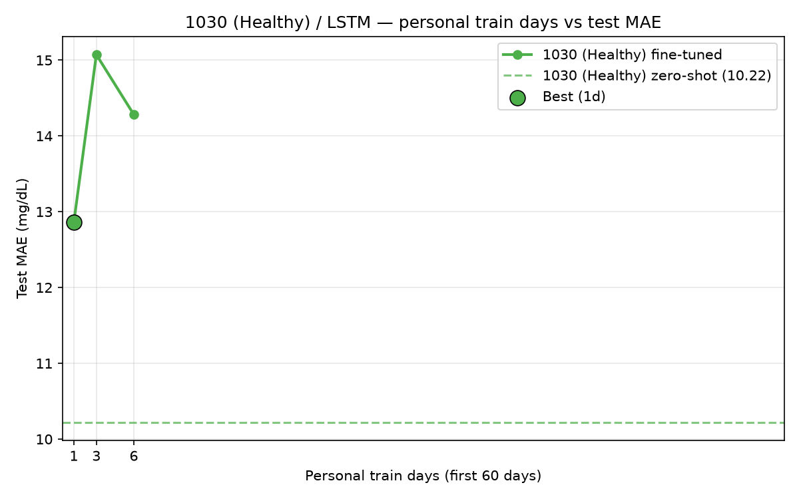


#### 1043 (Healthy)

| Days | Used train days | ZS MAE | FT MAE | Δ FT vs ZS |
|------|-----------------|--------|--------|------------|
| 1 | 1.0 | 15.62 | 21.64 | 6.02 |
| 3 | 3.0 | 15.62 | 23.64 | 8.02 |
| all (6d) | 6.3 | 15.62 | 16.80 | 1.18 |

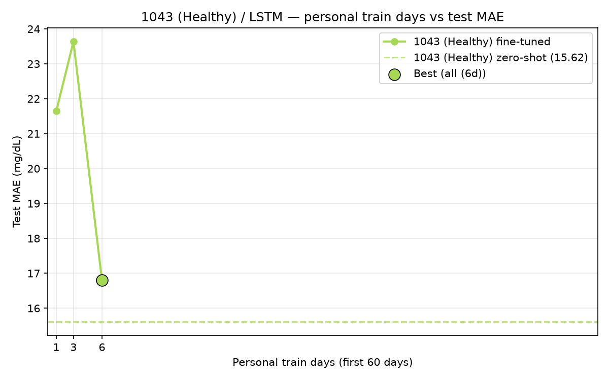


#### 1034 (Pre-T2DM)

| Days | Used train days | ZS MAE | FT MAE | Δ FT vs ZS |
|------|-----------------|--------|--------|------------|
| 1 | 1.0 | 12.92 | 17.04 | 4.12 |
| 3 | 3.0 | 12.92 | 20.87 | 7.95 |
| all (6d) | 6.3 | 12.92 | 21.17 | 8.25 |

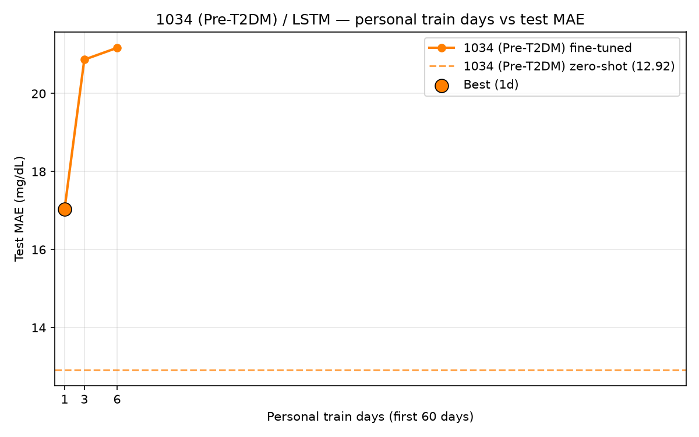


#### 1049 (Pre-T2DM)

| Days | Used train days | ZS MAE | FT MAE | Δ FT vs ZS |
|------|-----------------|--------|--------|------------|
| 1 | 1.0 | 14.96 | 23.08 | 8.12 |
| 3 | 3.0 | 14.96 | 21.08 | 6.12 |
| all (6d) | 6.3 | 14.96 | 18.34 | 3.38 |

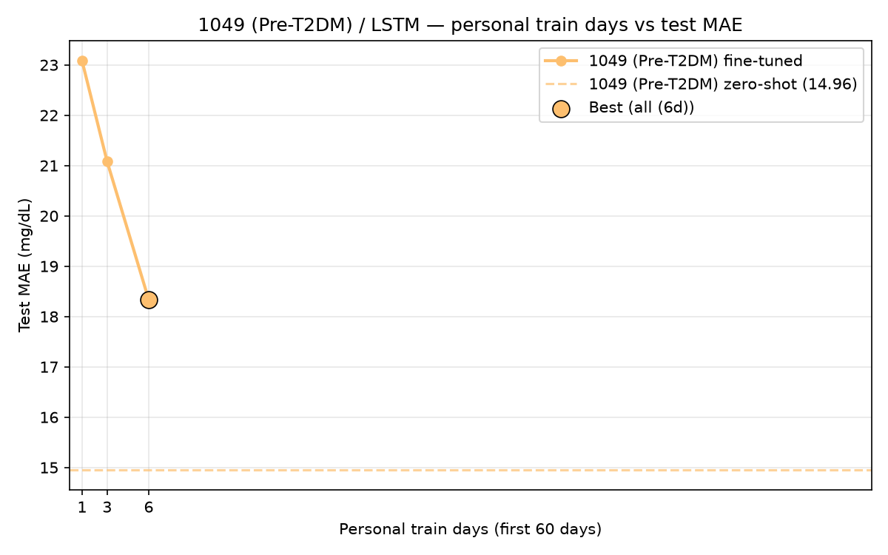


#### 1019 (Oral-T2DM)

| Days | Used train days | ZS MAE | FT MAE | Δ FT vs ZS |
|------|-----------------|--------|--------|------------|
| 1 | 1.0 | 15.11 | 18.84 | 3.73 |
| 3 | 3.0 | 15.11 | 19.42 | 4.31 |
| all (6d) | 6.3 | 15.11 | 20.58 | 5.47 |

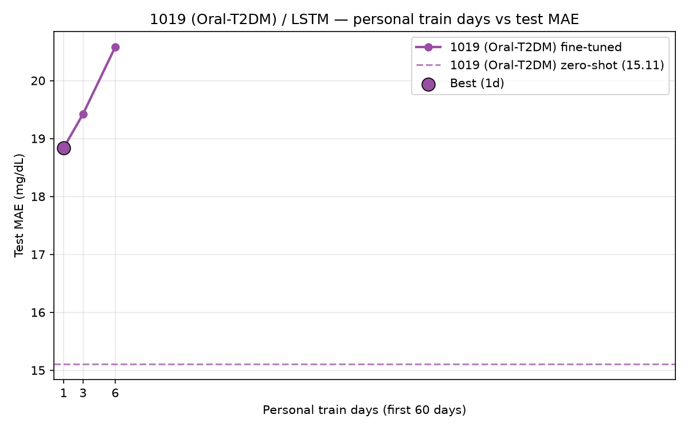


#### 1127 (Oral-T2DM)

| Days | Used train days | ZS MAE | FT MAE | Δ FT vs ZS |
|------|-----------------|--------|--------|------------|
| 1 | 1.0 | 25.40 | 28.13 | 2.73 |
| 3 | 3.0 | 25.40 | 30.80 | 5.40 |
| all (6d) | 6.3 | 25.40 | 31.28 | 5.87 |

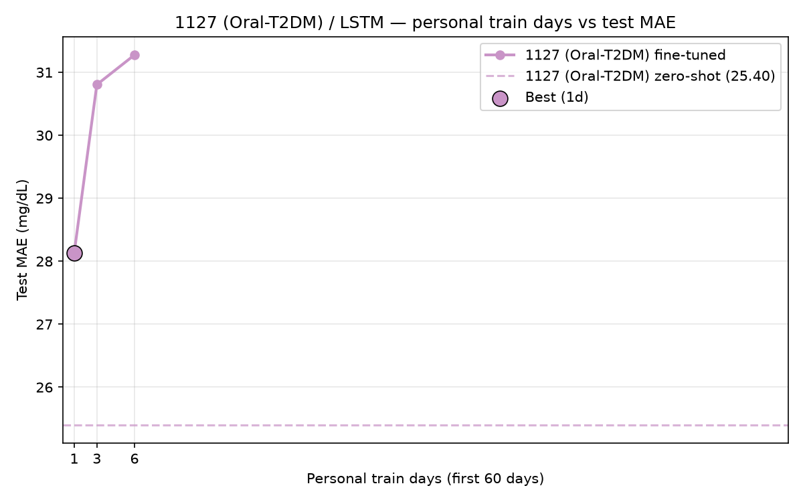


#### 1413 (Insulin-T2DM)

| Days | Used train days | ZS MAE | FT MAE | Δ FT vs ZS |
|------|-----------------|--------|--------|------------|
| 1 | 1.0 | 23.25 | 32.42 | 9.17 |
| 3 | 2.6 | 23.25 | 28.72 | 5.47 |
| 7 | 7.0 | 23.25 | 31.57 | 8.32 |
| all (9d) | 9.1 | 23.25 | 28.03 | 4.78 |

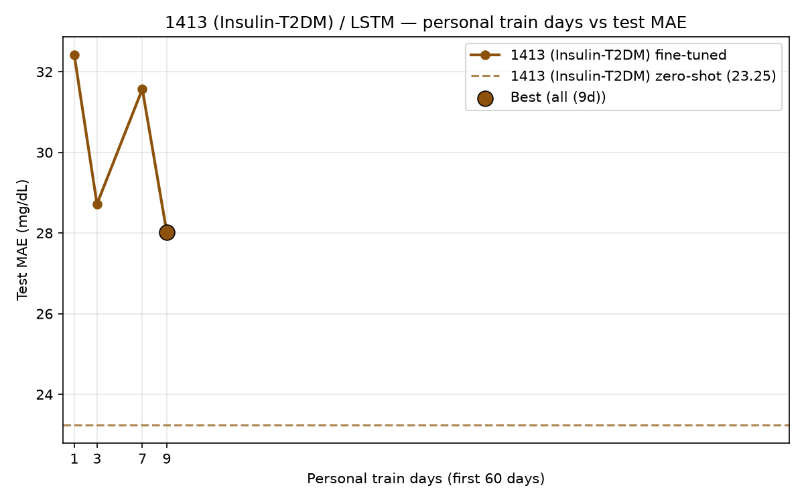


#### 1036 (Insulin-T2DM)

| Days | Used train days | ZS MAE | FT MAE | Δ FT vs ZS |
|------|-----------------|--------|--------|------------|
| 1 | 1.0 | 28.51 | 32.90 | 4.39 |
| 3 | 3.0 | 28.51 | 35.42 | 6.91 |
| all (6d) | 6.3 | 28.51 | 40.93 | 12.42 |

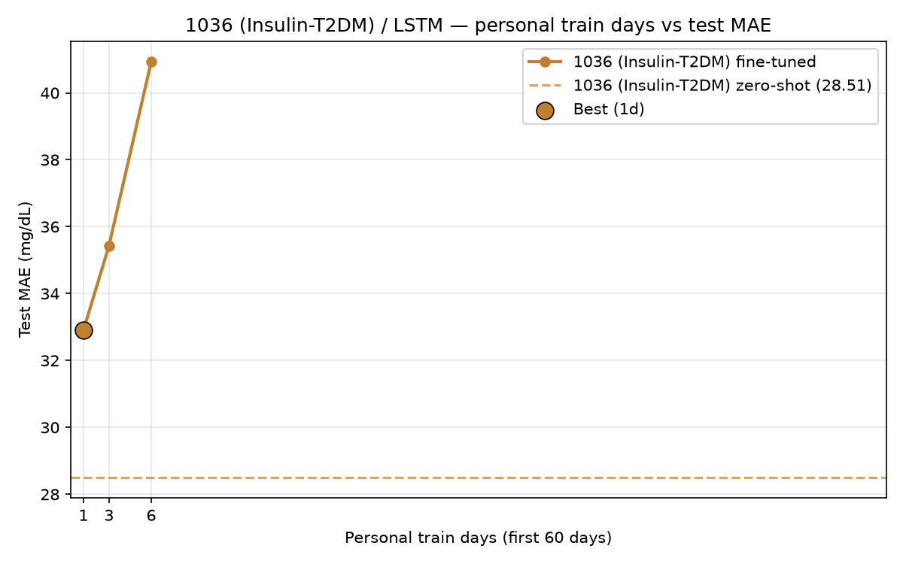


## Reproducibility and artifacts

```bash
uv run personal-nf-study --device auto
uv run personal-nf-study --report-only
```

| Artifact | Path |
|----------|------|
| Study root | `data/output/runs/personalization_nf` |
| This report | `docs/PERSONALIZATION_NF_REPORT.md` |
| Figures | `docs/figures/personalization_nf` |
| Status | `data/output/runs/personalization_nf/study_status.md` |

*Results from on-disk NeuralForecast personalization runs.*
