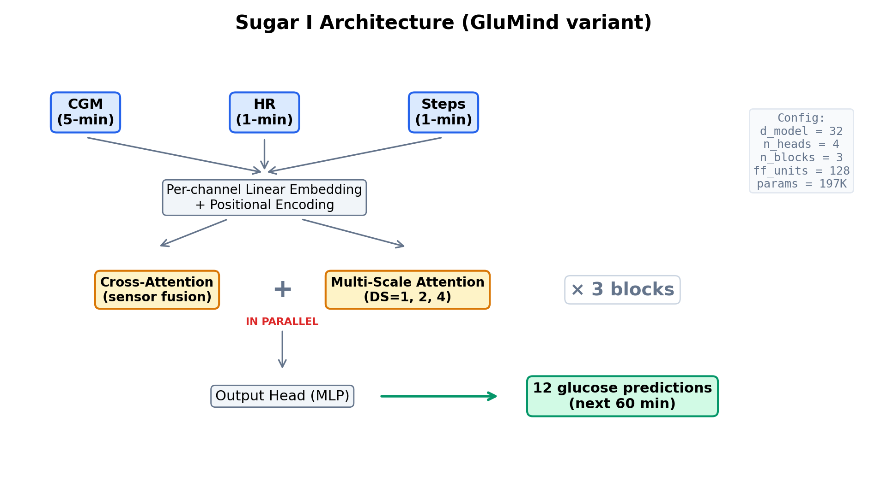
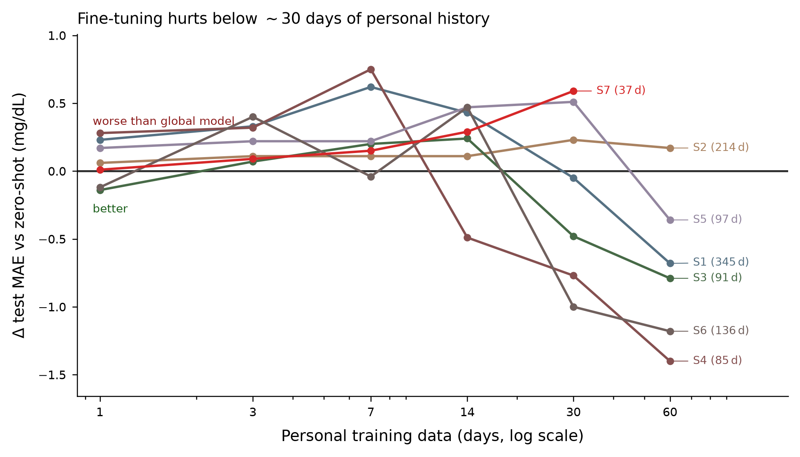
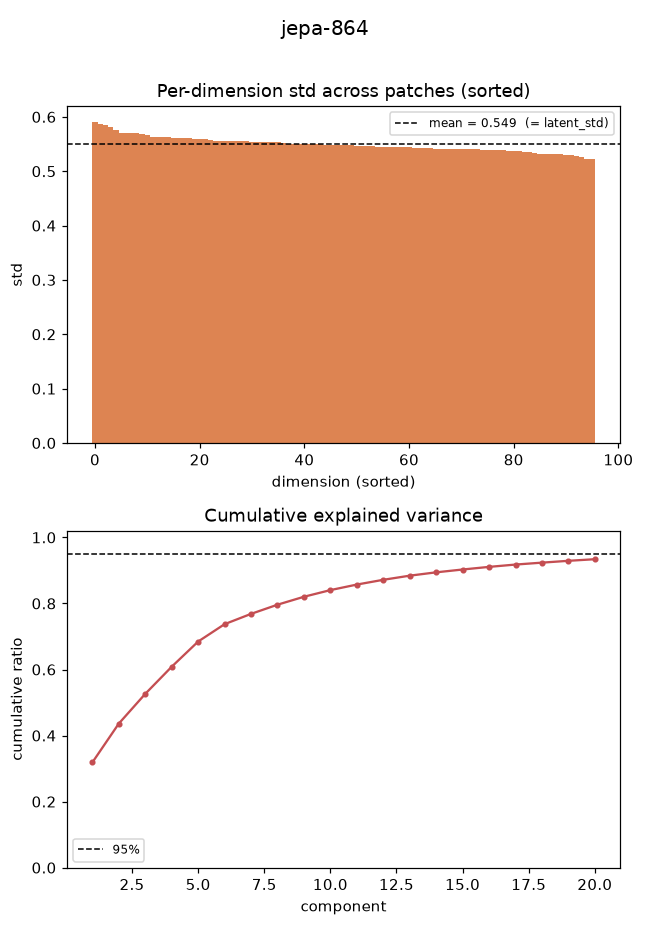
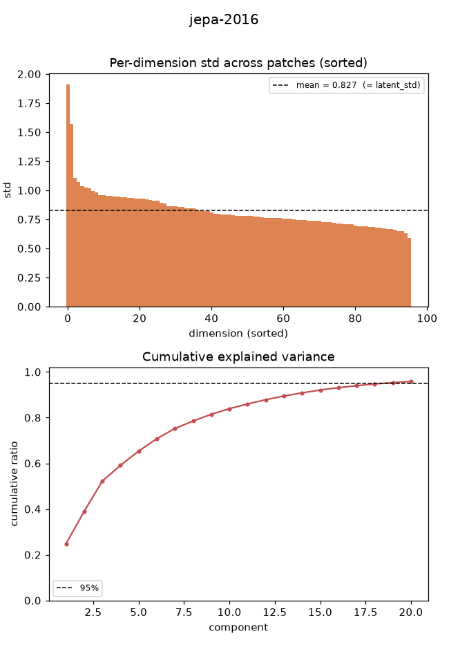
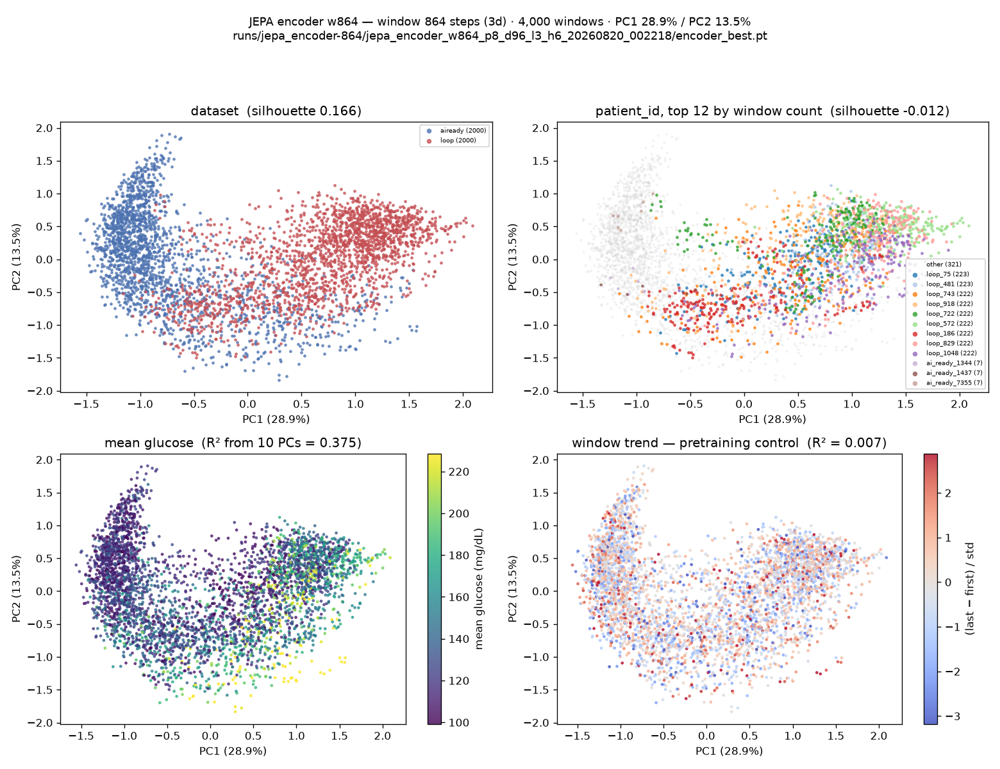

# Introduction

Continuous glucose monitors (CGMs) sample every five minutes , but report an excursion only after it has begun. A 60-minute forecast could instead support earlier action on hypoglycemia, insulin, or time-in-range. The task spans 537 million adults with diabetes today—projected to reach 783 million by 2045 —as well as healthy and prediabetic users who may wear a sensor for only one or two weeks a year. Those short wear periods also test whether safe personalization is possible with little individual history.

Inputs vary with the user. A wearable adds heart rate and steps; insulin records add basal insulin, boluses, and carbohydrates, whether delivered by pump or pen. AI-READI pairs Dexcom G6 CGM with Fitbit signals across four T2DM-spectrum cohorts , while Loop provides CGM and therapy records for T1DM. Sugar I combines GluMind’s parallel cross- and multi-scale self-attention  with learnable fusion of these alternative covariate sets. It also adds a JEPA encoder that predicts masked glucose representations rather than raw values, joining cross-sensor transformers  with self-supervised CGM representations . This is a step toward, rather than a complete, glucose world model: the current system has no action-conditioned predictor, decoder, or counterfactual evaluation.

The JEPA experiment exposes an evaluation problem. A sliding-window model requiring $`L`$ contiguous samples cannot score a series shorter than $`L + H`$; varying lookback therefore changes both model context and test population. Pooled metrics rarely expose this shift. In our sweep it explains most of an apparent context-length scaling law.

Our contributions:

1.  **Sugar I**, a compact GluMind extension (200K–420K parameters) reaching MAE 11.33 mg/dL (MARD 8.25%) on AI-READI. Learnable mixing supports wearable or insulin-therapy covariates; the latter reduce T1DM MAE by 3.6%, with bolus dominant and 93.4% of the gain retained without the pump-specific channel.

2.  A **JEPA-augmented transformer** and context sweep showing that population shrinkage explains most of an apparent 16% MAE gain; the matched-population gain is 3.0%.

3.  A matched comparison in which our encoder and released CGM-JEPA  differ by 0.4% MAE despite our larger corpus, and a **personalization study** yielding a deployable rule—inherit global scalers, personalize only above 30–60 days—together with evidence that the two-week floor coincides with the sensor wear period.

# Related Work

#### Classical, recurrent and transformer forecasters.

ARIMA is interpretable but poorly suited to nonlinear, non-stationary glucose dynamics. Convolutional-recurrent and LSTM models improve on it , with evidential and meta-learned variants addressing T1DM personalization . Attention models include Gluformer , AttenGluco , and GluMind’s parallel cross- and multi-scale self-attention ; N-HiTS provides a strong hierarchical-interpolation baseline without attention .

#### Self-supervised and foundation models.

CGM-JEPA releases an encoder trained with a joint-embedding predictive objective , while other foundation models target downstream health outcomes  or multiple wearable biosignals . We connect CGM-JEPA, and our own equivalent encoder, to a supervised 60-minute forecaster.

#### Benchmarks, and what they do not standardize.

GlucoBench standardizes forecasting over 13 public CGM datasets ; MetaboNet-Bench extends coverage to multimodal T1DM data . Neither requires scored-window counts, so common splits need not mean common evaluation examples when lookbacks differ (Section <a href="#sec:jepa_results" data-reference-type="ref" data-reference="sec:jepa_results">4.4</a>).

# Method

## Problem formulation

Given $`n`$ sensor-derived time series $`\mathbf{X} = [\mathbf{x}_1, \ldots, \mathbf{x}_n]`$ sampled over a lookback window of $`T`$ steps, the model predicts glucose values $`\hat{\mathbf{x}}_g = [x_{g,T+1}, \ldots, x_{g,T+H}]^\top`$ for the next $`H`$ steps. In our primary configuration, $`n = 3`$ (glucose, heart rate, step count), $`T = 80`$ (400 minutes at 5-minute sampling), and $`H = 12`$ (60 minutes).

## Sugar I architecture

Sugar I builds on GluMind’s parallel dual-attention design . A linear layer projects each scalar channel to $`d_\text{model}`$ and adds sinusoidal positional encoding before $`B`$ parallel dual-attention blocks (Figure <a href="#fig:sugar_i_arch" data-reference-type="ref" data-reference="fig:sugar_i_arch">1</a>).

**Cross-attention** performs sensor fusion: glucose embeddings are queries, and each auxiliary modality independently supplies keys and values through its own attention module,
``` math
\begin{equation}
    \mathbf{C}_i = \text{MultiHead}(\mathbf{Q}_\text{gluc}, \mathbf{K}_i, \mathbf{V}_i), \quad i \in \{1, \ldots, n-1\}
\end{equation}
```
The outputs are combined, normalized, and passed through a residual feedforward network.

**Multi-scale self-attention** supplies temporal context, applying separate attention modules to the glucose stream at three resolutions (downsampling factors 1, 2, 4 by average pooling), then upsampling and summing:
``` math
\begin{equation}
    \mathbf{M} = \sum_{s \in \{1,2,4\}} \text{Upsample}\bigl(\text{MultiHead}_s(\mathbf{G}_s, \mathbf{G}_s, \mathbf{G}_s)\bigr)
\end{equation}
```
The 5-, 10-, and 20-minute branches represent rapid and slower trends; their summed, normalized output is decoded by a two-layer MLP. The default model ($`d_\text{model}=32`$, 4 heads, $`B=3`$, 128 feedforward units, dropout 0.1) has $`\sim`$<!-- -->197K parameters; Appendix <a href="#app:setup" data-reference-type="ref" data-reference="app:setup">8</a> gives training details.

<figure id="fig:sugar_i_arch" data-latex-placement="ht">

<figcaption>Sugar I architecture. The CGM, heart-rate, and step streams are embedded separately and processed by three blocks of parallel cross-attention (sensor fusion) and multi-scale self-attention (DS=1, 2, 4). An MLP decodes the fused representation into 12 glucose predictions spanning 60 minutes.</figcaption>
</figure>

## Insulin and carbohydrate extension

Sugar I (insulin) uses therapy rather than hardware-specific covariates: active long-acting insulin, discrete short-acting doses, and carbohydrates. These also exist under multiple daily injections, although basal is then a once- or twice-daily dose rather than a programmed rate. We use pump data because it records all three at scale; the architecture does not require a pump, and Section <a href="#sec:covariate_results" data-reference-type="ref" data-reference="sec:covariate_results">4.2</a> measures the cost of removing its pump-specific signal.

The model replaces (HR, steps) with (basal, bolus, carbohydrates), giving $`n=4`$ channels and $`T=128`$, and replaces fixed averaging with **learnable softmax mixing**:
``` math
\begin{equation}
    \mathbf{C} = \sum_{i=1}^{3} w_i \cdot \mathbf{C}_i, \quad \text{where} \quad w_i = \frac{\exp(\alpha_i)}{\sum_{j=1}^{3} \exp(\alpha_j)}
\end{equation}
```

The learned $`\boldsymbol{\alpha}=(\alpha_1,\alpha_2,\alpha_3)`$ starts at zero (equal mixing), allowing sparse bolus events and continuous basal rate to contribute differently. The insulin configuration uses $`n_\text{heads}=8`$ and $`B=5`$.

## Self-supervised glucose representations as a fourth stream

The JEPA extension supplies a longer-context glucose representation as a fourth cross-attention stream while the transformer produces the supervised forecast. **Borrowed pretraining** uses released CGM-JEPA  (3 layers, 96 dimensions), frozen at its native 288-step window with its own $`z`$-score scaler. **In-house pretraining** uses our Conv1d-patchified, pre-norm transformer, pretrained by masked latent prediction and then fine-tuned with the backbone; per-window instance normalization makes it invariant to the backbone’s affine MinMax scaling.

#### Why a predictive latent objective.

JEPA predicts in representation space rather than reconstructing raw values , allowing the encoder to discard unpredictable CGM detail. It could supply the representation layer of a future glucose world model, but our predictor has no action conditioning, decoder, or counterfactual evaluation; here we test only whether it improves supervised forecasting.

#### Pretraining.

An EMA target encoder processes every patch; the context encoder sees only unmasked patches, and a predictor reconstructs masked-block latents from their *positions* under smooth-L1 loss. Target blocks scale from $`n_\text{patches}/8`$ to $`n_\text{patches}/4`$, keeping the masked fraction roughly constant. We add a variance penalty in the spirit of VICReg :
``` math
\begin{equation}
    L = \operatorname{SmoothL1}(\hat{z}, z) + \lambda \cdot \frac{1}{E} \sum_{j=1}^{E} \operatorname{ReLU}\!\left(\sigma_{\text{target}} - \sigma_{c,j}\right)
\end{equation}
```
where $`\sigma_{c,j}`$ is the per-dimension context standard deviation. Pretraining uses only the train split. Because collapse can lower loss, we also track per-dimension standard deviation and effective rank; the five separately pretrained 128–2016-step encoders and random-init reference ($`\approx0.67`$ at $`E=96`$) are detailed in Appendix <a href="#app:encoder" data-reference-type="ref" data-reference="app:encoder">12</a>.

#### Integration, and the source of the confound.

The normalized encoder output is projected to $`d_\text{model}=32`$ and enters a four-way softmax mixture with basal, bolus, and carbohydrates. We log its weight; values well below $`1/4`$ indicate that the model routes around the branch.

The aligned branches take trailing slices from a $`\max(\text{input\_steps},\text{jepa\_window})`$ window (Appendix <a href="#app:encoder" data-reference-type="ref" data-reference="app:encoder">12</a>, Figure <a href="#fig:sugar_jepa" data-reference-type="ref" data-reference="fig:sugar_jepa">3</a>). A series shorter than $`\text{lookback}+H`$ then contributes no windows, so longer JEPA context removes short series from training and evaluation (Section <a href="#sec:jepa_results" data-reference-type="ref" data-reference="sec:jepa_results">4.4</a>). Appendix <a href="#app:encoder" data-reference-type="ref" data-reference="app:encoder">12</a> covers optimizer grouping, the reason a zero learning rate does not freeze a parameter group under `CosineAnnealingLR`, and the probing protocol.

#### Representations as patient embeddings.

A frozen encoder could provide patient context before fine-tuning becomes viable (Section <a href="#sec:personalization_results" data-reference-type="ref" data-reference="sec:personalization_results">4.3</a>). We test whether its embeddings distinguish held-out patients with a classification head and inspect one PCA projection coloured by dataset, patient, mean glucose, and window trend; trend distinguishes an uninformative projection from a collapsed encoder.

# Results

## Baseline comparison and the severity gradient

Table <a href="#tab:per_cohort" data-reference-type="ref" data-reference="tab:per_cohort">[tab:per_cohort]</a> reports the overall and per-cohort results. On AI-READI, Sugar I reduces MAE by 45.0% relative to N-HiTS, 42.0% relative to GluFormer, and 12.5% relative to the published GluMind result. It also reduces T1DM MAE by 4.0% relative to N-HiTS. N-HiTS, however, has the lower T1DM RMSE (21.05 vs. 23.00), which means Sugar I’s average error is lower but its occasional errors on extreme swings are larger.

For the two multimodal models, error rises steadily from Healthy to T1DM, in line with greater glycemic variability across the severity spectrum. The baselines do not follow this order: N-HiTS and GluFormer both do better on Pre-T2DM than on Healthy (14.00 vs. 16.86; 14.21 vs. 17.08), and their errors fall sharply between Insulin-T2DM and T1DM (28.31 to 15.53; 26.36 to 15.46). The gradient is therefore a feature of the multimodal models here, not a general property of the task. Sugar I’s largest margin is in Insulin-T2DM, at roughly half the baselines’ MAE (Appendix <a href="#app:encoder" data-reference-type="ref" data-reference="app:encoder">12</a>, Figure <a href="#fig:per_cohort_mae" data-reference-type="ref" data-reference="fig:per_cohort_mae">4</a>).

Forecast MARD and sensor MARD should not be equated: our 8.25% is measured against CGM output, while the $`\sim`$<!-- -->8–10% CGM measurement MARD is against a blood reference , so the forecast target already contains sensor error. The sensor figure is useful only as a ceiling—once forecast error is comparable to the error in its reference signal, MARD against that signal separates models poorly.

## Insulin covariate contribution

On the joined benchmark, zeroing the insulin covariates raises MAE from 12.40 to 12.63, a 1.8% change. Most of the model’s advantage therefore comes from the architecture and in-domain training rather than from the covariates alone. In the T1DM ablation (819,013 windows, 9 users), **bolus insulin is the strongest channel**. Bolus alone reaches MAE 13.216, compared with 13.078 for all three covariates and 13.546 for none, recovering 70.5% of the available gain. Removing bolus has the largest cost of any single-channel exclusion ($`+0.321`$ mg/dL), while removing basal has the smallest ($`+0.030`$). The RMSE spread is larger than the MAE spread ($`+0.85`$ vs. $`+0.47`$), suggesting that the covariates help most on large errors, where bolus and carbohydrate events may identify excursions that glucose history alone misses. Because this experiment zeros inputs at inference time in a covariate-trained model, it estimates covariate contribution but does not replace a glucose-only training control.

## Personalization

Fine-tuning the global Sugar I (insulin) checkpoint improves forecasts for T1DM subjects with enough history but degrades them for subjects with little data. Across six T1DM users with $`\geq`$<!-- -->60 training days, mean test MAE improves by $`0.26`$ mg/dL with a 30-day budget, $`0.71`$ mg/dL with 60 days, and $`1.16`$ mg/dL with the full 85–345 days of history. With less than two weeks, most subjects do worse than with the frozen global model (Appendix <a href="#app:encoder" data-reference-type="ref" data-reference="app:encoder">12</a>, Figure <a href="#fig:personalization" data-reference-type="ref" data-reference="fig:personalization">2</a>). LwF distillation against the global teacher does not rescue these short fine-tunes (Appendix <a href="#app:continual" data-reference-type="ref" data-reference="app:continual">10</a>). The largest individual improvement, $`-2.09`$ mg/dL after 136 training days, occurs for a subject whose zero-shot MAE is 22.62, well above the cohort average. The subjects initially served worst may therefore have the most to gain. Results for AI-READI subjects, who have $`\sim`$<!-- -->6 days of CGM and no insulin covariates, are small and mixed.

Scaler handling is central to this result. The personal models inherit the scalers from the global checkpoint rather than fitting new ones. Refitting MinMax scalers on 1–14 days of one person’s glucose shifts the input distribution away from the pretrained scale and made short fine-tunes appear harmful; every result reported here uses inherited scalers.

#### The two-week floor may be a sensor artifact.

Two weeks is close to a sensor wear period, so the boundary may be hardware rather than sample size. Contiguous sequences in our benchmark end at a ceiling of 10.2 days with a pronounced mode at 9.5–10 days, so a 7–14 day personal budget typically spans one to two sensor sessions. Each replacement brings a new insertion site and calibration, so a short personal record samples one *sensor* as much as one person, and fine-tuning on it may adapt the model to that sensor’s offset rather than the individual’s physiology. The effect size is consistent: among users with $`\geq`$<!-- -->3 sequences, the between-sequence standard deviation of mean glucose is 11.1 mg/dL against a within-sequence standard deviation of 42.0 mg/dL—the same order as the 0.26–1.16 mg/dL personalization is trying to capture. We report this as a hypothesis consistent with the effect size, not a demonstrated cause; testing it requires the session-stratified split noted in future work.

In practice, personalization should be enabled only after enough history has accumulated, and preferably after it spans more than one sensor. Healthy and prediabetic users who wear a sensor for one or two weeks a year should receive the global model instead—and because the requirement is quantified, it can be communicated: a user told that roughly a month of wear unlocks a personalized model has a concrete reason to extend a two-week trial, which is a more honest engagement argument than an unqualified promise of personalization.

## Sugar I + JEPA results

### Encoder quality and what the representation organises by

Effective rank rises from 17.6 at 128 steps to 36.0 at the 3-day window, then falls to 16.7 at 7 days; the latter has spread comparable to random initialization yet the best pooled forecast, pointing again to population selection rather than latent quality. All encoders separate AI-READI from Loop (silhouette 0.166), confounding dataset with patient identity. Frozen 3-day embeddings identify 665 held-out patients with 68.4% accuracy against 0.15% chance, showing individual-distinguishing information but not zero-shot personalization. Appendix <a href="#app:encoder" data-reference-type="ref" data-reference="app:encoder">12</a> gives the full diagnostics and caveats.

### Forecasting performance, and why the apparent scaling law is an artifact

Table <a href="#tab:sugar_jepa_test" data-reference-type="ref" data-reference="tab:sugar_jepa_test">1</a> reports each encoder’s test metrics together with its number of scored windows. The window count is essential to interpreting the apparent effect of context length.

<div id="tab:sugar_jepa_test">

|  |  |  |  |  |  |  |  |
|:---|---:|---:|:--:|:--:|:--:|---:|---:|
| **Encoder** | **Windows** | **% of** | **T1DM** | **MAE** | **MARD** | **$`\Delta`$MAE** | **$`\Delta`$MAE** |
|  |  | **base** | **share** | $`\downarrow`$ | $`\downarrow`$ | **pooled** | **rewt.** |
| Baseline (insulin) | 1,667,437 | 100% | 49.1% | 12.40 | 9.91% | — | — |
| jepa-128-64$`^{\dagger}`$ | 1,667,437 | 100% | 49.1% | 12.47 | 10.40% | $`-0.6\%`$ | $`-0.5\%`$ |
| jepa-128$`^{\dagger}`$ | 1,667,437 | 100% | 49.1% | **12.03** | **9.80%** | $`+3.0\%`$ | $`+3.1\%`$ |
| jepa-288 | 1,469,436 | 88% | 47.8% | 11.37 | 9.08% | $`+8.3\%`$ | $`+8.2\%`$ |
| jepa-864 | 967,521 | 58% | 44.7% | 10.90 | 8.55% | $`+12.1\%`$ | $`+11.6\%`$ |
| jepa-2016 | 295,933 | 18% | 37.8% | 10.40 | 8.10% | $`+16.1\%`$ | $`+15.2\%`$ |
| CGM-JEPA (released) | 1,469,436 | 88% | 47.8% | 11.41 | 8.99% | $`+8.0\%`$ | $`+7.8\%`$ |

Sugar I + JEPA on the joined benchmark test split. **Window counts differ across rows**: longer JEPA windows require longer contiguous series and are therefore scored on smaller populations with a lower T1DM share. Relative changes use the insulin-covariate baseline (MAE 12.40 across all 1,667,437 windows). The last column reweights each row’s per-cohort errors to the baseline cohort mix. Rows marked $`\dagger`$ use the full baseline population.

</div>

The MAE column alone suggests a clean scaling law reaching 16% at seven days; the window count offers another explanation. The 7-day encoder is evaluated on only **17.7% of the baseline windows**, with the T1DM share falling from 49.1% to 37.8%, and across the five rows context length is almost perfectly aligned with the fraction of the hardest cohort removed. The design cannot separate the two effects. Reweighting removes the cohort-mix component and explains about one of the sixteen percentage points, but cannot correct selection by series length within a cohort: a patient contributing seven continuous days of CGM necessarily has more complete sensor coverage and may be easier to predict for reasons unrelated to the encoder. We therefore do not read the remainder as a genuine context-length gain.

Two comparisons are internally valid. At 128 steps, jepa-128 and the baseline share the same 1,667,437 windows, cohort mix and backbone hyperparameters, and MAE falls from $`12.40`$ to $`12.03`$—a **3.0% improvement**, the only unconfounded estimate that JEPA helps and about one fifth of the apparent pooled gain. Second, jepa-288 and the released CGM-JEPA encoder both use a 288-step context on the same 1,469,436 windows, isolating pretraining corpus and objective; the result is effectively a tie, with our encoder 0.4% lower on MAE ($`11.37`$ vs. $`11.41`$) and 1.6% on RMSE, and the released encoder 1.0% lower on MARD ($`8.99\%`$ vs. $`9.08\%`$). Our much larger corpus produces no clear advantage, suggesting corpus size is not the main constraint and the released encoder is a strong, inexpensive default. Embedding width does matter at fixed context: 96-dimensional jepa-128 beats 64-dimensional jepa-128-64 by 3.5% MAE on identical windows, and the 64-dimensional encoder is the only configuration not beating the baseline.

# Discussion

#### Matched-population evaluation is not optional for variable-context models.

For a sliding-window forecaster, lookback and evaluation population are mechanically linked: a model requiring $`L`$ contiguous samples cannot score a series shorter than $`L + H`$. In our sweep, that link produces a convincing scaling curve even though only 3% is supported by a population-matched comparison. Pooled MAE alone does not reveal the problem. The selection is also unlikely to be random in CGM data, because patients with seven continuous days of measurements have more complete sensor coverage and may be easier to predict for unrelated reasons. Window counts and cohort composition require only two extra table columns and should accompany results whenever context length varies.

#### Borrowed pretraining is a strong default, and latent quality does not track utility.

On matched windows, our encoder and the released encoder differ by only 0.4% MAE, with the released encoder ahead on MARD, despite our much larger corpus. More pretraining data is therefore unlikely to be the main constraint in this setting. The effective-rank results instead point to the objective: none of the encoders uses more than 36 of 96 dimensions, and the 7-day encoder uses 17. That encoder has the weakest latent geometry and a spread comparable to a randomly initialized network, yet it has the best pooled metrics. We take this as further evidence of population selection, not as evidence that a degenerate representation is better for forecasting. Neither effective rank nor pooled error is sufficient on its own for model selection.

#### A practical path to personal, on-device forecasts.

Two properties make this deployable where larger forecasters are not. At 200K–420K parameters Sugar I is orders of magnitude smaller than the transformer baselines it outperforms, so inference and gradient updates are plausible on a phone, keeping raw traces local—which matters because a glucose trace is identifying: our probes recover individual identity from 3-day windows at 68.4% across 665 patients. We have not benchmarked latency, memory, or energy on consumer hardware, so this is a feasibility claim.

Second, personalization carries a stated requirement rather than an open promise: inherit the global scalers, keep the global model active below roughly 30–60 days of history, and expect 0.26–1.16 mg/dL depending on budget. That is a rule a product can implement and a user can be told—a healthy user informed that about a month of wear unlocks a personal model has a concrete reason to extend a two-week trial. If the sensor-session mechanism holds, the requirement is better stated in sessions than days, and per-session normalization may lower it.

#### Learnable mixing, and what it diagnoses.

Bolus insulin appears in only 4% of rows but is the dominant covariate, while basal is dense yet largely overlaps with the glucose trend after forward-fill imputation, so fixed averaging would underweight bolus and overweight basal. The learned weights are also diagnostic—one falling well below its uniform share shows the model routing around that stream—and auxiliary-stream models should report them alongside accuracy.

#### Limitations.

Sugar I is a forecaster, not yet a world model. It has no action conditioning, no decoder to interpretable trajectories, and no counterfactual evaluation; the results do not support interventional prediction or mechanistic explanations.

Six further limitations affect the evidence. First, Sugar I’s T1DM RMSE is higher than N-HiTS (23.00 vs. 21.05), so it makes occasional large errors on extreme swings despite leading on MAE and MARD. Second, the covariate ablation is performed only at inference time; training matched models on each covariate subset could change the channel ranking. Third, we do not report clinically weighted measures such as error-grid occupancy and gMSE, or hypoglycemia sensitivity and lead time, all of which matter to the actionability of a 60-minute forecast. MARD is also of limited value in the Healthy cohort because its glucose range is narrow by construction, so pooled MARD favours evaluations dominated by stable participants. Fourth, the study lacks naive baselines. Until last-value persistence and linear extrapolation are evaluated at this horizon, the absolute merit of the models remains uncertain even where the relative comparisons are sound. Fifth, the JEPA branch adds $`\sim`$<!-- -->336K parameters to a 368K backbone, so capacity may explain part of its gain; finally, the 60-minute horizon is shorter than the 2–4 h some models target.

#### Future work.

A glucose world model requires action conditioning, interpretable decoding, and counterfactual evaluation, bringing causal-inference and offline-RL methods into scope. Low effective rank motivates isotropy-regularized objectives such as SIGReg ; the same architecture can also test cross-sensor transfer on AI-READI. Appendix <a href="#app:future" data-reference-type="ref" data-reference="app:future">14</a> gives the full roadmap. A cheaper experiment follows from the personalization result: stratify fine-tuning by sensor session at fixed training days, testing whether the two-week floor reflects sensor replacement rather than sample size.

# Conclusion

Sugar I pairs a compact multimodal transformer with a self-supervised JEPA glucose encoder, reaching MAE 11.33 mg/dL (MARD 8.25%) across the AI-READI T2DM spectrum on either wearable or insulin-therapy signals. JEPA improves MAE by 3.0% on matched data, far below the apparent 16% across unmatched context windows, and our larger-corpus encoder only ties released CGM-JEPA. Fine-tuning helps after 30–60 days but harms below two weeks. Matched-population evaluation should therefore be a requirement for variable-context models.

# Architecture hyperparameters

<div id="tab:hparams">

| **Parameter** | **Sugar I (wearable)** | **Sugar I (insulin)** | **Sugar I + JEPA** |
|:---|:--:|:--:|:--:|
| $`d_\text{model}`$ | 32 | 32 | 32 |
| $`n_\text{heads}`$ | 4 | 8 | 8 |
| $`n_\text{blocks}`$ | 3 | 5 | 5 |
| ff_units | 128 | 128 | 128 |
| dropout | 0.1 | 0.1 | 0.1 |
| input_steps | 80 | 128 | 128 |
| horizon | 12 | 12 | 12 |
| JEPA window | — | — | 128–2016 |
| JEPA embed dim | — | — | 64 or 96 |
| JEPA LR | — | — | $`4 \times 10^{-5}`$ |
| Total parameters | $`\sim`$<!-- -->197K | $`\sim`$<!-- -->300K | $`\sim`$<!-- -->420K |
| Optimizer | AdamW | AdamW | AdamW |
| Precision | bf16 | bf16 | bf16 |
| Batch size | 4096 | 256 | 256 |

Model configurations.

</div>

# Experimental setup

## Datasets

#### AI-READI.

AI-READI contains 896 participants in four clinically defined cohorts ($`n = 224`$ each): Healthy, Pre-T2DM, Oral-medication T2DM, and Insulin-dependent T2DM . Participants wore a Dexcom G6 CGM, sampled every 5 minutes, and a Fitbit recording heart rate and steps at approximately 1-minute intervals for about 10 days. We resample the data to 5-minute intervals, linearly interpolate gaps of $`\leq`$<!-- -->15 minutes, and apply MinMax normalization separately to each channel. Users are assigned to the training, validation, and test sets in a 70/15/15% split.

#### Loop (T1DM).

The Loop observational study from the JAEB Center for Health Research contains CGM and pump data from $`\sim`$<!-- -->1000 participants with T1DM who use the open-source DIY Loop automated insulin-delivery system. The records include glucose, basal rate, bolus insulin, and carbohydrate entries, which we process with the pipeline’s `loop` converter. Loop has substantially greater glycemic variability than the AI-READI cohorts and supplies the covariates needed for the insulin configuration.

#### Joined benchmark.

For the insulin and JEPA configurations, we vertically combine AI-READI (49.9%, wearable schema) and Loop (50.1%, T1DM with basal, bolus, and carbohydrate data) into `loop_ai_ready_joined2.csv`, which has 12.1M rows. We prefix sequence IDs to prevent collisions and balance the T1DM row mass against the combined non-T1DM mass.

#### Personalization subjects.

The personalization study includes 15 subjects from five clinical groups: 7 with T1DM, including one personal CGM/pump user with 345 days of data, and 8 from AI-READI, with 2 per non-T1DM group and $`\sim`$<!-- -->6 days each.

## Baselines

We compare Sugar I with three baselines, all using the same data splits:

- **N-HiTS** : neural hierarchical interpolation model from the NeuralForecast library , representing a strong non-transformer baseline.

- **GluFormer** : transformer with hierarchical attention and uncertainty quantification.

- **Original GluMind** : the published results from the original paper (same architecture, different training configuration).

## Metrics

We report Mean Absolute Error (MAE, mg/dL), Root Mean Squared Error (RMSE, mg/dL), and Mean Absolute Relative Difference (MARD, %). MARD is commonly used in clinical settings because it scales errors by glucose level; CGM sensors themselves have $`\sim`$<!-- -->10% MARD .

#### Training.

Both configurations use AdamW , bf16 mixed precision , and early stopping. For the wearable configuration, the learning rate is $`10^{-3}`$, weight decay is $`10^{-4}`$, batch size is 4096, and patience is 20. For the insulin configuration, the learning rate is $`4\times10^{-4}`$, weight decay is $`3\times10^{-5}`$, and batch size is 256. Table <a href="#tab:hparams" data-reference-type="ref" data-reference="tab:hparams">2</a> lists the remaining hyperparameters.

# Covariate portability beyond pump therapy

Basal rate is the only channel whose form is specific to a pump. A closed-loop system records a continuously modulated rate, while a person using injections receives a once- or twice-daily long-acting dose. The ablation bounds the cost of this difference. Using only bolus and carbohydrates, which can be recorded from a pen and meal entries, gives MAE 13.109 instead of 13.078 with all three channels. That retains **93.4% of the total covariate gain** at a cost of 0.031 mg/dL, or 0.24% of MAE. Most of the useful signal is therefore in the discrete, therapy-agnostic channels. This result is an upper bound on portability, not a validation on injection data: the model was trained with pump-derived basal and then evaluated with that channel zeroed. Training and testing on manually injected T1DM data remains necessary, although the current schema can already represent it.

# Continual learning across cohorts

Following , Sugar I supports continual training in the order Healthy $`\to`$ Pre-T2DM $`\to`$ Oral-T2DM $`\to`$ Insulin-T2DM. It uses Learning without Forgetting (LwF) :
``` math
\begin{equation}
    \mathcal{L} = (1 - \lambda)\,\mathcal{L}_\text{task} + \lambda\,\mathcal{L}_\text{distill}
\end{equation}
```
Here $`\mathcal{L}_\text{distill}`$ is the MSE between the current predictions and those from a frozen teacher snapshot of the previous cohort. We use $`\lambda = 0.3`$ to balance plasticity and stability.

On the AI-READI wearable configuration, joint training outperforms cohort-sequential training by 0.14 mg/dL MAE (11.34 vs. 11.48). LwF at $`\lambda = 0.3`$ therefore recovers most, but not all, of the joint-training performance. When all cohorts are available, joint training is preferable. Continual training is useful when earlier cohorts cannot be retained, at a cost of about 1% relative MAE.

# Data preprocessing pipeline

We process all CGM data with a modular open-source pipeline containing 9 device- and study-specific converters: AI-READI, Loop, HUPA, T1D-UoM, UC-HT (T1DM + healthy controls), Minidose 1, Dexcom G6, FreeStyle Libre 3, and Medtronic. The supported datasets include multimodal studies that pair CGM with heart rate, steps, insulin, carbohydrates, and meals. The pipeline consolidates each source into a common schema, detects gaps and splits sequences, interpolates continuous fields while preserving sparse events, resamples to a fixed 5-minute interval, and exports training, validation, and test splits. Imputation depends on the channel type and affects the covariate ablation. Glucose and basal rate are first forward-filled and then backward-filled because they are continuous signals that persist until changed. Bolus insulin and carbohydrates are discrete events, so missing values are set to zero without carry-over. The pipeline catalogues 51 public CGM datasets with download links and includes programmatic downloaders for the open-access sources.

# Supplementary figures and encoder diagnostics

<figure id="fig:personalization" data-latex-placement="ht">

<figcaption>Personalization results for seven T1DM subjects. Values show the change in test MAE relative to each subject’s zero-shot baseline; zero denotes the frozen global model, and positive values indicate that fine-tuning made the forecast worse. With less than roughly 30 days of personal history, most subjects remain above zero. Labels give the total history available for each subject.</figcaption>
</figure>

## Implementation detail

<div id="tab:jepa_variants">

| **Encoder** | **Embed dim** | **Context window** | **Patches** |
|:------------|:-------------:|:------------------:|:-----------:|
| jepa-128-64 |      64       |    128 (10.7 h)    |     16      |
| jepa-128    |      96       |    128 (10.7 h)    |     16      |
| jepa-288    |      96       |     288 (1 d)      |     36      |
| jepa-864    |      96       |     864 (3 d)      |     108     |
| jepa-2016   |      96       |     2016 (7 d)     |     252     |

Self-supervised encoder variants. Every encoder is pretrained on glucose from the training split of the joined benchmark.

</div>

For the in-house variant, the encoder trains with the backbone in a separate optimizer group at a lower learning rate ($`4 \times 10^{-5}`$ vs. $`4 \times 10^{-4}`$). Setting this group’s learning rate to zero does *not* freeze the encoder. `CosineAnnealingLR` uses one $`\eta_\text{min}`$ across parameter groups, so a group with a zero base rate anneals *upward* and ends at the backbone’s final learning rate. The frozen configurations reported here instead remove the encoder parameters from the optimizer.

The probing protocol assigns equal numbers of windows to each dataset and samples patients within a dataset in round-robin order. A proportional sample would be dominated by AI-READI, because the split contains 343 AI-READI patients and 9 Loop patients, and one Loop patient would supply most of that cohort’s windows. We calculate silhouette scores in the full 96-dimensional space rather than in the two-dimensional projection, which contains only the highest-variance axes. We do not draw a combined grid across encoders because a 2016-step window and a 288-step window cannot always be sampled from the same series; the rows would contain different samples and the columns would not be directly comparable.

## Encoder probe interpretation

Effective rank rises from 17.6 at 128 steps to 36.0 at the 3-day, 864-step window, out of 96 dimensions, then falls to 16.7 for the 7-day encoder. The latter has the highest mean per-dimension standard deviation (0.83 rather than $`\approx0.56`$), but its variance is concentrated in a few dimensions; the random-init reference at $`E=96`$ is $`\approx0.67`$. Its strong pooled forecast therefore reflects either a disconnect between latent geometry and utility or the easier evaluation population discussed in Section <a href="#sec:jepa_results" data-reference-type="ref" data-reference="sec:jepa_results">4.4</a>.

Every encoder separates AI-READI from Loop along the leading principal component. The dataset silhouette is 0.166 in the full 96-dimensional space. Because the split contains 343 AI-READI patients and 9 Loop patients, dataset and patient identity remain partly entangled. A head on frozen embeddings identifies patients with 11.3% validation accuracy at 128 steps, 36.5% at 288, and 68.4% at 864 across 665 held-out patients (chance 0.15%). The 7-day result is not comparable because only 18 patients have seven consecutive days. Instance normalization removes absolute glucose level before the first convolution, so any recovered level information must be encoded indirectly through shape. These probes establish information that distinguishes individuals, not zero-shot personalization.

<figure id="fig:sugar_jepa" data-latex-placement="ht">

<figcaption>Sugar I + JEPA. A self-supervised glucose encoder reads a longer history and enters the insulin configuration as the fourth stream in a four-way, learnable softmax mixture. We use either the released CGM-JEPA encoder (frozen, with its own <span class="math inline"><em>z</em></span>-score scaler) or an in-house encoder (instance-normalized and fine-tuned with the backbone).</figcaption>
</figure>

<figure id="fig:per_cohort_mae" data-latex-placement="ht">

<figcaption>Per-cohort MAE for all models. Sugar I is shown in teal. The baseline errors rise sharply for Insulin-T2DM, while the gap between models narrows for T1DM.</figcaption>
</figure>

<div id="tab:jepa_qc">

| **Encoder**   | **Embed dim** | **Effective rank** |       **Mean std**        |
|:--------------|:-------------:|:------------------:|:-------------------------:|
| jepa-128-64   |      64       |       17.62        |           0.56            |
| jepa-128      |      96       |       26.26        |           0.57            |
| jepa-288      |      96       |       27.43        |           0.56            |
| jepa-864      |      96       |     **35.99**      |           0.56            |
| jepa-2016     |      96       |       16.71        |           0.83            |
| *random init* |      96       |         —          | *$`\approx`$<!-- -->0.67* |

Latent diagnostics for the five pretrained encoders. Effective rank estimates the number of active latent dimensions; mean std is the average spread per dimension. A *random-init* encoder at $`E = 96`$ has mean std $`\approx 0.67`$, so a value near or below this reference does not by itself show that training produced a well-spread representation.

</div>

<figure id="fig:jepa_qc" data-latex-placement="ht">
<p> </p>
<figcaption>Diagnostics for the 3-day encoder (left) and 7-day encoder (right). The 3-day representation has a higher effective rank and a more even standard deviation across dimensions. In the 7-day representation, a few leading dimensions contain most of the variance. The lower panels show explained variance under PCA.</figcaption>
</figure>

<figure id="fig:pca_864" data-latex-placement="ht">

<figcaption>One fixed PCA projection of jepa-864 embeddings on held-out data. PC1 separates AI-READI from Loop; the dataset silhouette is 0.166 in the full 96-dimensional space. Dataset and patient identity are confounded because the split contains 343 AI-READI patients and 9 Loop patients.</figcaption>
</figure>

<div id="tab:jepa_patient">

| **Encoder**       | **Train loss** | **Train acc.** | **Val loss** | **Val acc.** |
|:------------------|:--------------:|:--------------:|:------------:|:------------:|
| jepa-128          |      4.09      |     0.136      |     4.41     |    0.113     |
| jepa-288          |      2.24      |     0.419      |     2.59     |    0.365     |
| **jepa-864**      |    **0.69**    |   **0.816**    |   **0.96**   |  **0.684**   |
| jepa-2016$`^{*}`$ |      1.23      |     0.583      |     1.71     |    0.483     |

Patient identification from frozen embeddings, 665 held-out patients (chance 0.15%). $`^{*}`$jepa-2016 is evaluated on only 18 patients—those with 7 consecutive days of measurements—and is therefore not comparable to the other rows.

</div>

# Sugar-Sugar human benchmarking

Sugar-Sugar (<https://sugar-sugar.study>) is an ethics-approved web study (University Medical Center Rostock, ref. A 2026-0064). Participants see 3 hours of real CGM data and draw a 60-minute forecast by placing 12 points on a chart. The target sample is $`>`$<!-- -->200 adults in a 2$`\times`$<!-- -->2 design crossing diabetes status with CGM experience. The study is currently recruiting and will be reported separately as a human accuracy reference for glucose forecasting.

# Future directions

The next step toward a glucose world model is to condition the predictor on actions: bolus doses, basal changes, carbohydrate intake, and exercise. This would allow counterfactual queries instead of simple extrapolation. It requires a clear separation between controllable actions and exogenous observations, a decoder to interpretable trajectories, and a way to evaluate counterfactuals that were never observed. At that point, causal-inference and offline-RL methods become more relevant than standard forecasting metrics.

The low effective ranks also suggest that the pretraining objective is limiting the representation. Isotropy-regularized alternatives such as SIGReg  are a natural next comparison. The architecture is not specific to glucose: parallel cross-attention can fuse other asynchronous physiological channels, including heart rate, accelerometry, sleep, and HRV. AI-READI’s multi-sensor cohorts provide a setting in which to test whether a shared latent representation transfers across sensors and populations.
