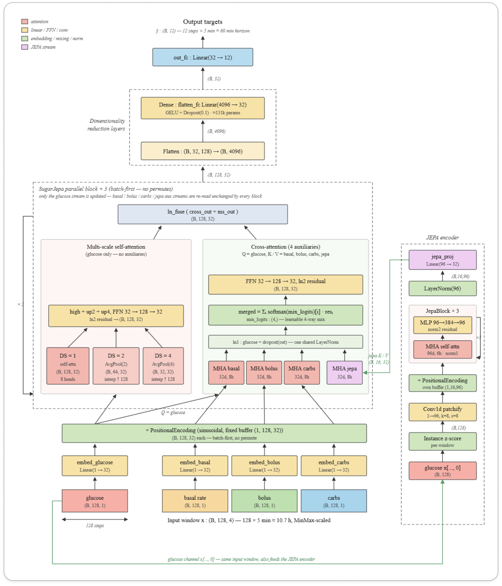
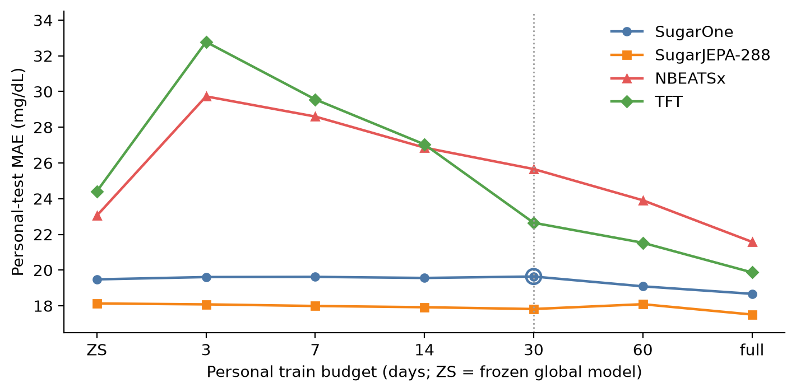

# Introduction

A CGM reports an excursion after it has begun (Schmelzeisen-Redeker et al. 2015). A 60-minute forecast—12 steps at 5-minute sampling—is the task of this paper. A population model can be served immediately. Personal history arrives slowly. After $`N`$ days of one person’s data, is the fine-tuned checkpoint safe to serve?

Glucose forecasting papers usually report a frozen global model, or one adapted model trained on all available personal data, or both (Sergazinov et al. 2023; Zhu et al. 2023). They rarely show the budgets in between. If 3–30 days of fine-tuning raise MAE, “always adapt” is the wrong rule. The system needs a gate: keep the frozen weights until the path is no longer harmful.

This paper treats personalization as a *curve*. We introduce **SugarOne**: the GluMind parallel dual-attention design (Farahmand et al. 2025) retargeted to covariates a commodity CGM plus an insulin record actually has (Section <a href="#sec:sugarone" data-reference-type="ref" data-reference="sec:sugarone">3.3</a>). SugarOne has no prior paper; it is specified here because it is the backbone we fine-tune. **SugarJEPA-288** adds a CGM-JEPA embedding (Muhammad et al. 2026) as a fourth stream. We compare day-budget curves on the same seven T1DM people against SugarOne and NeuralForecast continue-fit (Olivares et al. 2022, 2023; Lim et al. 2021).

Contributions:

- SugarOne: GluMind blocks on commodity covariates, our hyperparameters, and a joined Loop + AI-READI corpus.

- Personalization scored as a path (zero-shot, then 3, 7, 14, 30, 60, and full history) with a named smoothness check.

- On this cohort, a JEPA feature raises the day-zero floor and keeps short fine-tunes non-harmful. Frozen SugarJEPA-288 beats 30-day SugarOne for all seven users.

# Related work

#### Glucose transformers.

GluMind uses parallel cross-attention and multi-scale self-attention on glucose, heart rate, and steps (Farahmand et al. 2025). Gluformer and related attention models forecast from CGM with optional personalization (Sergazinov et al. 2023). We keep GluMind’s block design and change covariates, mixing, size, and training data (Section <a href="#sec:sugarone" data-reference-type="ref" data-reference="sec:sugarone">3.3</a>). We do not run a GluMind-versus-SugarOne leaderboard.

#### Self-supervised CGM.

CGM-JEPA learns glucose representations with a joint-embedding predictive objective (Muhammad et al. 2026). We use that idea as an extra *supervised-forecast* stream, pretrained on our train split. This is not a new foundation model.

#### Personalization and baselines.

Fine-tuning and meta-learning for T1DM typically yield one adapted model (Zhu et al. 2023). GlucoBench standardizes public CGM forecasting (Sergazinov et al. 2024) but not day-budget adaptation curves. We use NBEATSx and TFT, via NeuralForecast, as continue-fit baselines (Olivares et al. 2023, 2022; Lim et al. 2021).

# Method

## Task

Each model maps a lookback window to the next $`H=12`$ glucose values (60 minutes). The lead metric is MAE in mg/dL. Tables also report RMSE and MARD. The horizon is the same for every model.

## Data and two tests

Raw CGM and pump exports are resampled to a 5-minute grid and gap-filled with `glucose_data_processing` (GlucoseDAO 2026). We vertically join AI-READI-style wearable CGM (AI-READI Consortium 2024) and Loop T1DM pump records into one loop-style table (`loop_ai_ready_joined2.csv`; 12.1 million rows; about half T1DM / half non-T1DM by row mass). Study groups are Healthy, Pre-T2DM, Oral-T2DM, Insulin-T2DM, and T1DM. AI-READI rows have empty insulin and carbohydrate fields (zero-filled). Sequence IDs are prefixed so the two sources cannot collide.

We use two evaluations. Mixing them is a wrong sentence.

**Global test.** The dataset `test` split of the joined table. Question: is this a competent population model?

**Personal test.** Seven T1DM users with long history: one personal pump export (Livia, $`\sim`$<!-- -->345 train days) and six Loop quality holdouts (Users 154, 556, 730, 1017, 1029, 1082). Each person’s CSV is split chronologically: last 25% test, 15% of the remainder validation, the rest train. A day budget shortens *train* only. Validation and test never change. User 1082 has $`\sim`$<!-- -->37 train days and no 60-day cell; 60-day means use $`n=6`$.

Eight short-wear AI-READI users ($`\sim`$<!-- -->6–9 train days, no insulin/carb channels) are not in the main curve. SugarJEPA-288 needs a one-day lookback; those series are a limitation, not a second cohort.

## SugarOne

SugarOne uses GluMind’s parallel dual-attention blocks (Farahmand et al. 2025). A linear layer maps each scalar channel to $`d_{\mathrm{model}}`$ and adds sinusoidal positional encoding. Each block has (i) cross-attention in which glucose embeddings are queries and each auxiliary supplies its own keys and values, and (ii) multi-scale self-attention on glucose at downsampling factors 1, 2, and 4. A two-layer MLP decodes 12 steps.

GluMind was built for wearable extras. SugarOne is the same design aimed at a commodity CGM plus an insulin record. Table <a href="#tab:glumind-vs-sugarone" data-reference-type="ref" data-reference="tab:glumind-vs-sugarone">1</a> is the difference. Fusion is learnable softmax mixing over the three auxiliary streams,
``` math
\mathbf{C}=\sum_{i=1}^{3}w_i\mathbf{C}_i,\qquad
w_i=\frac{\exp(\alpha_i)}{\sum_{j}\exp(\alpha_j)},
```
with $`\boldsymbol{\alpha}`$ initialized at zero (equal mix). We do not evaluate a GluMind checkpoint on the personalization curves. SugarOne is the control in the same family as SugarJEPA.

<div id="tab:glumind-vs-sugarone">

|                 |           GluMind           |           SugarOne           |
|:----------------|:---------------------------:|:----------------------------:|
| Auxiliaries     |      Heart rate, steps      | Basal, bolus, carbohydrates  |
| Fusion          |        Fixed average        |      Learnable softmax       |
| Lookback / size | 80 steps, 4 heads, 3 blocks | 128 steps, 8 heads, 5 blocks |
| Width           |          $`d=32`$           |           $`d=32`$           |
| Training table  |   Wearable AI-READI-style   |    Joined Loop + AI-READI    |

SugarOne is unpublished. It keeps GluMind’s blocks and changes covariates, mixing, size, and data.

</div>

## SugarJEPA

We pretrain a CGM-JEPA-style encoder (Muhammad et al. 2026) on the joined `train` split, glucose only. A random 5% of that split is held out for encoder validation and is never used for encoder training. The loss is SmoothL1 latent prediction plus an EMA teacher and a VICReg-style variance penalty (Bardes et al. 2022):
``` math
L=\mathrm{SmoothL1}(\hat{z},z)
+\lambda\frac{1}{E}\sum_{j=1}^{E}
\mathrm{ReLU}\bigl(\sigma_{\mathrm{target}}-\sigma_{c,j}\bigr),
```
where $`E`$ is the embedding size and $`\sigma_{c,j}`$ is the standard deviation of context-block representations on dimension $`j`$.

The encoder is attached as a fourth SugarOne branch, on the same footing as basal, bolus, and carbohydrates (Figure <a href="#fig:arch" data-reference-type="ref" data-reference="fig:arch">1</a>). Embeddings are layer-normalized and projected from 96 to 32 dimensions before cross-attention. If the encoder wants $`m`$ steps and SugarOne wants $`n=128`$, with $`m>n`$, each training window has length $`m`$: the encoder sees all $`m`$ points; SugarOne sees the last $`n`$.

During *global* SugarJEPA training the encoder is not frozen. It is updated at $`4\times10^{-5}`$; the rest of the model at $`4\times10^{-4}`$. The hero encoder is **jepa-288** (96 dimensions, 288 steps, one day of CGM). Other windows (128, 864, 2016) are in Appendix <a href="#app:windows" data-reference-type="ref" data-reference="app:windows">7</a>. Longer windows change which series can be scored; they are not the claim of this paper.

<figure id="fig:arch" data-latex-placement="t">

<figcaption>SugarJEPA: SugarOne branches (glucose, basal, bolus, carbohydrates) plus a JEPA auxiliary. Personal fine-tunes freeze the encoder and update the SugarOne weights.</figcaption>
</figure>

## Fine-tune protocol and smoothness

Each day budget is an independent run from the global checkpoint, not a curriculum. Scalers stay the global `scalers.json`; they are not refit on personal train. SugarJEPA personalization freezes the JEPA encoder and updates only the SugarOne weights. We use plain fine-tune ($`\lambda=0`$). Learning-without-Forgetting distillation (Li and Hoiem 2018) did not remove SugarOne’s short-budget harm on this protocol; we do not use it here.

NeuralForecast models continue-fit from the saved global bundle (`use_init_models=False`), with the same idea: the day budget shortens train; the personal test split is frozen (Olivares et al. 2022).

There is no 1-day point on the main figure. SugarJEPA-288’s lookback is already one day of CGM, so a 1-day train slice cannot form a window. All models on Figure <a href="#fig:curves" data-reference-type="ref" data-reference="fig:curves">2</a> use zero-shot, then 3, 7, 14, 30, 60, and full history. Models that can form a 128-step window at 1 day are in Appendix <a href="#app:oneday" data-reference-type="ref" data-reference="app:oneday">9</a>.

Smoothness, in this paper, is three checks on *mean* personal-test MAE over the seven users (60-day means: $`n=6`$):

1.  **Non-harmful.** MAE at budget $`t`$ is not worse than that model’s own zero-shot.

2.  **Early gain.** Mean MAE falls below zero-shot before 60 days.

3.  **Terminal gain.** Full-history MAE is below that model’s zero-shot.

We do not claim the path is monotonic for every user.

The main figure has four curves: SugarOne, SugarJEPA-288, NBEATSx (harmful short continue-fit), and TFT (helps by 30 days on average). Other NeuralForecast models are in Appendix <a href="#app:nf" data-reference-type="ref" data-reference="app:nf">8</a>.

# Results

## Global test

Table <a href="#tab:global" data-reference-type="ref" data-reference="tab:global">2</a> is the joined-corpus holdout, not the personal chronological test. All four models are scored on the dataset `test` split. NBEATSx and TFT are the global NeuralForecast bundles used for continue-fit. These models are not weak toys. Personal zero-shot MAE on the seven T1DM users is higher for every model (Section <a href="#sec:paths" data-reference-type="ref" data-reference="sec:paths">4.2</a>); that is a different test.

<div id="tab:global">

| Model         |  MAE  | RMSE  | MARD  |
|:--------------|:-----:|:-----:|:-----:|
| SugarOne      | 12.41 | 19.05 | 9.90% |
| SugarJEPA-288 | 11.37 | 17.63 | 9.08% |
| NBEATSx       | 11.81 | 19.10 | 8.05% |
| TFT           | 12.69 | 20.36 | 8.47% |

Joined-corpus holdout (global test). Dataset `test` split. NBEATSx and TFT are the global NeuralForecast bundles used for continue-fit. SugarJEPA-864/2016 are omitted; they score a smaller population of long series.

</div>

## Personalization paths

Frozen SugarJEPA-288 has lower personal-test MAE than SugarOne fine-tuned for 30 days, for all seven T1DM users in this study (Table <a href="#tab:slice" data-reference-type="ref" data-reference="tab:slice">3</a>). That is one slice. Figure <a href="#fig:curves" data-reference-type="ref" data-reference="fig:curves">2</a> is the path.

<figure id="fig:curves" data-latex-placement="t">

<figcaption>Mean personal-test MAE versus train-day budget on seven T1DM users (60-day means: <span class="math inline"><em>n</em> = 6</span>). Dotted line: 30-day SugarOne point. There is no 1-day budget: SugarJEPA-288 cannot form a window from one day of train.</figcaption>
</figure>

SugarOne starts at 19.48 mg/dL. Mean MAE stays at or above that floor through 30 days (19.64) and only then falls (19.09 at 60 days; 18.67 at full history). Check 1 fails at 3–30 days. Checks 2–3 hold only after the 60-day mark.

NBEATSx starts worse on this personal test (23.05) despite a competitive global holdout. Continue-fit is harmful through 30 days (25.66) and still above zero-shot at 60 days (23.91). Full history recovers (21.58). The gate is mandatory.

TFT starts at 24.41. At 3–14 days the mean is *higher* than zero-shot (32.78, 29.56, 27.04). By 30 days the mean is below zero-shot (22.65) and full history is 19.87. TFT is not a smooth path from day 3. It is a delayed-gain exception among the NeuralForecast models we plot: useful from about 30 days, costly before that.

SugarJEPA-288 starts at 18.13—already below 30-day SugarOne. From 3 days the mean stays at or below its own zero-shot (18.08, 17.99, 17.92, 17.82; 18.09 at 60 days, still $`\le`$ 18.13) and ends at 17.51. All three checks hold on the mean. Single users can dip; we do not claim monotonicity per person.

User 1082 is the short T1DM history ($`\sim`$<!-- -->37 train days). SugarOne’s full fine-tune is worse than frozen (17.00 $`\rightarrow`$ 17.79). SugarJEPA-288 stays flat (15.17 $`\rightarrow`$ 15.19). That is evidence for a gate, not a reason to drop the user.

## The 30-day slice

Thirty days is a budget at which a clinic might first try to personalize, and at which SugarOne’s mean gain is still about zero. Table <a href="#tab:slice" data-reference-type="ref" data-reference="tab:slice">3</a> holds for every user in this study. The same “all seven” sentence is false against SugarOne’s *full* fine-tune: Livia (16.98) and User 1017 (16.95) beat frozen SugarJEPA-288 (17.64 and 17.41). Thirty days is the honest quote because it sits on Figure <a href="#fig:curves" data-reference-type="ref" data-reference="fig:curves">2</a>, not because it replaces the figure.

<div id="tab:slice">

| User  | SugarJEPA-288 ZS | SugarOne @ 30 d | Margin |
|:------|:----------------:|:---------------:|:------:|
| Livia |      17.64       |      18.06      |  0.42  |
| 154   |      23.13       |      24.84      |  1.70  |
| 556   |      17.22       |      17.65      |  0.43  |
| 730   |      16.02       |      18.23      |  2.21  |
| 1017  |      17.41       |      18.30      |  0.90  |
| 1029  |      20.30       |      22.81      |  2.51  |
| 1082  |      15.17       |      17.60      |  2.43  |

Personal-test MAE (mg/dL). Frozen SugarJEPA-288 versus SugarOne fine-tuned for 30 days. All seven T1DM users in this study.

</div>

## Fine-tuning SugarJEPA-288

A better frozen model can still adapt. With the JEPA encoder held fixed, mean personal MAE versus SugarJEPA-288’s own zero-shot is $`-0.05`$ at 3 days, $`-0.31`$ at 30 days, $`-0.04`$ at 60 days ($`n=6`$), and $`-0.62`$ at full history. Smoothness is not “refuse to fine-tune.” The path is usable, and full history still helps. That is a better system than waiting 60 days to fine-tune SugarOne.

# Discussion

SugarOne and NBEATSx need a rule: keep frozen weights until enough days exist. On this cohort SugarJEPA-288 can be adapted from 3 days without a mean MAE penalty. TFT shows that a NeuralForecast model can recover by 30 days; it does not show a non-harmful 3–14 day path, and its personal zero-shot is weaker than SugarOne’s. The JEPA feature is not “the only smooth model.” It is the model that is both better on day zero and non-harmful on the early path.

The 30-day slice is the cleanest single sentence. It compares two models at two budgets. A reviewer can say we compared a stronger global model to a weaker model’s short fine-tune. Figure <a href="#fig:curves" data-reference-type="ref" data-reference="fig:curves">2</a> is the answer: when SugarJEPA-288 is itself fine-tuned, the path does not go through a valley.

Limits. The personal cohort is seven T1DM users. Short-wear AI-READI series are out of the main figure. SugarJEPA-288’s lookback is one day versus SugarOne’s 10.7 hours; a matched 128-step encoder is in Appendix <a href="#app:windows" data-reference-type="ref" data-reference="app:windows">7</a> and still starts below SugarOne, with a slightly smaller margin. Smoothness is not a theorem. We did not put a GluMind checkpoint on these curves. We make no clinical deployment claim.

# Conclusion

Personalization of a 60-minute glucose forecast should be scored as a path, not only as zero-shot and full-history endpoints. Adding a frozen CGM-JEPA feature to SugarOne raises the day-zero floor and keeps short fine-tunes non-harmful on seven T1DM users. Frozen SugarJEPA-288 beats 30-day SugarOne for every user in that set.

# Other JEPA windows

Table <a href="#tab:encoders" data-reference-type="ref" data-reference="tab:encoders">4</a> lists the encoders that were trained. The main text uses jepa-288 only. Table <a href="#tab:all-ft" data-reference-type="ref" data-reference="tab:all-ft">5</a> is the full personal-test grid from the JEPA source draft. Empty cells are missing runs, not zeros: a window needs lookback plus horizon, so 1-day train is undefined for jepa-288 and short budgets drop for 864/2016. User 1082 has no 60-day cell. jepa-2016 has no rows for Users 1017 and 1082; do not average those people in. jepa-2016 can *raise* MAE at full fine-tune (mean 19.77 versus zero-shot 18.96). Longer context is not a smoother adapter. Global MAE for 864/2016 looks better in part because those encoders score fewer, longer series (Healthy windows fall from 194k at 288 steps to 49k at 2016). That is why they are not in Table <a href="#tab:global" data-reference-type="ref" data-reference="tab:global">2</a>.

<div id="tab:encoders">

| Encoder     | Embedding dim. |   Context    |
|:------------|:--------------:|:------------:|
| jepa-128-64 |       64       | 128 (10.7 h) |
| jepa-128    |       96       | 128 (10.7 h) |
| jepa-288    |       96       |  288 (1 d)   |
| jepa-864    |       96       |  864 (3 d)   |
| jepa-2016   |       96       |  2016 (7 d)  |

JEPA encoder variants. Only jepa-288 is in the main figure.

</div>

Mean personal zero-shot MAE: SugarOne 19.48; jepa-128-64 19.00; jepa-128 18.87; jepa-288 18.13. The 128-step encoders match SugarOne’s lookback and still start lower. They are a fairer architecture comparison; jepa-288 is the smoother hero curve we locked.

<div id="tab:all-ft">

<table>
<caption>Personal-test MAE (mg/dL) by user and day budget. Source: JEPA draft table. Means do not fill empty cells with zeros.</caption>
<thead>
<tr>
<th style="text-align: left;">Model</th>
<th style="text-align: center;">ZS</th>
<th style="text-align: center;">1d</th>
<th style="text-align: center;">3d</th>
<th style="text-align: center;">7d</th>
<th style="text-align: center;">14d</th>
<th style="text-align: center;">30d</th>
<th style="text-align: center;">60d</th>
<th style="text-align: center;">All</th>
</tr>
</thead>
<tbody>
<tr>
<td colspan="9" style="text-align: left;"><em>Livia</em></td>
</tr>
<tr>
<td style="text-align: left;">SugarOne</td>
<td style="text-align: center;">18.31</td>
<td style="text-align: center;">18.42</td>
<td style="text-align: center;">18.60</td>
<td style="text-align: center;">18.88</td>
<td style="text-align: center;">18.48</td>
<td style="text-align: center;">18.06</td>
<td style="text-align: center;">17.54</td>
<td style="text-align: center;">16.98</td>
</tr>
<tr>
<td style="text-align: left;">jepa-128-64</td>
<td style="text-align: center;">18.05</td>
<td style="text-align: center;">19.14</td>
<td style="text-align: center;">17.56</td>
<td style="text-align: center;">17.30</td>
<td style="text-align: center;">17.26</td>
<td style="text-align: center;">17.31</td>
<td style="text-align: center;">16.90</td>
<td style="text-align: center;">16.76</td>
</tr>
<tr>
<td style="text-align: left;">jepa-128</td>
<td style="text-align: center;">17.67</td>
<td style="text-align: center;">18.10</td>
<td style="text-align: center;">17.55</td>
<td style="text-align: center;">17.24</td>
<td style="text-align: center;">17.24</td>
<td style="text-align: center;">17.20</td>
<td style="text-align: center;">16.95</td>
<td style="text-align: center;">16.69</td>
</tr>
<tr>
<td style="text-align: left;">jepa-288</td>
<td style="text-align: center;">17.64</td>
<td style="text-align: center;">—</td>
<td style="text-align: center;">17.61</td>
<td style="text-align: center;">17.21</td>
<td style="text-align: center;">17.09</td>
<td style="text-align: center;">17.12</td>
<td style="text-align: center;">16.83</td>
<td style="text-align: center;">16.53</td>
</tr>
<tr>
<td style="text-align: left;">jepa-864</td>
<td style="text-align: center;">17.97</td>
<td style="text-align: center;">—</td>
<td style="text-align: center;">—</td>
<td style="text-align: center;">17.91</td>
<td style="text-align: center;">17.69</td>
<td style="text-align: center;">17.96</td>
<td style="text-align: center;">17.42</td>
<td style="text-align: center;">16.69</td>
</tr>
<tr>
<td style="text-align: left;">jepa-2016</td>
<td style="text-align: center;">18.61</td>
<td style="text-align: center;">—</td>
<td style="text-align: center;">—</td>
<td style="text-align: center;">—</td>
<td style="text-align: center;">18.07</td>
<td style="text-align: center;">18.15</td>
<td style="text-align: center;">17.46</td>
<td style="text-align: center;">17.79</td>
</tr>
<tr>
<td colspan="9" style="text-align: left;"><em>User 154</em></td>
</tr>
<tr>
<td style="text-align: left;">SugarOne</td>
<td style="text-align: center;">24.61</td>
<td style="text-align: center;">24.74</td>
<td style="text-align: center;">24.57</td>
<td style="text-align: center;">24.57</td>
<td style="text-align: center;">24.57</td>
<td style="text-align: center;">24.84</td>
<td style="text-align: center;">24.81</td>
<td style="text-align: center;">24.12</td>
</tr>
<tr>
<td style="text-align: left;">jepa-128-64</td>
<td style="text-align: center;">25.40</td>
<td style="text-align: center;">24.89</td>
<td style="text-align: center;">24.30</td>
<td style="text-align: center;">24.30</td>
<td style="text-align: center;">24.30</td>
<td style="text-align: center;">24.47</td>
<td style="text-align: center;">24.01</td>
<td style="text-align: center;">23.64</td>
</tr>
<tr>
<td style="text-align: left;">jepa-128</td>
<td style="text-align: center;">25.48</td>
<td style="text-align: center;">25.22</td>
<td style="text-align: center;">24.59</td>
<td style="text-align: center;">24.59</td>
<td style="text-align: center;">24.59</td>
<td style="text-align: center;">24.67</td>
<td style="text-align: center;">24.33</td>
<td style="text-align: center;">23.90</td>
</tr>
<tr>
<td style="text-align: left;">jepa-288</td>
<td style="text-align: center;">23.13</td>
<td style="text-align: center;">—</td>
<td style="text-align: center;">22.84</td>
<td style="text-align: center;">22.84</td>
<td style="text-align: center;">22.84</td>
<td style="text-align: center;">22.82</td>
<td style="text-align: center;">22.87</td>
<td style="text-align: center;">22.66</td>
</tr>
<tr>
<td style="text-align: left;">jepa-864</td>
<td style="text-align: center;">22.74</td>
<td style="text-align: center;">—</td>
<td style="text-align: center;">—</td>
<td style="text-align: center;">—</td>
<td style="text-align: center;">—</td>
<td style="text-align: center;">—</td>
<td style="text-align: center;">—</td>
<td style="text-align: center;">22.58</td>
</tr>
<tr>
<td style="text-align: left;">jepa-2016</td>
<td style="text-align: center;">21.93</td>
<td style="text-align: center;">—</td>
<td style="text-align: center;">—</td>
<td style="text-align: center;">—</td>
<td style="text-align: center;">—</td>
<td style="text-align: center;">—</td>
<td style="text-align: center;">—</td>
<td style="text-align: center;">27.28</td>
</tr>
<tr>
<td colspan="9" style="text-align: left;"><em>User 556</em></td>
</tr>
<tr>
<td style="text-align: left;">SugarOne</td>
<td style="text-align: center;">18.10</td>
<td style="text-align: center;">17.74</td>
<td style="text-align: center;">18.00</td>
<td style="text-align: center;">17.89</td>
<td style="text-align: center;">18.40</td>
<td style="text-align: center;">17.65</td>
<td style="text-align: center;">17.25</td>
<td style="text-align: center;">17.39</td>
</tr>
<tr>
<td style="text-align: left;">jepa-128-64</td>
<td style="text-align: center;">17.52</td>
<td style="text-align: center;">17.47</td>
<td style="text-align: center;">17.40</td>
<td style="text-align: center;">17.36</td>
<td style="text-align: center;">17.50</td>
<td style="text-align: center;">17.19</td>
<td style="text-align: center;">16.90</td>
<td style="text-align: center;">16.92</td>
</tr>
<tr>
<td style="text-align: left;">jepa-128</td>
<td style="text-align: center;">17.46</td>
<td style="text-align: center;">17.79</td>
<td style="text-align: center;">17.52</td>
<td style="text-align: center;">17.55</td>
<td style="text-align: center;">17.64</td>
<td style="text-align: center;">17.61</td>
<td style="text-align: center;">17.25</td>
<td style="text-align: center;">17.01</td>
</tr>
<tr>
<td style="text-align: left;">jepa-288</td>
<td style="text-align: center;">17.22</td>
<td style="text-align: center;">—</td>
<td style="text-align: center;">16.94</td>
<td style="text-align: center;">16.94</td>
<td style="text-align: center;">16.96</td>
<td style="text-align: center;">17.11</td>
<td style="text-align: center;">17.03</td>
<td style="text-align: center;">16.65</td>
</tr>
<tr>
<td style="text-align: left;">jepa-864</td>
<td style="text-align: center;">16.46</td>
<td style="text-align: center;">—</td>
<td style="text-align: center;">—</td>
<td style="text-align: center;">16.38</td>
<td style="text-align: center;">16.62</td>
<td style="text-align: center;">16.52</td>
<td style="text-align: center;">16.60</td>
<td style="text-align: center;">16.00</td>
</tr>
<tr>
<td style="text-align: left;">jepa-2016</td>
<td style="text-align: center;">15.30</td>
<td style="text-align: center;">—</td>
<td style="text-align: center;">—</td>
<td style="text-align: center;">—</td>
<td style="text-align: center;">19.69</td>
<td style="text-align: center;">15.18</td>
<td style="text-align: center;">15.49</td>
<td style="text-align: center;">15.49</td>
</tr>
<tr>
<td colspan="9" style="text-align: left;"><em>User 730</em></td>
</tr>
<tr>
<td style="text-align: left;">SugarOne</td>
<td style="text-align: center;">18.06</td>
<td style="text-align: center;">18.27</td>
<td style="text-align: center;">18.42</td>
<td style="text-align: center;">18.31</td>
<td style="text-align: center;">18.02</td>
<td style="text-align: center;">18.23</td>
<td style="text-align: center;">16.52</td>
<td style="text-align: center;">16.50</td>
</tr>
<tr>
<td style="text-align: left;">jepa-128-64</td>
<td style="text-align: center;">16.35</td>
<td style="text-align: center;">16.43</td>
<td style="text-align: center;">16.50</td>
<td style="text-align: center;">16.24</td>
<td style="text-align: center;">16.23</td>
<td style="text-align: center;">16.39</td>
<td style="text-align: center;">16.13</td>
<td style="text-align: center;">16.06</td>
</tr>
<tr>
<td style="text-align: left;">jepa-128</td>
<td style="text-align: center;">16.36</td>
<td style="text-align: center;">16.44</td>
<td style="text-align: center;">16.46</td>
<td style="text-align: center;">16.24</td>
<td style="text-align: center;">16.31</td>
<td style="text-align: center;">16.47</td>
<td style="text-align: center;">16.24</td>
<td style="text-align: center;">16.14</td>
</tr>
<tr>
<td style="text-align: left;">jepa-288</td>
<td style="text-align: center;">16.02</td>
<td style="text-align: center;">—</td>
<td style="text-align: center;">15.90</td>
<td style="text-align: center;">15.92</td>
<td style="text-align: center;">15.80</td>
<td style="text-align: center;">15.73</td>
<td style="text-align: center;">15.71</td>
<td style="text-align: center;">15.62</td>
</tr>
<tr>
<td style="text-align: left;">jepa-864</td>
<td style="text-align: center;">16.17</td>
<td style="text-align: center;">—</td>
<td style="text-align: center;">—</td>
<td style="text-align: center;">16.05</td>
<td style="text-align: center;">16.05</td>
<td style="text-align: center;">16.04</td>
<td style="text-align: center;">15.91</td>
<td style="text-align: center;">15.83</td>
</tr>
<tr>
<td style="text-align: left;">jepa-2016</td>
<td style="text-align: center;">14.73</td>
<td style="text-align: center;">—</td>
<td style="text-align: center;">—</td>
<td style="text-align: center;">—</td>
<td style="text-align: center;">14.95</td>
<td style="text-align: center;">14.93</td>
<td style="text-align: center;">15.75</td>
<td style="text-align: center;">15.39</td>
</tr>
<tr>
<td colspan="9" style="text-align: left;"><em>User 1017</em></td>
</tr>
<tr>
<td style="text-align: left;">SugarOne</td>
<td style="text-align: center;">17.69</td>
<td style="text-align: center;">17.85</td>
<td style="text-align: center;">17.89</td>
<td style="text-align: center;">17.91</td>
<td style="text-align: center;">18.01</td>
<td style="text-align: center;">18.30</td>
<td style="text-align: center;">17.38</td>
<td style="text-align: center;">16.95</td>
</tr>
<tr>
<td style="text-align: left;">jepa-128-64</td>
<td style="text-align: center;">18.20</td>
<td style="text-align: center;">17.88</td>
<td style="text-align: center;">17.95</td>
<td style="text-align: center;">17.96</td>
<td style="text-align: center;">17.93</td>
<td style="text-align: center;">17.72</td>
<td style="text-align: center;">16.89</td>
<td style="text-align: center;">16.62</td>
</tr>
<tr>
<td style="text-align: left;">jepa-128</td>
<td style="text-align: center;">17.97</td>
<td style="text-align: center;">17.81</td>
<td style="text-align: center;">17.80</td>
<td style="text-align: center;">17.78</td>
<td style="text-align: center;">17.88</td>
<td style="text-align: center;">17.63</td>
<td style="text-align: center;">17.00</td>
<td style="text-align: center;">16.75</td>
</tr>
<tr>
<td style="text-align: left;">jepa-288</td>
<td style="text-align: center;">17.41</td>
<td style="text-align: center;">—</td>
<td style="text-align: center;">17.37</td>
<td style="text-align: center;">17.37</td>
<td style="text-align: center;">16.93</td>
<td style="text-align: center;">16.94</td>
<td style="text-align: center;">16.58</td>
<td style="text-align: center;">16.38</td>
</tr>
<tr>
<td style="text-align: left;">jepa-864</td>
<td style="text-align: center;">16.62</td>
<td style="text-align: center;">—</td>
<td style="text-align: center;">—</td>
<td style="text-align: center;">—</td>
<td style="text-align: center;">—</td>
<td style="text-align: center;">16.85</td>
<td style="text-align: center;">17.01</td>
<td style="text-align: center;">16.83</td>
</tr>
<tr>
<td style="text-align: left;">jepa-2016</td>
<td style="text-align: center;">—</td>
<td style="text-align: center;">—</td>
<td style="text-align: center;">—</td>
<td style="text-align: center;">—</td>
<td style="text-align: center;">—</td>
<td style="text-align: center;">—</td>
<td style="text-align: center;">—</td>
<td style="text-align: center;">—</td>
</tr>
<tr>
<td colspan="9" style="text-align: left;"><em>User 1029</em></td>
</tr>
<tr>
<td style="text-align: left;">SugarOne</td>
<td style="text-align: center;">22.62</td>
<td style="text-align: center;">22.66</td>
<td style="text-align: center;">22.67</td>
<td style="text-align: center;">22.68</td>
<td style="text-align: center;">22.22</td>
<td style="text-align: center;">22.81</td>
<td style="text-align: center;">21.04</td>
<td style="text-align: center;">20.94</td>
</tr>
<tr>
<td style="text-align: left;">jepa-128-64</td>
<td style="text-align: center;">20.93</td>
<td style="text-align: center;">20.97</td>
<td style="text-align: center;">20.88</td>
<td style="text-align: center;">20.49</td>
<td style="text-align: center;">20.57</td>
<td style="text-align: center;">20.40</td>
<td style="text-align: center;">19.96</td>
<td style="text-align: center;">19.90</td>
</tr>
<tr>
<td style="text-align: left;">jepa-128</td>
<td style="text-align: center;">20.60</td>
<td style="text-align: center;">20.81</td>
<td style="text-align: center;">20.56</td>
<td style="text-align: center;">20.41</td>
<td style="text-align: center;">20.36</td>
<td style="text-align: center;">20.24</td>
<td style="text-align: center;">20.04</td>
<td style="text-align: center;">20.01</td>
</tr>
<tr>
<td style="text-align: left;">jepa-288</td>
<td style="text-align: center;">20.30</td>
<td style="text-align: center;">—</td>
<td style="text-align: center;">20.28</td>
<td style="text-align: center;">20.28</td>
<td style="text-align: center;">20.78</td>
<td style="text-align: center;">19.94</td>
<td style="text-align: center;">19.52</td>
<td style="text-align: center;">19.55</td>
</tr>
<tr>
<td style="text-align: left;">jepa-864</td>
<td style="text-align: center;">19.37</td>
<td style="text-align: center;">—</td>
<td style="text-align: center;">—</td>
<td style="text-align: center;">—</td>
<td style="text-align: center;">—</td>
<td style="text-align: center;">—</td>
<td style="text-align: center;">20.38</td>
<td style="text-align: center;">19.45</td>
</tr>
<tr>
<td style="text-align: left;">jepa-2016</td>
<td style="text-align: center;">24.22</td>
<td style="text-align: center;">—</td>
<td style="text-align: center;">—</td>
<td style="text-align: center;">—</td>
<td style="text-align: center;">—</td>
<td style="text-align: center;">—</td>
<td style="text-align: center;">—</td>
<td style="text-align: center;">22.91</td>
</tr>
<tr>
<td colspan="9" style="text-align: left;"><em>User 1082</em></td>
</tr>
<tr>
<td style="text-align: left;">SugarOne</td>
<td style="text-align: center;">17.00</td>
<td style="text-align: center;">16.97</td>
<td style="text-align: center;">17.08</td>
<td style="text-align: center;">17.13</td>
<td style="text-align: center;">17.20</td>
<td style="text-align: center;">17.60</td>
<td style="text-align: center;">—</td>
<td style="text-align: center;">17.79</td>
</tr>
<tr>
<td style="text-align: left;">jepa-128-64</td>
<td style="text-align: center;">16.54</td>
<td style="text-align: center;">16.55</td>
<td style="text-align: center;">16.55</td>
<td style="text-align: center;">16.36</td>
<td style="text-align: center;">16.41</td>
<td style="text-align: center;">16.56</td>
<td style="text-align: center;">—</td>
<td style="text-align: center;">16.65</td>
</tr>
<tr>
<td style="text-align: left;">jepa-128</td>
<td style="text-align: center;">16.57</td>
<td style="text-align: center;">16.54</td>
<td style="text-align: center;">16.54</td>
<td style="text-align: center;">16.48</td>
<td style="text-align: center;">16.51</td>
<td style="text-align: center;">16.62</td>
<td style="text-align: center;">—</td>
<td style="text-align: center;">16.66</td>
</tr>
<tr>
<td style="text-align: left;">jepa-288</td>
<td style="text-align: center;">15.17</td>
<td style="text-align: center;">—</td>
<td style="text-align: center;">15.59</td>
<td style="text-align: center;">15.36</td>
<td style="text-align: center;">15.04</td>
<td style="text-align: center;">15.10</td>
<td style="text-align: center;">—</td>
<td style="text-align: center;">15.19</td>
</tr>
<tr>
<td style="text-align: left;">jepa-864</td>
<td style="text-align: center;">14.78</td>
<td style="text-align: center;">—</td>
<td style="text-align: center;">—</td>
<td style="text-align: center;">14.83</td>
<td style="text-align: center;">14.97</td>
<td style="text-align: center;">14.97</td>
<td style="text-align: center;">—</td>
<td style="text-align: center;">14.97</td>
</tr>
<tr>
<td style="text-align: left;">jepa-2016</td>
<td style="text-align: center;">—</td>
<td style="text-align: center;">—</td>
<td style="text-align: center;">—</td>
<td style="text-align: center;">—</td>
<td style="text-align: center;">—</td>
<td style="text-align: center;">—</td>
<td style="text-align: center;">—</td>
<td style="text-align: center;">—</td>
</tr>
<tr>
<td colspan="9" style="text-align: left;"><em>Mean</em></td>
</tr>
<tr>
<td style="text-align: left;">SugarOne</td>
<td style="text-align: center;">19.48</td>
<td style="text-align: center;">19.52</td>
<td style="text-align: center;">19.61</td>
<td style="text-align: center;">19.62</td>
<td style="text-align: center;">19.56</td>
<td style="text-align: center;">19.64</td>
<td style="text-align: center;">19.09</td>
<td style="text-align: center;">18.67</td>
</tr>
<tr>
<td style="text-align: left;">jepa-128-64</td>
<td style="text-align: center;">19.00</td>
<td style="text-align: center;">19.05</td>
<td style="text-align: center;">18.74</td>
<td style="text-align: center;">18.57</td>
<td style="text-align: center;">18.60</td>
<td style="text-align: center;">18.58</td>
<td style="text-align: center;">18.47</td>
<td style="text-align: center;">18.08</td>
</tr>
<tr>
<td style="text-align: left;">jepa-128</td>
<td style="text-align: center;">18.87</td>
<td style="text-align: center;">18.96</td>
<td style="text-align: center;">18.72</td>
<td style="text-align: center;">18.61</td>
<td style="text-align: center;">18.65</td>
<td style="text-align: center;">18.63</td>
<td style="text-align: center;">18.64</td>
<td style="text-align: center;">18.16</td>
</tr>
<tr>
<td style="text-align: left;">jepa-288</td>
<td style="text-align: center;">18.13</td>
<td style="text-align: center;">—</td>
<td style="text-align: center;">18.08</td>
<td style="text-align: center;">17.99</td>
<td style="text-align: center;">17.92</td>
<td style="text-align: center;">17.82</td>
<td style="text-align: center;">18.09</td>
<td style="text-align: center;">17.51</td>
</tr>
<tr>
<td style="text-align: left;">jepa-864</td>
<td style="text-align: center;">17.73</td>
<td style="text-align: center;">—</td>
<td style="text-align: center;">—</td>
<td style="text-align: center;">16.29</td>
<td style="text-align: center;">16.33</td>
<td style="text-align: center;">16.47</td>
<td style="text-align: center;">17.46</td>
<td style="text-align: center;">17.48</td>
</tr>
<tr>
<td style="text-align: left;">jepa-2016</td>
<td style="text-align: center;">18.96</td>
<td style="text-align: center;">—</td>
<td style="text-align: center;">—</td>
<td style="text-align: center;">—</td>
<td style="text-align: center;">17.57</td>
<td style="text-align: center;">16.09</td>
<td style="text-align: center;">16.23</td>
<td style="text-align: center;">19.77</td>
</tr>
</tbody>
</table>

</div>

# Other NeuralForecast models

N-HiTS on the same six T1DM users with $`\ge`$<!-- -->60 train days has mean continue-fit $`\Delta`$ $`+2.24`$ at 30 days (harmful), $`+0.16`$ at 60 days, and $`-1.92`$ at full history—the same shape as NBEATSx (Challu et al. 2023). Its joined-corpus test MAE is 11.94 (RMSE 19.38, MARD 8.08%), close to NBEATSx. LSTM is worse at 30 days ($`\Delta`$ $`+6.00`$) and weaker globally (test MAE 17.37, RMSE 26.30, MARD 11.57%). TiDE’s 30-day mean $`\Delta`$ is $`-7.01`$ (helpful) but its global test MAE is 16.12 (RMSE 24.01, MARD 11.07%), well above the models in Table <a href="#tab:global" data-reference-type="ref" data-reference="tab:global">2</a>. We left them off Figure <a href="#fig:curves" data-reference-type="ref" data-reference="fig:curves">2</a> so the harmful-path contrast is one curve (NBEATSx), not five.

# One-day fine-tune

SugarOne, jepa-128\*, and the NeuralForecast models can form a 128-step window from one day of train. SugarJEPA-288 cannot. Mean SugarOne MAE at 1 day is 19.52 (slightly above zero-shot 19.48). NBEATSx and TFT 1-day continue-fit are sharply harmful on several users (e.g. TFT User 1017: 21.70 $`\rightarrow`$ 52.81). Those points are omitted from Figure <a href="#fig:curves" data-reference-type="ref" data-reference="fig:curves">2</a> so every model shares the same x-axis.

<div id="refs" class="references csl-bib-body hanging-indent">

<div id="ref-aireadi2024" class="csl-entry">

AI-READI Consortium. 2024. “AI-READI: Rethinking AI Data Collection, Preparation and Sharing in Diabetes Research and Beyond.” *Nature Metabolism* 6: 2210–12. <https://doi.org/10.1038/s42255-024-01165-x>.

</div>

<div id="ref-bardes2022vicreg" class="csl-entry">

Bardes, Adrien, Jean Ponce, and Yann LeCun. 2022. “VICReg: Variance-Invariance-Covariance Regularization for Self-Supervised Learning.” *International Conference on Learning Representations*. <https://arxiv.org/abs/2105.04906>.

</div>

<div id="ref-challu2023nhits" class="csl-entry">

Challu, Cristian, Kin G. Olivares, Boris N. Oreshkin, Federico Garza Ramirez, Max Mergenthaler Canseco, and Artur Dubrawski. 2023. “NHITS: Neural Hierarchical Interpolation for Time Series Forecasting.” *Proceedings of the AAAI Conference on Artificial Intelligence* 37: 6989–97. <https://doi.org/10.1609/aaai.v37i6.25854>.

</div>

<div id="ref-farahmand2025glumind" class="csl-entry">

Farahmand, Ebrahim, Reza Rahimi Azghan, Nooshin Taheri Chatrudi, et al. 2025. “GluMind: Multimodal Parallel Attention and Knowledge Retention for Robust Cross-Population Blood Glucose Forecasting.” *arXiv Preprint arXiv:2509.18457*. <https://arxiv.org/abs/2509.18457>.

</div>

<div id="ref-glucosedataprocessing" class="csl-entry">

GlucoseDAO. 2026. *Glucose_data_processing*. <a href="https://github.com/GlucoseDAO/glucose_data_processing" class="uri">Https://github.com/GlucoseDAO/glucose_data_processing</a>.

</div>

<div id="ref-li2018lwf" class="csl-entry">

Li, Zhizhong, and Derek Hoiem. 2018. “Learning Without Forgetting.” *IEEE Transactions on Pattern Analysis and Machine Intelligence* 40 (12): 2935–47. <https://doi.org/10.1109/TPAMI.2017.2773081>.

</div>

<div id="ref-lim2021tft" class="csl-entry">

Lim, Bryan, Sercan Ö Arık, Nicolas Loeff, and Tomas Pfister. 2021. “Temporal Fusion Transformers for Interpretable Multi-Horizon Time Series Forecasting.” *International Journal of Forecasting* 37 (4): 1748–64. <https://doi.org/10.1016/j.ijforecast.2021.03.012>.

</div>

<div id="ref-muhammad2026cgmjepa" class="csl-entry">

Muhammad, Hada Melino, Zechen Li, Flora Salim, and Ahmed A. Metwally. 2026. “CGM-JEPA: Learning Consistent Continuous Glucose Monitor Representations via Predictive Self-Supervised Pretraining.” *arXiv Preprint arXiv:2605.00933*. <https://arxiv.org/abs/2605.00933>.

</div>

<div id="ref-olivares2023nbeatsx" class="csl-entry">

Olivares, Kin G., Cristian Challu, Grzegorz Marcjasz, Rafał Weron, and Artur Dubrawski. 2023. “Neural Basis Expansion Analysis with Exogenous Variables: Forecasting Electricity Prices with NBEATSx.” *International Journal of Forecasting* 39 (2): 884–900. <https://doi.org/10.1016/j.ijforecast.2022.03.001>.

</div>

<div id="ref-neuralforecast2022" class="csl-entry">

Olivares, Kin G., Cristian Challú, Azul Garza, Max Mergenthaler Canseco, and Artur Dubrawski. 2022. *NeuralForecast: User Friendly State-of-the-Art Neural Forecasting Models*. PyCon Salt Lake City, Utah, US. <https://github.com/Nixtla/neuralforecast>.

</div>

<div id="ref-schmelzeisen2015delay" class="csl-entry">

Schmelzeisen-Redeker, Günther, Arnd Staib, Michael Strasser, Ulrich Müller, and Michael Schoemaker. 2015. “Time Delay of CGM Sensors: Relevance, Causes, and Countermeasures.” *Journal of Diabetes Science and Technology* 9 (5): 1006–15. <https://doi.org/10.1177/1932296815590154>.

</div>

<div id="ref-sergazinov2022gluformer" class="csl-entry">

Sergazinov, Renat, Mohammadreza Armandpour, and Irina Gaynanova. 2023. “Gluformer: Transformer-Based Personalized Glucose Forecasting with Uncertainty Quantification.” *ICASSP 2023 — 2023 IEEE International Conference on Acoustics, Speech and Signal Processing (ICASSP)*, 1–5. <https://doi.org/10.1109/ICASSP49357.2023.10096419>.

</div>

<div id="ref-sergazinov2024glucobench" class="csl-entry">

Sergazinov, Renat, Elizabeth Chun, Valeriya Rogovchenko, Nathaniel Fernandes, Nicholas Kasman, and Irina Gaynanova. 2024. “GlucoBench: Curated List of Continuous Glucose Monitoring Datasets with Prediction Benchmarks.” *arXiv Preprint arXiv:2410.05780*. <https://arxiv.org/abs/2410.05780>.

</div>

<div id="ref-zhu2023personalized" class="csl-entry">

Zhu, Taiyu, Kezhi Li, Pau Herrero, and Pantelis Georgiou. 2023. “Personalized Blood Glucose Prediction for Type 1 Diabetes Using Evidential Deep Learning and Meta-Learning.” *IEEE Transactions on Biomedical Engineering* 70 (1): 193–204. <https://doi.org/10.1109/TBME.2022.3187703>.

</div>

</div>
