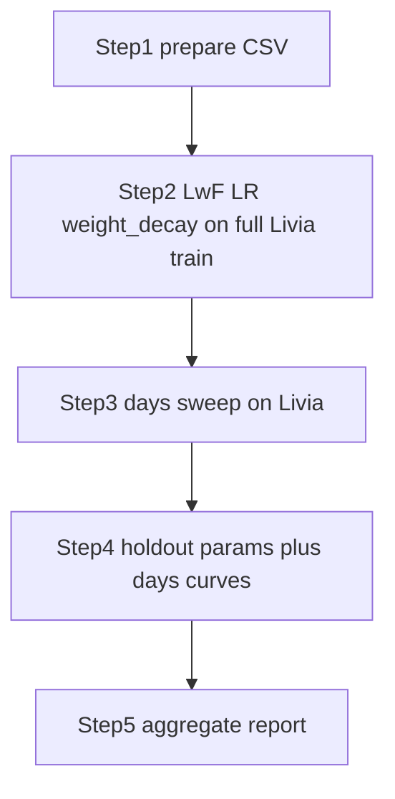

# Milestone 8 — Personalization Research Plan

## 1. Background

**Milestone (from `docs/milestones.pdf`):** Personalization and Fine-Tuning Analysis.

**Base model:** `test_model_sugar_one/` (SugarOne global checkpoint).

**Approach:** Per-user fine-tuning with **Learning without Forgetting (LwF)** — the frozen global model is the teacher; personal CGM/pump data drives adaptation. We first find the best LwF weight, learning rate, and weight decay on **all** personal train data, then study how many days of personal data are needed (plateau).

**Not in scope:** personal vs general data mixing (removed); cohort-level LwF in `train_sugar_one.py --mode continual`.

## 2. GluMind LwF starting point (`reports/glumind/`)

Before sweeping on Livia, we anchor the LwF search on prior GluMind continual-learning results:

| Report | Best continual run | Best `lwf_lambda` | Test MAE |
|--------|-------------------|-------------------|----------|
| [`AI_READY_PLUS_TYPE_1_TUNED_MODELS_RUNS_ANALYSIS.md`](../../reports/glumind/AI_READY_PLUS_TYPE_1_TUNED_MODELS_RUNS_ANALYSIS.md) | `glumind_continual_h12_20260226_011733` | **0.3** | 12.1975 |
| [`AI_READY_TUNED_MODELS_RUNS_ANALYSIS.md`](../../reports/glumind/AI_READY_TUNED_MODELS_RUNS_ANALYSIS.md) | `glumind_continual_h12_20260223_104653` | 0.2 | 11.4803 |

**Chosen starting point for SugarOne personalization:** `lwf_lambda = 0.3` from the **type-1** report (closest domain to loop/pump holdouts and T1DM cohort).

LwF analysis in the type-1 report (test-only):

| `lwf_lambda` | best_test_mae |
|--------------|---------------|
| 0.20 | 12.5037 |
| 0.25 | 12.4004 |
| **0.30** | **12.1975** |
| 0.35 | 12.3347 |

Our Step 2 grid mirrors this range: **`0.2, 0.25, 0.3, 0.35`** centered on the GluMind optimum.

## 3. Research questions

1. What **LwF lambda**, **learning rate**, and **weight_decay** work best when fine-tuning on full personal train data?
2. After hyperparameters are fixed, how does **number of personal train days** affect test MAE — and where is the **plateau**?
3. Do Livia hyperparameters transfer to Loop holdout users?
4. Is the **days → MAE curve** similar across people (Livia vs holdouts)? Document differences.

## 4. Experiment workflow

| Step | Script | Data | Purpose |
|------|--------|------|---------|
| **1** | `prepare_personal_csv.py` | Livia + holdouts | Chronological train/val/test |
| **2** | `sweep_hyperparams.py` | Livia, **full train** | Grid: LwF × LR × weight_decay |
| **3** | `sweep_data_size.py` | Livia | Days grid with fixed recipe; estimate plateau |
| **4** | `validate_holdouts.py` | 6 Loop holdouts | Phase A: frozen recipe; Phase B: days curves |
| **5** | `aggregate_results.py` | All runs | Merge summaries for report |



## 5. Protocol

### Chronological split (every subject)

- **Test:** last 25% of timeline — never used in fine-tuning
- **Val:** next 15% of remainder
- **Train:** everything earlier

### Step 2 — Hyperparameters (full personal train)

Use **all** personal train rows (`personal_days=None`).

| Parameter | Base value | Search grid |
|-----------|------------|-------------|
| **LwF lambda** | **0.3** (GluMind type-1 best) | `0.2, 0.25, 0.3, 0.35` |
| **Learning rate** | `4e-4` (`test_model_sugar_one/tuning_meta.json`) | `0.5×, 1×, 2×` base → `2e-4, 4e-4, 8e-4` |
| **weight_decay** | **`3e-5`** (`0.00003`, same as SugarOne training) | `0.5×, 1×, 2×` base → `1.5e-5, 3e-5, 6e-5` |
| **Patience** | from base model meta | `10` (fixed during sweep) |

Total combinations: 4 × 3 × 3 = **36 runs** on full Livia train data.

**Output:** `best_recipe.json` with `lwf_lambda`, `lr`, `weight_decay`, `patience`.

### Step 3 — Data size (fixed recipe)

- Days: `1, 3, 7, 14, 30, 60, all`
- Fixed `lwf_lambda`, `lr`, `weight_decay` from step 2
- Output: learning curve + `plateau_analysis.json` (`plateau_day`, `optimal_day`)

### Step 4 — Holdout validation

- Users: `154, 556, 730, 1017, 1029, 1082` (in `loop.csv`, not in `loop_ai_ready_joined2.csv`)
- **Phase A:** full-data fine-tune with frozen Livia recipe (no re-tuning)
- **Phase B:** same days grid per user; compare plateau to Livia in `validation_meta.json`

## 6. Commands

```bash
# Step 1 — Livia
uv run prepare-personal-csv livia \
  --input data/personalization/livia_glumind_ic_ready_full.csv \
  --out-dir data/personalization/prepared

# Step 2 — LwF × LR × weight_decay on full Livia train
uv run sweep-personal-hyperparams \
  --base-run-dir test_model_sugar_one \
  --personal-csv data/personalization/prepared/livia_chronological.csv \
  --out-dir runs/personalization/livia/sweeps/hyperparams \
  --device cuda

# Step 3 — Days curve (uses best_recipe.json)
uv run sweep-personal-data-size \
  --base-run-dir test_model_sugar_one \
  --personal-csv data/personalization/prepared/livia_chronological.csv \
  --recipe-json runs/personalization/livia/sweeps/hyperparams/best_recipe.json \
  --out-dir runs/personalization/livia/sweeps/data_size \
  --device cuda

# Step 4 — Holdouts
uv run validate-personal-holdouts \
  --base-run-dir test_model_sugar_one \
  --recipe-json runs/personalization/livia/sweeps/hyperparams/best_recipe.json \
  --livia-data-size-summary runs/personalization/livia/sweeps/data_size/summary.csv \
  --loop-csv data/loop_and_ai_ready/loop.csv \
  --out-dir runs/personalization/holdout_validation \
  --device cuda

# Step 5 — Aggregate
uv run aggregate-personal-results \
  --root runs/personalization \
  --out docs/reports/milestone8_personalization_summary.json
```

## 7. Success criteria

| Criterion | How |
|-----------|-----|
| ≥1 personalized model | Livia + ≥1 holdout |
| Global vs personalized | Zero-shot vs fine-tuned MAE |
| Data size vs performance | Step 3 curve + plateau |
| Transfer | Step 4 params + curve comparison |
| Reproducible | Seeds, split_meta, best_recipe.json |

## 8. Out of scope

- Personal vs general data mix
- GluMind HR/steps personalization
- SugarOne architecture changes
