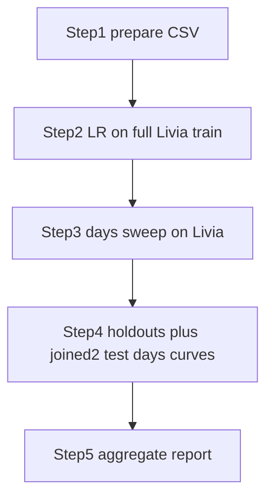

# Milestone 8 тАФ Personalization Research Plan

## 1. Background

**Milestone (from `docs/milestones.pdf`):** Personalization and Fine-Tuning Analysis.

**Base model:** `fixtures/checkpoints/sugar_one_1.0/` (SugarOne global checkpoint).

**Production approach:** **Plain fine-tune** on the global checkpoint тАФ load weights, train on one person's chronological CGM/pump data with `lwf_lambda=0` (no LwF teacher). This matches the use case: the personalized model is deployed **only for that user**. Experiments showed ~**10├Ч faster** training vs LwF=0.3 with sparse windows (stride=6).

**Fixed recipe defaults (not swept):**

- `lwf_lambda = 0` (plain fine-tune)
- `weight_decay = 3e-5`
- `train_window_stride = 6` (sparse train windows)
- val/test always dense (stride=1)

**Step 2 hyperparameter search:** **learning rate only** (`2e-4, 4e-4, 8e-4`).

**Not in scope:** personal vs general data mixing; cohort-level continual training in `train_sugar_one.py --mode continual`.

## 2. Research questions

1. What **learning rate** works best when plain fine-tuning on full personal train data?
2. After LR is fixed, how does **number of personal train days** affect test MAE тАФ and where is the **plateau**?
3. Do Livia hyperparameters transfer to Loop holdout users?
4. Is the **days → MAE curve** similar across people (Livia vs holdouts vs joined2 study groups)?

## 3. Experiment workflow

| Step  | Script                                   | Data                                      | Purpose                                       |
| ----- | ---------------------------------------- | ----------------------------------------- | --------------------------------------------- |
| **1** | `prepare_personal_csv.py`                | Livia + holdouts + joined2 test (2/group) | Chronological train/val/test                  |
| **2** | `tune-personal` / `sweep_hyperparams.py` | Livia, **full train**                     | Grid: **LR** (3 runs)                         |
| **3** | `sweep_data_size.py`                     | Livia                                     | Days grid with fixed recipe; estimate plateau |
| **4** | `run_phase4.py`                          | 6 Loop holdouts + 8 joined2 AI-READY users | Frozen recipe; days curves; interim report    |
| **5** | `run-personal-phase4 --report-only`      | All runs                                  | Refresh `temp_docs/reports/MILESTONE_8_INTERIM_REPORT.md` |



## 4. Protocol

### Chronological split (every subject)

- **Test:** last 25% of timeline тАФ never used in fine-tuning
- **Val:** next 15% of remainder
- **Train:** everything earlier

### Step 2 тАФ Hyperparameters (full personal train)

Use **all** personal train rows (`personal_days=None`).

| Parameter               | Value       | Notes                                     |
| ----------------------- | ----------- | ----------------------------------------- |
| **LwF lambda**          | **0**       | Plain fine-tune (fixed)                   |
| **Learning rate**       | `4e-4` base | Grid: `0.5├Ч, 1├Ч, 2├Ч` тЖТ `2e-4, 4e-4, 8e-4` |
| **weight_decay**        | **`3e-5`**  | Fixed (sweeps showed no test MAE effect)  |
| **train_window_stride** | **6**       | Sparse train windows (~6├Ч fewer batches)  |
| **Patience**            | **3**       | Early stopping                            |

Total combinations: **3 LR runs** on full Livia train data.

**Output:** `best_recipe.json` with `lwf_lambda`, `lr`, `weight_decay`, `patience`.

**TOML runner:**

```bash
uv run tune-personal
uv run tune-personal --dry-run
uv run tune-personal --list
```

Config: `src/personalization/personalization_tune.toml`

### Step 2b тАФ Holdout LR transfer (after Livia best LR is known)

Once Livia Step-2 picks the best LR (currently **2e-4**), sweep the same LR range on
Loop holdouts to see whether the optimum **transfers** or **diverges**.

**Interim report (this week):** pilot users **`154, 556, 730`** only (`--pilot-only` or `--users 730` to finish the last pilot). Users **`1017, 1029, 1082`** are deferred тАФ tracked in `sweep_status.json`.

| Parameter | Value |
|-----------|-------|
| LR grid | `1e-4, 2e-4, 4e-4` |
| Livia reference | `2e-4` (for divergence notes) |
| LwF | 0 (plain fine-tune) |
| weight_decay | `3e-5` (fixed) |

```bash
# Finish pilot user 730, then rebuild reports for all 3 pilot users
uv run sweep-holdout-lr --users 730 --skip-prepare --device cuda
uv run sweep-holdout-lr --report-only

# Or run full pilot grid from scratch
uv run sweep-holdout-lr --pilot-only --device cuda
```

Re-run skips finished combos and resumes partial runs from `last_checkpoint.pt`:

```bash
uv run sweep-holdout-lr --dry-run   # show pending / resume targets
uv run sweep-holdout-lr --device cuda
```

**Outputs:**
- `summary.csv` тАФ all user ├Ч LR runs
- `lr_comparison.json` тАФ per-user optimal LR vs Livia
- `lr_divergence_notes.md` тАФ human-readable divergence summary
- `best_recipe_per_user.json` тАФ optimal LR per holdout
- `sweep_status.json` / `sweep_status.md` тАФ pilot vs deferred progress

### Step 3 тАФ Data size (fixed recipe)

- Days: `1, 3, 7, 14, 30, 60, all`
- Fixed `lr=2e-4`, `weight_decay=3e-5`, `lwf_lambda=0`, **`precision=bf16`** (must match Step-2 tune)
- Reuse **base-run `scalers.json`** (not personal-train refit); day budget only limits train windows
- Prefer `--seed-all-from` the Step-2 best run so `days=all` matches the leaderboard exactly

```bash
# Archive any legacy fp32/wrong-scaler runs first, then:
uv run sweep-personal-data-size \
  --base-run-dir fixtures/checkpoints/sugar_one_1.0 \
  --personal-csv data/input/personalization/prepared/livia_chronological.csv \
  --recipe-json data/output/runs/personalization/livia/best_recipe.json \
  --out-dir data/output/runs/personalization/livia/sweeps/data_size \
  --seed-all-from data/output/runs/personalization/livia/tune/run_001_lr0.0002_stride6 \
  --device cuda

# Re-plot after manual edits
uv run plot-personal-data-size \
  --summary-csv data/output/runs/personalization/livia/sweeps/data_size/summary.csv
```

### Step 4 — Holdout + joined2 test validation

Same frozen Livia recipe as Step 3 (`lr=2e-4`, lwf=0, wd=3e-5, bf16, stride=6) and **base-run `scalers.json`** (`refit_scalers_on_personal=False`). Day grid: `1, 3, 7, 14, 30, 60, all` (numeric points that already cover the full train span are skipped).

**Cohort A — Loop quality holdouts** (in `loop.csv`, not selected into joined2): `154, 556, 730, 1017, 1029, 1082`.

**Cohort B — joined2 test, two users per AI-READY study group** from `data/input/loop_and_ai_ready/loop_ai_ready_joined2.csv` (`Recommended Split == test`, most rows then User ID). Frozen list in `personalization.cohort.JOINED2_TEST_USERS`. **T1DM is skipped** — already covered by Livia + Cohort A.

| Study group | Users |
|-------------|-------|
| Healthy | `ai_ready_1030`, `ai_ready_1043` |
| Pre-T2DM | `ai_ready_1034`, `ai_ready_1049` |
| Oral-T2DM | `ai_ready_1019`, `ai_ready_1127` |
| Insulin-T2DM | `ai_ready_1413`, `ai_ready_1036` |

Selection uses the joined2 **test split** to pick users. Each personal CSV then uses that user's **full joined2 history**, then the same chronological split as Cohort A. AI-READY users have no insulin/carb columns (zero-filled).

- **Phase A:** full-data fine-tune with frozen Livia recipe (no re-tuning)
- **Phase B:** same days grid per user; compare plateau to Livia
- **Report:** `temp_docs/reports/MILESTONE_8_INTERIM_REPORT.md` (holdout vs joined2 combined charts)

```bash
uv run prepare-personal-csv joined2-test
uv run run-personal-phase4 --device cuda
# Resume after Ctrl+C (completed day budgets are skipped):
uv run run-personal-phase4 --device cuda
# Joined2 cohort only:
uv run run-personal-phase4 --subjects joined2_test --device cuda
uv run run-personal-phase4 --report-only
```

## 5. Commands

```bash
# Step 1 тАФ Livia
uv run prepare-personal-csv livia \
  --input data/input/personalization/livia_glumind_ic_ready_full.csv \
  --out-dir data/input/personalization/prepared

# Step 2 тАФ LR grid on full Livia train (plain fine-tune)
uv run tune-personal

# Or legacy sweep script (same defaults):
uv run sweep-personal-hyperparams \
  --base-run-dir fixtures/checkpoints/sugar_one_1.0 \
  --personal-csv data/input/personalization/prepared/livia_chronological.csv \
  --out-dir data/output/runs/personalization/livia/sweeps/hyperparams \
  --device cuda

# Finalize a hung run (eval only, no re-training)
uv run python temp_src/personalization/finalize_personal_run.py \
  data/output/runs/personalization/livia/sweeps/data_size/days_all/livia_days_all --device cuda

# Rebuild chart without re-training
uv run sweep-personal-data-size ... --report-only
uv run sweep-personal-data-size \
  --base-run-dir fixtures/checkpoints/sugar_one_1.0 \
  --personal-csv data/input/personalization/prepared/livia_chronological.csv \
  --recipe-json data/output/runs/personalization/livia/best_recipe.json \
  --out-dir data/output/runs/personalization/livia/sweeps/data_size \
  --device cuda

# Step 4 — quality holdouts + joined2 test (resumable; skip_completed)
uv run prepare-personal-csv joined2-test
uv run run-personal-phase4 --device cuda
uv run run-personal-phase4 --report-only

# Legacy holdout validator (Phase A/B without the interim report writer)
uv run validate-personal-holdouts \
  --base-run-dir fixtures/checkpoints/sugar_one_1.0 \
  --recipe-json data/output/runs/personalization/livia/best_recipe.json \
  --livia-data-size-summary data/output/runs/personalization/livia/sweeps/data_size/summary.csv \
  --loop-csv data/input/loop_and_ai_ready/loop.csv \
  --out-dir data/output/runs/personalization/holdout_validation \
  --device cuda
```

## 6. Success criteria

| Criterion                | How                                 |
| ------------------------ | ----------------------------------- |
| тЙе1 personalized model    | Livia + тЙе1 holdout                  |
| Global vs personalized   | Zero-shot vs fine-tuned MAE         |
| Data size vs performance | Step 3 curve + plateau              |
| Transfer                 | Step 4 holdout + joined2 group curves |
| Reproducible             | Seeds, split_meta, best_recipe.json |

## 7. Appendix A тАФ Sparse train windows

**Motivation:** With `input_steps=128` and `horizon=12`, dense sliding windows overlap heavily. Stride=6 (~30 min) cuts train windows ~6├Ч with minimal test MAE change.

| Run              | `train_window_stride` | ~train windows (Livia) | ~epoch time (no LwF) |
| ---------------- | --------------------- | ---------------------- | -------------------- |
| Sparse (default) | 6                     | ~13.5k                 | ~4тАУ7 min             |
| Dense            | 1                     | ~81.5k                 | ~30тАУ40 min           |

```bash
uv run python temp_src/personalization/compare_window_stride.py \
  --personal-csv data/input/personalization/prepared/livia_chronological.csv \
  --out-dir data/output/runs/personalization/livia/window_stride_compare \
  --device cuda --precision bf16
```

## 8. Appendix B — LwF research (short-history stabilizer)

**Learning without Forgetting (LwF)** is still implemented in `personalization.finetune` and `sugar_one.train_sugar_one.train_one_epoch`: a frozen copy of the **global** checkpoint (`fixtures/checkpoints/sugar_one_1.0`) is the teacher (`loss = (1-λ)·task + λ·distill`). Default production personalization stays `lwf_lambda=0`.

Real-world question: a user has N days of data. Should we fine-tune from the global model, or will that slice make predictions worse than zero-shot? Every day budget is therefore an **independent** run from `sugar_one_1.0`. The teacher is always that same checkpoint — never a shorter-day student.

**Independent LwF** (`uv run sweep-personal-lwf`):

| Kind | Student init | Teacher | λ schedule |
|------|----------------|---------|------------|
| Independent (Phase 4) | global every day budget | none | 0 |
| LwF decay | global every day budget | `sugar_one_1.0` | 0.5 / 0.4 / 0.3 / 0.2 on 1 / 3 / 7 / 14 days; **0 from 30 days** (copy independent) |
| LwF λ=0.1 | global every day budget | `sugar_one_1.0` | **0.1 on every budget** including 30 / 60 / all |

Subjects: Livia, then user 154 (harmful short fine-tunes vs zero-shot).

```bash
uv run finetune-personal ... --lwf-lambda 0.3
uv run sweep-personal-lwf --device cuda
uv run sweep-personal-lwf --dry-run
uv run sweep-personal-lwf --report-only
```

Sequential student chaining (`sweep-personal-curriculum`) is a leftover experiment and is **not** this protocol.

## 9. Out of scope

- Personal vs general data mix
- GluMind HR/steps personalization
- SugarOne architecture changes
